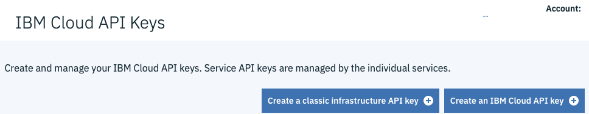
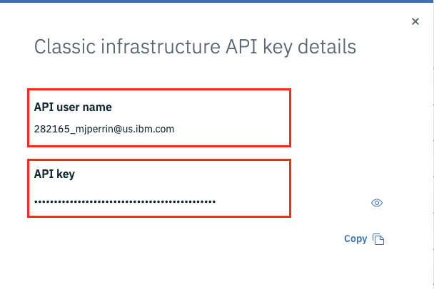

# API Keys and the credentials.properties file

## Overview
The IasC requires two API Keys from the platform to enable it to provision the necessary resources:
- The first Key is for the Classic Iaas Infrastructure resources.
- The second key is for the IBM Cloud resources

In the steps that follow, you will generate the required keys and put them into a credentials.properties file.

```properties
classic.username=<CLASSIC_USERNAME>
classic.api.key=<CLASSIC_API_KEY>
ibmcloud.api.key=<IBMCLOUD_API_KEY>
```

## Generating the Keys and Setting the Properties

### Step 1. Create the credentials.properties file.
Inside the `iteration-zero-ibmcloud` folder, copy `credentials.template` to a file named `credentials.properties`


### Step 2: Create a Classic Infrastructure API Key
- Follow these instructions to generate a Classic Infrasture API Key:
    - [Classic IaaS Infrastructure Username and API Key](https://cloud.ibm.com/docs/iam?topic=iam-classic_keys#classic_keys "Managing classic infrastructure API keys")

    - Click on `Create a classic infrastructure API Key` close the dialog and then click on the `Details` menu for the classic key in the list. If this button does not appear then the key is already created for you account and just view the `Details` for this key.

        **Note:** To access or create the keys click on `Manage->Access(IAM>)`  Then select `IBM Cloud API keys` menu. 
        
        
        **Note**: If you do not have the Classic API key configured you will have a button at the top asking you to add them.
            
 
- Open the credentials.properties file and set the values for the "classic.username" and "classic.api.key" properties.


### Step 3: Create and Set the IBM Cloud Resources Key

- Follow these instructions to generate a key:
[IBM Cloud API Key](https://console.bluemix.net/docs/iam/userid_keys.html#creating-an-api-key "Creating an API key")


- Open the credentials.properties file and set it as the value for the "ibmcloud.api.key" property.