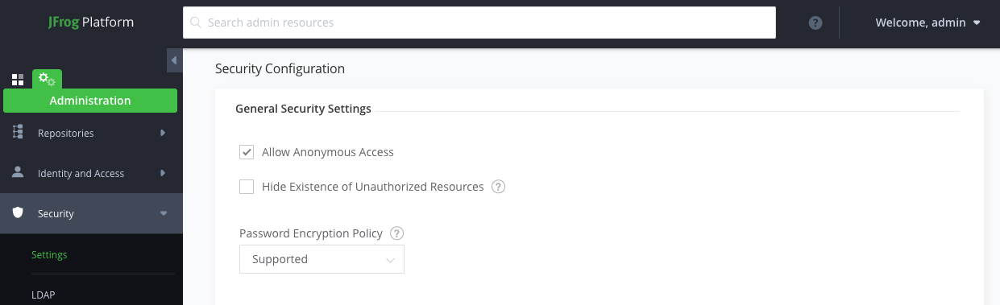

# Artifactory Setup

Complete the steps for setting up the Artifactory tool

!!!Note
    As of v1.9.0 of the Artifactory module, these steps have been automated and should not be required after a Toolkit install. The instructions are provided here to understand what steps are required to manually integrate the Artifactory instance into the pipelines.

## Overview

Artifactory is the [environments's artifact repository manager](../../reference/tools/artifactory.md).
Before you can use it as part of the continuous integration pipeline, it first must be configured as part of the environment.

## Configuration

Set up Artifactory in the environment with a Helm repository. Also, set up the environment to access Artifactory.

!!!Warning
    The version of Artifactory that is installed into the cluster is not configured for high availability. It is limited to the storage size of your cluster. It is highly recommended you integrate your pipelines with an enterprise grade Helm repository or artifact management system.

### Set up Artifactory

Create a repository in Artifactory for storing Helm charts.

- Open the Artifactory dashboard from the [Developer Dashboard](../../reference/dashboard.md) and login

- Log into Artifactory using the default userid and password, `igc credentials` can show these values. The first time
you log in the Welcome Page will prompt you to configure Artifactory using the Onboarding Wizard.

- Press **Get Started**

  

- The first step of the setup wizard is to change the default password. It is
 recommend you use a password generated by a password manager. [1Password
 ](https://1password.com) is the tool IBM recommends to its employees.

  

- Save the password somewhere safe or in your password manager; you will need to
  manually update the password in the  `secret` that is stored in the `tools` namespace/project
  called `artifactory-access`. There are more detailed instructions after you
  have completed the setup wizard.

The next step is to define the base url that will be used by the server.

- From the browser you are currently using copy the `URL` from the address bar.

  

- Paste the URL into the **Select Base URL** form and remove any trailing
 context roots, similar to the one in this view.

  

- The next page in the wizard is the Configure a Proxy Server page. This is to
  setup a proxy for external resources. You can click **Next** to skip this
  step.

  

- The next page in the wizard is the Create Repositories page. Since the open source release of
  Artifactory doesn't provide a package for Helm repositories, we will use a generic repository to hold the helm
  artifacts.

- Select **Generic**, then press **Next**

  

- The next page in the wizard is the Onboarding Complete page.

- Press **Finish**

  

### Allow Anonymous Access to Artifactory

- Open the Artifactory dashboard from the [Developer Dashboard](../../reference/dashboard.md) and login

- Click on the **Settings** tab on the left menu (the one with the gear icon), and then select
 **Security**

    

- Check the `Allow Anonymous Access` check box and press **Save**

### Obtain the encrypted password

To enable the CI pipelines ([Jenkins](../../reference/tools/jenkins), [Tekton](../../reference/tools/tekton), etc.) to store the Helm artifacts in the Artifactory repository, we need to obtain Artifactory's encrypted password and save it where the pipeline can access the password -- in the `artifactory-access` Kubernetes secret in the `tools` namespace in the Development Tools environment.

- In the Artifactory console, press the **Welcome, admin** menu button in the top right corner of the console and select **Edit profile**

- In the User Profile: admin page, enter you Artifactory password and press **Unlock*

  {style="width: 60%" .center }

Below, in the **Authentication Settings** section, is the **Encrypted Password** field.

- Press the **Eye** icon to view the encrypted password and press the **Cut & Paste** icon to copy it

  {style="width: 60%" .center }

- Now we have obtained the **Encrypt** key and had kept a copy of the Password we changed on the initial setup wizard. We need to update the secrets that stores these inside the cluster.

### Update the secret - OpenShift 4

- In the OpenShift 4 console, go to **Administrator** > **Workloads** > **Secrets**. At the top, select the `tools` project and filter for `artifactory`. Select **Edit Secret** on `artifactory-access`. (You do not need to base encode these values the OpenShift console does this for you.)
  {style="width: 80%" .center }

- Update the values that you retrieved for the encrypt key and updated the admin password
  - Add a key/value for `ARTIFACTORY_ENCRYPT` and set the value to your encrypt key value
  - Update the `ARTIFACTORY_PASSWORD` value with thew new admin password

- Click **Save** in OpenShift console

- View the secret in the console and confirm that the visible value of `ARTIFACTORY_ENCRYPT` matches the encrypted password shown in the Artifactory console

- On the command line, run `igc credentials` and verify that the Artifactory details have been updated

### Update the secret - Kubernetes and OpenShift 3

To update the secret in Kuberentes or Openshift 3, navigate to the `secret` called `artifactory-access`
in the `tools` namespace and update the following values. You will need encode these value in base64 key before
editing the secret.

[Kubernetes secrets](https://kubernetes.io/docs/concepts/configuration/secret/#creating-a-secret-manually) store data in base64 format. So to store Artifactory's encrypted password in a secret, it needs to be encoded into base64.

Any base64 encoding tool will work. For example:

- Go to the [Base64 Encode](https://www.base64encode.org/) website
- Paste the encrypted password into the online tool and press the **Encode** button
- In the field below, copy the encoded value into you clipboard or store it somewhere safe
- Find the `ARTIFACTORY_ENCRYPT` value (under `data`) and paste in the Artifactory base64 key into the field
- Find the `ARTIFACTORY_PASSWORD` value (under `data`) and paste in the

## Rerun the Pipeline

Previously, when you deployed you first app, the pipeline's Package Helm Chart stage didn't store the chart because the `ARTIFACTORY_ENCRYPT` property was not set. Now that it has been set, rerun your pipeline and check that the Helm chart for your app is stored correctly in Artifactory with matching semantic version information.

- In the Artifactory console, select the Artifacts page and expand the `generic-local` repository

  {style="width: 60%" .center }

You will see a folder named after your resource group containing the tar file for a Helm chart.

## Conclusion

Artifactory is now set up in your environment and CI pipelines can store Helm charts in Artifactory repository. Artifactory can now be used as a Helm repository for CD tools like ArgoCD and IBM Cloud Pak for Multi-Cloud Management.
