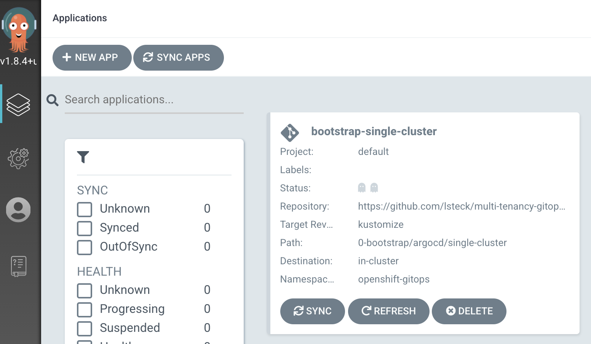
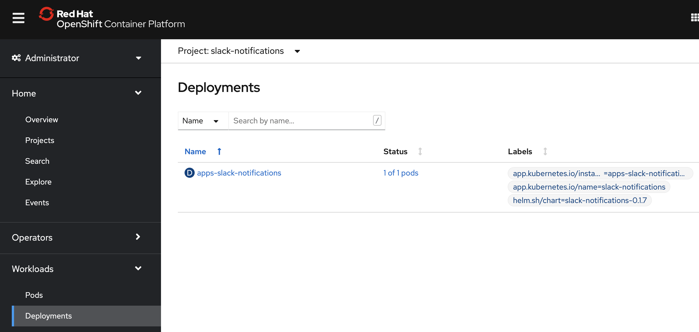

# Install Serverless and Cloud Events on an existing cluster using GitOps

<!--- cSpell:ignore gitid kubeseal cntk -->

!!!Note 
    This is a work in progress, come back for updates.

## Overview
This guide will illustrate the steps to install Serverless and Cloud Events in an existing cluster using ArgoCD provided by Red Hat OpenShift GitOps operator.  

Additionally it shows the steps to configure Red Hat Openshift Pipelines operator based on Tekton to send cloud events and steps to configure a "slack-notification" app to receive those events.

## Install Serverless and Cloud Eventing

### Pre-requisites

The following is required before proceeding to the next section.

- Provision an OpenShift cluster.
- Login to the cluster via the oc cli.

### Installation Steps

1. Fork the [multi-tenancy-gitops](https://github.com/cloud-native-toolkit/multi-tenancy-gitops) repository and clone your fork.

    ```shell
    git clone git@github.com:{gitid}/multi-tenancy-gitops.git
    ```

1. Change to the `kustomize` branch of your fork.

    ```shell
    cd multi-tenancy-gitops
    git checkout kustomize
    ```

1. Install the Red Hat OpenShift GitOps operator. 
    - For Openshift 4.6
        ```shell
        oc apply -f setup/ocp46/
        ```
    - For Openshift 4.7
        ```shell
        oc apply -f setup/ocp47/
        ```

1. Update the files to reference your forked repository.  Run the `set-git-source.sh` script that will replace `cloud-native-toolkit` Github Org references with your {gitid}.

    ```shell
    export GIT_USER={gitid}
    ./scripts/set-git-source.sh
    ```
   

1. Push the changes to your forked repository.

    ```shell
    git add .
    git commit -m "push repo gitid changes"
    git push
    ```
   

1. Their are different deployment options provided in folders in the repository.  In this guide we will use the default `single-server` deployment.  The other options are located in the `others` folder.

    ```text
    ./0-bootstrap
    └── argocd
        ├── bootstrap.yaml
        ├── others
        │   ├── 1-shared-cluster
        │   ├── 2-isolated-cluster
        │   └── 3-multi-cluster
        └── single-cluster
    ```

1. If you choose to use a different deployment option edit the `0-bootstrap/argocd/bootstrap.yaml` and modify the `spec.source.path` and update the `metadata.name` accordingly.  For example to use the `1-shared-cluster` change the path to `0-bootstrap/argocd/others/1-shared-cluster`.

    ```text
    apiVersion: argoproj.io/v1alpha1
    kind: Application
    metadata:
      name: bootstrap-1-shared-cluster
      namespace: openshift-gitops
    spec:
      destination:
        namespace: openshift-gitops
        server: https://kubernetes.default.svc
      project: default
      source:
        path: 0-bootstrap/argocd/others/1-shared-cluster
        repoURL: https://github.com/lsteck/multi-tenancy-gitops.git
        targetRevision: kustomize
      syncPolicy:
        automated:
        prune: true
        selfHeal: true
    ```

1. In this guide we will use the unchanged `0-bootstrap/argocd/bootstrap.yaml` which uses the `single-cluster` deployment.


    ```text
    apiVersion: argoproj.io/v1alpha1
    kind: Application
    metadata:
      name: bootstrap-single-cluster
      namespace: openshift-gitops
    spec:
      destination:
        namespace: openshift-gitops
        server: https://kubernetes.default.svc
      project: default
      source:
        path: 0-bootstrap/argocd/single-cluster
        repoURL: https://github.com/lsteck/multi-tenancy-gitops.git
        targetRevision: kustomize
      syncPolicy:
        automated:
        prune: true
        selfHeal: true
    ```

1. Under the cluster's folder there are `1-infra`, `2-services` and `3-apps` folders which define what infrastructure, services and app resources are to be deployed respectively.   

    ```text
    ./0-bootstrap
    └── argocd
        ├── bootstrap.yaml
        ├── others
        └── single-cluster
            ├── 1-infra
            ├── 2-services
            ├── 3-apps
            ├── bootstrap.yaml
            └── kustomization.yaml
    ```

1. Open the `kustomization.yaml` file under the `1-infra` folder 

    ```text
    ./0-bootstrap
    └── argocd
        ├── bootstrap.yaml
        ├── others
        └── single-cluster
            └── 1-infra
                ├── 1-infra.yaml
                ├── argocd
                └── kustomization.yaml
    ```

1. Uncomment the lines under the `# Openshift Serverless/Eventing` section to deploy those resources.

    ```text
    # Openshift Serverless/Eventing
    - argocd/namespace-openshift-serverless.yaml
    - argocd/namespace-knative-serving.yaml
    - argocd/namespace-knative-eventing.yaml
    ```
    
1. Open the `kustomization.yaml` file under the `2-services` folder 

    ```text
    ./0-bootstrap
    └── argocd
        ├── bootstrap.yaml
        ├── others
        └── single-cluster
            ├── 1-infra
            └── 2-services
                ├── 1-infra.yaml
                ├── argocd
                └── kustomization.yaml
    ```

1. Uncomment the lines under the `# Openshift Serverless/Eventing` section to deploy those resources.

    ```text
    # Openshift Serverless/Eventing
    - argocd/operators/openshift-serverless.yaml
    - argocd/instances/knative-eventing-instance.yaml
    ```

1. Installing the **Serverless and Eventing** doesn't require any resources under the `3-apps` folder so the `kustomization.yaml` in that folder doesn't need to be changed.

1. Push the changes to your forked repository.

    ```shell
    git add .
    git commit -m "push serverless and eventing"
    git push
    ```

1. Create the bootstrap ArgoCD application.

    ```shell
    oc apply -f 0-bootstrap/argocd/bootstrap.yaml -n openshift-gitops
    ```

1. From the OpenShift console launch ArgoCD by clicking the `ArgoCD` link from the Applications (9 squares) menu 

    

1. The ArcoCD user id is `admin` and the password can be found in the `argocd-cluster-cluster` secret in the `openshift-gitops` project namespace. You can extract the secret with the command
    ```shell
    oc extract secret/argocd-cluster-cluster --to=- -n openshift-gitops
    ```

1. On the ArgoCD UI you can see the newly created bootstrap application.

    

1. After several minutes you will see all the other ArgoCD applications with a status `Healthy` and `Synced`. The status will progress from `Missing`, `OutOfSync`, `Syncing`. If you see a status of `Sync failed` there were errors.

    

1. You can check that the Red Hat OpenShift Serverless operator that provides serverless and eventing capabilities has been installed from the **Installed Operators** page on the console.

    

## Install Slack Notification app and configure Tekton to emit Cloud Events

!!!Note 
    Both installation steps could be performed at the same time.  They were broken out in this guide to illustrate how you could install **Serverless and Eventing** without installing the **Slack Notification** app.

### Pre-requisites

The following are required before proceeding.

- Compete the previous section [Install Serverless and Cloud Eventing](#install-serverless-and-cloud-eventing)
- Create a [Slack Incoming Webhook](https://api.slack.com/messaging/webhooks).

### Installation Steps

1. Open the `kustomization.yaml` file under the `1-infra` folder 

    ```text
    ./0-bootstrap
    └── argocd
        ├── bootstrap.yaml
        ├── others
        └── single-cluster
            └── 1-infra
                ├── 1-infra.yaml
                ├── argocd
                └── kustomization.yaml
    ```

1. Uncomment the lines under the `# Slack Notifications` section to deploy those resources.

    ```text
    # Slack Notifications
    - argocd/namespace-slack-notifications.yaml
    ```

1. Push the changes to your forked repository.

    ```shell
    git add .
    git commit -m "push slack notifications namespace"
    git push
    ```

1. After a few minutes you should see see an ArgoCD `namespace-slack-notifications` app.  This app creates the `slack-notifications` project namespace where we will deploy the slack notification app.
    

1. Before we deploy the app we need to create a secret to store the slack incoming webhook you created as a pre-requisite. This secret needs to be in the `slack-notifications` project namespace. You can generate an encrypted secret containing the slack notification webhook using the Sealed Secret Operator or you can manually create the secret as follows **NOTE:** replace `<webhook-url>` with your slack webhook url .

    ```shell
    WEBHOOK=<webhook-url>

    oc project slack-notifications

    oc create secret generic slack-secret \
     --from-literal=SLACK_URL=${WEBHOOK}

    ```

1. Installing the **Slack Notification app** doesn't require any resources under the `2-services` folder so the `kustomization.yaml` in that folder doesn't need to be changed.

1. Open the `kustomization.yaml` file under the `3-apps` folder 

    ```text
    ./0-bootstrap
    └── argocd
        ├── bootstrap.yaml
        ├── others
        └── single-cluster
            ├── 1-infra
            ├── 2-services
            └── 3-apps
                ├── 3-apps.yaml
                ├── argocd
                └── kustomization.yaml
    ```

1. Uncomment the lines under the `# Slack Notifications` section to deploy those resources.

    ```text
    # Slack Notifications
    - argocd/slack-notifications/slack-notifications.yaml
    - argocd/shared/config/openshift-pipelines/configmap/openshift-pipelines-config.yaml
    ```

1. If you changed the slack-secret name or key you need to update the secret name and key value in the `slack-notification.yaml` 

    1. Open `slack-notifications.yaml`
        ```text
        ./0-bootstrap
        └── argocd
            └── single-cluster
                └── 3-apps
                   └── argocd
                       └── slack-notifications
                           └── slack-notifications.yaml
        ```

    1. Modify the name and key to match your secret name and the key name.
        ```text
          secret:
            # provide name of the secret that contains slack url
            name: slack-secret
            # provide key of the secret that contains slack url
            key: SLACK_URL
        ```

1. Push the changes to your forked repository.

    ```shell
    git add .
    git commit -m "push slack notifications app"
    git push
    ```


1. After a few minutes you will see an `apps-slack-notifications` ArgoCD app and a `openshift-pipelines-config` ArgoCD app. 
        


1. On the OpenShift Console you can see the slack notifications app deployment in the `slack-notifications` project namespace.
        


Now when you run Pipelines you will receive Slack Notifications. 
