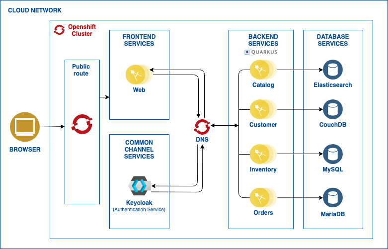
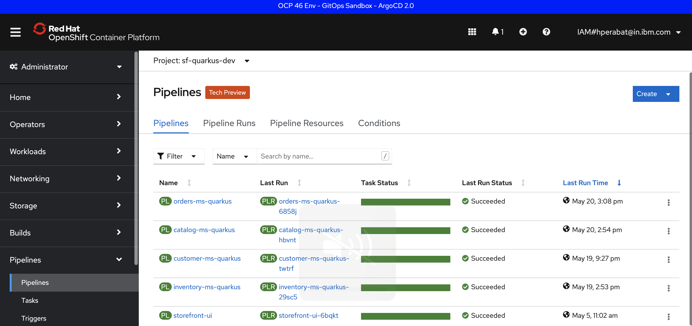

# Storefront - Cloud Native Exemplar

Exemplar application for developers to understand the cloud native toolkit and use cases on Red Hat OpenShift.

## Build and deploy a cloudnative reference implementation using Cloud native toolkit

This provides a working example of a Tekton based CICD pipeline to build and deploy a [StoreFront](https://cloudnativereference.dev/). The Pipeline and Task resources available in [Cloud Native Toolkit](https://cloudnativetoolkit.dev/) can be used to deploy different microservices that are part of this application.

### Prerequisites

| Task                             | Instructions                             |
| ---------------------------------| -----------------------------------------|
| Active OpenShift 4.x Cluster     |                                          |
| Set up accounts and tools        | [Instructions](../../../overview/prerequisites.md) |
| Install the Cloud Native Toolkit | [Install the Cloud Native Toolkit](../../../setup/setup-options.md) |

### Deploy the StoreFront

Get started with deploying a simple retail application, Storefront using Cloud Native Toolkit. The Storefront application implements a simple shopping application that displays a catalog of antique computing devices. People can search for and buy products from the application’s web interface.

The logical architecture for this reference implementation is shown in the picture below.

This application has a web interface that relies on separate BFF (Backend for Frontend) services to interact with the backend data.

These are several components of this architecture.

- This OmniChannel application contains an [AngularJS](https://angularjs.org/) based web application.
- The Web app invokes its own backend Microservice to fetch data, we call this component BFFs following the [Backend for Frontends](http://samnewman.io/patterns/architectural/bff/) pattern. The Web BFF is implemented using the Node.js Express Framework.
- The BFFs invokes another layer of reusable Java Microservices. The reusable microservices are written in Java using [Quarkus](https://quarkus.io/) framework.
- The Java Microservices are as follows:
  - The [Inventory Service](https://cloudnativereference.dev/related-repositories/inventory) uses an instance of [MySQL](https://www.mysql.com/) to store the inventory items.
  - The [Catalog service](https://cloudnativereference.dev/related-repositories/catalog) retrieves items from a searchable JSON datasource using [ElasticSearch](https://www.elastic.co/).
  - [Keycloak](https://cloudnativereference.dev/related-repositories/keycloak) delegates authentication and authorization.
  - The [Customer service](https://cloudnativereference.dev/related-repositories/customer) stores and retrieves Customer data from a searchable JSON datasource using [CouchDB](http://couchdb.apache.org/).
  - The [Orders Service](https://cloudnativereference.dev/related-repositories/orders) uses an instance of [MariaDB](https://mariadb.org/) to store order information.

### Deploy the Storefront using Cloud native toolkit

Follow the below guide for instructions on how to deploy all the microservices of Storefront onto Openshift using Cloud native toolkit.

[Cloud native toolkit - StoreFront Quarkus version](https://cloudnativereference.dev/deployments/cntk-quarkus)

To get an idea, here is a view of a completed and successful pipelinerun for all the microservices.

