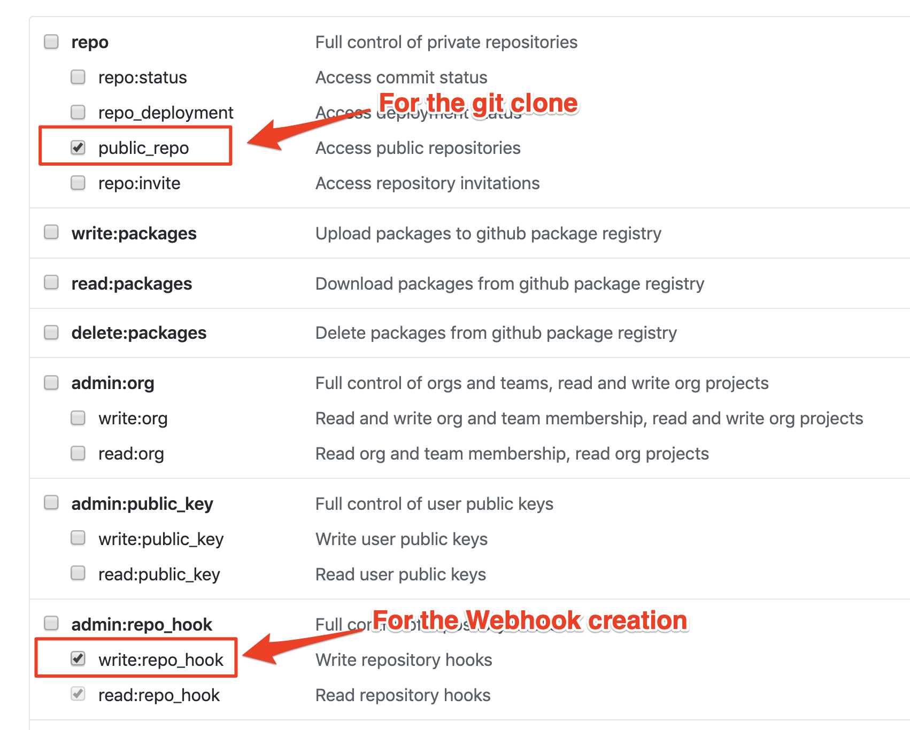

# Cloud-Native Toolkit Developer Setup

Before starting the learning activities, you need to setup your development environment.  This section assumes you have the development tools for your preferred programming language already installed.  It only covers the tooling for the Cloud-Native Toolkit.

## Prerequisites

To complete the cloud-Native Toolkit learning, you need to have

- a laptop or workstation running Linux, MacOS or MS Windows.  If running linux you may need to adapt some of the instructions to match your Linux distribution
- a web browser, capable of running modern web sites
- an active, public, [GitHub](https://github.com){: target=_blank} account
- access to a Red Hat OpenShift cluster.  If one has not been provided or you did not set one up please work through the [Install](../setup/setup-options.md){: target=_blank} section to get access to a cluster.

This guide assumes that you have some basic knowledge of Kubernetes, Docker, and modern software delivery techniques including CI/CD. There are some suggested educational materials listed in the [Resources](../resources/resources.md){: target=_blank} section.

## Cluster Command Line Tools

You will be using the command line for some of the tasks you will learn about as you work through the learning material.  

If you are using the Open Labs environment, then you can skip installing command line tools locally as the Open Labs environment provides a web-based command line.

If you are working with a cluster running on the IBM Cloud then you have the option to use the IBM Cloud Shell rather than a local command prompt.  If you opt to use the IBM Cloud Shell then don't need any local command line tools installed.

If you installed your own cluster following the [fast-start](../setup/fast-start.md){: target=_blank} instructions then you should already have the command line tools installed.

If you don't need, or already have the command line tools installed then you can jump to the [User accounts](#user-accounts) section, other wise continue to install the required tools.

### Installing Command Line Tools

The set of command line tools you need depends on the cluster you will be using to complete the learning:

- IBM Cloud based clusters need the **IBM Cloud Command Line Interface (CLI)**
- OpenShift clusters need the RedHat **oc** command

#### IBM Cloud CLI

To install the IBM Cloud CLI follow the instructions in the [IBM Cloud documentation](https://cloud.ibm.com/docs/cli?topic=cli-getting-started){: target=_blank}.

#### RedHat oc command

The oc command is available from all installations of RedHat OpenShift or CodeReady Containers.  Navigate and log into the web console for the cluster, then in the dropdown accessed by clicking the help icon (a question mark next to you username at the top of the web console) you will find a link to the install images for various operating systems.

The install images are also available to download from [RedHat](https://mirror.openshift.com/pub/openshift-v4/x86_64/clients/ocp/){: target=_blank}.  Be sure to get the latest version of the oc command.

## User accounts

You'll need the following accounts to complete the Cloud-Native Toolkit learning.

### Github account

!!!Todo
    CRC cannot be triggered by github - what to use?

You will need a [GitHub account](https://github.com){: target=_blank} (public, not enterprise) to use the Starter Kit templates. Create one if you do not have one already. If you have not logged in for a while, make sure your login is working.

Ensure you have a git command line tool installed.  You can verify you have a working git command line interface by entering the command ```git version``` in a command or terminal window.  If you don't have git installed then you can download it from [here](https://git-scm.com/downloads){: target=_blank}

#### Configure a Github personal access token

For the automation you will learn as part of the Continuous Integration process you will need a [GitHub personal access token](https://docs.github.com/en/github/authenticating-to-github/creating-a-personal-access-token){: target=_blank} with `public_repo` and `write:repo_hook` scopes.

A Personal Access Token is used in place of a user password to authenticate with GitHub.

The Personal Access Token only needs to be generated once because it is associated with a GitHub user or organization and can be used to access any of the user's/organization's repos.

- Navigate to [Developer Settings](https://github.com/settings/tokens){: target=_blank} and generate a new token; name it something like "CI pipeline"
- Select `public_repo` scope to enable git clone
- Select `write:repo_hook` scope so the pipeline can create a web hook
  
    
  
- The GitHub UI will never again let you see this token, so be sure to save the token in your password manager or somewhere safe that you can access later on

### IBM Cloud account

If you will be using a cluster hosted in the IBM cloud, then you need to have an active IBM Cloud account.  Create an [IBM Cloud account](https://cloud.ibm.com){: target=_blank}, if you don't have one already, and make sure you can log in.

#### Create an IBM Cloud API Key

API Keys are tokens scoped to a particular IBM Cloud account that can be used to access cloud services, particularly through
the IBM Cloud CLI. Generate an API Key for whichever account contains the cluster you will be using for the Getting Started
activities.

Follow these steps to [create an API key](https://cloud.ibm.com/docs/account?topic=account-userapikey#create_user_key){: target=_blank} and
download the key to a file. Be sure to include a descriptive name of the API Key so you know where it is used.

## Install the Cloud-Native Toolkit Command Line Interface (CLI)

The Cloud-Native Toolkit provides extensions to the kubernetes and OpenShift command line tools to provide convenient helper functions to speed up development activities.  The additional commands are detailed in the [reference](../reference/cli.md){: target=_blank} section.

The Cloud-Native Toolkit CLI needs to be installed in all development environments (including the OpenLabs and IBM Cloud Shell environments)

To install the Cloud-Native Toolkit CLI run the following command:

```shell
curl -sL shell.cloudnativetoolkit.dev | shell -
source ~/.bashrc || source ~/.zshrc
```

!!!Note
    If you have access to multiple IBM Cloud accounts you may find the [IBM Cloud cluster fast-switching tool (icc)](../resources/ibm-cloud/icc.md){: target=_blank} of use.  The **icc** tool is installed as part of the Cloud-Native Toolkit CLI.

    If you are working on the IBM Cloud there is a browser based shell environment you can use.  Information about setting up and accessing the browser based shell to work with the Cloud-Native Toolkit can be found in the [resources section](../resources/ibm-cloud/cloud-shell.md){: target=_blank}
