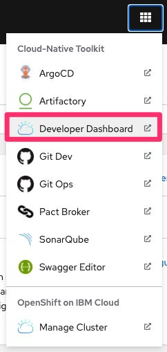
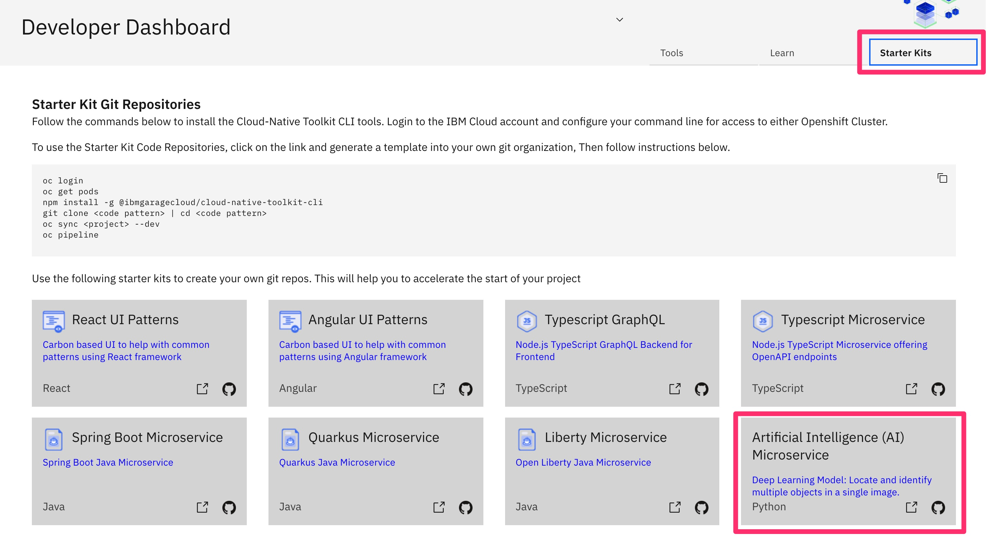
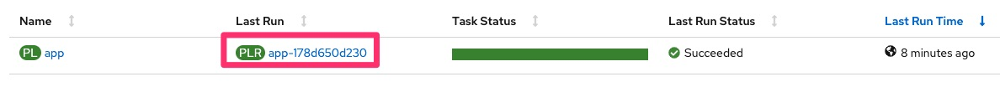

# Deploy an Artificial Intelligence Microservice

<!--- cSpell:ignore mobilenet rcnn resnet -->

1. Prerequisites
    - The instructor should [Setup Workshop Environment](setup.md)
    - The student should [Setup CLI and Terminal Shell](setup.md#4-optional-auto-configure-terminal-shell)

1. Instructor will provide the following info:
    - OpenShift Console URL (OCP_CONSOLE_URL)
    - The username and password for OpenShift and Git Server (default values are user1, user2, etc.. for users and `password` for password).

1. Set `TOOLKIT_USERNAME` environment variable.
   If you are participation in a workshop replace `userdemo` with your assigned username (ex. `user01`).
    ```bash
    TOOLKIT_USERNAME=userdemo
    ```

1. **(Skip if using KubeAdmin or IBM Cloud)** Login to OpenShift using `oc`
    - If using IBM Cloud cluster then login with your IBM account email and IAM API Key or Token by using the **Copy Login Command**
        
    - If using a cluster that was configured with the workshop scripts outside IBM Cloud then use respective assigned username (ex. `user01`), and the password is `password`
    ```bash
    oc login $OCP_URL -u $TOOLKIT_USERNAME -p password
    ```

1. Set `TOOLKIT_PROJECT` environment variable
   If you are participation in a workshop replace `projectdemo` based on your assigned username (ex. `project01`).
    ```bash
    TOOLKIT_PROJECT=projectdemo
    ```

1. Create a project/namespace using your project as prefix, and `-dev` and suffix
    ```bash
    oc sync $TOOLKIT_PROJECT-dev
    ```

1. Fork application template git repo
    - Open Developer Dashboard from the OpenShift Console
        {.center}
    - Select Starter Kits
        {.center}
    - Select One in our case **Artificial Intelligence Microservice**
    - Click Fork
    - Login into GIT Sever using the provided username and password (ie `userdemo` and `password`)
    - Click **Fork Repository**

1. Setup environment variable `GIT_URL` for the git url using the value from previous step or as following.
        **Note:** We are including username/password in git url for simplicity of this lab. You would **NOT** want to do this in your development environment.
    ```bash
    GIT_REPO=ai-model-object-detector
    GIT_URL=http://${TOOLKIT_USERNAME}:password@$(oc get route -n tools gitea --template='{{.spec.host}}')/${TOOLKIT_USERNAME}/${GIT_REPO}
    echo GIT_URL=${GIT_URL}

    ```

1. Clone the git repository and change directory
    ```bash
    cd $HOME
    git clone $GIT_URL app
    cd app

    ```

1. Create a Tekton pipeline for the application
    ```bash
    oc pipeline --tekton
    ```
    - Use down/up arrow and select `ibm-general`
    - Enter **n** and hit Enter to disable image scanning
    - Hit Enter to enable Dockerfile linting
    - Hit Enter to select default health endpoint `/`
    - Open the url to see the pipeline running in the OpenShift Console

1. Verify that Pipeline Run completed successfully
    - On the OpenShift web console select **Pipelines**
    - At the top of the page select your development project/namespace created above (ex. `project01-dev`)
    - The app pipeline last run status should be **Succeeded**
        {.center}

1. Review the Pipeline Tasks/Stages.
    - Click on the last run
        {.center}
    - Click on the **Test** task and view the logs
        {.center}
    - Open SonarQube from Console Link
    - Open Registry from Console Link
    - Open Artifactory from Console Link

1. The **gitops** step of the pipeline triggers Argo CD to deploy the app to QA. Select **Developer** perspective, select project `$TOOLKIT_PROJECT-qa` and then select **Topology** from the Console and verify the application running
        {.center}

1. Open the application route url and try out the application using the swagger UI or append `/app` to the URL to load Web UI for the Application. You can download the this sample [picture](https://raw.githubusercontent.com/IBM/MAX-Object-Detector/master/samples/baby-bear.jpg) to test the app
        {.center}
        {.center}


1. Make a change to the application in the git repository and see the pipeline running again from the Console. Lets change the Machine Learning being used from `ssd_mobilenet_v1` to `faster_rcnn_resnet101`
    ```bash
    git config --local user.email "${TOOLKIT_USERNAME}@example.com"
    git config --local user.name "${TOOLKIT_USERNAME}"
    sed -i 's/ssd_mobilenet_v1/faster_rcnn_resnet101/' Dockerfile
    git add .
    git commit -m "update model"
    git push -u origin master

    ```

1. Verify that change in Git Server and Git WebHook
    - Open Git Dev from Console Link
    - Navigate to user app git repository
    - Review the recent commit
    - Review the webhook recent delivery
        {.center}

1. Verify that a new Pipeline starts successfully

1. Verify that the App manifests are being updated in the `gitops` repo in the git account `toolkit` under the `qa` directory.
    - Open Git Ops from Console Link
    - Select toolkit/gitops git repository
        {.center}

1. Congratulations you finished this lab, continue with lab [Promote an Application using CD with GitOps and ArgoCD](cd.md)
