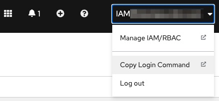
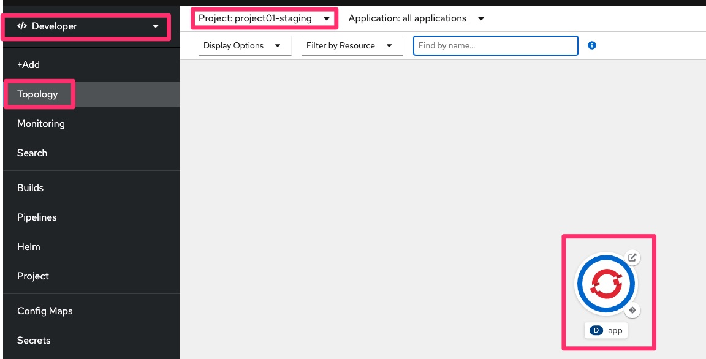
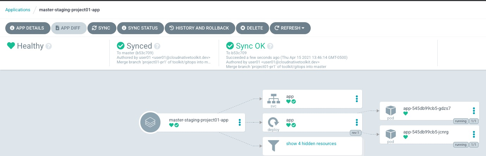
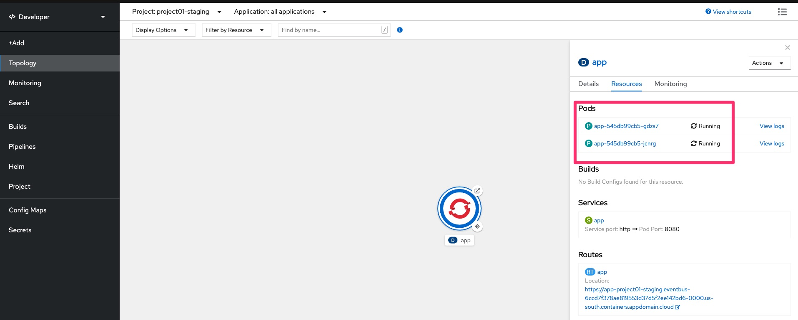

# Promote an Application using CD with GitOps and ArgoCD

Promote an Application using CD with GitOps and ArgoCD

<iframe width="100%" height="500" src="https://www.youtube-nocookie.com/embed/Fr85xbcM_es" title="YouTube video player" frameborder="0" allow="accelerometer; autoplay; clipboard-write; encrypted-media; gyroscope; picture-in-picture" allowfullscreen></iframe>

1. Prerequisites
    - Complete lab [Deploy an Application using CI Pipelines with Tekton](ci.md).

1. Set `TOOLKIT_USERNAME` environment variable.
   If you are participation in a workshop replace `userdemo` with your assigned username (ex. `user01`).
    ```bash
    TOOLKIT_USERNAME=userdemo
    ```

1. **(Skip if using KubeAdmin or IBM Cloud)** Login to OpenShift using `oc`
    - If using IBM Cloud cluster then login with your IBM account email and IAM API Key or Token by using the **Copy Login Command**
        
    - If using a cluster that was configured with the workshop scripts outside IBM Cloud then use respective assigned username (ex. `user01`), and the password is `password`
    ```bash
    oc login $OCP_URL -u $TOOLKIT_USERNAME -p password
    ```

1. Set `TOOLKIT_PROJECT` environment variable
   If you are participation in a workshop replace `projectdemo` based on your assigned username (ex. `project01`).
    ```bash
    TOOLKIT_PROJECT=projectdemo
    ```

1. Verify Application is deployed in **QA**
    - Get ArgoCD's `admin` password by running `oc credentials`  
    - Select ArgoCD from the Console Link and login using `admin` and the password you just retrieved
    - Filter Applications by name `${TOOLKIT_PROJECT}-qa` (ie project01-qa)
    - Select the application `master-qa-${TOOLKIT_PROJECT}-app` (ie master-qa-project01-app)
        

1. Verify Application is running in the QA namespace corresponding to your username `${TOOLKIT_PROJECT}-qa`
    - Select **Developer** perspective, select project `${TOOLKIT_PROJECT}-qa` and then select **Topology** from the Console and see the application running
        

1. Setup environment variable `GIT_OPS_URL` for the git url using the value from previous step or as following
    ```bash
    GIT_OPS_URL=http://${TOOLKIT_USERNAME}:password@$(oc get route -n tools gitea --template='{{.spec.host}}')/toolkit/gitops
    echo GIT_OPS_URL=${GIT_OPS_URL}

    ```

1. Clone the git repository and change directory
    ```bash
    cd $HOME
    git clone $GIT_OPS_URL
    cd gitops

    ```

1. Review the `qa` and `staging` directory in the git repository
    ```bash
    ls -l qa/
    ls -l staging/

    ```

1. Promote the application from **QA** to **STAGING** by copying the app manifest files using git
    ```bash
    git config --local user.email "${TOOLKIT_USERNAME}@example.com"
    git config --local user.name "${TOOLKIT_USERNAME}"

    cp -a qa/${TOOLKIT_PROJECT}/ staging/${TOOLKIT_PROJECT}/

    git add .
    git commit -m "Promote Application from QA to STAGING environment for $TOOLKIT_PROJECT"
    git push -u origin master

    ```

1. Verify Application is deployed in **STAGING**
    - Get ArgoCD's `admin` password by running `oc credentials`  
    - Select ArgoCD from the Console Link and login using `admin` and the password you just retrieved
    - Filter Applications by namespace `${TOOLKIT_PROJECT}-staging` (ie project01-staging)
    - It might take a couple minutes for the application to show up
    - Select the application `master-staging-${TOOLKIT_PROJECT}-app` (ie master-staging-project01-app)
    - Click **Refresh**
        

1. Verify Application is running in the **STAGING** namespace corresponding to your username `${TOOLKIT_PROJECT}`
    - Select **Developer** perspective, select project `${TOOLKIT_PROJECT}-staging` and then select **Topology** from the Console and see the application running
        

1. Propose a change for the Application in **STAGING**
    - Update the replica count and create a new git branch in remote repo
    ```bash
    cat > staging/${TOOLKIT_PROJECT}/app/values.yaml <<EOF
    global: {}
    app:
      replicaCount: 2
    EOF

    git diff

    git add .
    git checkout -b ${TOOLKIT_PROJECT}-pr1
    git commit -m "Update Application in ${TOOLKIT_PROJECT}-staging namespace"
    git push -u origin ${TOOLKIT_PROJECT}-pr1

    ```
    - Open Git Ops from Console Link
    - Select toolkit/gitops git repository
    - Create a Pull Request
    - Select Pull Request
    - Click **New Pull Request**
    - Select from `compare` dropdown the branch `${TOOLKIT_PROJECT}-pr1`
    - Enter a title like `Update replica count for app in namespace $TOOLKIT_PROJECT`
    - Enter a Comment like `We need more instances business is growing Yay!`
    - click **Create Pull Request**
        

1. Review the PR follow the change management process established by your team.
    - Click Merge Pull Request
    - Click Delete Branch

1. Review that application scales out
    - Review in ArgoCD UI, notice there are now two pods, it takes about 4 minutes to sync, you can click **Refresh**
        
    - Review in OpenShift Console, click the Deployment circle details shows 2 Pods.
        

1. Congratulations you finished this activity, continue with the lab [Deploy a 3 tier Microservice using React, Node.js, and Java](inventory.md)
