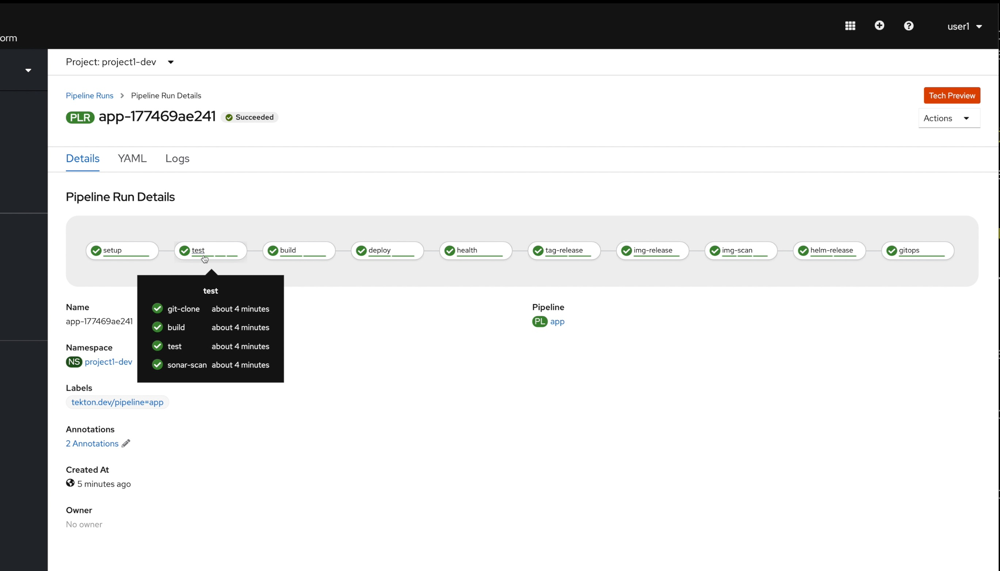
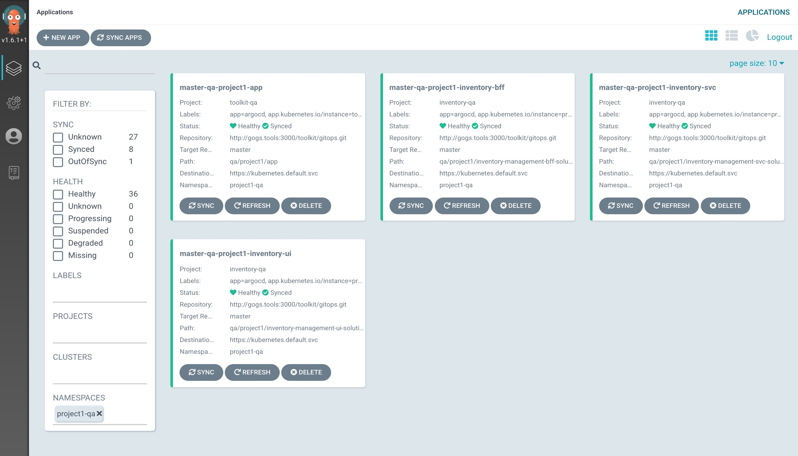

# IBM Cloud Native Toolkit Workshop

The Workshop is design to provide a quick way to try the methodology leveraging the tools that the Toolkit integrates.

!!!Todo
    Is this workshop Windows enabled - all instructions tend to use curl piped into sh?  Is Windows support needed?

## Agenda

[{: width=30%}](setup.md) Setup Workshop Environment (*workshop admin only*)

[{: width=30%}](ci.md) Deploy an Application using CI Pipelines with Tekton

[{: width=30%}](cd.md) Promote an Application using CD with GitOps and ArgoCD

[{: width=30%}](inventory.md) Deploy a 3 tier Microservice using React, Node.js, and Java

[{: width=30%}](appmod.md) App Modernization with modern DevOps

