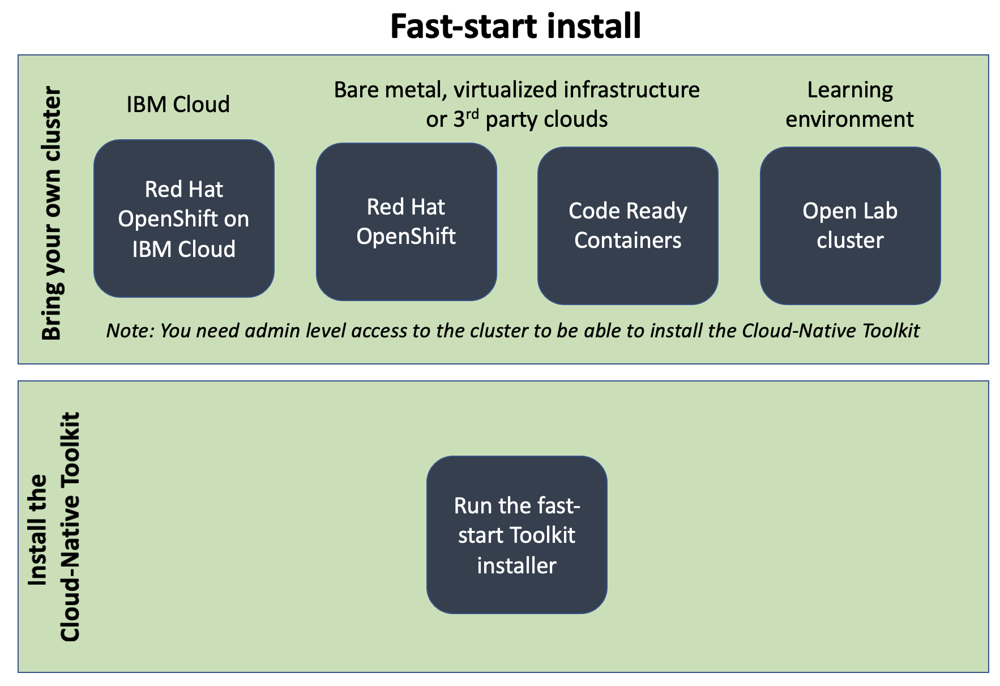

# Installing the Cloud-Native Toolkit

!!!note
    If you are a developer attending a training event, where the training environment is provided, you should skip this section and move onto the Cloud-Native Toolkit fast [start content](../learning/fast-start.md)

    If you want to host a workshop for a number of developers, then you may want to use [workshop](../resources/workshop/workshop.md).

There is no single way to setup an enterprise development infrastructure for cloud native application development.  There are [many different tools available](https://www.cncf.io/projects/){: target="_blank" .external } to help create Cloud Native applications.  You need to find the set of tools and processes that allow the IT organization to work efficiently to create and manage production-ready applications and services.  This can be a time consuming processes, to evaluate available tools and determine how to integrate them into a development environment.

The Cloud-Native toolkit is an opinionated set of tools to create a production-ready development environment.  The toolkit also provides installation options and starter kits to get you up and running quickly.

If you don't have access to a Cloud-Native Toolkit installation then you can select one of the setup options detailed below to install the toolkit before moving onto the learning.

## Options for installing the toolkit

{style="width: 90%" .center }

The Cloud-Native toolkit will run on a standard Kubernetes cluster or on the Red Hat OpenShift hybrid cloud platform, which is based on Kubernetes.

The Cloud-Native toolkit supports many different options for installing and configuring the toolkit across a number of different Kubernetes based environment, but for the first install it is recommended to follow the fast-start setup.  

The [fast-start installation](fast-start.md) will create an environment for you to learn about cloud native development.  Once you have a better understanding of cloud native development you can then make informed decisions about how you want to do Cloud-Native Development within your production environment and customize the toolkit to meet your requirements.

You will find additional installation and toolkit configuration options in the [Adopting the toolkit](../adopting/setup/installing.md) section, but the recommended path for your first installation is the [fast-start installation](fast-start.md) option.

## Prerequisites for installing the Cloud-Native Toolkit

For all options to complete the Fast-start training your need a laptop or workstation with a modern Operating System (MS Windows, Mac OS or Linux) with an up to date browser.

For IBM Cloud, bare metal, virtualized infrastructure or 3rd party cloud installs you also need to have a terminal for interacting with the cluster using command line tools.  If using the IBM Cloud there is a web based command line environment available so you don't need to install additional tooling on your workstation or laptop.

If using the Learning environment, you only need a browser, as the learning environment provides a web based command line environment.

### IBM Cloud Shell

If you plan to use an IBM Cloud based cluster to complete the learning, then you can opt to use the IBM Cloud web based shell environment.  To access the shell simply navigate to [https://cloud.ibm.com/shell](https://cloud.ibm.com/shell){: target="_blank" .external }.

The web based shell contains all the tool needed (curl, node.js, ibmcloud CLI and oc CLI) to complete the installation.

### Install prerequisite tools on your workstation or laptop

If you are not planning to use the IBM Cloud shell or are going to use the online Learning environment, then you need to have some prerequisite software installed on your laptop or workstation.

If on Mac OS or Linux then you need to have curl installed.  This is usually available from the Linux package manager or installed as part of the base operating system

For all operating systems [Node.js](https://nodejs.org/en/) needs to be installed
