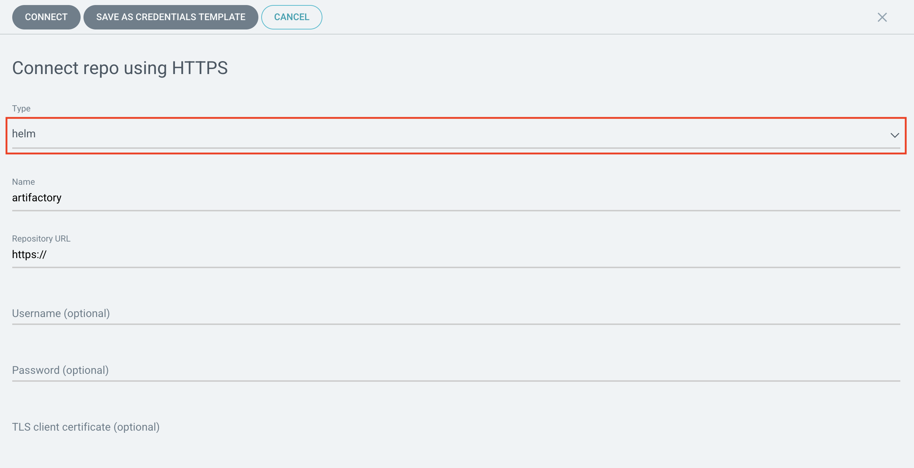

import Globals from 'gatsby-theme-carbon/src/templates/Globals';

<PageDescription>

Complete the steps for setting up the ArgoCD tool to support integration with
 Artifactory as a Helm repository

</PageDescription>

<InlineNotification>

**Note**: An **environment administrator** performs the steps on this page. See [Plan Installation > Roles](/admin/plan-installation#roles) for the overview of the roles involved.

</InlineNotification>

## Overview

ArgoCD is the [<Globals name="env" />'s continuous delivery tool](/tools/continuous-delivery).
Before you can use it as part of the environment, it must first be configured.

## Prerequisites

Before setting up ArgoCD, [set up Artifactory](/admin/artifactory-setup) so that ArgoCD can use it as a Helm repository.

##  Configuration

Configure ArgoCD to use Artifactory as a Helm repository.

### Get the Helm repository location

The Helm repository is in Artifactory. ArgoCD will need the URL to that repository.

1. In the Artifactory console, select the Home page

2. In the Set Me Up section, click on the `generic-local` repository

    

3. In the Set Me Up dialog for the generic-local repository, copy the Deploy URL

    

### Register the helm repository with ArgoCD

1. Log in to ArgoCD

2. Open the `Settings` dialog by clicking the `Manage your repositories, projects, settings` button on the left menu

    

3. From the Settings page, select `Repositories`

    

4. Press the `Connect repo using https` button at the top of the page

    
    
5. In the New Repository dialog, select `helm` for the repository type, provide a name to identify the 
repository, and enter the Artifactory deploy url for the repository url. Press `Connect` to create the 
repository.
    

6. The repository should now appear and the list and can be used for application deployments

## Conclusion

ArgoCD now has the configuration in the <Globals name="env" /> that it needs to access the helm chart repository 
in Artifactory.
