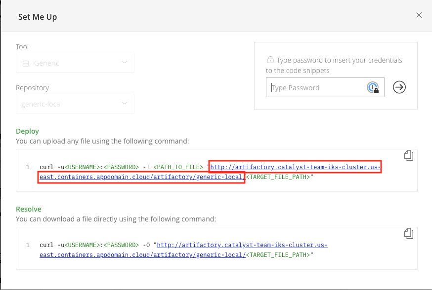

import Globals from 'gatsby-theme-carbon/src/templates/Globals';

<PageDescription>

Complete the steps for setting up the ArgoCD tool to support integration with
 Artifactory as a Helm repository

</PageDescription>


<InlineNotification>

**Note**: An **environment administrator** performs the steps on this page. See [Plan Installation > Roles](/admin/plan-installation#roles) for the overview of the roles involved.

</InlineNotification>


## Overview

ArgoCD is the [<Globals name="env" />'s continuous delivery tool](/guides/continuous-delivery).
Before you can use it as part of the environment, it must first be configured.

## Prerequisites

Before setting up ArgoCD, [set up Artifactory](/admin/artifactory-setup) so that ArgoCD can use it as a Helm repository.

##  Configuration

Configure ArgoCD to use Artifactory as a Helm repository.

### Clone the ArgoCD repository

The ArgoCD repository contains files and samples for configuring ArgoCD.

- Clone the repository to your development machine

  ```bash
  git clone git@github.com:IBM/template-argocd-gitops.git
  cd template-argocd-gitops
  ```

### Get the Helm repository location

The Helm repository is in Artifactory. ArgoCD will need the URL to that repository.

- In the Artifactory console, select the Home page

- In the Set Me Up section, click on the `generic-local` repository

  

- In the Set Me Up dialog for the generic-local repository, copy the Deploy URL

  

### Update the ArgoCD configuration file

The repo you cloned contains an ArgoCD configuration file. Put the Helm repository location in that file
and deploy it to your <Globals name="env" />.

- Log into your cluster from the CLI

- Add the folder name for your helm artifacts to the URL copied from the
 Artifactory console
 `[artifact-helm
-repository
-location]/[helm artifact folder]` this is often the same name as your
 resource group

- In your local copy of the `template-argocd-gitops` repo, run `./config
/addhelmrepository.sh [artifact-helm-repository-location]/[helm artifact
 folder]`

    where `[artifact-helm-repository-location]` is the URL of the Helm repository location in Artifactory

Verify that the new configuration has deployed

- In the Kubernetes dashboard or OpenShift console, navigate to the Config Maps in the `tools` namespace

- Select the `argocd-cm` config map and confirm that its `helm.repositories` property specifies the Artifactory URL

## Conclusion

ArgoCD now has the configuration file in the <Globals name="env" /> that it needs to access the Helm chart repository in Artifactory.
