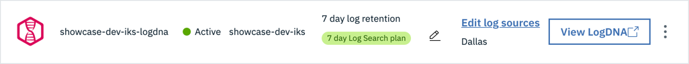

import Globals from 'gatsby-theme-carbon/src/templates/Globals';

<PageDescription>

Customize the Developer Dashboard and the OpenShift console

</PageDescription>

<InlineNotification>

**Note**: An **environment administrator** performs the steps on this page. See [Plan Installation > Roles](/admin/plan-installation#roles) for the overview of the roles involved.

</InlineNotification>

You can add additional tools to the [Developer Dashboard](/getting-started/dashboard) and to the Tools menu on the OpenShift console. The tools in the cluster are automatically added, but the tools outside the cluster must be added manually. You can manually add these tools, specifying their URLs in the process:
- Image registry
- GitHub repository
- LogDNA dashboard
- Sysdig dashboard
    
You can also add tools for the Cloud Paks that you install in the environment, for CodeReady Workspaces if you install that in the environment, etc.

With the <Globals name="shortName" /> now installed into your development cluster, it is now possible to customize it further to meet your development team's requirements. This may be to use it for a small squad that just has ten developers, or prepare it for a large activation workshop tht could have two-hundred developers. The following customization helps enable the control you need for the developers.

## Getting Links for Tools

To get the URL for the image registry:
- In the IBM Cloud console, navigate to Kubernetes > Registry or OpenShift > Registry
- On the Registry page, select the Images tab
- That URL for the Images tab (or any of the Registry tabs) is the one to add to the tools lists

### LogDNA dashboard

Get the URL for the LogDNA web UI in your environment
- [IBM Log Analysis with LogDNA: Viewing logs](https://cloud.ibm.com/docs/services/Log-Analysis-with-LogDNA?topic=LogDNA-view_logs)
explains how to open the web UI
- In the IBM Cloud dashboard, navigate to **Observability** > **Logging**
- Find the logging instance named after your environment's cluster, such as `showcase-dev-iks-logdna`. To help find it, 
you can filter by your resource group.
    
- In the logging instance, the URL in the **View LogDNA** button is the one to add to the tools lists

### Sysdig dashboard

Get the URL for the Sysdig web UI for your environment
- [Step 4: Launch the web UI](https://cloud.ibm.com/docs/services/Monitoring-with-Sysdig?topic=Sysdig-getting-started#step4) explains how to open the web UI
    - In the IBM Cloud dashboard, navigate to **Observability** > **Monitoring**
    - Find the monitoring instance named after your environment's cluster, such as `showcase-dev-iks-sysdig`
    
    - In the monitoring instance, the URL in the **View Sysdig** button is the one to add to the tools lists


## Adding Tools to the Developer Dashboard

To customize tools that are displayed in the <Globals name="dashboard" /> follow these instructions to [Customize Dashboard](/getting-started/dashboard#customizing-the-tools-view). The Dashboard already has several tools configured, and you may want to add more.

- These are tools that every Environment has but that are hosted outside of the cluster. To add these to the Dashboard, run these commands and provide the URLs: 
    ```
    igc tool-config --name ir --url {url image registry}
    igc tool-config --name github --url {url to git org}
    igc tool-config --name logdna --url {url to LogDNA instance}
    igc tool-config --name sysdig --url {url to Sysdig instance}
    ```
- If your Environment includes the Cloud Paks with these tools, add them to your Dashboard:
    ```
    igc tool-config --name ta --url {url to the Transformation Advisor}
    igc tool-config --name mcm --url {url to IBM CP4MCM}
    igc tool-config --name integration --url {url to CP4I instance}  
    ```

- If you've installed CodeReady Workspaces in your Environment (see below), add it to your Dashboard:
    ```
    igc tool-config --name codeready --url {url to the CRW instance}
    ```
  
## Adding Tools to the OpenShift Console

If the <Globals name="env" /> includes an OpenShift cluster, the Environment adds a Tools menu to the OpenShift console. The tools in the cluster are automatically added, but you need to add the tools outside of the cluster to specify their URLs. You can also extend the Tools menu to provide fast links to common tools you the development team will require. These tools links are common across the cluster.


- Edit the file called `tools.yaml` in the `terraform/scripts` folder. This file contains the CRDs required to configure the menu items. Add custom links for `github`, `logdna`, and `sysdig`, and save the file. 

- Run the `terraform/scripts/config-console-tools` script to apply the settings in `tools.yaml`. To do so: Make sure you are logged into your cluster from the command line and run the script, specifying your cluster's ingress subdomain. To find the ingress subdomain, go to the cluster overview page in the IBM Cloud console; it's something like `resource-group-NNN-XXX.region.containers.appdomain.cloud`.
    ```
    ./config-console-tools {cluster ingress subdomain}
    ```
    
- Optionally, you can extend the list of tools to include links to other tools. For example, here are two links to the Cloud Pak for Multicloud Management and the Cloud Pak for Integration.
    ```
    ---
    apiVersion: console.openshift.io/v1
    kind: ConsoleLink
    metadata:
      name: toolkit-mcm
    spec:
      applicationMenu:
        imageURL: https://dashboard-tools.#CLUSTER_INGRESS_URL/tools/icon/mcm
        section: Cloud Native Toolkit
      href: https://icp-console.gsi-learning-ocp43-7ec5d722a0ab3f463fdc90eeb94dbc70-0000.us-east.containers.appdomain.cloud/
      location: ApplicationMenu
      text: Multi Cloud Manager
    ---
    apiVersion: console.openshift.io/v1
    kind: ConsoleLink
    metadata:
      name: toolkit-integration
    spec:
      applicationMenu:
        imageURL: https://dashboard-tools.#CLUSTER_INGRESS_URL/tools/icon/integration
        section: Cloud Native Toolkit
      href: https://navigator-integration.gsi-ocp311-integration-7ec5d722a0ab3f463fdc90eeb94dbc70-0001.us-east.containers.appdomain.cloud/
      location: ApplicationMenu
      text: Integration
    ```

## Installing CodeReady Workspaces

CodeReady Workspaces can be easily added to your development experience using the Red Hat Operator Hub. See [Chapter 3. Installing CodeReady Workspaces from Operator Hub](https://access.redhat.com/documentation/en-us/red_hat_codeready_workspaces/1.1/html/administration_guide/installing-codeready-workspaces-from-operator-hub).

CodeReady Workspaces is a developer workspace server and cloud IDE. Workspaces are defined as project code files and all of their dependencies necessary to edit, build, run, and debug them. Each workspace has its own private IDE hosted within it. The IDE is accessible through a browser. The browser downloads the IDE as a single-page web application. CodeReady Workspaces will enable a 100% developer experience to be delivered from a user's browser. This is perfect for running enablement learning from constrained developer laptops, or for SREs to make quick change to a microservice.
       
### CodeReady Workspaces Intallation Pre-requisite

Do this first:
- Provision the OpenShift 4.3 Cluster
- Ensure the logged in user has the Administrator privileges 
- Ensure you have created a new Project to manage the "codeready workspace operator & cluster"

Setting up the CRW Operator & Cluster:
- Navigate to Operator Hub and search of the Red Hat Cloudready workspace. Click on the operator and select the appropriate workspace to install the CRW operator.
- Navigate to the installed operator to view the CRW operator. 
- Now click the link visible as part of the operator to create/view the
 CheCluster part of the workspace
- Create the CheCluster button, to navigate to the YAML Configuration
 page (displays all the parameters). 
- You need to change the following parameter mentioned below, As part of
 the storage section, please add the following parameters
    ```    
    postgresPVCStorageClassName: ibmc-block-gold
    workspacePVCStorageClassName: ibmc-block-gold
    ```

- Post definition the yaml section for storage will look as below
    ```
     :storage:
        postgresPVCStorageClassName: ibmc-block-gold
        pvcStrategy: per-workspace
        pvcClaimSize: 1Gi
        preCreateSubPaths: true
        workspacePVCStorageClassName: ibmc-block-gold
    ```

- Now create, the cluster after doing the above changes. The cluster will take few minutes to get created as its resources such as Postgres DB, Keycloak Auth, CRW workspace will get created.
- Once Cluster is created navigate to the overview tab of the CheCluster in
 the CRW operator. You will be able to see the below :
    - URL of the CodeReady Workspaces URL
    - URL of the Red Hat SSO Admin Console URL 
    - oAuth SSO Enabled.
 - This should be enabled by default, if not please slide the button to
  enable and confirm
 - TLS Would be disabled. Please slide the button to enable https connectivity
 to the CRW workspace and confirm
 - You have now completed the provisioning of the Code Ready Workspaces
  operator into your development cluster and will enable it to be used by the
   developers that plan to use this development cluster