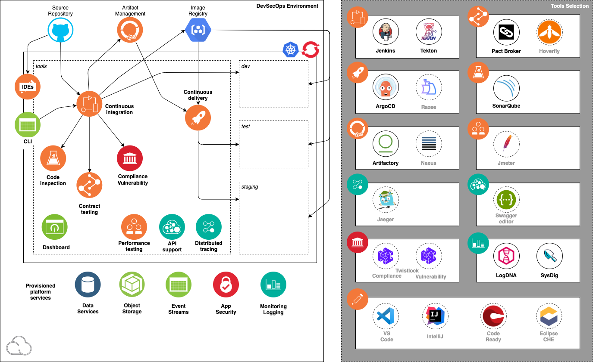

import Globals from 'gatsby-theme-carbon/src/templates/Globals';

<PageDescription>

Learn the architecture of the environment and the applications it supports

</PageDescription>

## Environment Architecture

As explained in the [overview](/overview), the <Globals name="env" /> consists of the following components and developer tools:
- A development cluster
- A set of backend services
- A set of continuous delivery tools

This diagram illustrates the Development Tools environment:

The diagram shows the components in the environment: the cluster, the deployment target environments, the cloud services, and the tools.

### Cloud-native application development

The <Globals name="env" /> is designed to facilitate development of applications that follow a best practices cloud-native application architecture, as explained in [Application Architecture](/arch/application). Teams developing applications with this architecture will best be able to take advantage of this environment.

### Dev tools inside

The developer tools implement the CI/CD pipeline for continuous delivery. They are deployed inside the development cluster in the tools namespace, which has several advantages.

**The tools are part of the environment.** The pipeline has to be hosted somewhere. Rather than find some new place for it in the cloud, or worse yet outside the cloud, let's host the pipeline in the <Globals name="env" />. The environment includes a development cluster--let's run the pipeline in there. Since Kubernetes organizes resources in namespaces, let's put these developer tools in their own namespace, we'll call it *tools*.

**The tools go where the environment goes.** Because the developer tools and the pipeline they implement are hosted in the cluster, the pipeline can be installed wherever the environment can be installed--which is any Kubernetes or Red Hat OpenShift cluster. This is especially important for hybrid- and multi-cloud architectures where cloud environments are hosted on different platforms--IBM Cloud, AWS, Azure, on-prem, etc. The environment cannot depend on the CI/CD tools provided by a single platform, it needs tools that can be hosted on any platform.

**Each team selects its own tools.** Because the developer tools are installed separately in each environment, the development team that owns the environment can customize the tools and pipeline specifically for their project. All of the development teams in the enterprise don't have to agree on a single set of tools and a single set of pipeline configurations. Each team can customize their toolset to meet the team's preferences.

**Each team manages its own tools.** Because the developer tools are hosted inside the environment, the enterprise's operation teams don't have to be responsible for managing the tools. Each development team can manage its own tools running in its own environment. This is especially significant when various development teams select a wide range of tools. Normally operations would be responsible for managing all of the tools that any team wants to use, and would scope their responsibilities by limiting the tools teams can select. Now each team can decide which tools it wants to use, as long as they can be hosted in Kubernetes and the team is willing to pay for them and manage them.

**No production application dependencies.** When an application developed in a <Globals name="env" /> is deployed to production, it does not require the continuous delivery pipeline in the production environment. The application is deployed using the artifacts produced by the pipeline--principally Helm charts of Docker images--but the pipeline is not required in the production environment. That is all the more reason to host the pipeline in the development environment, the only place it is needed.

### Ops tools outside

The backend services provide capabilities the applications depend on, which will be needed in production. They should be provided by the platform, so this part of the environment is platform-specific. The production instances of these services will need to be managed by the enterprise's operations teams. These services are an agreement, a point of coordination between the development team and the operations team. There are several aspects to this agreement.

**Monitoring and management**: Applications should be [built to manage](/arch/manageable). This requires monitoring systems outside the application, applications designed for monitoring, and operations personnel who use the monitoring. The <Globals name="env" /> uses two of the primary monitoring services in the IBM Cloud service catalog: [IBM Cloud Monitoring with Sysdig](https://cloud.ibm.com/docs/services/Monitoring-with-Sysdig) and [IBM Log Analysis with LogDNA](https://cloud.ibm.com/docs/services/Log-Analysis-with-LogDNA).

**Data persistence**: Cloud applications are stateless, but user functionality has data--that data must be stored somewhere. It should be stored and managed outside of the application so that the data survives application upgrades and outages. Applications typically have three types of data, and the <Globals name="env" /> incorporates IBM Cloud services for each one: [Databases For PostgreSQL](https://cloud.ibm.com/docs/services/databases-for-postgresql) for legacy relational data, [IBM Cloudant](https://cloud.ibm.com/docs/services/Cloudant) for document data, and [Cloud Object Storage](https://cloud.ibm.com/docs/services/cloud-object-storage) for binary data.

**Security**: Applications need to not only provide user functionality, but to do so securely. One important aspect of security is authenticating the users of the application. The <Globals name="env" /> provides this capability using [IBM Cloud App ID](https://cloud.ibm.com/docs/services/appid).

**Source code management** (SCM): The application's codebase should be stored in a code repository that provides revision control. ([The Twelve-Factor App](https://12factor.net/), Factor I. Codebase). The <Globals name="env" /> uses Git repos in [GitHub](https://github.com/), which provides [webhooks](https://developer.github.com/webhooks/) to trigger the environment's CI pipeline (either [Tekton](/guides/continuous-integration-tekton) or [Jenkins](/guides/continuous-integration)). While SCM is not needed in production and does not need to be managed by the operations team, it is an external capability that must be provided to the <Globals name="env" /> and that the development team must agree on (such as each development team having its own [GitHub organization](https://help.github.com/en/github/setting-up-and-managing-organizations-and-teams/about-organizations)).

### Teams for developers

As [Development Teams](/arch/teams) explains in detail, each development team can get its own <Globals name="env" />, or multiple teams can share an environment. The tradeoff is each team getting an isolated development environment so that they can work independently from each other vs. sharing an environment to increase utilization and facilitate coordinating on assets that form a single application.

