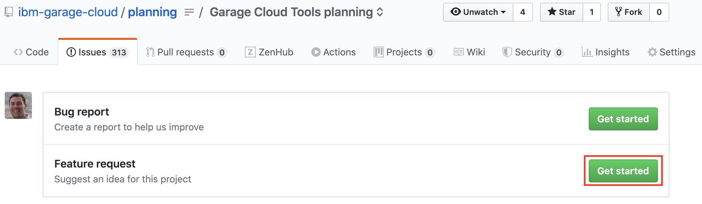
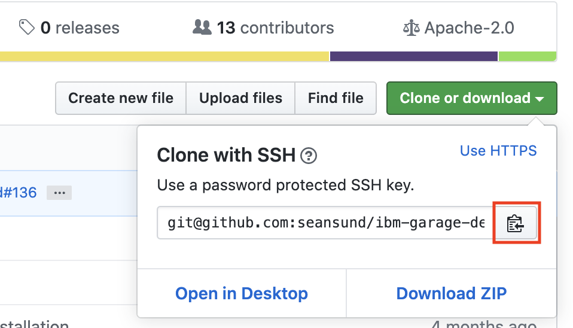
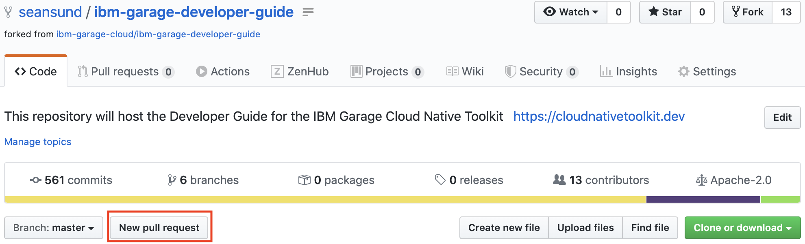
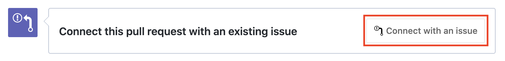

import Globals from 'gatsby-theme-carbon/src/templates/Globals'


## <Globals name="longName" />

_<Globals name="longName" />_  is an organized effort managed by the IBM Garage to help
 development teams build and deliver cloud-native solutions deployed to IBM Cloud with IBM Kubernetes 
 and Red Hat OpenShift Managed Service. The work is managed as an Open Source project and contribution is
 welcome from anyone that would like to participate. The following guidelines will help everyone navigate
 the process of contributing. (Most of these steps will generally apply to any Open Source project.)

###  Project structure

Before diving into the steps, it's important to get a general understanding of the organization structure of
the repositories. The various components that make up the <Globals name="longName" /> are organized into different git repositories
that are aligned around solution space, release schedule, and intended audience. Currently, these repositories are
divided between two public Git organizations:

- [github.com/ibm-garage-cloud](https://github.com/ibm-garage-cloud)
- [github.com/IBM](https://github.com/IBM)

All of the repositories in the [github.com/ibm-garage-cloud](https://github.com/ibm-garage-cloud) 
organization belong to the <Globals name="shortName" />. Within the [github.com/IBM](https://github.com/IBM) 
organization only the following repositories contain <Globals name="longName" /> content:

- [IBM/template-graphql-typescript](https://github.com/IBM/template-graphql-typescript)
- [IBM/template-java-spring](https://github.com/IBM/template-java-spring)
- [IBM/template-node-angular](https://github.com/IBM/template-node-angular)
- [IBM/template-node-react](https://github.com/IBM/template-node-react)
- [IBM/template-node-typescript](https://github.com/IBM/template-node-typescript)
- [IBM/ibm-garage-tekton-tasks](https://github.com/IBM/ibm-garage-tekton-tasks)
- [IBM/template-argocd-gitops](https://github.com/IBM/template-argocd-gitops)
- [IBM/template-ibmcloud-services](https://github.com/IBM/template-ibmcloud-services)
 
(These repositories have been relocated to the [github.com/IBM](https://github.com/IBM) because their content applies 
more broadly than the <Globals name="shortName" /> and/or fits in with the larger catalog of related Code Pattern and
Starter Kit content). 

## How to contribute

### 1. Look through the issues

<InlineNotification kind="info">

**Prerequisite:** We use ZenHub to add metadata to the Git issues so they can be managed via a Kanban board. ZenHub
also allows us to show the issues and pull requests from the various repositories in on place. Viewing 
the issues with ZenHub requires a Chrome extension - 
https://chrome.google.com/webstore/detail/zenhub-for-github/ogcgkffhplmphkaahpmffcafajaocjbd?hl=en-US .  We highly
recommend installing this extension to help search the issues.

</InlineNotification>

Whether you have a question/issue with existing behavior or an idea for a new feature that
can be added to the Toolkit, the place to begin is looking through the issues. Each repository has its own list of
issues. If you have an issue with content from a specific repository then any related issues will likely be found
there. 

However, given the wide range of repositories and the interconnected nature of many of the components it is usually
best to look at the ZenHub board. The following steps are the best way to view the board:

1. Open the [github.com/ibm-garage-cloud/planning](https://github.com/ibm-garage-cloud/planning) repository
2. Click on the `ZenHub` link along the top menu. **Note:** You must install the ZenHub extension for the link to
appear

  

3. Look at the `Repos` drop-down in the top-right of the board to ensure all the issues for the various 
<Globals name="shortName" /> repositories have been displayed. If the drop-down does not read `Repos (24/24)`
then do the following to select them all:

  i. Click on the `Repos` drop-down
  
  ii. Select the `Show all repos` link 
  
  

4. Use the filters and/or the search bar to find cards related to your issue.

If you find an existing ticket that is related to your issue, add your information to the
card.

#### Existing defect

If you find an existing defect, be sure to add a comment with the details of your specific
scenario. When the defect has been addressed and the ticket has been moved to the `Review/QA`
stage, we will ask you to help test the solution in your environment.

#### Existing feature

If you find an existing feature request, please indicate your interest through a comment. As
appropriate, include the business requirements or user story that is driving the request. We
will use this input to help determine prioritization of new features.

#### No issue found

If you are unable to find a card that is related to your issue or feature, proceed to
the next step to create a new issue. The search doesn't need to be an exhaustive one and
if there is any question whether the item is new or a duplicate, go ahead and create 
a new issue. We'd rather have the item captured and mark it as a duplicate after the
fact, if necessary, than to have an issue fall through the cracks.

### 2. Create a new issue

If you could not find an existing issue related to your problem or feature then its time to
create a new issue. Issues fall in one of two categories:

- Bug
- Feature

#### Bug

Bugs can be either be reported against the repository that has the problem or in the general
[github.com/ibm-garage-cloud/planning](https://github.com/ibm-garage-cloud/planning) repository.
These are the steps for reporting a bug:

1. Navigate to the repository in the browser
2. Click on the `Issues` menu item at the top then click on `New Issue`

  

3. Click `Get Started` on the `Bug report` template to create a new issue from the template. 
**Note:** At the moment, some repositories do not have `Bug report` templates defined. If a template does not exist 
you will see the blank issue dialog.

  

4. Provide all the information relevant to the bug, particularly the details of your scenario and the steps to reproduce

#### Feature

Features should be reported against the [github.com/ibm-garage-cloud/planning](https://github.com/ibm-garage-cloud/planning)
repository. These are the steps for requesting a feature:


1. Navigate to the [github.com/ibm-garage-cloud/planning](https://github.com/ibm-garage-cloud/planning) repository in 
the browser
2. Click on the `Issues` menu item at the top then click on `New Issue`

  

3. Click `Get Started` on the `Feature request` template to create a new issue from the template 

  

4. Provide all the information relevant to the bug, particularly the details of the problem addressed by the feature and
the impact/benefit of implamenting the feature

### 3. Setup your repository for development

On an Open Source project there are typically a few maintainers who have direct
access to the repositories and a larger number of contributors who do not. In this case, the
way to introduce changes to the repositories is through a fork. The process for setting up the
fork is as follows: 


1. Clone the repository to which you want to introduce changes (the `upstream` repository) to 
your local machine

  ```shell script
  git clone {upstream repo url}
  ```
  
2. Create a fork of the `upstream` repository by pressing the `Fork` button at the top of the
page

  

3. Copy the url of the repository fork

  

4. Open a terminal to the cloned directory and run the following to set the push url to
be the url of the repository fork

  ```shell script
  git remote set-url origin {fork repo url}
  ```

5. List the remotes for the local repository clone to verify that the fetch and push urls are
pointing to the appropriate repositories

  ```shell script
  git remote -v
  ```

  The output should look something like the following, with the `fetch` pointing to the 
  `upstream` url and the `push` pointing to the `fork`
  
  
  
With the local clone set up this way, any time you get changes from the remote
(e.g. `git pull`) the changes will be pulled from the `upstream` repository. Similarly,
when you push changes they will be pushed to the `fork`.

### 4. Develop your changes

Now that you have a fork and a local clone of the repository, you can start making your changes. This
part is mostly business-as-usual for software development. We have a couple of best practices we 
recommend:

#### Work in a branch

It is a best practice to make your changes in a separate branch, even though the changes
will be made in your own fork. There are at least two good reasons for doing this:

1. The branch can be named after the issue number and the feature

  Naming the branch according to the change that is being made provides a bit of documentation
  for the purpose of the branch. It also helps enforce the notion that the branch exists only
  for the implementation of that feature.

2. The branch can be rebased when new changes come in from the `upstream`

  Through the course of development of the branch, other changes may be introduced in the
  upstream repository. Making the changes in a separate branch allows for the upstream
  changes to be easily pulled in on the master branch and applied to other branches as
  appropriate.

Create the branch by running:

```shell script
git checkout -b {branch name}
```

Push the branch up to your fork by running:

```shell script
git push -u origin {branch name}
```

#### Commit message format

Each commit message should clearly describe the changes that are being made. During the
development process as many small changes are made, a single one-liner is sufficient for
the commit message.

With larger changes or when the changes in the branch are squashed into a single commit,
the following commit message format is preferred.

_Writing commit messages_

- `<type>` indicates the type of commit that’s being made. This can be: `feat`, `fix`, `perf`, `docs`, `chore`, `style`, `refactor`.
- `<scope>` the scope could be anything specifying place of the commit change or the thing(s) that changed.
- `<subject>` the subject should be a short overview of the change.
- `<body>` the body should be a detailed description of the change(s). This can be prose or a bulleted listing.
- `<issue reference>` the issue reference should be a reference to the issue number under which this change is being 
made. The issue reference should be in the format of `{git org}/{git repo}#{issue number}`

_Commit message format:_

```
type(<scope>): <subject>
<BLANK LINE>
<body>
<BLANK LINE>
<issue reference>
```

#### Create a draft pull request when the branch is first pushed to the fork

GitHub recently introduced `draft` pull requests that allow a pull request to be recorded but
marked as not yet ready for review. Git provides a url to open a pull request the first time a branch
is first pushed to the remote, which gives an excellent and easy opportunity to create the draft.

**Note**: Be sure to link the pull request with the issue

Creating a draft pull request early has the following benefits:

1. Clicking the link provided by Git sets up the source and target repos/branches for you so you don't
need to hunt around
2. Having the draft pull request gives insight for everyone else where the work is being done

#### Push changes to your fork frequently during development

As you are making changes, push them frequently to the fork. This ensures that your code is backed up
somewhere and allows everyone else to see what activity is happening. It also means that if you get
pulled into some other work, the latest version of your changes are available for others to possibly
pick up where you left off.

#### Pull in the latest changes from master frequently and rebase your branch

It is good to make sure you are always working off of the latest code from the upstream. With the 
changes in a separate branch, it is easy to bring in upstream changes with the following steps:

1. Checkout master in the local clone

  ```shell script
  git checkout master
  ```

2. Pull in the changes from the `upstream` repository

  ```shell script
  git pull
  ```

3. Check out your branch

  ```shell script
  git checkout {branch}
  ```

4. Rebase your branch on master

  ```shell script
  git rebase master
  ```

5. Force push the changes

  ```shell script
  git push --force-with-lease
  ```

### 5. Create your pull request

GitHub has recently added a new feature that allows a pull request
to put into `draft` status. This is helpful to record a pull request
as pending work even if the changes are not yet ready for review.

1. Open your fork repository in a browser

2. Click `New pull request`

  
  
3. Select the appropriate target and source branches for the pull
request and press `Create pull request`

  

  `base repository` is the target repository into which your
  changes should be merged (should be the upstream repository)
  
  `base` is the target branch in the upstream repository into which your
  changes should be merged (typically this will be `master`)
  
  `head repository` is the source of the changes (this should be
  your fork repository)
  
  `compare` is the branch containing your changes that should be merged

2. Write the title and description of the pull request

  [How to write the perfect pull request](https://github.com/blog/1943-how-to-write-the-perfect-pull-request)

3. Link the pull request to the related issue

  

4. Click `Create pull request` or `Create draft pull request` to submit

**Note:** A pull request can be converted to a `draft` after it was created
by clicking on the `Convert to draft` link located unter the `Reviewers` 
section on the right-hand side. 

  

### 6. Prepare your branch to submit the pull request for review 

1. Pull in the latest changes from master frequently and rebase your branch, as described in the previous section

2. (Optionally) Rebase your branch to squash commits and clean up commit messages.

  An interactive rebase will allow you to clean up your branch before submitting it for review. This
  will reduce the number of commits down to the core set of changes that reflect the feature/bug fix, 
  remove any commits that aren't part of the change you are making, and clean up the commit messages
  to clearly describe the changes and follow the commit message format guidelines.

### 7. Submit your pull request for review

Assuming you have previously created a draft pull request, when you are ready to have your code 
reviewed and merged then you will need to indicate that in the pull request.

1. Open the browser to the upstream repository.

2. Select the `Pull requests` tab, find your pull request in the list
and open it.

3. Press the `Ready for review` button to tell the maintainers the pull
request is ready to be processed. 

  

### 8. Update your pull request

Keep an eye on the pull request after it has been submitted for review. The maintainers may have questions
or request changes before the pull request can be closed. The GitHub system should notify you when changes
are made to your pull request.

Also, the maintainers all have day jobs and sometimes pull requests get overlooked. If your pull request has
sat for a while you can get some attention to it by tagging one of the maintainers in a commit comment.
E.g. `@seansund @csantana @bwoolf1 @lsteck` 
