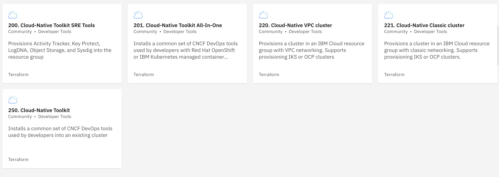

import Globals from 'gatsby-theme-carbon/src/templates/Globals';

<PageDescription>

One of the features of the IBM Cloud Catalog is support for private catalog tiles. These can
contain custom Terraform definitions that can accelerate SRE teams in the execution of common
and repetitive tasks. The <Globals name="shortName" /> tools installation can be configured as
a private catalog tile. This is the recommended approach for using this asset multiple times.
This asset enables the easy transition of a default cluster into a cluster that supports
Cloud-Native CI/CD development tools.



</PageDescription>

<InlineNotification kind="warning">
This installation method will only work on IBM Cloud. Use Iteration Zero for others.
</InlineNotification>

## Cloud-Native Toolkit: Tile Installation

Walkthrough of the Cloud Native Toolkit installation on RedHat OpenShift using the Private Catalog on IBM Cloud.

<iframe width="560" height="315" src="https://www.youtube.com/embed/H_DsaYXLBVc" frameborder="0" allow="accelerometer; autoplay; clipboard-write; encrypted-media; gyroscope; picture-in-picture" allowfullscreen></iframe>

### A. Create the catalog

<br></br>

1. Log in to the <Globals name="ic" /> Console
2. Click **Manage->Catalogs** from the top menu
3. Click on **Create Catalog**
4. In the `Create a catalog` dialog, provide the following values:
    - **name:** the name of the catalog, for example `Team Catalog`
    - **description:** (optional) a brief description of the purpose of the catalog
    - **products:** select **Start with no products**
    - **resource group:** click **Update** to change the default resource group for the catalog
5. Click **Create** to complete the catalog creation

### B. Register the <Globals name="shortName" /> tiles in the catalog

<br></br>

<InlineNotification>

**Note:** The following instructions depend on the `jq` command. The information for installing
`jq` can be found on the [<Globals name="shortName" /> prerequisites](/getting-started/prereqs) page

</InlineNotification>

<br />

Run the following command to install the offering tiles into an existing catalog. You will be prompted for your catalog name
and IBM Cloud API Key.

```shell
bash -c "$(curl -Ls tiles.cloudnativetoolkit.dev)"
```

Alternatively, the values can be provided to the script via environment variables named `CATALOG_NAME` and `API_KEY`.

```shell
CATALOG_NAME="Team Catalog" API_KEY="xxxx" bash -c "$(curl -Ls tiles.cloudnativetoolkit.dev)"
```

### C. Apply the tile

<br />

Once the tile has been installed it can be used repeatedly to set up clusters with
the CNCF tools. Each time the tile is applied, a set of configuration variables are
required.

1. Log in to the <Globals name="ic" /> Console.
2. Select **Catalog** from the top menu.
3. From the side menu, select your catalog from the drop-down list (e.g. `Team Catalog`). (**IBM Cloud catalog** should be selected initially.)
4. Click **Private** on the side menu to see the private catalog entries
5. Click on the **Cloud-Native Toolkit** tile
6. Enter values for the variables list provided.

    | **Variable**          | **Description**                                                                               | **eg. Value**                 |
    |-----------------------|-----------------------------------------------------------------------------------------------|-------------------------------|
    | `ibmcloud_api_key`    | The API key from IBM Cloud Console that has ClusterAdmin access and supports service creation | `{guid API key from Console}` |
    | `resource_group_name` | Existing resource group in the account where the cluster has been created                     | `dev-team-one`                |
    | `region`              | The region where the cluster has been provisioned                                             | `us-east`, `eu-gb`, etc       |
    | `cluster_exists`      | Flag indicating if the cluster already exists. (`false` means the cluster should be provisioned) | `true` or `false`          |
    | `vpc_cluster`         | Flag indicating that the cluster has been built on VPC infrastructure                         | `true` or `false`             |
    | `vpc_zone_names`      | A comma-separated list of the VPC zones that should be used for worker nodes. This value is requored if `cluster_exists` is set to `false` and `vpc_cluster` is set to `true` | `us-south-1` or `us-east-1,us-east-2` |
    | `cluster_name`        | The name of the cluster (If `cluster_exists` is set to `true` then this name should match an existing cluster) | `dev-team-one-iks-117-vpc` |
    | `cluster_type`        | The type of cluster into which the toolkit will be installed                                  | `kubernetes`, `ocp3`, `ocp4` or `ocp44` |
    | `registry_namespace`  | The namespace that should be used in the IBM Container Registry. If not provided the value will default to the resource group name | `dev-team-one-registry-2020` |
    | `provision_logdna`    | Flag indicating that a new instance of LogDNA should be provisioned                           | `true` or `false`          |
    | `logdna_name`         | The name of the LogDNA instance (If `provision_logdna` is set to `false` this value is used by the scripts to bind the existing LogDNA instance to the cluster) | `cntk-showcase-logdna` |
    | `provision_sysdig`    | Flag indicating that a new instance of Sysdig should be provisioned                           | `true` or `false`          |
    | `sysdig_name`         | The name of the Sysdig instance (If `provision_sysdig` is set to `false` this value is used by the scripts to bind the existing Sysdig instance to the cluster) | `cntk-showcase-sysdig` |

    <InlineNotification>

    **Note:** Provisioning a new cluster using classic infrastructure is not supported with the tile install. In this case
    you are recommended to either create the cluster using the <Globals name="ic" /> Console then use the tile
    to install the Toolkit **OR** to install with one of the other methods.

    </InlineNotification>

<br />


7. Check the box to accept the **Apache 2** license for the tile.
8. Click **Install** to start the install process

This will kick off the installation of the <Globals name="shortName" /> using an
IBM Cloud Private Catalog Tile. The progress can be reviewed from the
**Schematics** entry

## Post-installation steps

Once the Terraform has completed, walk through the [post installation steps](/getting-started-day-0/post-installation) to
explore and verify the environment.

## Troubleshooting

If you find that the Terraform provisioning has failed, for Private Catalog delete the workspace and for Iteration Zero  try re-running the `runTerraform.sh` script again.
The state will be saved and Terraform will try and apply the configuration to match the desired end state.

If you find that some of the services have failed to create in the time allocated, try the following with Iteration zero:

1. Manually delete the service instances in your resource group
3. Re-run the `runTerraform.sh` script with the `--delete` argument to clean up the state
    ```shell script
    ./runTerraform.sh --delete
    ```
