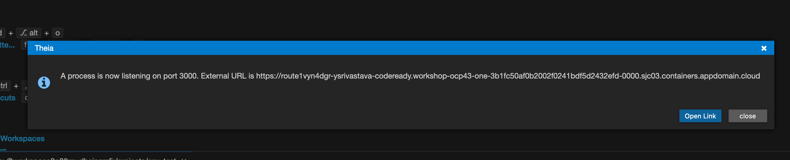

import Globals from 'gatsby-theme-carbon/src/templates/Globals';

<PageDescription>

Create a sample application and deploy it with a CI pipeline

</PageDescription>

## Overview

The <Globals name="env" /> supports end-to-end development and deployment of an application. The instructions below
will show you how to do it.

You can create a new app using one of the [<Globals name="templates" />](/starterkits). These have been
created to include all the key components, configuration, and frameworks to get you started on creating the code you
need for your solutions. The approach for getting started is exactly the same for an environment based on
**Kubernetes** or **Red Hat OpenShift**.

**Note:** The instructions provided below lean heavily on the use of the <Globals name="igccli"/> to both show how the
CLI works in context and to streamline the process (the reason for creating the CLI in the first place). However, the
use of the CLI is in no way required to use the <Globals name="shortName"/>. If you would prefer to work through these
instructions without the use of the CLI, we have provided the equivalent manual steps for each command on
the [Cloud-Native Toolkit CLI](/getting-started/cli) page.

This video demonstrates how to work through the steps to create an application and use a deployment pipeline to install
it into your development cluster.

<Video src="/videos/deployapp.m4v" type="video/m4v" poster="/images/poster.png"/>

```toc
# This code block gets replaced with the TOC
exclude: Table of Contents
tight: false
ordered: false
from-heading: 2
to-heading: 6
class-name: "table-of-contents"
```

### Links

<AnchorLinks>
  <AnchorLink to="#1.-log-into-your-development-cluster-from-the-command-line">1. Log into your Development Cluster from the command line</AnchorLink>
  <AnchorLink to="#2.-create-the-development-namespace">2. Create the development namespace</AnchorLink>
  <AnchorLink to="#3.-open-the-developer-dashboard">3. Open the Developer Dashboard</AnchorLink>
  <AnchorLink to="#4.-create-your-app-in-git">4. Create your app in Git</AnchorLink>
  <AnchorLink to="#5.-clone-your-code">5. Clone your code</AnchorLink>
  <AnchorLink to="#6.-run-the-application locally">6. Run the application locally</AnchorLink>
  <AnchorLink to="#7.-set-the-namespace-context">7. Set the namespace context</AnchorLink>
  <AnchorLink to="#8.-register-the-app-in-a-devops-pipeline">8. Register your pipeline</AnchorLink>
  <AnchorLink to="#9.-view-your-application-pipeline">9. View your application pipeline</AnchorLink>
  <AnchorLink to="#10.-access-the-running-app">10. Access the running app</AnchorLink>
  <AnchorLink to="#11.-locate-the-app-in-the-web-console">11. Locate the app in the Web Console</AnchorLink>
</AnchorLinks>

### 1. Log into your Development Cluster from the command line

- Make sure you have installed all the [Prerequisite Dev Tools](/getting-started/prereqs) before continuing
- Log in to the development cluster's CLI (Kubernetes or Red Hat OpenShift)

    To do so, navigate to your cluster in the _IBM Cloud console_, click on the **Access** tab, and follow the
    instructions in **After your cluster provisions, gain access**  section to log in to the cluster from the command line

- You can test that you're connected to the cluster with the following simple command:

  ```shell script
  oc get pods -n tools
  ```

    <InlineNotification kind="info">

    **NOTE**: If your workshop is on Code Ready Workspaces, follow the steps in [Code Ready Workspaces Setup](/getting-started/devenvsetup#code-ready-workspace) before logging in to the cluster.
    The remaining steps assume this step has already been performed. If you stop and then come back later it is a good idea to re-run this step again before proceeding

    </InlineNotification>

### 2. Create the development namespace

- Before getting started, the development namespace/project needs to be created and prepared for the DevOps pipelines.
- This is something that would typically happen once at the beginning of a project when a development team is formed and 
  assigned to the cluster.This step copies the common `secrets` and `configMaps` to your new namespace. This enables the pipelines to reference the values easily for you project

    ```
    oc sync {DEV_NAMESPACE} --dev
    ```

### 3. Open the Developer Dashboard

The [Developer Dashboard](/getting-started-day-1/dashboard) makes it easy for you to navigate to the tools, including a
section that allows you to select a set of preconfigured [<Globals name="templates" />](/resources/codepatterns-overview) that make seeding your development project very easy.

- If you are logged into the OpenShift console, you can select the tools menu and select **Developer Dashboard**

- If you are on a laptop/desktop, open a browser and make sure you are logged into [Github](https://github.com)

- Open the dashboard by running the following command:
  ```
  oc dashboard
  ```

### 4. Create your app in Git

- From the Developer Dashboard, click on **<Globals name="templates" />** tab

    <InlineNotification kind="warning">

    **Warning:** If you are developing on a shared education cluster, you need to make it easy to identify
    your app. Please suffix the app name with your initials `{app name}-{your initials}` (e.g.
    `stockbffnode-mjp`) and use the **Git Organization** for the shared environment.

    **Warning:** Your browser needs to be logged in to your GitHub account for a template to work. If the link from the
    tile displays the GitHub 404 page, log in and reload the page.

    </InlineNotification>


- Pick one of the templates that is a good architectural fit for your application and the language and framework that you prefer to work with. For your first application, select the **Typescript Microservice**. This also works well in the Cloud Shell.

  Click on a <Globals name="template" /> **Tile** to create your app github repository from the
    template repository selected. You can also click on the **Git Icon** to browse the source template
    repository and click on the **Template** to create the template.

- Complete the [GitHub create repository from template](https://help.github.com/en/github/creating-cloning-and-archiving-repositories/creating-a-repository-from-a-template)
process.

  **Owner**: Select a valid GitHub organization that you are authorized to create repositories within or the one you were given for the shared cluster (See warning above)

  **Repository name**: Enter a name for your repo. GitHub will help with showing a green tick if it is valid (See warning above)

  **Description**: Describe your app

  Press **Create repository from template**

  

- The new repository will be created in your selected organization.

### 5. Clone your code

- Next, clone the Github repo to your local machine.
- Click on **Clone or download**
- Copy the clone _HTTPS link_, and use the `git clone` command to clone it to your terminal.
    ```shell script
    git clone https://github.com/gsi-ecosystem-demo/stockbffnode-mjp.git
    ```
- You will be required to enter your **GitHub User ID** and use your **Git Hub Personal Access Token** as your password. This will complete the clone of your git repository.

- Change into the cloned directory
    ```shell script
    cd stockbffnode
    ```
- You must rename the app to match your git repo or to a unique name for your solution. When applications move into a _test_ environment, they need to have unique names.
- Edit `package.json` and edit the `name:` field and change it from its template name to your chosen name.
- In case of a java gradle application(Spring Boot Microservice), edit the `settings.gradle` file. Edit the `rootProject.name` field and change it from its template name to your chosen name.
- Save the edits
- Push the changes back to your repository
    ```bash
    git add .
    git commit -m "Update application name"
    git push
    ```
- You will be required to enter your **GitHub User ID** and use your **Git Hub Personal Access Token** as your password. This will push your changes back to the repository.

## Running the Application

### 6. Run the application locally

Most developers like to run the code natively in local development environment. To do so, follow the instructions listed in the **README.md** file to run the code locally.
You may be required to install a specific runtime like **Java**, **Node** or **Go**.

- If you want to quickly access your git repo you can run a helper command to open the git webpage.
    ```
    oc git
    ``` 

- From inside the folder where the code was cloned from GitHub, run the following command to install the Node.js dependencies.
    ```
    npm install
    ```
- Run the following command to start the application.
    ```
    npm run start
    ```

<Tabs>

<Tab label="Cloud Shell">

 - To view the running app click on the **Eye Icon** on the top right and select the port `3000` this will open a browser tab and display the running app on that port.

    

</Tab>


<Tab label="Cloud Ready Workspaces">




- Click on open link


- To view this application in new tab click top right corner arrow icon

</Tab>

<Tab label="Desktop/Laptop">
- Open a browser to `http://localhost:3000/api-docs/`
</Tab>

</Tabs>

- You can try out the sample API that is provided with this **Code Pattern**

- You can now add new features and function from inside the Cloud Shell and experiment with your code before you push any changes back to git.


### 7. Set the namespace context

Before running the remaining commands, it is important to set the
namespace/project context. (**Note:** The `kubernetes` command will work for both `openshift`
and `kubernetes`.)

<Tabs>
<Tab label="OpenShift">

```shell script
oc project {DEV_NAMESPACE} 
```
</Tab>
<Tab label="Kubernetes">

```shell script
kubectl config set-context --current --namespace={DEV_NAMESPACE}
```
</Tab>
</Tabs>

### 8. Register the App in a DevOps Pipeline

Up to this point you have the code in a GitHub repository and have cloned it to your local development environment. You now need to register the repository with the continuous integration pipeline. The <Globals name="env" /> supports both [Tekton](/tools/tekton) and [Jenkins](/tools/jenkins) for continuous
integration.

- Start the process to create a pipeline

    ```shell script
    oc pipeline
    ```

    <InlineNotification kind="info">

    The pipeline command give an option for both `Jenkins` and `Tekton`. For more information about working with the
    different build engines, please see [Continuous Integration with Jenkins Guide](/tools/jenkins) and
    [Continuous Integration with Tekton Guide](/tools/tekton)

    </InlineNotification>

- For the deployment of your first app with OpenShift select **Tekton** as the chosen CI engine.

- The first time a pipeline is registered in the namespace, the CLI will ask for a username and
**Personal Access Token** for the Git repository that will be stored in a secret named `git-credentials`. It will
also ask for the branch that should be used for the pipeline.

  **Username**: Enter your GitHub user id

  **Personal Access Token**: Paste your GitHub personal access token

  **Branch**: Press enter to use the default git branch, master, or type in another branch you want to register

- When registering a `Tekton` pipeline, you will be prompted to select which pipeline you want to use for your application. If you selected Node based Code Pattern, select the Node pipeline. If you selected Java, select the Gradle pipeline.
- For the first app, select the `ibm-nodejs` version of the pipeline. This will use the Node based CI pipeline with Tekton.
    ```
    ? Select the Pipeline to use in the PipelineRun: (Use arrow keys)❯
     ibm-appmod-liberty
     ibm-golang
     ibm-golang-edge
     ibm-java-gradle
     ibm-java-maven
     ibm-nodejs
     Skip PipelineRun creation
    ```
- It also gives you a option of vulnerability scanning the images.The scan is performed by the Vulnerability Advisor of IBM Image Registry. This scan is performed in "scan" stage of pipeline after "img-release" stage.
  ```
  ? Would you like to enable the pipeline to scan the image for vulnerabilities?(Y/n)
  ```
- To skip the scan, you have type "n" (No).Otherwise, type "y" (Yes) for performing Vulnerability Scanning on the image.

- After the pipeline has been created,the command will set up a webhook from the Git host to the pipeline event listener

    **Note:** if the webhook registration step fails, it is likely because the Git credentials are incorrect or do not have enough permission in the repository. 

- The pipeline will be registered in your development cluster.

### 9. View your application pipeline

The steps to view your registered pipeline will vary based on type of pipeline (`Jenkins` or `Tekton`) and container platform version.

<Accordion>
<AccordionItem title="Tekton">

<Tabs>
<Tab label="OpenShift 4.x">

1. Open the OpenShift Web Console

    ```shell script
    oc console
    ```

    **OR**

    

2. From menu on the left switch to the **Developer** mode

3. Select _dev_ project that was used for the application pipeline registration

4. In the left menu, select *Pipelines*

You will see your application dev ops pipeline now starting to build and once completed will look like the image below.


</Tab>
<Tab label="Kubernetes">

1. Open the Developer Dashboard

    ```shell script
    kubectl dashboard
    ```

2. Select the `Tekton` tile to launch the Tekton UI

3. Select your development project

</Tab>
</Tabs>

</AccordionItem>
<AccordionItem title="Jenkins">

<Tabs>
<Tab label="OpenShift 4.x">

1. Open the OpenShift Web Console

    ```shell script
    oc console
    ```

    **OR**

    

2. From the left-hand menu, select `Builds` -> `Build Configs`

3. Select your project from the drop-down menu at the top

4. The registered pipeline should appear in the list

</Tab>
<Tab label="Kubernetes">

1. Run the command `oc dashboard` in your terminal to open your [<Globals name="dashboard" />](/getting-started-day-1/dashboard)
2. Select the Jenkins tool to open the Jenkins dashboard
3. Run the command `kubectl credentials` in your terminal to get the list of logins for the tools
4. Use the Jenkins userid and password to log into the Jenkins dashboard

Wait for the pipeline stages to start building. Once the stages have completed, you will see a view similar to the one below.


</Tab>
</Tabs>

</AccordionItem>

</Accordion>

### 10. Access the running app

Once the pipeline has completed successfully, the app will be deployed into the namespace used when
registering the pipeline. To validate the app is running follow these steps:

**Note:** Be sure the namespace context is set correctly before running the following commands -
[set the namespace context](#7.-set-the-namespace-context)

- Retrieve the app ingress endpoint using commands below in your terminal.

    ```bash
    oc endpoints
    ```

- From the endpoints listed, select the URL for the repo that was just deployed and press **Enter** to
open that URL in a web browser. Validate the application is working as expected.

### 11. Locate the app in the web console

The build pipeline is configured to build the source code from the Git repository into a container image. This
image is stored in the [Image Registry](/learning/intermediate). After that, the image is deployed into the
same namespace/project within the development cluster where the pipeline ran and validated for its health. The steps
below will walk through locating the installed application within the Web Console.

<Tabs>
<Tab label="OpenShift 4.x">

- Open the **OpenShift web console**
  ```shell script
    oc console
    ```
- Change to the **Developer** view
- Click on **Topology** menu
- Click on your application deployment in the topology view
- Click on the **Overview** tab
- Increase the number of running pods to 2 pods
- Click on the **Resources** tab to view the list of pods
- Click on **View Logs** link to view the logs from each pod
- You can see the running state of your application


</Tab>

<Tab label="Kubernetes">

- Open the **Kubernetes Dashboard**
  ```shell script
    kubectl console
    ```
- Change to the namespace from `default` to either `dev` or the namespace you used to deploy your app
- Click on **Deployments**
- You should see the deployment of your application
- Click on your application , and the corresponding **Replica Set**
- Try scaling the application, click on **Scale** in the header, change number of pods to 2 and click **OK**
- Click on one of the `pod` instances
- Click on **Logs**
- You can see the running state of your application
- Navigate around the console to understand where your deployment, service and pods are running


</Tab>
</Tabs>

<InlineNotification kind="success">

**Success:** You now have your application running inside your development cluster and being delivered using a Tekton based CI pipeline. This is the beginning of the developer journey with IBM Cloud.

</InlineNotification>

Having reached this point, we recommend you repeat the process a few more
 times using different **Code Patterns** templates and explore the **Developer** view in OpenShift to get familiar with it.

### 12. Test the webhook
-  Go to your cloned git project and navigate to <i>chart/base</i> directory.
```
cd stockbffnode
cd chart/base
```
- Open the file `Chart.yaml` in edit mode and change the `description` field's value from "A Helm chart for Kubernetes" to "A Helm chart for [yourprojectName]"
- Save the edits
- Push the changes back to your repository
    ```bash
    git add .
    git commit -m "Update application name"
    git push
    ```
- As soon as you push your code changes successfully, the webhook will trigger a new pipeline run for your project in your namespace in OCP.
  
  **Note:** if the webhook registration step fails, the git push will not trigger the pipeline.
