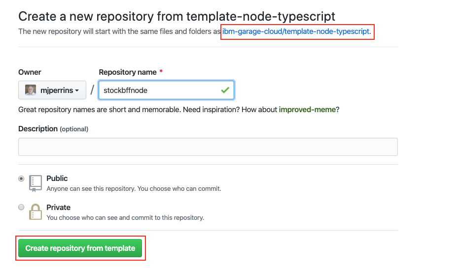

<PageDescription>

Create a sample application and register Jenkins build pipeline to deploy your application into your development cluster

</PageDescription>

## Overview

You can create a new app using one of the [Starter Kit Templates](/starterkits/overview). These have been created to include all the key components, configuration, and frameworks to get you started on creating the code you need for your solutions. The approach for getting started is exactly the same for **IBM Kubernetes** or **Red Hat OpenShift** managed service that have both had the Development environment installed.

This video will demonstrate how to work through the steps to create an application that uses a deployment pipeline to install it into your development cluster.

<p></p>
<p></p>
<p></p>

<Video src="/videos/deployapp.m4v" type="video/m4v" poster="/images/poster.png"/>

### Log into you Development Cluster from the command line

- Make sure you have installed all [Prerequisites](/getting-started/prereqs) before continuing
- Open a terminal
- log into your Development cluster in a terminal (If using a shared education cluster, log into openshift)
- To do so, navigate to your cluster in the _IBM Cloud Console_, click on the **Access** tab and
follow the instructions to login from the command line
- You can test this with the following simple command: 

<Accordion>

  <AccordionItem title="OpenShift">

    oc get pods

  </AccordionItem>

  <AccordionItem title="Kubernetes">

    kubectl get nodes

  </AccordionItem>

</Accordion>


### Links

<AnchorLinks>
  <AnchorLink to="#open-developer-tools-dashboard">Open Developer Tools Dashboard</AnchorLink>
  <AnchorLink to="#create-your-app-in-git">Create your app in Git</AnchorLink>
  <AnchorLink to="#clone-your-code">Clone your code</AnchorLink>
  <AnchorLink to="#running-locally">Running Locally</AnchorLink>
  <AnchorLink to="#register-the-app-in-a-devops-pipeline">Register your pipeline</AnchorLink>
  <AnchorLink to="#view-your-application-pipeline">View your application pipeline</AnchorLink>
  <AnchorLink to="#access-running-app">Access running app</AnchorLink>
  <AnchorLink to="#where-is-your-app-running-">Where is your app running ?</AnchorLink>
</AnchorLinks>

Clone your code
### Open Developer Tools Dashboard


The Developer Tools Dashboard makes it easy for you to navigate to the tools, including a section that allows you to select a set of preconfigured [Starter Kit Templates](/starterkits/overview) that make seeding your development project very easy.

- Open a browser and make sure you are logged into [Github](https://github.com)
- Open the [Developer Tools Dashboard](/getting-started/dashboard) by running the following command:
    ```
    igc dashboard
    ```

### Create your app in Git
<InlineNotification kind="warning">

**Warning:** If you are developing on a shared education cluster. You need to make it easy to identify your app please suffix the app name with your initials `{app name}-{your initials}` ie. `stockbffnode-mjp` and use the **Git Organisation** listed in your notification email.

</InlineNotification>

- Open the Developer Tools Dashboard
- Click on **Starter Kits** tab
- Pick one of the templates that is a good architectural fit for your application and the language and framework that you prefer to work with.
    - Click on a Starter Kit Template **Tile** to create your app github repository from the template repository selected.
    - You can also click on the **Git Icon** to browse the source template repository and click on the **Template** to create the template

- Complete the [GitHub create repository from template](https://help.github.com/en/github/creating-cloning-and-archiving-repositories/creating-a-repository-from-a-template) process.

  - **Owner**: Select a validate GitHub organization that you are authorized to create repositories within or the one you were given for the shared cluster (See warning above)
  - **Repository name**: Enter a valid name for you repo , github will help with showing a green tick if it is valid (See warning above)

  - **Description**: Describe your app
    
  - Press **Create repository from template**


The new repository will be created in your selected organization.

### Clone your code
- Next, clone it to your local machine.
- Click on **Clone or download**
- Copy the clone _SSH link_, and use the `git clone` command to clone it to your developer desktop machine.
    ```base
    git clone git@github.com:mjperrins/stockbffnode.git
    ```
- Change into the cloned directory
    ```
    cd stockbffnode
    ```
- You must rename the app to match your git repo or to a unique name for your solution. Then applications move into a _test_ environment they need to unique names.
- Edit `package.json` and edit the `name:` field and change it from its template name to your chosen name.
- Save the edits
- Push the changes back to your repository
    ```
    git add .
    git commit -m "Update application name"
    git push
    ```

### Running Locally

Most developers like to run the code natively in local development environment. To do so, follow the instructions listed in the **README.md** file to run the code locally. You may be required to install a specific runtime like **Java**, **Node**, or **Python**.


### Register the App in a DevOps Pipeline

You now have the code in a GitHub repository and have cloned it to you local development environment. You now need to register the repository with the continuous integration pipeline technology.

The default continuous integration tool currently is [Jenkins](/guides
/continuous-integration). [Tekton](/guides/continuous-integration-tekton) is
 also enabled.

You can use the [IGC CLI](/getting-started/cli) to assist helping register a pipeline with Jenkins.

<InlineNotification kind="warning">

  **Warning:** If you are working on a shared education cluster, please deploy your app into a unique project/namespace and continue to do this for all other app creation steps. This will isolate your pipelines into its own namespace/project from other developers working on the same cluster.
  
</InlineNotification>
  

  - If working on **OpenShift** create your project namespace first
      ```bash
      oc new-project dev-{initials}
      ```
  - Do not run `igc pipeline` without a namespace , this will cause your
   pipeline to be created in the default `dev` namespace:
      ```bash
      igc pipeline
      ```
  - Instead, include the namespace parameter:
      ```bash
      igc pipeline -n dev-{initials}
      ```
  - For example:
      ```bash
      igc pipeline -n dev-mjp
      ```

  - You can alternatively configure your app to use **Tekton** for CI. For
   more details review the [Continuous Integration with Tekton Guide](/guides/continuous-integration-tekton)   
      ```bash
      igc pipeline -n dev-mjp --tekton  
      ```  
  
- Register your repo using the `igc pipeline` command. The CLI will ask for your github userid, it can be found in your github settings. It will ask for you enter your **Github Personal Access Token** and finally your branch.
    - **Username**: Enter your GitHub user id
    - **Password**: Paste your github personal access token
    - **Branch**: Press enter for the default git branch or type in another branch you want to register
        ```bash
        $ oc new-project -n dev-{initials}
        $ igc pipeline -n dev-{intials}
        Project git repo: https://github.com/mjperrins/stockbffnode.git
        ? Provide the username: mperrins
        ? Please provide your password/personal access token: [hidden]
        ? Please provide the branch the pipeline should use: master
        Creating secret with git credentials
        Registering pipeline
        Creating git webhook
        ```

- The pipeline will be registered in your development cluster.

### View your application pipeline

To view you registered pipeline, follow the steps for the type of development cluster you registered your application with.

<Tabs>
<Tab label="OpenShift">

- Open the OpenShift Web Console from the Developer Cluster instance


- From the top menu, switch to the **Application Console**
- Select _dev_ project/namespace or you personal namespace that was used on the creation
- In the left menu, select *Builds* -> *Pipelines*

You will see your application dev ops pipeline now starting to build and once completed will look like the image below.


</Tab>
<Tab label="Kubernetes">

- Run the command `igc dashboard` in your terminal to open your [Developer Tools Dashboard](/getting-started/dashboard)
- Select the Jenkins tool to open the Jenkins dashboard
- Run the command `igc credentials` in your terminal to get the list of logins for the tools
- Use the Jenkins userid and password to log into the Jenkins dashboard

Wait for the pipeline stages to start building. Once the stages have completed, you will see a view similar to the one below.


</Tab>
</Tabs>

### Access running app

Once the pipeline has completed successfully, the app will be deployed into the `dev` namespace or the namespace you used when registering the pipeline.

- To validate the app is running follow these steps.

- To access the app, retrieve the app ingress endpoint using commands below in your terminal, remember to use the namespace you supplied when registering the application.
    ```bash
    igc ingress -n dev
    ```
  
  You will see a list of apps displayed with their ingress URLs for the application.
    ```bash
    igc ingress -n dev
    ? Ingresses in the 'dev' namespace. Select an ingress to launch the default browser or 'Exit'.

    1) Exit
    2) template-graphql-typescript - https://template-graphql-typescript-dev.mooc-one-rhos-cluster.us-east.containers.appdomain.cloud
    3) template-node-react - https://template-node-react-dev.mooc-one-rhos-cluster.us-east.containers.appdomain.cloud
    Answer:
    ```
- Use the arrow keys to select the ingress URL and press **Enter** to open it in a web browser and validate the application is working as expected


### Where is your app running ?

- The build pipeline is configured to build you source code into a container image. This image is stored in the IBM Image Registry. The image is then deployed into your namespace/project within you development cluster and validated for its health.
- Use the steps below to find your application within your cluster console.

<Tabs>
<Tab label="OpenShift">

- Open the **OpenShift web console**
- Change to the **Application Console**
- Select you project either `dev` or the namespace you used to deploy your app
- Click on **Deployments**
- You should see the deployment of your application
- Click on your application , and the corresponding deployment number
- Try increasing the number of pods to see new instances being provisioned
- Click on one of the `pod` instances
- Click on **Logs**
- You can see the running state of your application
- Navigate around the console to understand where your deployment, service and pods are running


</Tab>

<Tab label="Kubernetes">

- Open the **Kubernetes Dashboard**
- Change to the namespace from `default` to either `dev` or the namespace you used to deploy your app
- Click on **Deployments**
- You should see the deployment of your application
- Click on your application , and the corresponding **Replica Set**
- Try scaling the application, click on **Scale** in the header, change number of pods to 2 and click **OK**
- Click on one of the `pod` instances
- Click on **Logs**
- You can see the running state of your application
- Navigate around the console to understand where your deployment, service and pods are running


</Tab>
</Tabs>

- If you have reached this point, we recommend you repeat the process a few more times using different templates and explore you environment to get familiar with it.
- The [Guides](/guides/overview) will explain more about the tools used in the pipelines

<InlineNotification kind="success">

**Success:** You will now have your application running inside your development cluster.

</InlineNotification>

- This completes the deployment of your app.

You now have a running application that is being built and deployed into your development cluster.
The next step is to prepare for Continuous Delivery, Code Analysis, and Artifact Management.

## Guides

For more detailed instructions of how to enable to the full developer lifecycle read through the **Guides** section.

<AnchorLinks small>
  <AnchorLink to="../../guides/overview">Guides</AnchorLink>
  <AnchorLink to="../../codepatterns/overview">Code Patterns
  </AnchorLink>
</AnchorLinks>
