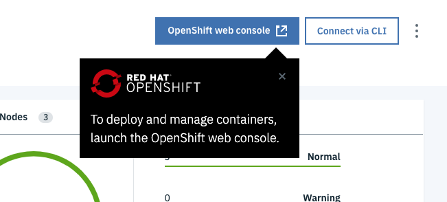
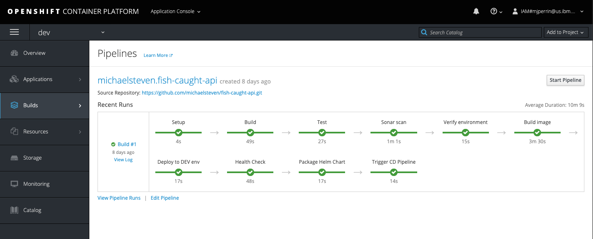

<PageDescription>

Use a Starter Kit Template to create a sample app and the Jenkins pipeline to deploy it into the cluster

</PageDescription>

## Overview

Now that you have prepared your Developer Tools environment for cloud-native application development, 
you can now create a new app using one of the _Starter Kit Templates_. These have been created to include all the key
components, configuration, and frameworks to get you started on creating the code you need for your solutions. The approach for getting started is exactly the same for a set of tools installed into **IBM Kubernetes** or **Red Hat OpenShift** managed service.

### Demonstration video

This video will demo how to get started with using the Dashboard to develop and deploy an app.
It shows how to do the steps that are described below.

<Video src="/videos/deployapp.m4v" type="video/m4v" poster="/images/poster.png"/>

### Open the Developer Tools Dashboard

The Developer Tools Dashboard makes it easy for you to navigate to the tools, including a section that
lists the [Starter Kit Templates](/starterkits/overview). These templates have been created to give you 
a more comprehensive starting point for you apps.

- Make sure you have installed all [Prerequisites](/installation/pre-reqs) listed before continuing
- Open the [Developer Tools Dashboard](/getting-started/dashboard)
    ```
    igc dashboard
    ```
- Click on **Starter Kits** tab
- Pick one of the templates that is a good architectural fit for your application and the language and framework that you prefer to work with.
    - Click on the tile to create a new repository copy from the template repository.
    - You can also click on the **Git Icon** to browse the template repository.

<InlineNotification>

Each Starter Kit Template is a [GitHub template repository](https://help.github.com/en/github/creating-cloning-and-archiving-repositories/creating-a-template-repository).
This feature copies the directory structure and files of a template repository into a new repository in your organisation with no git history.

</InlineNotification>

- Complete the [GitHub create repository from template](https://help.github.com/en/github/creating-cloning-and-archiving-repositories/creating-a-repository-from-a-template) view to create the new repository
  - You can see the source git repo displayed at the top
  - **Owner**: Select a validate GitHub organization that you are authorised to create repositories within
  - **Repository name**: Enter a valid name for you repo

<InlineNotification kind="warning">

  **Warning:** If you are working on a shared education cluster to make it easy to identify your app please suffix the app name with your initials ie. `stockbffnode-mjp`

</InlineNotification>

  - **Description**: Describe your app
    
  - Press **Create repository from template**

The new repository will be created in your selected organization. Next, clone it to your local machine.
- Click on **Clone or download**
- Copy the clone _SSH link_, and use the `git clone` command to clone it to your developer desktop machine.
    ```base
    git clone git@github.com:mjperrins/stockbffnode.git
    cd stockbffnode
    ```

- You must rename the app to match your git repo or a name that is unique for your solution.


### Running Locally

Most developers like to run the code natively in local development environment. To do so, follow the instructions
listed in the **README.md** file to run the code locally. You may be required to install a
specific runtime like **Java**, **Node**, or **Python**

### Register the App in a DevOps Pipeline

You now have the code in a GitHub repository and have cloned it to you local development environment.
You can now register the repository with the **Continuous Integration** pipeline technology.

The default CI pipeline tool is currently **Jenkins**. ([Tekton support is also supported](/guides/continuous-integration-tekton))

- Install the [Prerequisites](/installation/pre-reqs) listed before continuing
- We use the [IGC CLI](/getting-started/cli) to assist helping register a pipeline with Jenkins

#### Register the repo with Jenkins
- Open a terminal
- Make sure you are logged into your Development cluster in a terminal.
- To do so, navigate to your cluster in the _IBM Cloud Console_, click on the **Access** tab and
follow the instructions to login from the command line
- You can test this with the following simple command.

<Accordion>

  <AccordionItem title="OpenShift">

    oc get nodes

  </AccordionItem>

  <AccordionItem title="Kubernetes">

    kubectl get nodes

  </AccordionItem>

</Accordion>

<p></p>

- Change to the repo directory
    ```bash
    cd {path to cloned repo}
    ```

<InlineNotification kind="warning">

  **Warning:** If you are working on a shared education cluster please deploy your app into a unique project/namespace that is unique to you as a developer and continue to do this for all other app creation steps. ie. `igc pipeline -n mooc-one-mjp`

  This will isolate your pipelines from other developers working on the same cluster.

</InlineNotification>

- Register your repo using the `igc pipeline` command. The CLI will read the Git repo information from the directory and prompt for the credentials required to access the repo.
    - **Username**: Enter your GitHub user id
    - **Password**: Paste your personal access token
    - **Branch**: Press enter for the default git branch or type in another branch you want to register
    ```bash
    $ igc pipeline -n dev
    Project git repo: https://github.com/mjperrins/stockbffnode.git
    ? Provide the username: mperrins
    ? Please provide your password/personal access token: [hidden]
    ? Please provide the branch the pipeline should use: master
    Creating secret with git credentials
    Registering pipeline
    Creating git webhook
    ```

- The pipeline will be registered in your development cluster.

### View App Pipeline

- Expand the section below depending on which type of development cluster you registered your application with.

<Accordion>

  <AccordionItem title="OpenShift">
    <p>
    - Open the OpenShift Web Console from the Developer Cluster instance
    </p>



- From the top menu switch to the **Application Console**
- Select _dev_ project/namespace or you personal namespace that was used on the creation
- Select left menu *Builds*->*Pipelines*
- You will see your application dev ops pipeline now starting to build and once completed will look like the image below
- To trigger another build



  </AccordionItem>

  <AccordionItem title="Kubernetes" open="true">
    <p>
    - Using the Developer Tools Dashboard, open the Jenkins dashboard.
    </p>

        igc dashboard
    <p>
    - test
    </p>

   <InlineNotification>

   Note: You will have to log into the Jenkins dashboard. To get the username and password,
   run `igc credentials` using the [IGC CLI](getting-started/cli).

   </InlineNotification>

  </AccordionItem>

</Accordion>


- Select the Jenkins tool to open the Jenkins Instance


You will see you pipeline registered.

Build and deploy your app
- Click on your app pipeline and click **Build Now**

Wait for the pipeline stages to start building.
Once the stages have completed, you should see a view similar to the one below.


### Access running app

Once the pipeline has completed successfully, the app will be deployed into the `dev` namespace
in your Kubernetes or OpenShift cluster. You can now access the app to test it.

- To access the app, retrieve the app ingress endpoint using command below
    ```bash
    igc ingress -n dev
    ```
  
  You will see a list of apps displayed with their ingress URLs
    ```bash
    Host(s):
    [
      'http://stockbffnode-dev.showcase-dev-iks-cluster.us-south.containers.appdomain.cloud'
    ]

- Open this ingress URL in your browser and validate the app is working as expected

## Where is the App ?

- The build pipeline has


This completes the deployment of your app.


### Complete the setup

<InlineNotification kind="warning">

  **Note:** If you are working on a shared education cluster the following steps will have already been completed. You can read the documentation for reference.

</InlineNotification>

You now have a running application that is being built and deployed into your development cluster.
The next step is to prepare for Continuous Delivery, Code Analysis, and Artifact Management.

To enable this, follow these instructions to complete the setup of the **ArgoCD** and **Artifactory**:

<AnchorLinks small>
  <AnchorLink to="../../getting-started/argocd-setup">ArgoCD Setup</AnchorLink>
  <AnchorLink to="../../getting-started/artifactory-setup">Artifactory Setup</AnchorLink>
</AnchorLinks>

## Guides

For more detailed instructions of how to enable to the full developer lifecycle read through the **Guides** section.

<AnchorLinks small>
  <AnchorLink to="../../guides/overview">Guides</AnchorLink>
  <AnchorLink to="../../starterkits/overview">Starter Kit Templates</AnchorLink>
</AnchorLinks>
