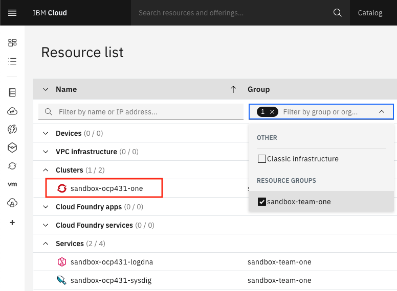

To enable the best working experience through the hands-on exercises, you
need to select the environment you plan to use for development and the required tools for integration with IBM Cloud.

- If you plan to use your desktop/laptop for hands-on exercises, follow
 the instructions in the Desktop/Laptop tab. You will need a recent macOS or
  Windows 10 operating system for this option.
- If you cannot install tools on your desktop/laptop, follow the Cloud Shell
 instructions.

Once you have fulfilled these setup requirements you will be ready to
go through the **Getting Started** steps.

<Tabs>

<Tab label="Cloud Shell">

## Introduction to Cloud Shell

IBM Cloud Shell is a free service that gives you complete control of your cloud resources, applications, and 
infrastructure, from any web browser. It's instantly accessible from your free IBM Cloud account--no other installation 
is needed.

Features of IBM Cloud Shell include:

- Preconfigured environment: IBM Cloud Shell provides a curated, cloud-based workspace with dozens of preinstalled tools 
  and programming languages. It's automatically authenticated with your IBM Cloud account so you can start to develop 
  immediately.

- File upload/download: use this feature to import files to IBM Cloud Shell or pull-down data to your local machine.

- Multiple sessions: use up to five shell sessions at a time to maximize your productivity. Mirror workflows on your 
  local machine, or view logs on one session while editing a file in another.

### Cloud Shell setup
- Open the IBM Cloud console (cloud.ibm.com) in your browser and log in if needed.

- Invoke Cloud Shell by clicking on the button at the top, right-hand corner of the browser window.
    

- Set up `igc` by running the following commands on the just opened terminal:
    ```shell
    curl -sL shell.cloudnativetoolkit.dev | sh - && . ~/.bashrc
    ```

- If successful, you should see something like the following:
    ```shell
    Downloading scripts: https://github.com/ibm-garage-cloud/cloud-shell-commands/releases/download/0.3.5/assets.tar.gz
    ** Installing argocd cli
    ** Installing tkn cli
    ** Installing kube-ps1
    ** Installing icc
    ** Installing Cloud-Native Toolkit cli
       + Installing igc cli
    ```

-  You can check the CLI tools package was installed correctly by checking the `oc` version:
    ```shell
    $ oc sync --version
    1.0.1
    ```

</Tab>

<Tab label="Desktop/Laptop">

## Tools installation

- [Node](https://nodejs.org/en/): required for running the [IBM Garage for Cloud CLI](https://ibm-garage-cloud.github.io/ibm-garage-developer-guide/getting-started/cli).
        - Installed on your local machine.
        - Recommended: `v12.x LTS`.

- [Docker Desktop](https://www.docker.com/products/docker-desktop): required for running common tools and [Developer Tools Image](https://ibm-garage-cloud.github.io/ibm-garage-developer-guide/guides/tools-image).
            - Installed and running on your local machine.
          The following tools are required:

- [Git Client](https://git-scm.com/): needs to be installed in your development operating system, it comes as standard for Mac OS.

- [Visual Studio Code](https://code.visualstudio.com/download): a popular code editor
    - You will need to edit some files, having a good quality editor is a good practice.
        - Enabling [launching VSCode from a terminal](https://code.visualstudio.com/docs/setup/mac#_launching-from-the-command-line).

- [Shell tools](https://github.com/ibm-garage-cloud/cloud-shell-commands): a set of cloud shell tools
  
    ```shell
    curl -sL shell.cloudnativetoolkit.dev | sh - && . ~/.bashrc
    ```

    The shell tools includes the following:
    - [IBM Cloud CLI](https://cloud.ibm.com/docs/cli?topic=cloud-cli-getting-started): required for the management of your IBM Cloud Account, and managed IBM Kubernetes and Red Hat OpenShift clusters

    - [IBM Garage for Cloud CLI](https://ibm-garage-cloud.github.io/ibm-garage-developer-guide/getting-started/cli): used to help make working with the development tools as easy as possible.

    - [Tekton CLI](https://github.com/tektoncd/cli): used to control and manage Tekton
      
    - [ArgoCD CLI](https://argoproj.github.io/argo-cd/cli_installation/): used to control and manage ArgoCD

</Tab>

</Tabs>

## Log in to IBM Cloud

- Use the `ibmcloud` command to log in to the cloud account. Replace the user_id, password and team name with the sandbox ones:
    ```bash
    $ ibmcloud login -u <user_id> -p <password> -g <sandbox-team> -r us-south
    ```

- Select the account number you have been assigned to:
    ```bash
    $ ibmcloud login -u email@company.com -p XXX -g sandbox-team-one -r us-south
    API endpoint: https://cloud.ibm.com
    Authenticating...
    OK

    Select an account:
    1. GSI Labs - IBM
    Enter a number> 1
    Targeted account GSI Labs

    Targeted resource group sandbox-team-one

    Targeted region us-south

    API endpoint:      https://cloud.ibm.com
    Region:            us-south
    User:              email@company.com
    Account:           GSI Labs
    Resource group:    sandbox-team-one
    CF API endpoint:
    Org:
    Space:

    ```

## Log in to OpenShift Cluster

- Log in to OpenShift Cluster from the cloud console:
    

- Access the OpenShift console by clicking on the button:
    

- Get the OpenShift login command, which includes a token:
    

- Run the login command in the terminal:
    ```bash
    $ oc login --token=qvARHflZDlOYfjJZRJUEs53Yfy4F8aa6_L3ezoagQFM --server=https://c103-e.us-south.containers.cloud.ibm.com:30979
    Logged into "https://c103-e.us-south.containers.cloud.ibm.com:30979" as "IAM#email@company" using the token provided.

    You have access to 71 projects, the list has been suppressed. You can list all projects with 'oc projects'

    Using project "dev-ab".
    ```

### Configure git

- Execute the following commands replacing the email and short name:

  ```
  $ git config --global user.email "<email>"
  $ git config --global user.name "<short_name>"
  ```
