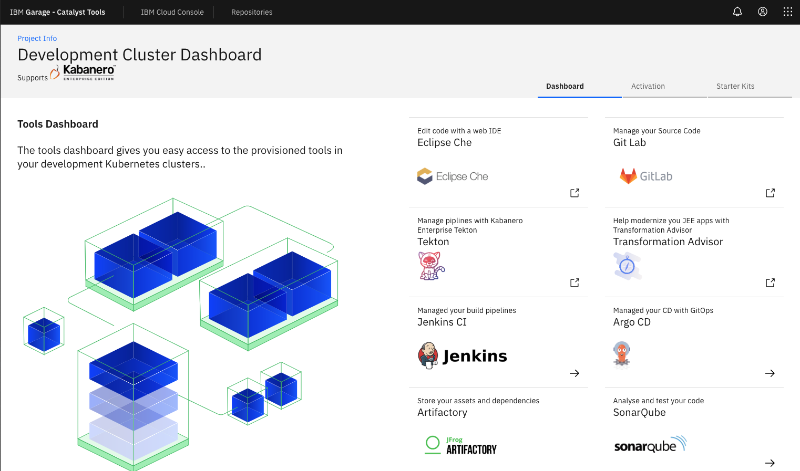

<PageDescription>

Use these installation steps to help install and setup the IBM Garage for Cloud Developer Tools into your IBM Cloud account.

</PageDescription>


Follow each step in turn:

<Tabs>

<Tab label="Pre-requisites">

The IBM Garage for Cloud Developer Tools are hosted in a [IBM Cloud Kubernetes Service](https://cloud.ibm.com/docs/containers) or 
[Red Hat OpenShift on IBM Cloud](https://cloud.ibm.com/docs/openshift) clutser to use for application development. These 
instructions explain how to access, configure, and run the scripts to create the cluster.

The following pre-requisties are required before following the setup instructions.

- An IBM Cloud account with:
    - the ability to provision resources to support [Kubernetes](https://cloud.ibm.com/kubernetes/clusters) 
    and [OpenShift](https://cloud.ibm.com/kubernetes/clusters?platformType=openshift) environments
    - the ability to create a [Resource Group](https://cloud.ibm.com/account/resource-groups) for your development resources
    - a region and zone containing [a pair of public and private VLANs](https://cloud.ibm.com/classic/network/vlans)
- [Docker Desktop](https://www.docker.com/products/docker-desktop) installed and running on your local machine
- [Node](https://nodejs.org/en/) installed on your local machine

</Tab>
<Tab label="Step 1: Clone">

Clone the `iteration-zero-ibmcloud` repository to your local filesystem

```bash
$ git clone git@github.ibm.com:garage-catalyst/iteration-zero-ibmcloud.git

$ cd iteration-zero-ibmcloud
```
</Tab>

<Tab label="Step 2: API keys">

A Kubernetes or OpenShift clutser is a PaaS resource hosted in IaaS resources. 
API keys authenticate an [IBM Cloud CLI](https://cloud.ibm.com/docs/cli) client--such as a Terraform script--to create 
these resources programatically. Two keys will be needed:
- The first Key is for the Classic Infrastructure (IaaS) resources
- The second key is for the IBM Cloud (PaaS) resources

The following steps create the required keys and put them into a file called `credentials.properties`.

```properties
classic.username=<CLASSIC_USERNAME>
classic.api.key=<CLASSIC_API_KEY>
ibmcloud.api.key=<IBMCLOUD_API_KEY>
```

 The Iternation Zero library will use these settings to initialize its environment.

### Step A. Create the credentials.properties file

- Inside the `iteration-zero-ibmcloud` folder, copy `credentials.template` to a file named `credentials.properties`.

The `credentials.properties` file is already listed in the `.gitignore` file so that the file containing 
your private API keys will not be pushed to the server repository.

### Step B. Create and set the Classic infrastructure API key

- Follow these instructions to create a Classic infrastructure API key: [Managing classic infrastructure API keys](https://cloud.ibm.com/docs/iam?topic=iam-classic_keys "Managing classic infrastructure API keys")

    - In the IBM Cloud console, go to the IBM Cloud API Keys page

    To open the IBM Cloud API Keys page, select **Manage -> Access (IAM)**, then select the **IBM Cloud API keys** tab.

    - If your account already has a classic infrastructure API key, it will appear in the list of keys as **Classic infrastructure API key**. Otherwise, the page will have a **Create a classic infrastructure API key** button on the top. To crate the key, press that button and close the dialog.

    

    - Find **Classic infrastructure API key** in the list and open its details.

    

- Edit the `credentials.properties` file to set the values for the `classic.username` and `classic.api.key` properties.

### Step C. Create and set the IBM Cloud API key

- Follow these instructions to create an IBM Cloud API key:
[Managing user API keys](https://cloud.ibm.com/docs/iam?topic=iam-userapikey "Managing user API keys")

- Edit the `credentials.properties` file to set the value for the `ibmcloud.api.key` property.

</Tab>

<Tab label="Step 3: Resource Group and VLANs">

Before we can create resources--such as a Kubernetes or OpenShift cluster--we need to create a resource group. 
[IBM Cloud Identity and Access Management](https://cloud.ibm.com/docs/iam) uses a resource group to organize 
a set of resources so that one access policy can easily be applied to all of the resources. This resource group
will help distinguish the Cloud Developer Tools resources from the other resources in the same IBM Cloud account. 

Create a dedicated resource group for your development team. This resource group will contain the Cloud Developer 
Tools' resources--your development cluster and supporting cloud services.

- Follow these instructions to create a resource group:
[Creating a resource group](https://cloud.ibm.com/docs/resources?topic=resources-rgs#create_rgs "Creating a resource group")

Remember the name of your resource group, you'll need to set it in a configuration file.

</Tab>

<Tab label="Step 4: VLANs">

A Kubernetes or OpenShift cluster uses two VLANs, a public VLAN and a private VLAN. In IBM Cloud, a single zone cluster
is hosted in a particular zone in a particular region. If the account you're using has multiple regions and zones,
you need to decide what region and zone you'll want the cluster cerated in, then specify VLANs in that zone.

There are two approaches for determing the VLAN info:
- Advanced users can view the list of VLANs in their account and choose which VLANs to use.
- For users who want a simpler approach, the Cloud Developer Tools include a CLI which can tell you 
the VLAN info for the first zone in the region you specify. 

Either way, once you determine the VLAN info, you need to set it in the `terraform.tfvars` properties file.

### Option A. Select from account's VLAN List (Advanced)

[Getting started with VLANs](https://cloud.ibm.com/docs/infrastructure/vlans) explains how to open the
VLAN List page in the console. Choose the public and private VLANs for the region and zone you want to
host the Cloud Developer Tools. 

### Option B. Install and use the Developer Tools CLI (Simpler)

The Developer Tools CLI has a command to gather this information for you, in a format that is 
easy to cut/paste into the `terraform.tfvars` properties file.

- Install the [IBM Garage Developer Tools CLI](https://github.ibm.com/garage-catalyst/ibmcloud-garage-cli):
    ```bash
    npm i -g @garage-catalyst/ibm-garage-cloud-cli
    ````
- Log into your IBM Cloud Account with the correct region and resource group:
    ```bash
    ibmcloud login -a cloud.ibm.com -r <region> -g <resource group>
    ```
- Run the CLI command to obtain the VLAN information:
    ```bash
    igc vlan
    ```
    You will now have a set of properties that can be copied directly into your `terraform.tfvars`.

Remember your VLAN ID and routers, you'll need to set them in a configuration file.

</Tab>

<Tab label="Step 5: Terraform variables">

The settings for creating the Cloud Developer Tools cluster go in a file called `terraform.tfvars`.

### Step A. Set the required Terraform variables

Edit the `./terraform/settings/terraform.tfvars` file to set the resource group, VLANs, and other values gathered from the previous steps.
Many of these values can be copied directly from the output of 
the [IBM Garage Developer Tools CLI](https://github.ibm.com/garage-catalyst/ibmcloud-garage-cli) command `igc vlan`.

Typical values look like this:

```terraform
resource_group_name="catalyst-team"
vlan_region="us-south"
vlan_datacenter="dal10"
private_vlan_number="2372"
private_vlan_router_hostname="bcr01a.dal10"
public_vlan_number="1849"
public_vlan_router_hostname="fcr01a.dal10"
```

### Step B. Set the optional Terraform variables

The `terraform.tfvars` file has four additional properties that specify optional settings.

```terraform
# The cluster name can be provided (particularly if using existing cluster) or it will
# default to '${resource_group_name}-cluster'
cluster_name="mycluster"
# Flag indicating if we are using an existing cluster or creating a new one
cluster_exists="false"
# Flag indicating if we are using an existing postgres server or creating a new one
postgres_server_exists="false"
# The type of cluster that will be created/used (kubernetes or openshift)
cluster_type="kubernetes"
```

These are scenarios for using these optioal settings:
- To specify the name of the new cluster, set `cluster_name`.

- To specify installing the tools into an existing cluster, set `cluster_exists` and  `cluster_name`.

- If an older version of the tools has already been installed in this existing cluster, in addition
to setting `cluster_exists` and  `cluster_name`, also set `postgres_server_exists`.

- To specify whether the cluster is Kubernetes or OpenShift, set `cluster_type`.

</Tab>

<Tab label="Step 6: Run Terraform">

We are now ready to kick off the installation.

- Run the following command to launch a IBM Garage [Developer Tools CLI Tools Docker container](https://github.ibm.com/garage-catalyst/client-tools-image).

    ```bash
    ./launch.sh
    ```

    <InlineNotification>

    ***Note:*** This will install the Cloud Garage Tools docker image and exec shell into the running container. You will run the rest of the commands from inside this container. The container will mount the `./terraform/` directory as `/home/devops/src/`. This is helpful in sharing files between your host filesystem and your container.

    </InlineNotification>


- It will also allow you to continue to extend or modify the base Terraform IasC that has been supplied and tailor it for your specific project needs.

- Once the Docker container has started and the script has exec shelled into it you will see an IBM Garage banner. This will help you
identify you are running inside the Docker image that has just mounted your file system.

- Next step is to run the following script:

    ```bash
    ./runTerraform.sh
    ```

    The script will prompt if you want to proceed. If an existing cluster is selected the contents will be cleaned up to prepare for the terraform process (the `tools`, `dev`, `test`, and `staging` namespaces).

    After you select **Y* the Terraform Apply process will begin to create the infrastructure and services for your Development Environment.

    Creating a new cluster takes about 1.5 hours on average (but can also take considerably longer) and the rest of the process takes about 30 minutes. At the end, you should have your Iteration Zero resources fully provisioned and configured, enjoy!

</Tab>

</Tabs>


### Development Cluster Dashboard

Once the installation has completed you can use the Development Cluster Dashboard to navigate to the installed tools.


To access the dashboard obtain the ingress endpoint using the developer CLI.


```bash
igc ingress -n tools
```

This will return the ingress URLs for each of the tools.

```bash
Host(s):
[
  'http://grpc.argocd.showcase-dev-iks-cluster.us-south.containers.appdomain.cloud',
  'http://argocd.showcase-dev-iks-cluster.us-south.containers.appdomain.cloud',
  'http://artifactory.showcase-dev-iks-cluster.us-south.containers.appdomain.cloud',
  'http://dashboard.showcase-dev-iks-cluster.us-south.containers.appdomain.cloud',
  'http://jenkins.showcase-dev-iks-cluster.us-south.containers.appdomain.cloud',
  'http://pact.showcase-dev-iks-cluster.us-south.containers.appdomain.cloud',
  'http://sonarqube.showcase-dev-iks-cluster.us-south.containers.appdomain.cloud'
]
```

Select the one called `dashboard` and open it in your browser.



### Credentials

Currently the tools are not linked to a single sign on service (future plan), other than Jenkins in OpenShift, to obtain the credentials for the tools login into ibm cloud account on the command line and run `igc credentials` this will list the `userids` and `passwords` secrets for each tool installed.
You can use these details to login.

```bash
igc credentials
```
