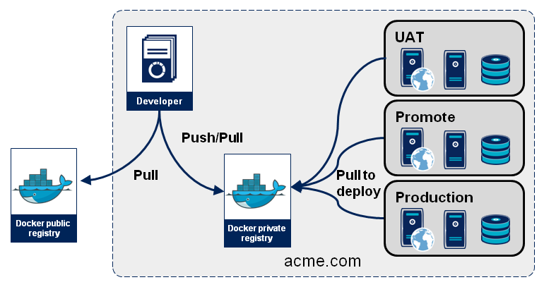
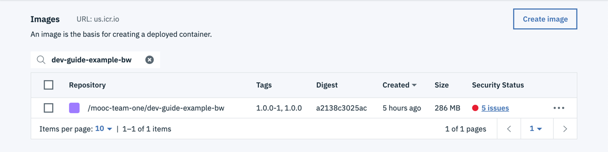

import Globals from 'gatsby-theme-carbon/src/templates/Globals';

<PageDescription>

The CI/CD pipeline stores container images in an image registry

</PageDescription>

In IBM Garage Method, one of the Develop practices is to [automate continuous delivery through a delivery pipeline](https://www.ibm.com/garage/method/practices/deliver/practice_delivery_pipeline/), in part by using an artifact repository for storing output of the build stage. When hosted in IBM Cloud, the <Globals name="env" /> uses the IBM Cloud Container Registry for storing container images.

## What is the IBM Cloud Container Registry

[IBM Cloud Container Registry](https://www.ibm.com/cloud/container-registry) is a private, multitenant [Docker registry](https://docs.docker.com/registry/) built into IBM Cloud for storing [OCI images](https://www.opencontainers.org/about). Each IBM Cloud region hosts its own highly available registry. When deploying an application to a Kubernetes or OpenShift cluster, the cluster creates containers using the images in the registry. To package an application for deployment, the runtime must be built into an image that is stored in the registry. 

In this standard Docker diagram, the acme.com domain is effectively an IBM Cloud region and the Docker private registry is the instance of IBM Cloud Container Registry in that region.



The diagram shows these components and their relationships:
- **Developer** builds the image; ideally it is automated as part of a CI pipeline
- **Docker private registry** stores the image that was built
- **UAT**, **Promote**, and **Production** are deployment environments, such as Kubernetes clusters or namespaces, that run the containers based on the image

### Accessing the registry

There are two ways to work with an [IBM Cloud registry](https://cloud.ibm.com/docs/services/Registry):
- **Web UI**: In the IBM Cloud console, navigate to either **Kubernetes** or **OpenShift** and then **Registry**
- **CLI**: Use the [container-registry CLI plug-in](https://cloud.ibm.com/docs/services/Registry?topic=registry-registry_setup_cli_namespace) in the IBM Cloud CLI

Of the two approaches, the CLI is much more powerful. The console is mainly for looking at your registry.

When you installed the [prerequisites](/getting-started/prereqs), part of installing the IBM Cloud CLI installed several other tools and plug-ins including the container-registry plug-in.

To use the container-registry plug-in, or even to push an image into the registry using your local Docker install (another of the [prerequisites](/getting-started/prereqs)), you must first log into IBM Cloud and then log into the region's IBM Cloud Container Registry:

```bash
$ ibmcloud login

$ ibmcloud cr login
```

The logins [determine the namespaces you can access](https://cloud.ibm.com/docs/services/Registry?topic=registry-iam). Other accounts for other tenants also have namespaces in the registry, but IBM Cloud doesn't let you see them and prevents you from accessing their images.

## Registry organization

Like the directories and file names in a file system, a Docker registry is a single collection of images that is cataloged with hierarchical names. A Docker registry such as Docker Hub (or, as we'll see, a registry in IBM Cloud) stores an image with a hierarchical name: namespace, repository, and tag. This path is specified when tagging and pushing the image:

```bash
$ docker tag <image> <namesapce>/<repo-name>:<tag>

$ docker push <namesapce>/<repo-name>:<tag>
```

To tag and push an image to any registry other than Doker Hub, you have to specify its domain as part of the path:

```bash
$ docker push <domain>/<namesapce>/<repo-name>:<tag>
```

### Registry organization in an IBM Cloud account

IBM's registry organizes images in this same hierarchical structure.

**Domain**: [Each region](https://cloud.ibm.com/docs/services/Registry?topic=registry-registry_overview#registry_regions_local) in IBM Cloud (e.g. Dallas, London, Sydney, etc.) has its own multitenant registry instance with its own domain name (such as `us.icr.io` for Dallas/us-south). IBM provides its [public images](https://cloud.ibm.com/docs/services/Registry?topic=registry-public_images) in a global registry (domain `icr.io` (no region)).

**Namespace**: A namespace is associated with an IBM Cloud account and groups the account's images. Every user in the account can view and work with all images in the namespace, but users outside of the account cannot access images in the account's namespaces. An account may use multiple namespaces to organize images for groupings such as development vs. production or approved vs. experimental. Each namespace must have a name that is unique within a region for all accounts (not just your account).

**Repoitory**: A repo is often thought of as the name of the image, but techincally the same image can have different names (but the same image ID). Within a registry, different images with the same name stored in the same namespace will be stored in the same repo as long as they have different tags.

**Tag**: Optional; if a command does not specify it, the default tag is `latest`. Two different tags enable a namesapce to store two images with different image IDs but the same repository name. The tag typically specifies a different build of an image with a different image ID. Two builds usually package two different versions of an application's code, but Docker does not enforce that. The two builds could just be the same Dockerfile run twice with the same inputs (and therefore equivalent), or two completely unrelated sets of software. But two builds usually run software that is similar but at least slightly different, such as a new version of an application's code, but could be simply an alternative implementation of the code (such as for A/B testing).

Therefore, when [adding an image to a registry in IBM Cloud](https://cloud.ibm.com/docs/services/Registry?topic=registry-getting-started#gs_registry_images_pushing), the push command specifies the image's hierarchical path like this:

```bash
docker push <region>.icr.io/<my_namespace>/<image_repo>:<tag>
```

You can see this structure when you show the regestry using the CLI:
```bash
$ ibmcloud cr image-list
Listing images...

Repository                                                Tag        Digest          Namespace           Created        Size      Security status   
us.icr.io/showcase-dev-iks/template-graphql-typescript    1.0.0      6b3575c122e9    showcase-dev-iks    6 hours ago    303 MB    5 Issues   
us.icr.io/showcase-dev-iks/template-graphql-typescript    1.0.0-5    6b3575c122e9    showcase-dev-iks    6 hours ago    303 MB    5 Issues   
us.icr.io/showcase-dev-iks/template-java-spring           1.0.0      24f3cdf69605    showcase-dev-iks    7 hours ago    213 MB    No Issues 
us.icr.io/showcase-dev-iks/template-java-spring           1.0.0-14   24f3cdf69605    showcase-dev-iks    7 hours ago    213 MB    No Issues
```

Notice the columns labeled *Repository* (which is domain/namespace/repo) and *Tag*--those comprise the path for finding each image. And *Namespace* is specified again in its own column, which is useful for filtering searches.

You can also see that the first two items in the list are not two separate images but really the same image with two tags: the image ID (a.k.a. digest) is the same, so the two tags are two different ways to look up the same image. Likewise, the last two images are really the same image with two tags.

The registry in the IBM Cloud console shows the same images:


It shows more clearly that each image has two tags, rather than being two different images.

## IBM Cloud Container Registry features

IBM Cloud Container Registry is not only a Docker registry hosted in IBM Cloud, it adds several features to the registry service. The registry in each region is private, multitenant, and highly available--properties that a simple registry doesn't have. Here are some other features and capabilities.

[**Vulnerability Advisor**](https://cloud.ibm.com/docs/services/va) scans images in the registry to search for known security issues and generates reports with advice on how to fix your images and better secure your environment. Lists of the vunerabilities scanned for are available in [Vulnerable packages](https://cloud.ibm.com/docs/services/va?topic=va-va_index#packages). An administrator can specify exemptions that should not be reported. [Running containers are not scanned](https://cloud.ibm.com/docs/services/Registry?topic=registry-registry_release_notes#27jun2019), just the images in the registry. In the image lists shown above, the *Security status* column shows the number of issues found; the report will explain them in greater detail. In the console, click on the number of issues for details.

[**Trusted content technology**](https://cloud.ibm.com/docs/services/Registry?topic=registry-registry_trustedcontent): IBM Cloud Container Registry supports images signed using [Docker Content Trust (DCT)](https://docs.docker.com/engine/security/trust/content_trust/). The signature confirms who built the image, such as the CI tool. The push and pull commands maintain image signatures.

[**Container Image Security Enforcement**](https://cloud.ibm.com/docs/services/Registry?topic=registry-security_enforce#security_enforce) verifies container images before deploying them to a cluster. You can control where images are deployed from, enforce Vulnerability Advisor policies, and ensure that content trust is properly applied to the image. If an image does not meet your policy requirements, the pod is not deployed to your cluster or updated.

[**User authorization**](https://cloud.ibm.com/docs/services/Registry?topic=registry-iam): While all users in an account have access to that account's namespaces in the registry, an account manager can use IAM to manage the access for different users. For example, a common customer concern is: "How can an administrator control which images can be downloaded from Docker Hub and deployed into production?" By using IAM to control access to the registry, a manager can disable the ability to push, build, or delete images, then create a policy to allow these actions and only assign it to certain trusted users such as the CI pipeline's service ID. These privileged users should only add approved images into the registry, thereby limiting the containers that the developers can deploy. The managers can likewise limit what the CD pipeline can possibly deploy to production by creating a namespace that only includes images approved for production and restricing the CD pipeline to deploy from that namespace.


## Image registry in the Pipeline

The CI and CD pipelines currently exchange two types of artifacts: Docker images and Helm charts. The CI pipeline ([Jenkins](/guides/continuous-integration), [Tekton](/guides/continuous-integration-tekton), etc.) builds these artifacts and ArgoCD deploys them. To store and share the artifacts, the pipeline uses two repositories:
- **Docker images**: This Developer Tools Image Registry
- **Helm charts**: A [Helm repository in Artifactory](/guides/artifact-management)

In the CI pipeline, the *Build image* stage creates the Docker image and stores it in the registry. Then the *Deploy to DEV env* stage specifies the image's path in the Helm chart's values file, which the chart will use to deploy the app. Likewise, the CD pipeline specifies the image's registry path in the values files for the other deployments. When the Helm chart runs, it and Kubernetes read the image from the registry and start the containers.

## Give it a try

Let's take a look at using the registry.

- If you haven't already, [deploy your first app](/getting-started/deploy-app)
    - For example, deploy the <Globals name="template" /> named Typescript Microservice
    - I deployed my in a project named dev-guide-example-bw

- In the IBM Cloud console, navigate to either **Kubernetes** or **OpenShift** and then **Registry**
    - It doesn't matter whether you navigate via the Kubernetes panel or the OpenShift panel, the share the same registry
    - The registry is the IBM Cloud Container Registry for your region

- In the registry, search for the image named for your project
    

- In the CLI, run the corresponding command
    ```bash
    $ ibmcloud cr image-list | grep dev-guide-example-bw
    us.icr.io/mooc-team-one/dev-guide-example-bw                 1.0.0     a2138c3025ac   mooc-team-one    4 hours ago    286 MB   5 Issues
    us.icr.io/mooc-team-one/dev-guide-example-bw                 1.0.0-1   a2138c3025ac   mooc-team-one    4 hours ago    286 MB   5 Issues
    ```

- Back in the console, click on the image to see its details
    

- Under **Security Status**, click on **5 issues** to see the issues that Vulnerability Advisor found in this image
    - What it found was configuration issues
        

    - Scroll down to see the list of configuration issues
        

## Conclusion

We've seen that the CI pipeline packages an app as a Docker image and stores it in the registry, and also builds a Helm chart that references the image in the registry so that the chart can deploy containers built from the image.

In IBM Cloud, the registry is the IBM Cloud Container Registry. The registry displays all of the namespaces in your account but not those in other tenants' accounts. In addition to basic registry functions, IBM Cloud adds additional features: private, multitenant, highly available, Vulnerability Advisor, Trusted content technology, Container Image Security Enforcement, and User authorization. Using the registry, you can see your list of images, details about the image, and details about any issues that Vulnerability Advisor found.
