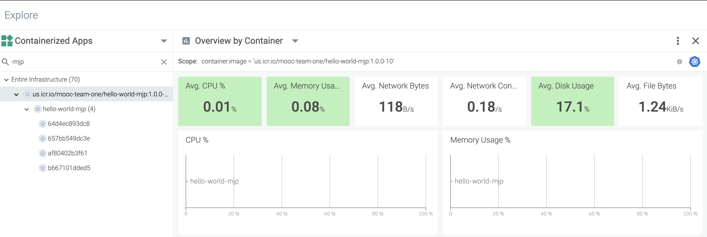
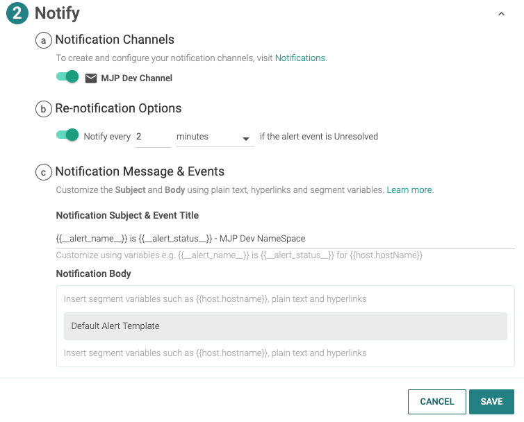
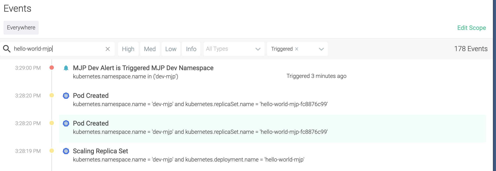

import Globals from 'gatsby-theme-carbon/src/templates/Globals';

<PageDescription>

Use Sysdig to monitor your running application

</PageDescription>

In IBM Garage Method, one of the Operate practices is to [automate application monitoring](https://www.ibm.com/garage/method/practices/manage/practice_automated_monitoring/). Sysdig automates application monitoring, enabling an operator to view stats and collect metrics about a Kubernetes cluster and its deployments. The <Globals name="env" /> includes an IBM Cloud Monitoring with Sysdig service instance configured with a Sysdig agent installed in the environment's cluster. Simply by deploying your application into the <Globals name="env" />, Sysdig monitors it, just open the Sysdig web UI from the IBM Cloud dashboard to browse your application's status.

## Sysdig Monitoring

[IBM Cloud Monitoring with Sysdig](https://cloud.ibm.com/docs/services/Monitoring-with-Sysdig) explains how to configure and use an instance of the Sysdig service, but the <Globals name="env" /> has already done most of this for you. You can skip steps 1-3 about user access, provisioning an instance, and installing an agent.

### Sysdig dashboard

Open the Sysdig web UI for your environment's cluster
- [Step 4: Launch the web UI](https://cloud.ibm.com/docs/services/Monitoring-with-Sysdig?topic=Sysdig-getting-started#step4) explains how to open the web UI
    - In the IBM Cloud dashboard, navigate to **Observability** > **Monitoring**
    - Find the monitoring instance named after your environment's cluster, such as `showcase-dev-iks-sysdig`
    
    - In the monitoring instance, press the **View Sysdig** button to open the Sysdig web UI

Finish onboarding the agent
- If this is your first time opening the Sysdig dashboard on your cluster's monitoring agent, Sysdig will open the Onboarding wizard
- The first page shows the hosts (i.e. Kubernetes nodes) and containers that Sysdig found, as well as the integrations it has 
selected to monitor them
    
    Notice there are different types of integrations for different types of runtimes such as Java, servers such as Tomcat, 
    and even infrasturcture integrations for monitoring the Kubernetes cluster itself and its containerd engines.

- Press **Next**

- The second page shows the predefined metrics, dashboards, and alerts that Sysdig will start using to monitor the apps 
in your cluster
    
    - Press **Complete Onboarding**

### Explore your application

By default, the Sysdig dashboard opens the **Explore** page on its **Deployments and Pods** grouping.

- Select your cluster

By default, Sysdig opens its **Overview by Process** dashboard, which has panels showing stats about CPU, memory, and networking. 
This is one of Sysdig's **Default Dashboards** (i.e. built-in dashboards).

These are the cumulative totals for all of the pods running in the cluster. Hover over a graph and a key pops up to list
the pods and show each one's color.

- Expand your cluster and namespace, then select your deployment

This shows the stats just for the pods in your deployment.

On the **Dashboard** page, you can create your own custom dashboards.

The Getting started tutorial, starting with 
[Step 5: Monitor your environment](https://cloud.ibm.com/docs/services/Monitoring-with-Sysdig?topic=Sysdig-getting-started#step5), 
gives some instructions on monitoring, managing, and what to do next.


## Give it a try

Before you start to understanding how to monitor your application instances, make sure you have [deployed an app](/getting-started/deployapp) into your development cluster. This _Git it a Try_ uses [template-node-typescript](/starterkits/starterkittemplates) as an example.

The **SysDig** service is already created, bound and configured to listen to monitoring metrics and events for your development cluster. You can see this in the HTTP overview.

- Open the **SysDig** instance that is named the same as your development cluster.
- Go to **Dashboards** > **HTTP Overview**

The dashboard shows stats for all incoming HTTP requests for all apps in the cluster. Browse through these views to get a feel for what they're showing.

### View your app's metrics

Take a look at the metrics for your app.

- Select the **Explore** page in the left nav menu
- On the Explore page, select the **Containerized Apps** grouping
- Search for your app, e.g. `hello-world-mjp`
- In the list of apps, select yours, e.g. `us.icr.io/mooc-team-one/hello-world-mjp:1.0.0-10`
- With your app selected, select the **Overview by Container** dashboard

    The Overview by Container dashboard shows metrics for the containers in your app. You will now see just the metrics for your your app. You can view at different levels--from pod to namespace to node to cluster--giving you a fine grain access to you monitoring requirements.

    

### Creating a custom alert

SysDig enables monitoring for custom events and alerting for events. Let's create a simple alert that will send an email when ever the total number of pods in your namespace/project exceeds a specific number. This is helpful to monitor when project is consuming unnecessary resources in the development environment.

Note: This is not tracking the number of pods in an application, but the number of pods (for all applications) in a namespace/project.

#### Add Notification Channel

Create a notification channel, which is how SysDig will send you an alert.

- In the SysDig dashboard, press the button with your initials at the bottom of the left nav menu, and select **Settings**
- In the Settings page, select **Notification Channels**
- Press **Add Notification Channel** and select **email** as the channel type
- Enter your business email address and give your channel a name, e.g. `MJP Dev Channel`
- Press **Save**
- Using the `...` menu, send a test notification and verify that it arrives into your email account

#### Add Alert

Create an alert, which notifies you when an event occurs.

- Select the **Alerts** page in the left nav menu
- Press **Add Alert** and select **Metric**

The New Alert/Metric wizard enables you to configure a wide range of alerts.

- Select the default title, "New Metric Alert", and edit it to name the alert, e.g. `MJP Dev Metric`
- Change the severity to red `High`
- In Section 1: Define of th wizard, complete the fields as shown
    
    This alert will trigger after the number of pods (in any/all applications) in your namespace/project raises above 3. This will only trigger for your own developer space, make sure this is set to the one you use for deploying your applications, e.g. `dev-mjp`.

- In Section 2: Notify of the wizard, switch on the notification channel you created earlier, e.g. `MJP Dev Channel`
- Set it to notify you every 2 minutes
- In the **Notification Subject & Event Title** field, add your namespace to the end, e.g. `- Dev-MJP namespace`
    

- Press **Save**

### Cause the event

Let's test your alert by causing the event to occur.

- Back in your OpenShift or Kubernetes dashboard, navigate to your namespace/project and its deploments
- Select the deployment for your app and increase the number of pods for your app to 4

Once your app has started 4 pods/replicas, your namespace/project will be running more than the 3 pods your alert is monitoring for.

### Acknowledge your event

#### Watch the container count
While starting pods goes very quickly, SysDig monitoring is not instantaneous. It will take 2-20 min for monitoring to detect the event.

- Back in the SysDig dashboard, navigate to your app again
    - **Explore** > **Containerized Apps**
    - Select your app to display the **Overview by Container Image** dashboard

Wait and watch for the container count to rise to 4. (Again, this could take 2-20 min. Watch for the times along the bottom of the graph to finally change.)

#### Watch for the event
Look for the event showing that your condition has been detected.
- Select the **Events** page in the left nav menu
- In the search field, enter the name of your app, i.e. `hello-world-mjp`
- Look for an event named "{alert} is Triggered - {namespace} namespace"
    - {alert} is the name of the alert you created, e.g. `MJP Dev Metric`
    - {namespace} is the name of your namespace/project, e.g. `dev-mjp`

    

    If you've already waited a few minutes until the container count increased to 4, you should see this event immediately. Otherwise, you need to wait (2-20 min?) until monitoring detects the change, triggers the alert, and logs the event.

#### Watch for the alerts
Once the event is displayed, check your email. You should get an email from `Sysdig Notifications <ibm-saas-emailer@sysdig.com>` with the subject "{alert} is Triggered - {namespace} namespace" (same as the event label). It says the metric is `kubernetes.namespace.pod.available.count` and the value is the number of pods in your namespace/project, at least 4 -- plus a bunch of other info about the event.

```email
From: Sysdig Notifications <ibm-saas-emailer@sysdig.com>
To: "Matthew J Perrins"
Subject: MJP Dev Alert is Triggered - Dev-MJP namespace

                Event Generated:
    Severity	High
      Metric	kubernetes.namespace.pod.available.count = 4
     Segment	kubernetes.cluster.id = '75240dcc-0326-11ea-be8d-eadf5501b087' and kubernetes.cluster.name = 'default' and kubernetes.namespace.name = 'dev-mjp'
       Scope	kubernetes.namespace.name in dev-mjp
        Time	11/17/2019 09:29 PM UTC
       State	Triggered
Active since	4 minutes
   More info	View notification

                Triggered by Alert:
        Name	MJP Dev Alert
        Team	Monitor Operations
       Scope	kubernetes.namespace.name in dev-mjp
  Segment by	kubernetes.cluster.id, kubernetes.cluster.name, kubernetes.namespace.name
        When	max(max(kubernetes.namespace.pod.available.count)) > 3
For at least	1 d
   More info	View alert
```

Wait awhile and you should get more emails notifying you about this event, 1 email about every 10 min. The event is only listed once in the Events view, when the condition was first detected. But SysDig will continue to notify you about the event until you acknowledge it.

#### Acknowledge the event

Tell SysDig you're aware of the event.

- Select the event and press **Acknowledge**

    This will inform the monitoring that an operations team member is working the issue.

Alerting will send you one more alert email, subject "{alert} is Acknowledged - {namespace} namespace", informing you that the event has been acknowledged. Then it won't send you any more alert emails about this event.

## Conclusion

It's important to be able to monitor your deployed applications. 
Here, the <Globals name="env" /> uses Sysdig Monitoring, but you never had to install or run Sysdig.
Just deploy your application into the <Globals name="env" /> and it gets moniotored automatically.
After deploying your application, open the Sysdig web UI and browse the status, including the status 
of your cluster as a whole and your deployment in particular.

### Learn more

Learn more about using SysDig Monitoring:
<AnchorLinks>
  <AnchorLink to="https://cloud.ibm.com/docs/services/Monitoring-with-Sysdig?topic=Sysdig-monitoring">IBM Cloud Monitoring with Sysdig > Monitoring your environment</AnchorLink>
  <AnchorLink to="https://cloud.ibm.com/docs/services/Monitoring-with-Sysdig?topic=Sysdig-dashboards">IBM Cloud Monitoring with Sysdig > Working with dashboards</AnchorLink>
  <AnchorLink to="https://docs.sysdig.com/en/dashboards.html">Sysdig Monitor > Dashboards</AnchorLink>
  <AnchorLink to="https://docs.sysdig.com/en/explore.html">Sysdig Monitor > Explore</AnchorLink>
  <AnchorLink to="https://docs.sysdig.com/en/events.html">Sysdig Monitor > Events</AnchorLink>
  <AnchorLink to="https://docs.sysdig.com/en/metric-alerts.html">Sysdig Monitor > Alerts > Metric Alerts</AnchorLink>
</AnchorLinks>
