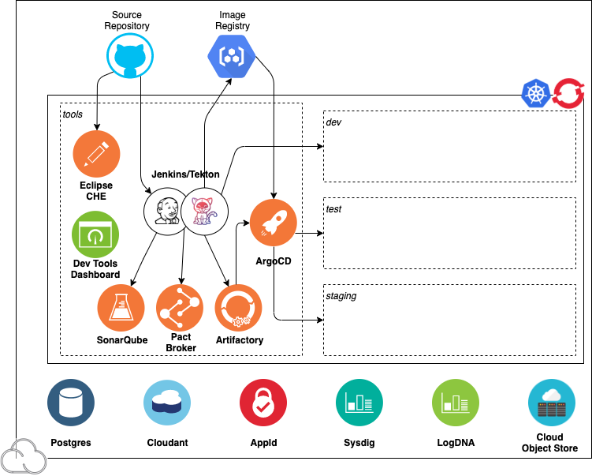

## Overview

The Development Environment contains a number of popular and proven open source tools for cloud native development with IBM Kubernetes and Red Hat OpenShift.

The **Tools Guides** section of the **Developer Guide** will help you understand what each tool does and how it helps you prepare you application code for production delivery.

## Tools Configurations

The tools have been installed and configured inside your IBM Cloud Managed cluster. This is a popular approach that Red Hat and other vendors are following. There are some up and downsides. The Upside is you can get started quickly and you are only incurring the cost of the managed cluster. The downside is you need to monitor them and manage them. The cool thing is that IBM Cloud has an amazing Monitoring solution that can be configure to alert you of issues. More about that in the Guides.

Note: As the industry moves to full lifecycle operators this will be the case.

The tools are installed into a **tools** namespace and have a number of _ConfigMaps_ and _Secrets_ defined to make it super easy for the tools to access and communicate with the underlying **IBM Cloud** services. There is more information on this [here](/guides/cluster-config).

### Guides

The Guides explain how to create and deploy applications using Continuous Integration with Jenkins. They help explain how to integrate code analysis into your applications with **SonarQube**. They explain how to move applications into test, staging and production using Continuous Deployment techniques with **Artifactory** and **ArgoCD** and much more.
