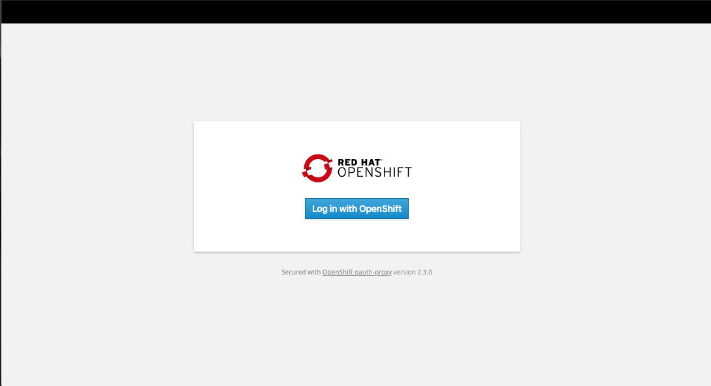
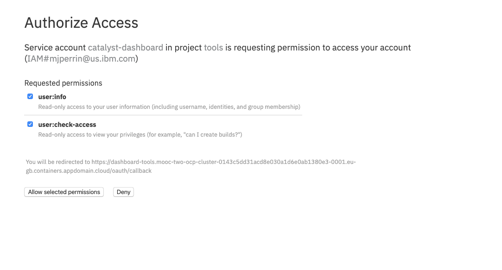
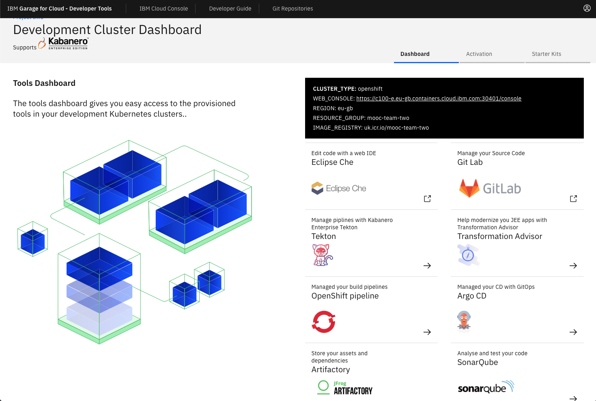

<PageDescription>

Release notes for the MOOC v1.1 Cluster Update

</PageDescription>


## Cluster Upgrades

The MOOC enablement team has replaced
 all the current MOOC
 Clusters with new white listed OpenShift clusters. This is to enable the
  MOOC to continue into 2020. The decision was made not to migrate
   data at this point as it is a living breathing learning platform so can be cleared down at the discretion of the enablement team.

The good news is all your apps are stored in your teams Git Organization so will not be effected. The following is a list of steps to enable your existing apps to be redeployed. 

<InlineNotification>

**Note**: If you have not completed any MOOC Education activities you are not
 effected. This is purely for the early adopters that started on the platform during the live education sessions.

</InlineNotification>

### Dashboard

The Dashboard now supports OpenShift single sign on and uses the OAuth
 Challenge.
 
 - Approve the Authentication by clicking **Log in with OpenShift**
    
 - Select the Authorize Access click on **Allow selected permissions**
    
 - You will now see the Dashboard in Authorised mode
    
   
### CLI
 
-  Install the latest IBM Garage for Cloud Developer Tools CLI, there has been
 some minor bug fixes to address issues seen from the first phase of the MOOC
 .   
    ```$bash
    npm i -g @garage-catalyst/ibm-garage-cloud-cli
    ```

### JenkinsFile update

You will need to make two code changes to your `Jenkinsfile` in your
 individual app code repositories. The good news is Tekton is going to make
  this a lot easier for the future with the Tasks being separated from the
   pipeline definitions.

replace `def workingDir = env.CLOUD_NAME == "openshift" ? "/home/jenkins" : "/home/jenkins/agent"	` with `def workingDir = "/home/jenkins/agent"`

This change is required to enable support for the newer version of Jenkins that is now installed as part of OpenShift. 

To prevent the build from not starting on the new Jenkins instances. Replace
 `    return "a.${jobName}.${buildNumber}".replace('_', '-').replace('/', '-').replace('-.', '.');	` with     `return "a.${jobName}${buildNumber}".replace('_', '-').replace('/', '-').replace('-.', '.');`

This is generic for all Starter Kit Templates, the templates themselves have
 been updated so any new apps created based on them will will work without
  issue. 

### Registering you pipeline

- Run the following commands for each app that you have previously deployed. 
    ```bash
    oc new-project dev-{initials}
    igc namespace dev-{initials}
    igc pipeline -n dev-{initials}
    ```

### ArgoCD Continue Delivery setup 

You will need to complete this section of the Session 1,Week 2 material.

[Argo CD Setup](https://ibm-garage-cloud.github.io/ibm-garage-developer-guide/practical/inventory-part2#using-cd-to-deploy-to-test)

### AppID Enabling Authentication

You will need to complete this section of the Session 1, Week 2 material, the section where you configure AppID

[AppID setup](https://ibm-garage-cloud.github.io/ibm-garage-developer-guide/practical/inventory-part2#securing-the-solution-with-app-id)

### Data in Cloudant

You will need to complete this section of the Session 1, Week 2 material to
 repopulate your database.

[Populate Cloudant Database](https://ibm-garage-cloud.github.io/ibm-garage-developer-guide/practical/inventory-part2#add-a-cloudant-integration-to-your-backend-service)

You will need to update the `mappings.json` with the new Cloudant Instance
 credentials
 
 ### WebHook for CP4Apps
 
 You will need to configure a web hook for Cloud Pak for Applications 
 
 [Configure Web Hook](https://ibm-garage-cloud.github.io/ibm-garage-developer-guide/practical/cp4apps#connect-the-pipeline-to-git)

Thank you for all the help and support during the Live Sessions. You can
 continue to return to the MOOC and walk through the self paced material.
    
**MOOC Enablement Team**