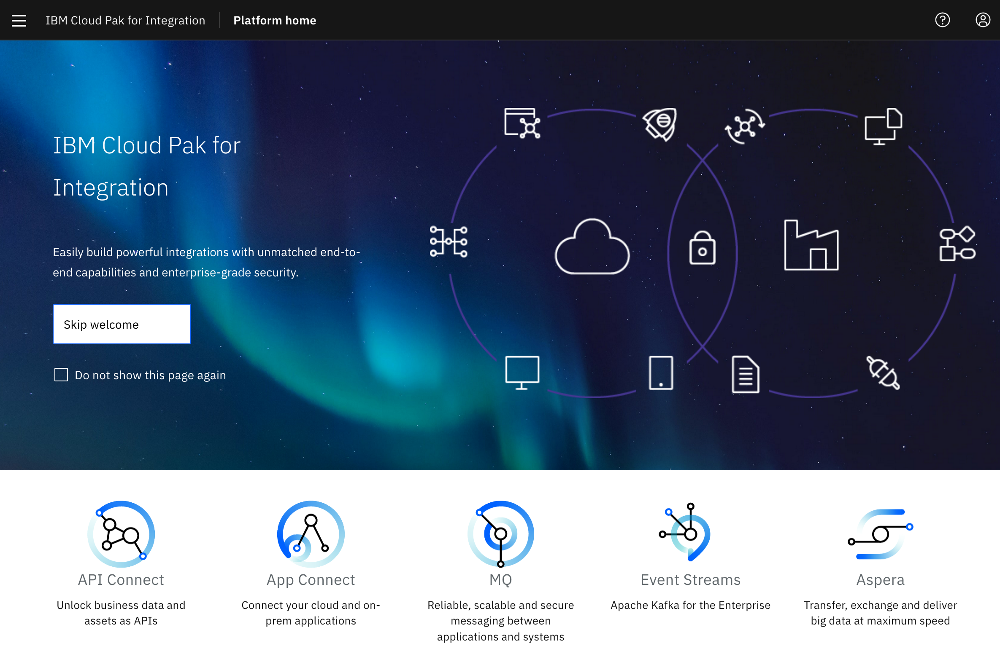

<PageDescription>

Homework for students in the MOOC, Session 4

</PageDescription>

This is the homework tasks for the [Garage OpenShift and Cloud Pak MOOC
](/homework/teams). Week 5 focuses on IBM Cloud Pak for Integration
, including using the API Connect, App Connect, Event Streams with Kafka and
 much more (CP4Integration).

## Session 4 - Cloud Pak for Integration

<InlineNotification>

Before you proceed, make sure you have signed up for the MOOC development environment. It is a paid IBM Cloud account. (The environment is locked down to prevent creating any new services.) Also, before proceeding:
- Be sure you have already done the [Welcome to your MOOC team](/homework/teams) tasks

</InlineNotification>

Session 4 of the MOOC focuses on Cloud Pak for Integration (CP4I) and it has been installed with single sign on in the IBM Cloud in the same way a client
  would have it configured for their account. This gives you access to all the software that is included in the
   **CP4I** offering, see the welcome screen below.   
   

   
This homework assumes that you have:
 - Reviewed the Playback from the Session 4 Monday session
 - Seen a demo of each of the homework tasks below
 - Seen demos and discussion about what is expected from the homework

<InlineNotification>

**Note**: Support is provided in the `#openshift-cldpak-mooc` Slack channel (in the [IBM Garage for Cloud Slack Org](http://ibm-garage.slack.com) team). This channel will also be used to share any common issues found.

</InlineNotification>

### Homework tasks

This week's homework starts with some background reading.

| Task                            | Description         | Link        | Time    |
| ---------------| -------------------------------  |:----------- |---------|
| Introduction | Introduction to IBM Cloud Pak for Integration  |  [Introduction](https://www.ibm.com/cloud/cloud-pak-for-integration)  | 1 hour |
| Review | IBM Garage Reference Architecture for Integration  | [Reference Architecture](https://www.ibm.com/cloud/garage/architectures/modern-integration) | 1 Hour |
| Integration Modernization |  Agile Integration Architecture | [Agile Architecture](https://www.ibm.com/cloud/integration/agile-integration) | 1 Hour |
| Videos | Product Tours and Hands on lab for Cloud Pak for Integration | [Product Tours](https://www.ibm.com/demos/collection/Cloud-Pak-for-Integration/)  | 4 hours |
| Review Asset Repository | Review the IBM Garage and Solution Engineering teams Asset repository | [Asset Repository](https://ibm-cloud-architecture.github.io/deliverables/integration.html) | 4 hours |
| Labs 1 | Enable order processing flow using Event Streams, App Connect, MQ , API Connect and Asset Repository | [Lab](https://github.ibm.com/rsundara/cp4i-labs/tree/master/lab1) | 2 Hours |
| Product Education | Education for products contained in the Cloud Pak for Integration | [Product Education](https://www.ibm.com/services/learning/ites.wss/zz-en?pageType=journey_category&c=&tag=o-itns-01-02) | Self Paced |

Once you have completed these tasks, you will have completed the homework for Session 4. You will now have an understanding of the IBM Cloud Garage
  approach to using **CP4I** in Integration Solutions.

### Homework Review 

This is no planned Homework review for this session.