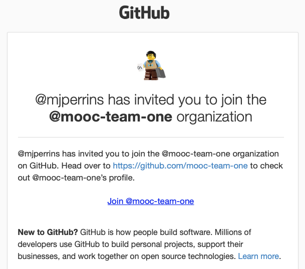
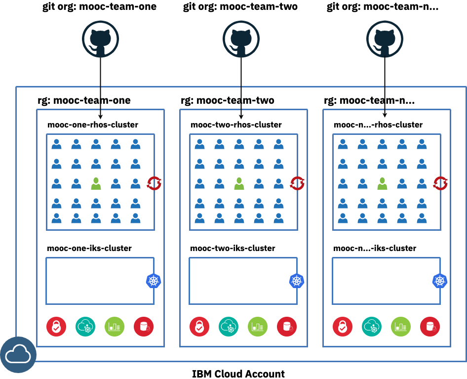
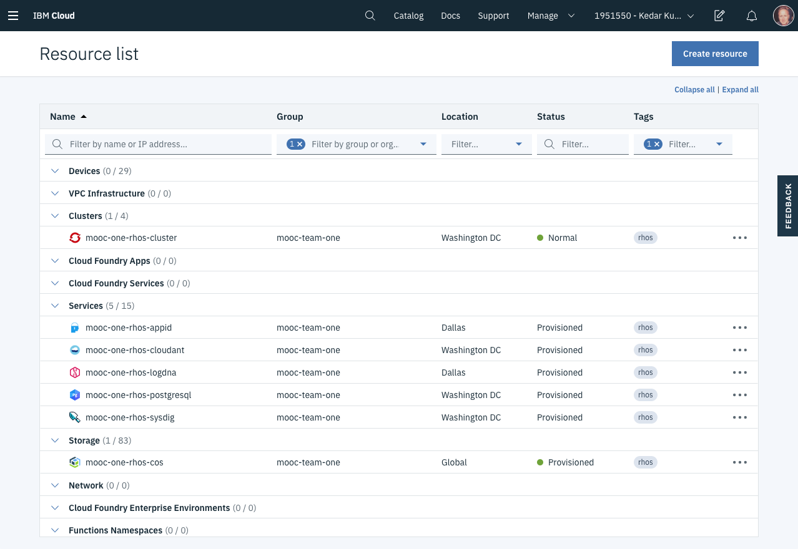

<PageDescription>

Steps to get set up as part of your team in the Developer Tools environment to do the MOOC

</PageDescription>

Thanks for signing up for the Garage OpenShift and Cloud Pak MOOC. You should have received a Welcome email that provides the details of the team you've been assigned to and pointing you to this welcome page. By participating in this [massive open online course](https://en.wikipedia.org/wiki/Massive_open_online_course) (MOOC), you have access to:
- The education agenda and playbacks: The link to the **Garage OpenShift and Cloud Pak MOOC** is provided in the email
- A Developer Tools environment preinstalled in a pay-as-you-go IBM Cloud account which you'll use to perform the homework

<InlineNotification kind="warning">

**Warning:** If you do not enroll in the class, you will not be given access to the Developer Tools environment on IBM Cloud. Enrollment adds you to the environment.

</InlineNotification>

## Notification

The Welcome email gives you details on how to access the Developer Tools environment for your development team.

**MOOC Sandbox Registration Details**
- **Account**: This is the IBM Cloud account with a Developer Tools environment for your team and resources to perform the homework
- **Team**: This is the name of your development team
- **GitHub Organization**: This is the org in GitHub for your team's set of Git repos
- **Resource Group**: This is the IBM Cloud resource group for your Developer Tools environment

You must associate your IBM email address with your public GitHub account or make sure you have a public account that is using your IBM email address. To set your email address in GitHub:
- Go to [Github](https://github.com) (public, not enterprise)
- Log into your account or create one
- Navigate to you account settings
- Select emails, check your IBM email address is your primary email for the account
- If it is not, then add you IBM email and verify it
- If you are correctly verified and associated, you will receive a second email inviting you to your team's GitHub organization

<InlineNotification kind="warning">

**Warning:** If you do not associate your IBM email with you public GitHub account, you will not receive
a Git Organization invite and you will have issues completing the homework. We are not mixing personal email addresses with this **MOOC** training.

</InlineNotification>

## Sandbox

[The IBM Garage for Cloud Developer Tools environment](/overview) is designed to make it easier for you to develop and deploy cloud-native applications. It includes an OpenShift or Kubernetes cluster, cloud services bound to the cluster, and developer tools installed in the cluster. The combination supports developing cloud-native microservices architecture applications and CI/CD continuous deployment of those applications. A development team creating an application for a company would install one of these environments in the company's IBM Cloud account. Multiple development teams creating applications for the same company would install multiple environments, one per team wanting to work independently.

The Sandbox has been defined exactly how a client of IBM would use the IBM Cloud. Each development team will contain up to **100+** of your IBM colleagues. Each team has been configured in [IAM](https://cloud.ibm.com/docs/iam) as its own access group with a corresponding resource group. Your resources for your team's Developer Tools environment have been created in that resource group. As a member of your team's access group, you'll have access to the resources in your team's Developer Tools environment. Since the Developer Tools environment has already been created, you are restricted from creating new cloud resources or deleting existing ones.

The following teams diagram shows how access is configured. Imagine you are the Green user: There will be lots of other users in your team, maybe in different timezones, all sharing the same cloud resources. The administrators will monitor the cluster to identify any issues early and resolve them.

You will be given access to the team's GitHub organization and are expected to create all of your applications as repositories in your team's organization. This is how real world development projects work. This enables you to collaborate with your fellow team members and  prevents you from creating duplicate projects names.

**Extra credit**: After performing the homework in the OpenShift cluster, can you get it working in a Kubernetes cluster as well? As shown in the teams diagram above, your team's Developer Tools environment and its resource group include not only an OpenShift cluster but also a Kubernetes cluster. It's helpful if you can perform these development tasks in both container platforms because some IBM clients use one and some use the other. If you can work in both, you'll be qualified to staff more projects. The Developer Tools environment makes the developer experience the same for both container platforms.

## Team locations

The teams are spread globally in different geographic locations listed below. We will try and make team membership as close to your home Garage as possible.

<InlineNotification>

**Note:** After you receive your team notification email, please click on the link to your team homework below to request to join your team's GitHub organization.

</InlineNotification>

| Team | Location | Region | Data Center | Git Org |
| ---  | ------- | ------ | ---- | ----- |-------- |
| **mooc-team-one** | Washington | us-east | wdc07 | [Washington Homework](https://github.com/mooc-team-one) |
| **mooc-team-two** | London | eu-gb   | lon05    | [London Homework](https://github.com/mooc-team-two) |
| **mooc-team-three** | Tokyo | jp-tok |  tok04   | [Tokyo Homework](https://github.com/mooc-team-three) |
| **mooc-team-four** | San Jose | us-south |  sjc04   | [San Jose Homework](https://github.com/mooc-team-four) |
| **mooc-team-surge** | Washington | us-east |  wdc07   | [SURGE Homework](https://github.com/mooc-team-surge) |

## Validating your access the IBM Cloud

<InlineNotification>

**Note**: If you have issues with any of the following steps, please raise an issue on the Slack channel **#openshift-cldpak-mooc**. All homework issues should be raised on the **#catalyst-project** channel.

</InlineNotification>

Follow these steps to check you can access your team's Developer Tools environment.

Login and view the resources.

- Login to the [IBM Cloud](https://cloud.ibm.com)
- The Welcome email with the MOOC Sandbox Registration Details will tell you your account, team, GitHub organization, and resource group
- In the IBM Cloud console, switch to the account specified in the email
- Navigate to the *Resource List*
- In the Group filter, select your team's resource group

- Click on **Expand All** (top right) to show all of the resources in your resource group
- Under Cluster, you should see two clusters named `mooc-{team}-ocp??-cluster
` and `mooc-{team}-iks??-cluster` (where `{team}` is the name of your team
 some clusters may have number when there is more than one of that type)

Explore the Red Hat OpenShift resources and set up the CLI.

- In the Tags filter, enter both `ocp` and `rhos` to see just the Red Hat
 OpenShift cluster and services

- Click on the name of each cloud service instance and verify you can open each one's dashboard
- Click on the names of the Red Hat OpenShift cluster to open its dashboard
- Switch to the **Access** tab
- Follow the instructions to install the CLI, access the cluster from the CLI, and validate that you are successfully connected
- Press the *OpenShift web console* button and verify that you can open the Red Hat OpenShift console

Explore the IKS resources and set up the CLI.

- Return to the **Resource List**
- Remove the `rhos` and `ocp` tags and add the `iks` tag
- Repeat the same steps for your team's Kubernetes cluster and services

<InlineNotification kind="success">

You have completed this homework task if you have:
- Managed to access IBM Cloud account
- Viewed your team's Red Hat OpenShift cluster
- Accessed the cluster from the command line

</InlineNotification>

## Etiquette

Please remember that you are sharing a development cluster with other colleagues, so be considerate of the following rules:

- Make sure you use your own namespace/project for you applications
    - Name your personal namespace/project using the convention `dev-{your initials}`, i.e. `dev-mjp`
    - Any namespaces/projects not following this approach will be deleted by the [master builders](https://www.youtube.com/watch?v=Um-PlX6oPBQ)
- Name your applications using the convention `{app name}-{your initials}`, i.e. `inventory-bff-mjp`
    - Using the team GitHub organization will help avoid creating apps with the same name
- Use Slack to talk to your fellow team members to help debug issues
- Use the [GitHub team discussion](https://help.github.com/en/github/building-a-strong-community/about-team-discussions) feature to share knowledge
- Do not delete anything in the cluster that is not yours
    - Especially secrets and configMaps--deleting these will mess up how the environment works for you and your colleagues, and more importantly will cause unnecessary repair work for the [master builders](https://www.youtube.com/watch?v=Um-PlX6oPBQ)
    - Do not delete other people's pipelines or deployed apps
- Do not create anything that will cause unnecessary stress to or load on your team's cluster, its environment, or the MOOC account

Remember:
- Part of what you should be learning is how to be team members working on multiple microservices in the same development cluster with other developers
- "[My app runs on my computer](https://donthitsave.com/comic/2016/07/15/it-works-on-my-computer)" is necessary but not sufficient, it needs to run in the OpenShift or IKS clusters as well
- IBM Cloud is like one big lego set of software and services
    - After this course, you be on your way to be a master builder, it's loads of fun
