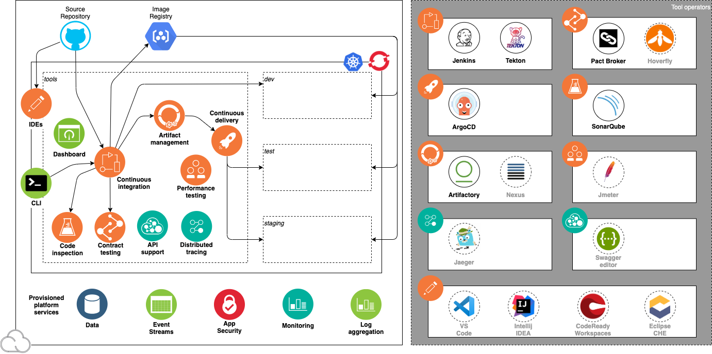

<PageDescription>

Get familiar with using the IBM Garage for Cloud Developer Tools

</PageDescription>

## Developer Tools

The IBM Garage for Cloud Developer Tools is an environment for developing cloud-native applications for deployment 
to Kubernetes and Red Hat OpenShift. It embodies IBM Garage Method principles and practices for consistently developed 
applications incorporating best practices that increase developer velocity for efficient delivery of business value.

### Overview

A short video introducing the concepts of DevOps with Red Hat OpenShift
<iframe width="80%" height="500" src="https://www.youtube.com/embed/GOPWObjFTsI" frameborder="0" allow="accelerometer; autoplay; encrypted-media; gyroscope; picture-in-picture" allowfullscreen></iframe>

Each development team installs its own copy of the Developer Tools environment into the team's account. 
The environment includes several features that support IBM Garage Method best practices for consistent and rapid development of cloud-native applications:

- **Installation**: The Developer Tools are able to install themselves as a new environment 
- **Cluster**: A Kubernetes or OpenShift cluster that both hosts the tools and itself is a deployment target for application builds
- **SDLC**: Deployment target environments that support the application development lifecycle: *dev*, *test*, and *staging*
- **Backend services**: Cloud services commonly required by cloud-native applications for monitoring, security, and persistence
- **CI/CD**: A prebuilt, ready-to-run continuous delivery pipeline incorporating best-of-breed open source software tools
- **Starter Kits**: Prebuilt code templates for common application components and tasks incorporating best practices that developers can add to their codebase as needed
- **Dashboard**: A centralized tool to help developers use the environment's other tools, Starter Kits, and so on
- **Red Hat CRC**: The tools can be installed into the RedHat CodeReady Containers environment

Some of the tools are sourced from the [IBM Bitnami Software Catalog](https://cloud.ibm.com/catalog?search=label%3Ahelm#software) that can be found in the IBM Cloud. This approach helps assemble these reliable open source development tools into an end-to-end developer experience that is fully integrated with IBM Cloud's managed container services.

Typically a [Cloud System Admin](/admin/overview) or [squad leader](https://www.ibm.com/garage/method/practices/culture/practice-building-effective-squads/) installs and sets up a new Developer Tools environment after the [initial inception workshop](https://www.ibm.com/garage/method/practices/think/inception),
providing a place for the developers to start developing the
[minimum viable product (MVP)](https://www.ibm.com/garage/method/practices/think/inception/practice_minimum_viable_product).
The objective is to reduce the time required for a team to configure and prepare their development environment.
The key benefit is to make the end-to-end 
[CI/CD development lifecycle](https://www.ibm.com/garage/method/practices/deliver/practice_continuous_delivery/) 
consistent across each platform and make the out-of-the-box developer experience as simple as possible.

The installation is performed using [Terraform](https://cloud.ibm.com/docs/terraform),
with a [modular configuration](https://github.com/ibm-garage-cloud/garage-terraform-modules) so unneeded tools can be easily disabled or new tools added.
The combination of tools selected are proven in the industry to deliver real value for modern cloud-native development.

[Red Hat Open Innovation Labs CI/CD components](https://github.com/rht-labs/labs-ci-cd) embodies a very similar approach to how they deliver success with OpenShift.

### Environment components

After installation, the Developer Tools environment consists of the following components and development tools:
- A development cluster
- A set of backend services
- A set of continuous delivery tools

This diagram illustrates the Development Tools environment:

The diagram shows the components in the environment: the cluster, the deployment target environments, the cloud services, and the tools.

#### Development cluster

The heart of the the Developer Tools environment is a cluster:

- An [IBM Cloud Kubernetes Service](https://www.ibm.com/cloud/container-service) 
or [Red Hat OpenShift on IBM Cloud](https://www.ibm.com/cloud/openshift) 3-node cluster
- Cluster namespace that encapsulates the tooling installed in the cluster: *tools*
- Cluster namespaces for deployment target environments: *dev*, *test*, and *staging*

#### Backend services

The following IBM Cloud services are created and bound to the cluster:

| Capability                | Service        |Description |
| -----------------------   |:-------------- |------------|
| Logging                   | [LogDNA Logging](https://cloud.ibm.com/docs/services/Log-Analysis-with-LogDNA?topic=LogDNA-getting-started)  | Manage app logging LogDNA  |
| Monitoring                | [SysDig Monitoring](https://cloud.ibm.com/docs/services/Monitoring-with-Sysdig?topic=Sysdig-getting-started) | Manage monitoring of apps with SysDig |
| AppID                     | [AppID Application Authentication](https://cloud.ibm.com/docs/services/appid?topic=appid-service-access-management) | Secure your apps, APIs and Kubernetes Ingress end points |
| Cloudant                  | [Cloudant NoSQL Database](https://cloud.ibm.com/docs/services/Cloudant?topic=cloudant-getting-started) | NoSQL Database commonly used for data persistence |
| Cloud Object Storage      | [Cloud Object Storage Storage](https://cloud.ibm.com/docs/services/cloud-object-storage?topic=cloud-object-storage-getting-started) | Storage service commonly used for binary content |
| PostreSQL                 | [PostgreSQL](https://cloud.ibm.com/docs/services/databases-for-postgresql?topic=databases-for-postgresql-about) (used by SonarQube) | SQL Database used for structure data persistence |

#### Continuous delivery tools

The following best-of-breed open source software tools are installed in the cluster's *tools* namespace:

| Capability                  | Tool                                         | Bitnami   |Description |
| --------------------------- |:--------------                               | -------   |------------|
| Continuous Integration      | [Jenkins CI](https://jenkins.io/)            |  Yes      | Jenkins is a common tool for Continuous Integration   |
| Continuous Integration      | [Tekton CI](https://tekton.dev/)             |           | Tekton is an emerging tool for Continuous Integration with Kubernetes and OpenShift  |
| Code Analysis               | [SonarQube](https://www.sonarqube.org/)      |  Yes      | SonarQube can scan code and display the results in a dashboard |
| Artifact and Helm Storage   | [Artifactory](https://jfrog.com/open-source/)|  Yes      | Artifactory is an artifact storage and Helm chart repository  |
| Continuous Deployment       | [ArgoCD](https://argoproj.github.io/argo-cd/)|           | ArgoCD support Continuous Delivery with GitOps |
| Contract API Testing        | [Pact](https://docs.pact.io/)                |           | Pact enables API contract testing |
| Web IDE                     | [Eclipse CHE](https://www.eclipse.org/che/)  |           | IDE for editing and managing code in a web browser |

## Getting Started

Get to know the Developer Tools environment:

<AnchorLinks>
      <AnchorLink to="../getting-started/overview">Getting Started</AnchorLink>
      <AnchorLink to="../getting-started/deploy-app">Deploy Your First App</AnchorLink>
      <AnchorLink to="../guides/overview">Guides</AnchorLink>
      <AnchorLink to="../starterkits/overview">Starter Kit Templates</AnchorLink>
      <AnchorLink to="../admin/overview">Installation</AnchorLink>
</AnchorLinks>