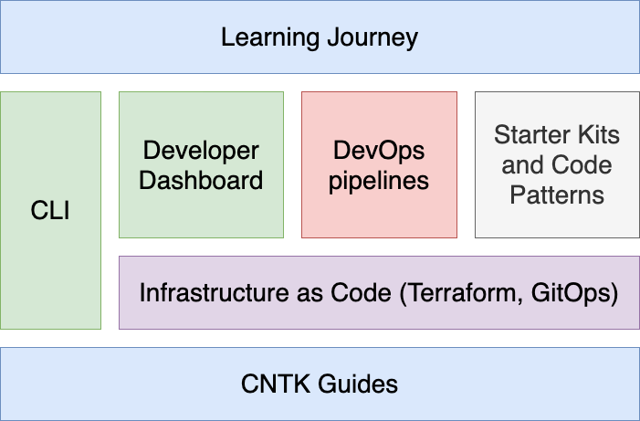
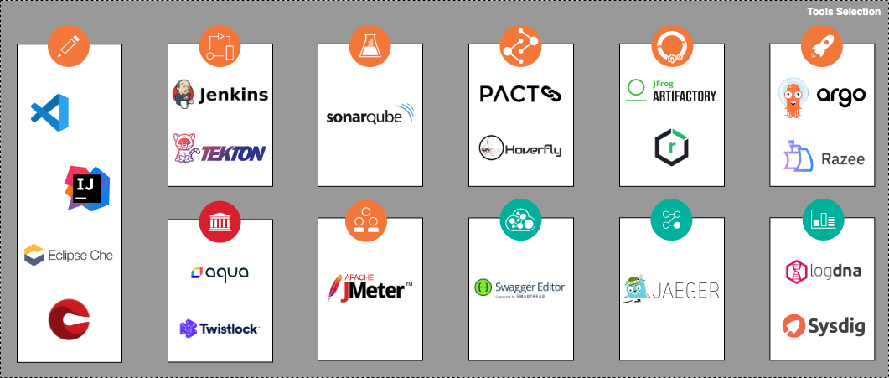

import Globals from 'gatsby-theme-carbon/src/templates/Globals'

<PageDescription>

Get familiar with using the <Globals name="longName"/>

</PageDescription>

<Globals name="longName" /> is an open-source collection of assets that provide an environment for developing 
cloud-native applications for deployment within <Globals name="ocp" /> and <Globals name="kube" />. It
embodies <Globals name="method" /> principles and practices for consistently developed
applications, incorporating best practices that increase developer velocity for efficient delivery of business value.

## <Globals name="shortName" /> objectives

There are a number of objectives behind providing the <Globals name="shortName" />. The three main goals of the <Globals name="tinyName" /> are provided below:

### 1. Accelerate time to business value

One goal of the <Globals name="shortName" /> is to prepare the development environment quickly and allow the development
team to start delivering business function on day one of the first iteration using enterprise cloud-native practices. After all,
the point of cloud-native development is to deliver business value to end users and the development and operations infrastructure
are provided in service to that goal.

Through the automation provided by the <Globals name="shortName" /> we can provision an environment in minutes through automation
that is fully configured and ready for a development team to start working immediately. With the other components of
the <Globals name="tinyName" />, developers can begin with a rich DevOps framework with a focus on "build to manage" techniques to
help build production-ready applications.

### 2. Reduce risk through consistent delivery models from start to production

The <Globals name="shortName" /> encapsulates many of the available best practices for cloud-native development including
DevOps and "Build to Manage" practices. They have been provided through the <Globals name="tinyName" /> in this way so that
developers and SREs can benefit from these practices without requiring any additional effort and so that they can be applied
consistently from project to project.

### 3. Quickly ramp up development teams on <Globals name="ocp" /> and <Globals name="kube" />

Containerized platforms like <Globals name="ocp" /> and <Globals name="kube" /> provide a great deal of functionality and
flexibility for application teams. However, these platforms can at time seem unapproachable for developers and SREs new to the environment
given all the different concepts and components. The <Globals name="shortName" /> aims to help with the learning curve in two
different ways:

1. Provide tools and techniques to "round off the corners" of the more complex aspects of working in a containerized environment
2. Provide a learning journey that incrementally introduces the concepts of a containerized environment in terms of practical scenarios, not abstract theory

## Guided walk-though

If you'd like to have a guided walkthrough of what the <Globals name="shortName" /> provides, check out this [video demonstration](https://www.youtube.com/watch?v=LcWboN1T7Zk) of
the <Globals name="tinyName" /> in action.

## Components of the <Globals name="longName" />

As the name suggests, the <Globals name="longName" /> provides a collection of tools that can be used in part or in
whole to support the activities of software development life-cycle. The following provides a listing of the assets that
make up the <Globals name="shortName" />:

- [**Guides**](#guides) - this set of documentation that weaves the various toolkit components together with a perspective on how to apply cloud-native practices to deliver business solutions
- [**Infrastucture as Code**](getting-started-day-0/infrastructure-as-code) - Terraform scripts and GitOps configuration to provision and manage the environment
- [**CLI**](/getting-started/cli) - a simple node-based CLI that installs as a plugin to the `kubectl` and `oc` CLIs and provides commands to simplify common
- [**Developer Dashboard**](/getting-started-day-1/dashboard) - Dashboard component and <Globals name="ocp" /> console extensions to simplify common developer activities
- [**DevOps pipelines**](/getting-started-day-1/continuous-integration) - continuous integration pipelines for Tekton and Jenkins
- [**Starter Kits and Code Patterns**](./starterkits) - software repositories that can be used to quickly get started building applications using common patterns, or to serve as a reference to enhance existing patterns
- [**Learning Journey**](/learning/intermediate) - activation material to teach practitioners how to apply cloud-native practices in real-world scenarios using the <Globals name="tinyName" />

## <Globals name="shortName" /> <Globals name="devenv" />

The <Globals name="shortName" /> <Globals name="devenv" /> includes several features that support <Globals name="method" /> best practices
for consistent and rapid development of cloud-native applications:

- **Cluster**: A <Globals name="ocp" /> or <Globals name="kube" /> cluster that both hosts the tools and itself is a deployment target for application builds
- **SDLC**: Deployment target environments that support the application development lifecycle: *dev*, *test*, and *staging*
- **Backend services**: Cloud services commonly required by cloud-native applications for monitoring, security, and persistence
- **CI/CD**: A prebuilt, ready-to-run continuous delivery pipeline incorporating best-of-breed open source software tools
- **<Globals name="templates" />**: Prebuilt code templates for common application components and tasks incorporating best practices that developers can add to their codebase as needed
- **Dashboard**: A centralized console to help developers use the environment's capabilities

Typically a [Cloud System Admin](/admin/overview) (or a [squad lead](https://www.ibm.com/garage/method/practices/culture/practice-building-effective-squads/)) installs and sets
up a new <Globals name="devenv" /> after the [inception workshop](https://www.ibm.com/garage/method/practices/think/inception),
providing a place for the developers to start developing the
[minimum viable product (MVP)](https://www.ibm.com/garage/method/practices/think/inception/practice_minimum_viable_product).
The objective is to reduce the time required for a team to configure and prepare their development environment. The key
benefit is to make the end-to-end [CI/CD development lifecycle](https://www.ibm.com/garage/method/practices/deliver/practice_continuous_delivery/)
consistent across each platform and make the out-of-the-box developer experience as simple as possible.

The installation is performed using [Terraform](https://cloud.ibm.com/docs/terraform) scripts structured as [modular components](https://github.com/ibm-garage-cloud/garage-terraform-modules)
so unneeded tools can be easily disabled or new tools added. The combination of tools selected are proven in the
industry to deliver real value for modern cloud-native development.

[Red Hat Open Innovation Labs CI/CD components](https://github.com/rht-labs/labs-ci-cd) embodies a very similar approach to how they deliver success with OpenShift.

### Environment components

After installation, the <Globals name="env" /> consists of the following components and developer tools:
- A <Globals name="ocp" /> or <Globals name="iks" /> development cluster
- A collection of continuous delivery tools deployed into the cluster
- A set of backend services

This diagram illustrates the <Globals name="env" />:

<!-- Image Map Generated by http://www.image-map.net/ -->

<map name="image-map" id="image-map">
    <area target="" alt="Continuous Integration" title="Continuous Integration" href="/getting-started-day-1/continuous-integration" coords="271,250,30" shape="circle" />
    <area target="" alt="Git Ops" title="Git Ops" href="/getting-started-day-0/git-ops" coords="378,89,30" shape="circle" />
    <area target="" alt="Artifact Management" title="Artifact Management" href="/getting-started-day-1/artifact-management" coords="591,60,30" shape="circle" />
    <area target="" alt="Image Registry" title="Image Registry" href="/getting-started-day-1/image-registry" coords="697,41,30" shape="circle" />
    <area target="" alt="Code Inspection" title="Code Inspection" href="/getting-started-day-1/code-inspection" coords="164,354,30" shape="circle" />
    <area target="" alt="Contract Testing" title="Contract Testing" href="/getting-started-day-1/contract-testing" coords="271,401,30" shape="circle" />
    <area target="" alt="Continuous Delivery" title="Continuous Delivery" href="/getting-started-day-2/continuous-delivery" coords="592,251,30" shape="circle" />
    <area target="" alt="Dashboard" title="Dashboard" href="/getting-started-day-1/dashboard" coords="146,472,30" shape="circle" />
    <area target="" alt="Distributed Tracing" title="Distributed Tracing" href="/getting-started-day-2/open-tracing" coords="531,469,30" shape="circle" />
    <area target="" alt="Monitoring" title="Monitoring" href="/getting-started-day-2/monitoring" coords="878,607,30" shape="circle" />
    <area target="" alt="Log Management" title="Log Management" href="/getting-started-day-2/log-management" coords="1011,607,30" shape="circle" />
    <area target="" alt="API Support" title="API Support" href="/getting-started-day-1/api-support" coords="424,472,30" shape="circle" />
    <area target="" alt="Performance Testing" title="Performance Testing" href="/getting-started-day-2/performance-testing" coords="531,354,30" shape="circle" />
    <area target="" alt="Compliance and Vulnerability" title="Compliance and Vulnerability" href="/getting-started-day-1/compliance-vulnerability" coords="378,356,30" shape="circle" />
    <area target="" alt="CLI" title="CLI" href="/getting-started/cli" coords="71,321,30" shape="circle" />
    <area target="" alt="Vault" title="Vault" href="/getting-started-day-1/vault" coords="484,72,30" shape="circle" />
    <area target="" alt="Data Security" title="Data Security" href="/getting-started-day-0/data-security" coords="210,607,30" shape="circle" />
</map>

The diagram shows the components in the environment: the cluster, the deployment target environments, the cloud services, and the tools.

<Accordion>
<AccordionItem title="Logo Usage Reference">

| Logo      | Usage Reference |
| --------- | ---------- |
| Artifactory | is an Open Source product maintained by [JFrog](https://jfrog.com/brand-guidelines/) |
| Jenkins | Open Source project [Jenkins](https://www.jenkins.io/artwork/) |
| SonarQube | Open Source project maintained by [SonarSource](https://www.sonarsource.com/logos/) |
| Nexus Repository | Open Source project maintained by [SonaType](https://www.sonatype.com/nexus-repository-oss) |
| Trivy | Open Source project maintained by [Aqua](https://www.aquasec.com/brand/) |
| InteliJ | IDE from [JetBrains](https://www.jetbrains.com/company/brand/) |
| VSCode | Free IDE maintained by [Microsoft](https://code.visualstudio.com/) |
| Jaeger | Open Source tool maintained by [Jaeger Community](https://www.jaegertracing.io/get-in-touch/) |
| ArgoCD | Open Source tool maintained by [ArgoCD Community](https://argoproj.github.io/projects/argo-cd/)|
| OpenShift and CodeReady | Workspaces are products from [Red Hat](https://developers.redhat.com/products/codeready-workspaces/overview) |
| LogDNA | IBM Cloud service supplied by [LogDNA](https://logdna.com/)|
| Sysdig | IBM Cloud service supplied by [Sysdig](https://sysdig.com/)|

</AccordionItem>
</Accordion>

The tools to provision an environment using the <Globals name="shortName" /> can the customized to provision a particular
set of tools fit for the environment. The Toolkit provides a default installation to provision a <Globals name="devenv" />
as a starting point. Any of the available components listed on the [Terraform modules](/admin/terraform) page can be used
to prepare the environment.

#### Development cluster

The heart of the <Globals name="devenv" /> is a cluster:

- An [IBM Cloud-managed Kubernetes](https://www.ibm.com/cloud/container-service) or [Red Hat OpenShift](https://www.ibm.com/cloud/openshift) cluster
- Cluster namespace that encapsulates the tooling installed in the cluster: *tools*
- A collection of SRE tools and services

#### Continuous delivery tools

The following best-of-breed open source software tools are installed in the cluster's *tools* namespace:

| Capability                  | Tool           | Bitnami |Description |
| --------------------------- |:-------------- | ------- |------------|
| Continuous Integration      | [Jenkins CI](/tools/continuous-integration/)            |  Yes    | Jenkins is a common tool for Continuous Integration   |
| Continuous Integration      | [Tekton CI](/tools/continuous-integration-tekton)       |         | Tekton is an emerging tool for Continuous Integration with Kubernetes and OpenShift  |
| API Contract Testing        | [Pact](/tools/contract-testing/)                        |         | Pact enables API contract testing |
| Code Analysis               | [SonarQube](/tools/code-analysis)                       |  Yes    | SonarQube can scan code and display the results in a dashboard |
| Container Image Registry    | [IBM Cloud Container Registry](/tools/image-registry)   |         | Stores container images to be deployed |
| Artifact Management         | [Artifactory](/tools/artifact-management/)              |  Yes    | Artifactory is an artifact storage and Helm chart repository  |
| Continuous Delivery         | [ArgoCD](/tools/continuous-delivery/)                   |         | ArgoCD support Continuous Delivery with GitOps |
| Web IDE                     | [Code Ready Workspace](https://developers.redhat.com/products/codeready-workspaces/overview)              |         | IDE for editing and managing code in a web browser |

#### Backend services

The following <Globals key="ic" /> services can be created and bound to the cluster:

| Capability                | Service        |Description |
| -----------------------   |:-------------- |------------|
| Log Management            | [Log Analysis with LogDNA](/tools/log-management)  | Manage and analyze app logs  |
| Monitoring                | [Cloud Monitoring with Sysdig](/tools/monitoring)  | Monitor app and platform resources |
| User Authentication       | [App ID](/programming/security/)                    | Verify identities of clients accessing app end points |
| Relational Data Storage   | [Databases For PostgreSQL](/programming/databases)  | Stores relational data structured as schemas for SQL querying |
| Schemaless Data Storage   | [Cloudant](/programming/databases)                  | NoSQL database for JSON documents |
| Binary Data Storage       | [Cloud Object Storage](/programming/databases)      | Storage service commonly used for binary content |

## Getting Started

Get to know the <Globals name="shortName" />:

<AnchorLinks small>
      <AnchorLink to="/getting-started">Getting Started</AnchorLink>
      <AnchorLink to="/getting-started-day-1/deploy-app">Deploy Your First App</AnchorLink>
      <AnchorLink to="/tools">Tools Guides</AnchorLink>
      <AnchorLink to="/starterkits"><Globals name="templates" /></AnchorLink>
      <AnchorLink to="/admin">Installation</AnchorLink>
      <AnchorLink to="/arch/environment">Architectures</AnchorLink>
</AnchorLinks>
