<PageDescription>

Migrate a Java EE app that requires no code changes

</PageDescription>

This exercise shows how to handle a "no code changes required" modernization of an existing traditional WebSphere Application Server Network Deployment (WebSphere ND) application to WebSphere Liberty running in a Docker container. We will migrate the application using [IBM Cloud Transformation Advisor](https://www.ibm.com/garage/method/practices/learn/ibm-transformation-advisor).

This exercise assumes the following:

1. You are using a Developer Tools environment that has already been installed.
1. Cloud Pak for Applications has already been installed in the environment.

This exercise consists of the following sections:

<AnchorLinks>
  <AnchorLink to="#scan-the-existing-application">Scan the Existing Application</AnchorLink>
  <AnchorLink to="#analyze-the-scan-results">Analyze the Scan Results</AnchorLink>
  <AnchorLink to="#configure-websphere-liberty">Configure WebSphere Liberty</AnchorLink>
  <AnchorLink to="#run-plantsbywebsphere-on-liberty">Run PlantsByWebSphere on Liberty</AnchorLink>
</AnchorLinks>

## Business need

This WebSphere Application Server customer finds itself in a common situation: They have a bunch of legacy monolithic applications running in WebSphere Application Server Network Deployment (WebSphere ND) on traditional IT. This was state-of-the-art back when the applications were first deployed, but the runtime requires periodic maintenance and constant administration. Now the customer would like to host the application in a cloud environment, but they have no desire to make any code changes to move the apps. While it might be beneficial for the customer to invest money in rethinking and redesigning their entire portfolio of applications to move off of traditional WebSphere, in reality this is overkill for applications that still provide the proper business functionality just fine. For these legacy monoliths, we can reduce the maintenance overhead by moving to WebSphere Liberty and running on Red Hat OpenShift. We can also reduce the administrative overhead by implementing a common CI/CD and SRE practices.

In this exercise, you will learn the skills to be able to demonstrate to these customers how *some* applications can be moved to Liberty in a Docker container without the need to make code changes. This approach known as [runtime modernization](https://www.ibm.com/cloud/garage/architectures/runtime-modernization-solution/), which doesn't address the technical debt in the application but does remove the technical debt created by the application server runtime. This approach is one strategy for the overall modernization of a customer's legacy Java application portfolio and an important skill to have.

### Project hill

Here's the [hill statement](https://www.ibm.com/garage/method/practices/think/practice_hills/) describing the desired outcome of this migration:

- **Who**: Operations teams are tasked with moving existing Java applications from traditional WebSphere ND to "the Cloud" and don't have access to developers for the majority of the legacy Java portfolio.

- **What**: This is an application that users still need. They consider it fine as-is: Either it doesn't require bug fixes and new features, or that maintenance isn't worth the expense. The operations team needs to move to "the Cloud" and wants to standardize on Docker containers that they can run anywhere.

- **Wow**: With a few simple steps, you can move an application and the associated configuration to a Liberty runtime in a Docker container without changing code. This is something that can be repeated over and over in a factory type engagement.

## Architecture

PlantsByWebSphere is a simple legacy monolith that runs in WebSphere Application Server with a backend database (DB2).

## Technical Requirements

This modernization exercise has the following requirements:
- No code changes -- You don't even have access to source code
- The target is to get the application running on Liberty in a Docker container on your laptop
- The DB2 database will remain in its current location -- It is deployed in a container in the MOOC4 environment, exposed with a NodePort

## Guide
This exercise has the following steps:
- Run a pre-configured instance of traditional WebSphere in a Docker container on your laptop to simulate the existing customer environment
- Use the data collector in Transformation Advisor to scan the WebSphere runtime and the PlantsByWebSphere application
- Load the scan results in to Transformation Advisor running in your MOOC environment's Red Hat OpenShift cluster
- Review the Transformation Advisor analysis
- Use the accelerators to build a Docker image with Liberty and the application
- Run the newly created Docker image with application on Liberty on your laptop to demonstrate success

### Solution Links

TBD

### Scan the Existing Application

We need to first have the application installed and running so that we can scan it.

#### Setup
In order to simulate a real traditional WebSphere ND customer environment on your laptop, we have provided you with a Dockerfile that creates a Docker image that you can run locally. This image will contain traditional WebSphere, the PlantsByWebSphere application, and the data collector in Transformation Advisor. The end result will be a container running the application which accesses the shared database.

<InlineNotification kind="info">

**Note:** In the real world, you would work with the client's WebSphere administrators to execute the data collector in their environment. For this exercise, we simulate that production environment as a Docker image running on your laptop.

</InlineNotification>

<InlineNotification kind="info">

**Note:** The DB2 database used for this exercise is at `169.62.108.167` on port `30866`.

</InlineNotification>

- Clone the repository to your machine

    ```bash
    git clone https://github.com/ibm-cloud-architecture/icp-dev-workshop.git
    cd icp-dev-workshop/lab4/CreatePreConfiguredtWASContainer
    ```

- Review the Dockerfile, see that the Docker image will contain:
    - The DB2 JDBC drivers
    - wsadmin scripts -- Used to configure the WebSphere application server for the PlantsByWebSphere application
    - Compiled application EAR files
    - The data collector in Transformation Advisor -- This was split in to 50mb chunks so it could easily be stored in GIT

- Review the `customCmd.properties` file

    This file is used to ensure that the data collector scans all of the files in the application. By default, the data collector ignores Java classes in the `com.ibm.websphere` packages, as well as packages that are typically used by open-source JARs such as `net` and `org` packages. These packages are ignored because they typically contain code that the client doesn't own, so any issues found by Transformation Advisor would be false positives. This becomes a problem when the client's code is in a package such as `net` or `org` because the scanner will ignore their Java code.

    ```java
    evaluation=--evaluate --excludePackages=com.informix,com.microsoft,com.sybase,com.sun,java,javax,net,org,oracle,sqlj,_ibmjsp --includePackages=com.ibm
    migration_liberty=--analyze --sourceAppServer=was855 --targetAppServer=liberty --targetCloud=dockerIBMCloud --includePackages=com.ibm --excludePackages=com.informix,com.microsoft,com.sybase,com.sun,java,javax,net,org,oracle,sqlj,_ibmjsp
    migration_was=--analyze --sourceAppServer=was855 --targetAppServer=was90 --targetCloud=vmIBMCloud --includePackages=com.ibm --excludePackages=com.informix,com.microsoft,com.sybase,com.sun,java,javax,net,org,oracle,sqlj,_ibmjsp
    #inventory=--inventory --excludeFiles=".*/directory/LargeXMLFileName.xml"
    #featureList=--featureList --excludeFiles=".*/directory/LargeXMLFileName.xml"
    #java_opt=-Xmx2g
    ```
- Review the `wsadmin.py` file
    - Ensure that the `serverName` and `port` for the DataSources match the values of your DB2 database (above)

- Build the Docker image

    ```bash
    docker build -t twas-plantsbywebsphere .
    ```

- Review the Docker image for traditional WebSphere Application Server

    ```bash
    $ docker images | grep websphere

    REPOSITORY                      TAG        IMAGE ID        CREATED          SIZE
    ibmcom/websphere-traditional    profile    67b52a4c08ad    12 months ago    1.75GB
    ```

    You may be wondering: If traditional WebSphere runs in a Docker container, then why are we moving to Liberty?

    - One reason: **1.75GB**!!

    - Another reason: Having to hardcode configuration values in configuration files (like in the previous step) because traditional WebSphere can't read [configuration from environment variables](https://12factor.net/config)

- Start an instance of the Docker image

    ```bash
    docker run -d -p 9080:9080 -p 9443:9443 -p 9060:9060 -p 9043:9043 -v "$(pwd)":/data --name twas-plantsbywebsphere twas-plantsbywebsphere:latest
    ```

- Tail the logs for the Docker container and wait for the message shown below:

    ```
    $ docker logs -f twas-plantsbywebsphere
    ...

    *** CERTIFICATES THAT ARE EXPIRED OR BEYOND THE EXPIRATION THRESHOLD AND HAVE BEEN REPLACED ***;

    CWPKI0645I: Personal certificate alias "default" in KeyStore "NodeDefaultKeyStore((cell):DefaultCell01:(node):DefaultNode01)" was REPLACED.
    CWPKI0645I: Personal certificate alias "default" in KeyStore "NodeRSATokenKeyStore((cell):DefaultCell01:(node):DefaultNode01)" was REPLACED.
    ```

    This message is expected because this version of the traditional WebSphere Docker image is over 12 months old and the SSL certificates have expired.

- Restart the container to refresh these SSL certificates

    ```bash
    docker stop twas-plantsbywebsphere
    docker start twas-plantsbywebsphere
    ```

- Tail the logs for the Docker container and wait for the message shown below:

    ```
    $ docker logs -f twas-plantsbywebsphere
    ...

    WSVR0001I: Server server1 open for e-business
    ```

- Log in to the Administrative Console

    https://localhost:9043/ibm/console

    NOTE: The console requires secure HTTP. Chrome and Safari block https://localhost and recently don't allow exceptions. You may need to use Firefox to log in to the console. Firefox blocks, but gives you the option to proceed anyways.

    username: `wsadmin` password: `passw0rd`

- Navigate to `Applications --> Application Types --> WebSphere enterprise applications` and verify that you see `HelloWorld` and `PlantsByWebsphere8`

    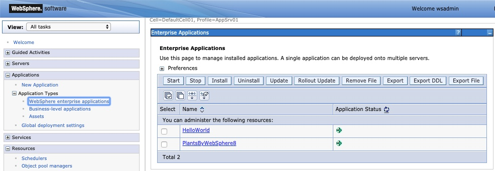

- Navigate to `Resources --> JDBC --> DataSources` and verify that you see `PlantsByWebSphereDataSource` and `PlantsByWebSphereDataSourceNONJTA`. These are the two DataSources that will be detected by the data collector.

    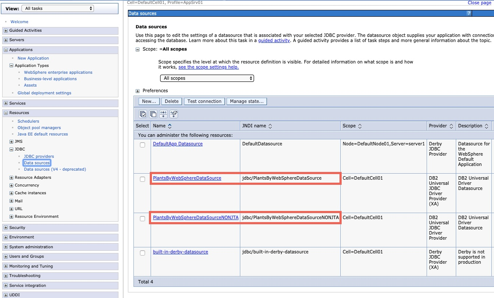

- Log out of the Administrative Console

- Access PlantsByWebSphere using http://localhost:9080/PlantsByWebSphere

    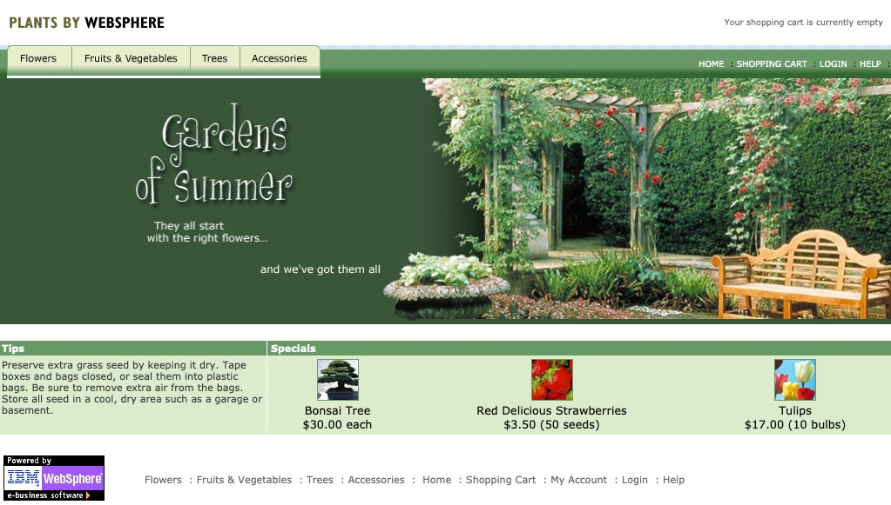

- Click on one of the Specials such as the "Bonsai Tree". If the screen shown below is displayed, the connection to the Database is working correctly.

    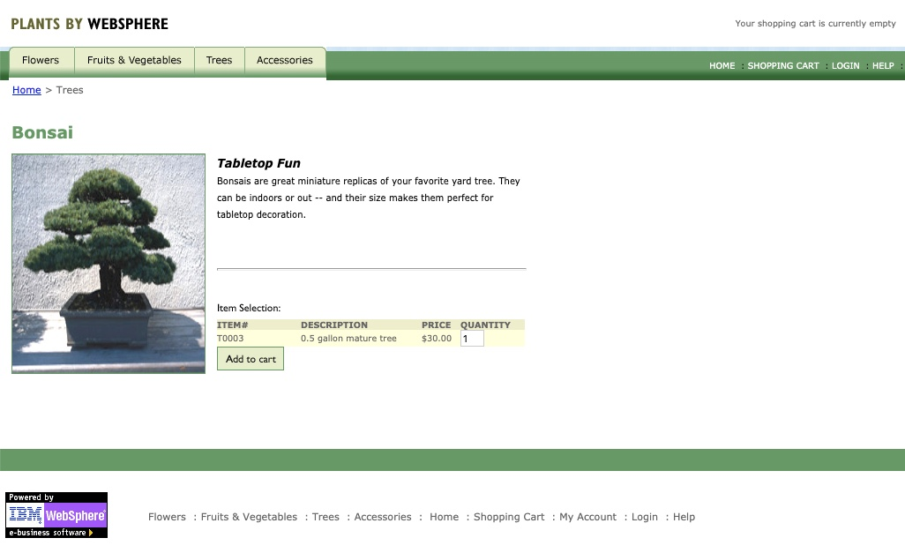


#### Run the data collector

Now that you have validated that the PlantsByWebSphere application is running in the Docker container, it is time to run the data collector.

- Enter the twas-plantsbywebsphere Docker container

    ```bash
    docker exec -it twas-plantsbywebsphere bash
    ```

- Navigate to the data collector directory

    ```bash
    cd /demo/transformationadvisor-2.0.1
    ```

- Execute the data collector

    ```bash
    ./bin/transformationadvisor -w /opt/IBM/WebSphere/AppServer -p AppSrv01 wsadmin passw0rd
    ```

- When prompted, accept the License agreement

- After a few minutes, you will either see a "Thank you for uploading your data. You can proceed to the application UI for doing further analysis." message or an error related to "unable to upload the data" which will occur if the data collector can't access the Transformation Advisor UI which is running in Red Hat OpenShift.

    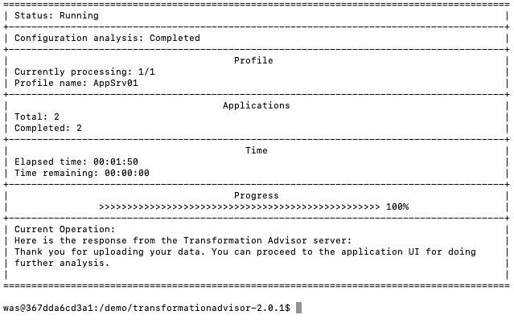

- Verify that the results zip file has been created

    ```bash
    $ ls -la AppSrv01.zip
    -rw-r--r-- 1 was was 340860 Nov 22 15:32 AppSrv01.zip
    ```

- Use CTRL+D to exit from the Docker container

- Copy the `AppSrv01.zip` file from within the Docker container to your local disk

    ```bash
    docker cp twas-plantsbywebsphere:/demo/transformationadvisor-2.0.1/AppSrv01.zip .
    ```

- Stop and remove the Docker container

    ```bash
    docker stop twas-plantsbywebsphere
    docker rm twas-plantsbywebsphere
    ```

### Analyze the scan results

In this section, you will upload the results from the data collector to the Transformation Advisor UI and analyze the findings.

- Use the [Developer Tools Dashboard](/getting-started/dashboard) to open the Transformation Advisor dashboard

    

    - The browser may display the message "Authentication endpoint is broken at the moment."  To solve the problem, open the URL in a new incognito browser tab.

- Add a new Workspace named `AppMod-{initials}`

- Add a new Collection named `Lab1`

- Click `Upload data` and specify the `AppSrv01.zip` file you created from scanning the app

    After a few moments, the UI will display the Results page.

    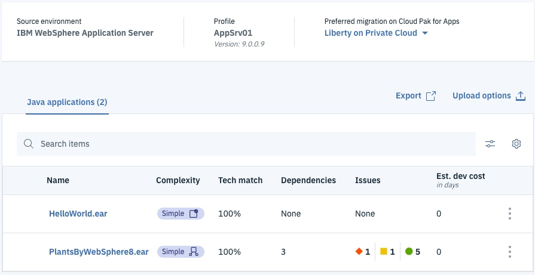

#### Review the results

Take a moment to review the results. Transformation Advisor has determined this application is "simple" to move to Liberty on Private Cloud.

- What happens if you change the Preferred migration target to Liberty on Public Cloud? Why did the *complexity* change?

- Hold your mouse over the "Complex" box. Why does Transformation Advisor think you need a VPN?

- Click on the the `PlantsByWebSphere8.ear` and read the Public Cloud to Private Cloud Network Connection result.

Scroll down and note the External Dependencies that have been detected to be required by this application. Remember the DB2 database? Transformation Advisor detected that the application uses the database. It is telling you that either you will need to move the database to the public cloud or the application in the pubic cloud will need a network connection--probably a VPN--to the database in the private data center.

- Click the `<-- Recommendations` link at the top of the page to return to the Recommendations page, then set the Preferred migration target to Liberty on Private Cloud once again

#### Review the reports

Take a moment to review the reports. Make sure the Transformation Advisor UI is displaying the Results page and that the Preferred migration target is set to Liberty on Private Cloud.

- Click on the the `PlantsByWebSphere8.ear` again and review the Technology Issues section

- Scroll to the bottom of the page and review the Technology Report, Inventory Report, and Analysis Report

Note that at the top of each report, the command line parameters are shown. This helps to validate that your settings in `customCmd.properties` have been detected.

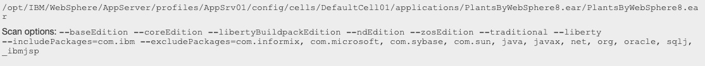

Review each of the reports:

- **Technology Report**
    - Lists the Java EE features used by the application and
    - Maps these features to the capabilities of the various WebSphere editions

    This is a useful first step to determining whether this application will run on Liberty.

    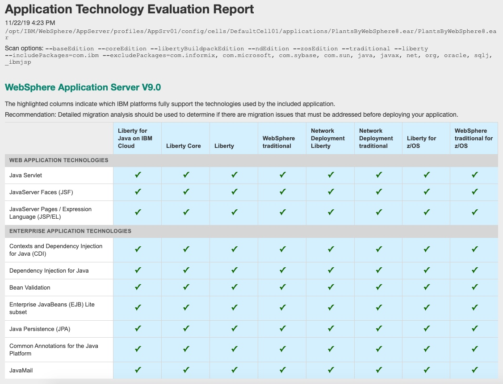

- **Inventory Report**

    - Lists the Java EE components in the application

    This helps give an idea of the size of the monolith and identify the number of EJBs and web services.

    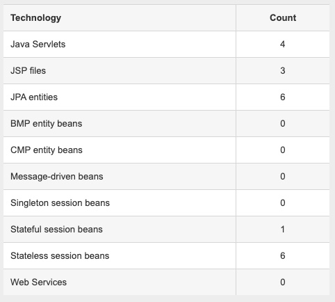

    - Shows the application structure

    This shows which JARs are included in the application, which helps identify technical debt such as old versions of Struts, Spring, Hibernate and whether the application packages IBM or JEE JARs that can cause classloading issues later.

    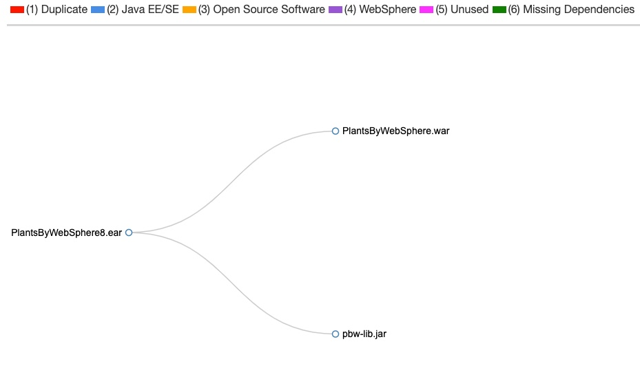

    - Lists the Utility JAR files

    This shows which packages are in each JAR, which is especially useful if the client doesn't know which Java packages to scan. If you find this part of the report lists client code in packages that the scanner ignored such as `org` and `net`, you will need to update the `customCmd.properties` file to include these packages and re-run the scan.

    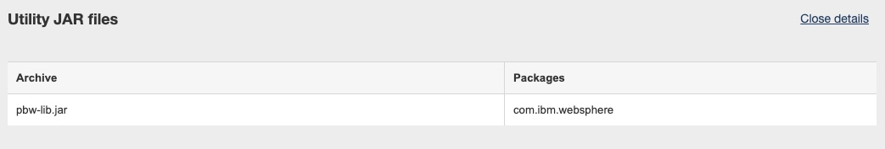

- **Analysis Report**

    - Lists the issues found during the scan of the application

    Review the Severe and Warning results using the `show rule help` and `show results` links. Note that the one severe result for this application is related to the user of `sendRedirect`; if problems are encountered during testing, the solution is to set a JVM property.

    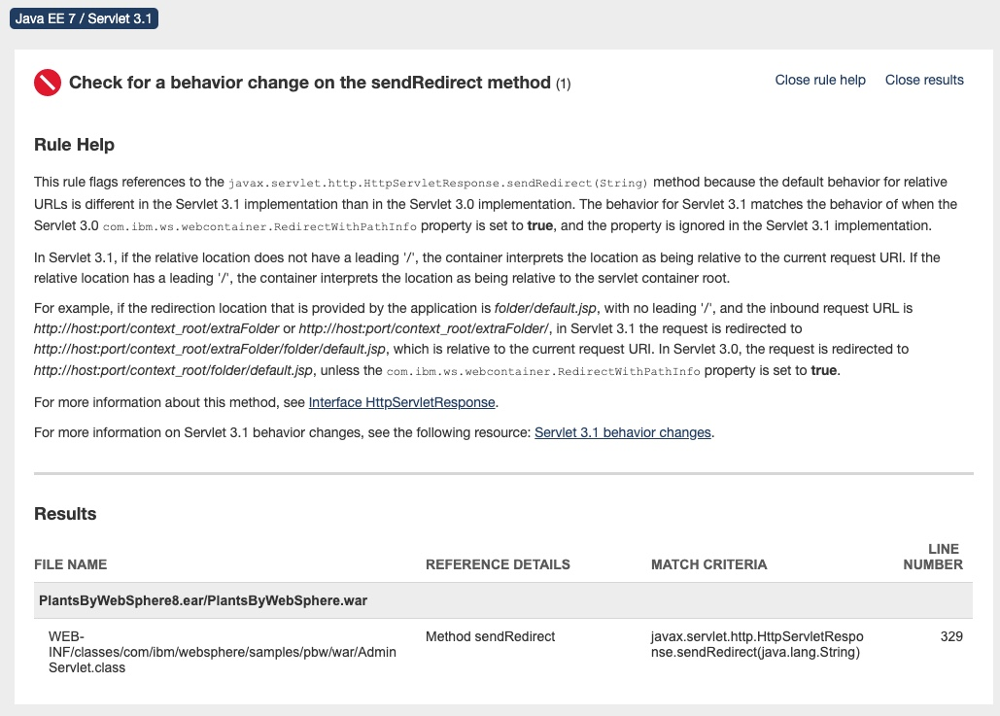

- Close the open report tabs and return to the Recommendations page

Let's go ahead and move this application to Liberty.

### Configure WebSphere Liberty

Transformation Advisor creates some accelerators to speed up the process of migrating an application. These files are a starting point for most modernization journeys and require modification. In this section you will modify those files for PlantsByWebSphere.

- From the main recommendations page, click the `...` link on the right for the `PlantsByWebSphere8.ear` and select `view migration plan`

  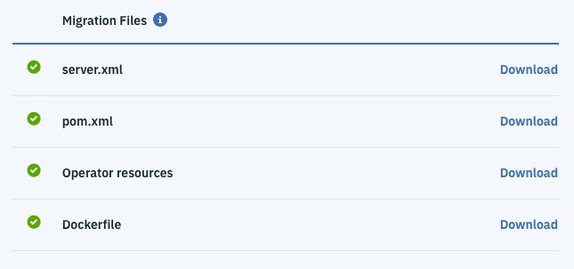

  * ```server.xml``` - Transformation Advisor extracts most of the configuration from traditional WebSphere and generates a server.xml for Liberty to use.
  * ```Dockerfile``` - Used to create the Docker image which includes the application, and configuration for Liberty.
  * ```Operator resources``` - Used in Red Hat OpenShift to deploy the application using the OpenLiberty operator.
  * ```pom.xml``` - Used for maven builds, particularly useful if the application does not already employ build scripts.

- Create a new directory in the lab4 folder

    ```bash
    cd ..
    mkdir liberty
    cd liberty
    ```

- Download `server.xml` and `Dockerfile` from Transformation Advisor and place them in `lab4/liberty`

- If Dockerfile gets renamed to `Dockerfile.txt` during the download, rename it to `Dockerfile` without the `.txt` extension

- Copy `plantsbywebspherev8.ear` from `lab4/binary/application` and place it in `liberty/binary/application`

- Copy `db2jcc.jar` and `db2jcc_licence_cu.jar` from
`lab4/binary/lib` and place them in `lab4/liberty/binary/lib`

- Issue the command `ls -laR` in the `liberty` folder and validate your structure is as shown below:

    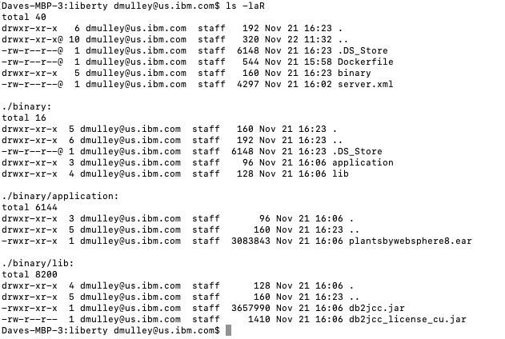

- Open the `server.xml` file in your favorite editor and make the following changes:

  * change the `jpa-2.1` feature to `jpa-2.0`

  * uncomment the `dataSources` and `jdbcDrivers`

  * change the DB2 driver locations to be `/config/lib/db2jcc.jar` and `/config/lib/db2jcc_licence_cu.jar` for the `DB2_Universal_JDBC_Driver_Provider` and the `DB2_Universal_JDBC_Driver_Provider_(XA)` jdbcDrivers. (THERE ARE TWO SETS OF FILE NAMES THAT MUST BE CHANGED)

  * add `user="db2inst1" password="db2Pa2359w0rd123" transactional="false"` to the `properties.db2.jcc` line of the `PlantsByWebSphereDataSourceNONJTA` datasource

  * add `user="db2inst1" password="db2Pa2359w0rd123" transactional="true"` to the `properties.db2.jcc` line of the `PlantsByWebSphereDataSource` datasource

  * change `location="plantsbywebsphere8-1.0.0.war" name="PlantsByWebSphere8" type="war"/>` to the `location="plantsbywebsphere8.ear" name="PlantsByWebSphere8" type="ear"/>`

  * save your changes

  The modified `server.xml` should look like the one shown below:

    ```
    <?xml version="1.0" encoding="UTF-8"?><!--Generated by IBM TransformationAdvisor
    Thu Nov 21 20:49:39 GMT 2019--><server>
    <!--These elements have been identified from this application's configuration.-->
      <featureManager>
        <feature>beanValidation-1.1</feature>
        <feature>cdi-1.2</feature>
        <feature>ejbLite-3.2</feature>
        <feature>el-3.0</feature>
        <feature>javaMail-1.5</feature>
        <feature>jndi-1.0</feature>
        <feature>jpa-2.0</feature>
        <feature>jsf-2.2</feature>
        <feature>jsp-2.3</feature>
        <feature>servlet-3.1</feature>
      </featureManager>
      <!-- <variable name="DERBY_JDBC_DRIVER_PATH" value="${WAS_INSTALL_ROOT}/derby/lib"/> -->
      <httpEndpoint host="*" httpPort="9080" httpsPort="9443" id="defaultHttpEndpoint"/>
      <!-- <variable name="DB2UNIVERSAL_JDBC_DRIVER_NATIVEPATH" value=""/> -->
      <variable name="DERBY_JDBC_DRIVER_PATH" value="${shared.config.dir}/lib/global"/>
      <variable name="DB2UNIVERSAL_JDBC_DRIVER_NATIVEPATH" value="${shared.config.dir}/lib/global"/>
      <applicationManager autoExpand="true"/>
      <!--These elements are from the profile level configuration. Not all of them may be necessary for your application.-->
      <dataSource containerAuthDataRef="DefaultNode01/PlantsAuthAlias" id="PlantsByWebSphereDataSourceNONJTA" jdbcDriverRef="DB2_Universal_JDBC_Driver_Provider" jndiName="jdbc/PlantsByWebSphereDataSourceNONJTA">
        <properties.db2.jcc user="db2inst1" password="db2Pa2359w0rd123" transactional="false" beginTranForResultSetScrollingAPIs="false" beginTranForVendorAPIs="false" connectionSharing="1" databaseName="PLANTSDB" enableClientInformation="false" enableMultithreadedAccessDetection="false" errorDetectionModel="ExceptionMapping" jmsOnePhaseOptimization="false" name="PlantsByWebSphereDataSourceNONJTA" nonTransactionalDataSource="false" portNumber="30465" preTestSQLString="SELECT CURRENT SQLID FROM SYSIBM.SYSDUMMY1" propagateClientIdentityUsingTrustedContext="false" reauthentication="false" retrieveMessagesFromServerOnGetMessage="true" serverName="52.117.164.118" traceLevel="-1" unbindClientRerouteListFromJndi="false" useTransactionRedirect="false" validateNewConnection="false" validateNewConnectionRetryCount="100" validateNewConnectionRetryInterval="3"/>
        <connectionManager agedTimeout="0" connectionTimeout="180" maxIdleTime="1800" maxPoolSize="10" minPoolSize="0" reapTime="180"/>
      </dataSource>
      <dataSource containerAuthDataRef="DefaultNode01/PlantsAuthAlias" id="PlantsByWebSphereDataSource" jdbcDriverRef="DB2_Universal_JDBC_Driver_Provider_(XA)" jndiName="jdbc/PlantsByWebSphereDataSource">
        <properties.db2.jcc user="db2inst1" password="db2Pa2359w0rd123" transactional="true" beginTranForResultSetScrollingAPIs="false" beginTranForVendorAPIs="false" connectionSharing="1" databaseName="PLANTSDB" enableClientInformation="false" enableMultithreadedAccessDetection="false" errorDetectionModel="ExceptionMapping" name="PlantsByWebSphereDataSource" nonTransactionalDataSource="false" portNumber="30465" preTestSQLString="SELECT CURRENT SQLID FROM SYSIBM.SYSDUMMY1" propagateClientIdentityUsingTrustedContext="false" reauthentication="false" retrieveMessagesFromServerOnGetMessage="false" serverName="52.117.164.118" traceLevel="-1" unbindClientRerouteListFromJndi="false" useTransactionRedirect="false" validateNewConnection="false" validateNewConnectionRetryCount="100" validateNewConnectionRetryInterval="3"/>
        <connectionManager agedTimeout="0" connectionTimeout="180" maxIdleTime="1800" maxPoolSize="10" minPoolSize="0" reapTime="180"/>
      </dataSource>
      <jdbcDriver id="DB2_Universal_JDBC_Driver_Provider" javax.sql.DataSource="com.ibm.db2.jcc.DB2ConnectionPoolDataSource">
          <library>
              <file name="/config/lib/db2jcc.jar"/>
              <file name="/config/lib/db2jcc_license_cu.jar"/>
          </library>
      </jdbcDriver>
      <jdbcDriver id="DB2_Universal_JDBC_Driver_Provider_(XA)" javax.sql.DataSource="com.ibm.db2.jcc.DB2XADataSource">
          <library>
              <file name="/config/lib/db2jcc.jar"/>
              <file name="/config/lib/db2jcc_license_cu.jar"/>
          </library>
      </jdbcDriver>
      <authData id="DefaultNode01/PlantsAuthAlias" password="???" user="db2inst1"/>
      <application id="PlantsByWebSphere8" location="plantsbywebsphere8.ear" name="PlantsByWebSphere8" type="ear"/>
    </server>
    ```

- Review the generated Dockerfile `liberty/Dockerfile` in your favorite editor. Note that this Dockerfile expects the maven build to be triggered as part of this Docker build and then the generated war is copied to the Liberty runtime.

- Given that we aren't going to build the application in this way we are going to replace the entire contents of the Dockerfile as shown below:

    ```
    FROM ibmcom/websphere-liberty:webProfile7-ubi-min-amd64

    ARG SSL=true

    ARG MP_MONITORING=true
    ARG HTTP_ENDPOINT=false

    COPY ./server.xml /config
    COPY ./binary/application/* /config/apps/
    RUN mkdir /config/lib
    COPY ./binary/lib/* /config/lib/

    USER root
    RUN configure.sh
    USER 1001

    # Upgrade to production license if URL to JAR provided
    ARG LICENSE_JAR_URL
    RUN \
       if [ $LICENSE_JAR_URL ]; then \
         wget $LICENSE_JAR_URL -O /tmp/license.jar \
         && java -jar /tmp/license.jar -acceptLicense /opt/ibm \
         && rm /tmp/license.jar; \
       fi

    ```

### Run PlantsByWebSphere on Liberty
Now you are ready to build and run the Docker image that contains WebSphere Liberty and the PlantsByWebSphere application.

- Build the image using the following command

    ```
    docker build -t plantsbyliberty .
    ```

- Check the size of the newly created image and note that it is much smaller that the traditional WebSphere image and more `cloud-ready`

    ```
    docker images | grep plantsbyliberty

    ```

- Run an instance of the new container using the following command:

    ```
    docker run -d -p 9080:9080 -p 9443:9443 --name plantsbyliberty plantsbyliberty
    ```

- Tail the logs for the Docker container and wait for the `CWWKT0016I: Web application available (default_host): http://0c59e31137ff:9080/PlantsByWebSphere/` message to be displayed

- Open browser to http://localhost:9080/PlantsByWebSphere and confirm the app working as expected with the DB2 data by clicking the `Flowers` link.

    

- Stop and remove the Docker container using the following commands:

    ```bash
    docker stop plantsbyliberty
    docker rm plantsbyliberty
    ```

That's it. You now have this application running on Liberty in a Container. For next steps you would likely push this image to a Red Hat OpenShift Image Repository and deploy the application using the OpenLiberty Operator. If the client was interested in adding CI/CD automation you may also go back to the source code and automate CI and then automate deployment using CD.

## Summary

You have now completed the first of two AppMod exercises. This exercise demonstrated a simple `runtime` modernization scenario.
