<PageDescription>

An example of a "minimum code changes" modernization of an existing traditional WebSphere ND application to Liberty running in a Docker Container.

</PageDescription>

<AnchorLinks>
  <AnchorLink to="#environment-setup">Environment Setup</AnchorLink>
  <AnchorLink to="#analyze-the-scan-results">Analyze the Scan Results</AnchorLink>
  <AnchorLink to="#make-the-code-changes">Make the code changes</AnchorLink>
  <AnchorLink to="#run-the-modified-application">Run the modified Application</AnchorLink>
</AnchorLinks>

## Business Need

Just as with Application Modernization Exercise 1, Exercise 2 is an example of `runtime modernization` which doesn't address the technical debt in the application but does remove the technical debt provided by the Application Server itself. In this exercise you will learn the skills to make minor code changes to applications to move them from traditional WebSphere ND to "the Cloud". While this isn't the typical way that the Garage wants to engage with customers, it is going to be part of the overall modernization of their legacy Java portfolio and an important skill for you to have. You will use tools such as IBM Cloud Transformation Advisor and the Eclipse based WebSphere Migration Toolkit.

## [MVP Statement](https://www.ibm.com/garage/method/practices/think/practice_minimum_viable_product/)

- **Who** Operations teams are tasked with moving from traditional WebSphere ND to "the Cloud" and have access to developers to make some minor changes to legacy Java applications to move them to the Cloud.

- **What** This application is used by a small number of customers and will be replaced in 18 months with a new version. The operations team needs to move to "the Cloud" now and wants to standardize on Docker containers that they can run anywhere.

- **Wow** With a few simple steps you can move an application and the associated configuration to a Liberty runtime in a Docker container with some minor code changes. This is something that can be repeated over and over in a factory type engagement.

## [Architecture]()

Customer Order Services is a simple legacy monolith with a backend database (DB2).

## Technical Requirements
- This modernization exercise has the following requirements:

    - Minor code changes
    - The target is to get the application running on Liberty in a Docker container on your laptop
    - The DB2 database will remain in it's current location (it is deployed in a container in the MOOC4 cluster exposed with a NodePort)

## Guide
- This exercise has the following steps

    - Import provided scan results in to IBM Cloud Transformation Advisor running in your MOOC Red Hat OpenShift cluster.
    - Review the IBM Cloud Transformation Advisor analysis
    - Load the application source code in to Eclipse
    - Use the WebSphere Migration Toolkit to support simple code changes
    - Configure WebSphere Liberty to run the Application
    - Unit Test and fix the Application

## Solution Links

### Environment Setup

#### Install WebSphere Liberty Tools

- Validate that you have JDK 8 (which is typically found in `/Library/Java/JavaVirtualMachines/`)

    - If you don't have JDK 8 you can get it from here: https://www.oracle.com/technetwork/java/javase/downloads/jdk8-downloads-2133151.html

- Download and unzip Liberty from here: https://developer.ibm.com/wasdev/downloads/#asset/runtimes-wlp-javaee8

- Install Eclipse from here: https://www.eclipse.org/downloads/download.php?file=/technology/epp/downloads/release/2019-09/R/eclipse-jee-2019-09-R-macosx-cocoa-x86_64.dmg

- Use the `Eclipse Marketplace` to install `IBM WebSphere Application Server Migration Toolkit` and `IBM Liberty Development Tools 19.0.0.9` and restart Eclipse

### Analyze the Scan Results
In this section you will upload the results from the IBM Cloud Transformation Advisor Data Collector to the IBM Cloud Transformation Advisor UI and analyze the findings.

- Using your `IBM Garage for Cloud - Development Cluster Dashboard`, navigate to `Transformation Advisor`

    

- You may receive an `Authentication endpoint is broken at the moment.` message. Copy the `URL` to a new `incognito` browser session to solve the problem

- Use your existing workspace named `AppMod_{your initials}`

- Add a new Collection named `Lab2`

In AppMod Exercise 1 you cloned the https://github.com/ibm-cloud-architecture/icp-dev-workshop.git repository. In the `lab5` folder you will find a `lab5.zip` file that contains the IBM Cloud Transformation Advisor Data Collector results.

- Click `Upload data` and provide `lab5.zip`. After a few moments the results will be displayed as shown below:

    

- Click on the `CustomerOrderServicesApp.ear` and review the detailed results. Review the `severe` results and use the `Analysis` report to locate the files you'll need to change.

### Make the code changes

#### Download the application code and import it into Eclipse

- Clone the repository to your machine

    ```bash
    git clone https://github.com/ibm-cloud-architecture/refarch-jee-customerorder.git
    ```

- Checkout the source code:

    ```bash
    cd refarch-jee-customerorder
    git checkout was70-dev
    ```

- Open eclipse, create a workspace and close the `Welcome` screen

- In the `Servers` view, create a new Server

- Select `IBM --> Liberty Server` and click Next

  

- Set the `installation path` to the location where you unzipped the Liberty download earlier and then select a `JDK 8` for the `JRE`

  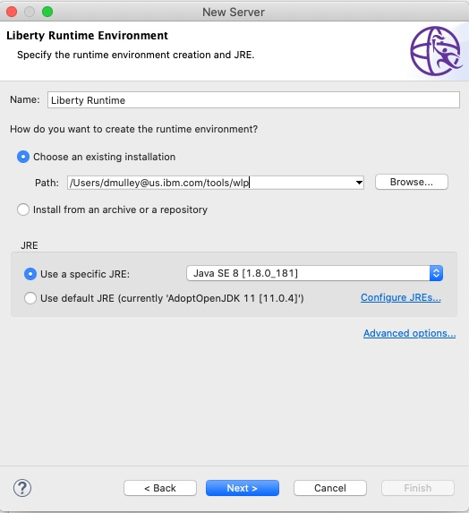

- Change the `Server Name` to `Lab5` and then click Finish

  

- Import the existing projects by:
   * Clicking `File > Import`.
   * In the `General folder`, click `Existing Projects into Workspace`.
   * Click `Next`.
   * In the `Select root directory field`, enter the location that you cloned the repository to such as `/lab5/refarch-jee-customerorder` and click `Browse`.
   * Click `Finish`

   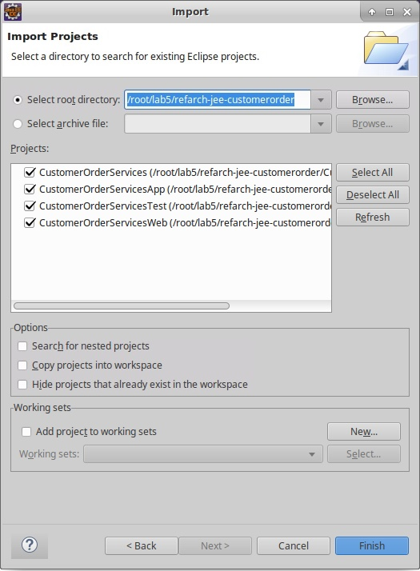

   * In the Workspace Migration window, click `Cancel`. In the migration cancel window, click `OK`.

#### Clean up the development environment
When you create a Liberty development environment, you might need to fix installation paths and development tool versions that differ from the original development environment. When you imported the project to Eclipse, any errors were highlighted with red error marks.


- To view the problems in your workspace, click `Window > Show View > Other > General > Problems`. Click `OK`.

Errors are shown for each of the projects that are related to the build path. In the projects for the new development environment, you need to update the references to the Java and WebSphere libraries which can be done automatically by setting the `Target Runtime`

- Fix the targeted runtime for the application using these steps:

    * Right-click on `CustomerOrderServicesApp` and click Properties.

    * In the Properties window, click `Targeted Runtimes`

    * De-select `WebSphere Application Server traditional V7.0`

    * Select `Liberty Runtime`

    * Click `Apply and Close`

  

- After updating the target runtime, clean and rebuild the entire workspace by clicking `Project > Clean`. Make sure that Clean all projects is selected and click `OK`.

- Look at the Problems view again:

    

- You resolved several problems, but a few problems still exist. In this case, you want to fix the Xpath is invalid error. To fix that error:

    * Right-click the `CustomerOrderServicesWeb` project and click `Properties`.

    * In the properties window, click `Validation`

    * Scroll to the `XSL Validator` and clear the `Manual` and `Build` options.

    * Click `Apply and Close`.

    

- Clean and rebuild the entire workspace

- Look at the Problems view again:

    

- Java build errors are caused by missing Jackson JARs.  Download missing JARs from Maven:

    * jackson-core-asl-1.9.13.jar (https://mvnrepository.com/artifact/org.codehaus.jackson/jackson-core-asl/1.9.13)

    * jackson-jaxrs-1.9.13.jar (https://mvnrepository.com/artifact/org.codehaus.jackson/jackson-jaxrs/1.9.13)

    * jackson-mapper-asl-1.9.13.jar (https://mvnrepository.com/artifact/org.codehaus.jackson/jackson-mapper-asl/1.9.13)

- Import Jackson jars into the EAR/lib (CustomerOrderServicesApp/lib) directory:

    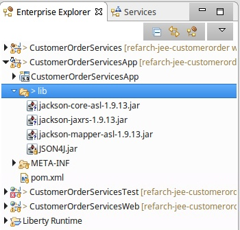

- Java build errors are also in the CustomerOrderServiceTest project due to missing Apache Wink dependency.

    * Download the Apache Wink 1.4 zip file from http://archive.apache.org/dist/wink/1.4.0/

    * unzip the zip file

    * import wink-1.4.jar from apache-wink-1.4/dist into CustomerOrderServiceTest/WebContent/WEB-INF/lib

    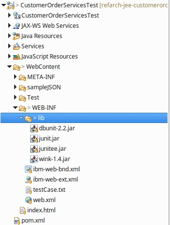

- Now the projects have built without problems.

#### Configure the Software Analyzer
In this task, you configure the Software Analyzer that is part of the WebSphere Application Server Migration Toolkit.

- In your Eclipse environment, click Run > Analysis. The Software Analyzer opens.

- Right-click Software Analyzer and select New. Type a name for the new configuration and click the Rules tab for the configuration.

- From the Rule Set menu, select WebSphere Application Server Version Migration and click Set. The "Rule set configuration" window opens.

    

- Configure the settings so that the appropriate rules, based on your migration requirements, are applied when your applications are analyzed.

    

- When you're finished, click OK.

#### Run the Software Analyzer
- Click Analyze. After you run the Software Analyzer, the Software Analyzer Results tab is shown. The Software Analyzer rules and any errors and warnings are sorted in four categories: Java Code Review, XML File Review, JSP Code Review and File Review. Review each of the categories to determine whether code or configuration changes might be needed.

  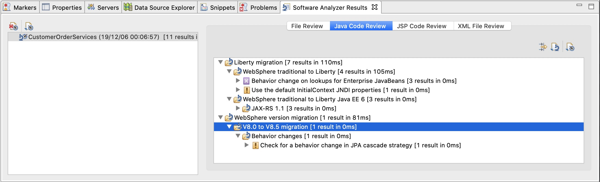

- Click the File Review tab. The tab is empty

- Click the Java Code Review tab. Warnings are shown for these aspects the WebSphere Application Migration Toolkit:

  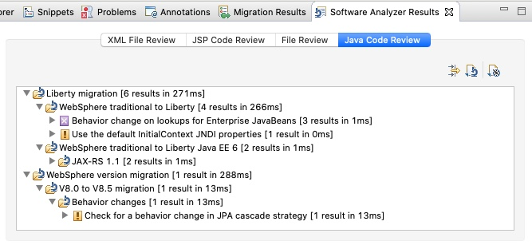

  Let's start with the warning about the default initalContext JNDI properties. View the information about the rule that flagged each error or warning by clicking Help > Show Contextual Help.

  To understand more about the problem, click it and read the Help information.

  Tip: If you need more information, click the detailed help link:

  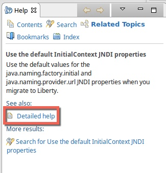

- When you understand what the problem is, double-click the file that the Software Analyzer mentions. Inspect the code and determine whether the warning affects your application.

  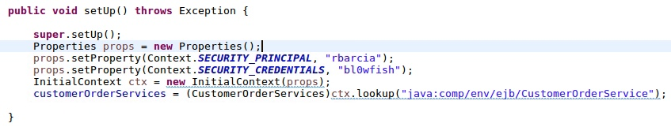

  As you can see from the code, you're not using either of the two default initialContext JNDI properties that this warning mentions. You can ignore this warning and move to the next one.

- Move to the Java Code Review section, which contains information about the use of system-provided third-party APIs.

  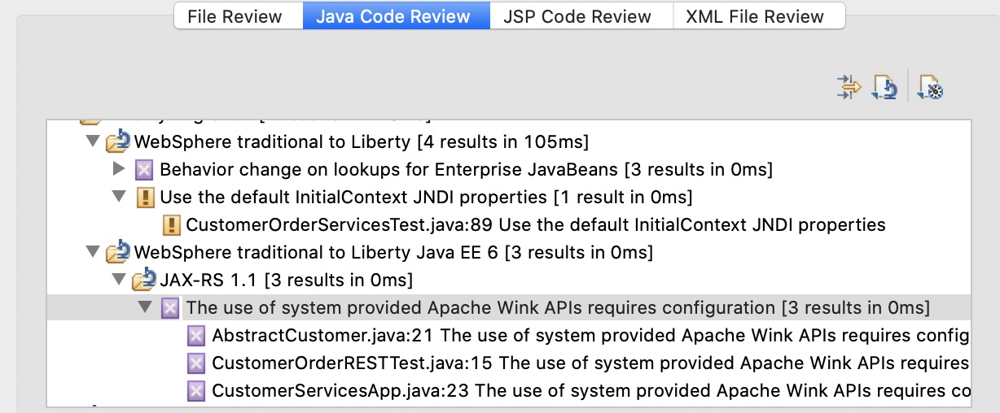

- Click the detailed help and review the information.

  

  The information doesn't contain enough details to determine what the problem is. Click the link in the last sentence to open an IBM Knowledge Center page for WebSphere.

  From the information in IBM Knowledge Center, you learn that you need to configure the Liberty server to give the application access to third-party libraries. To configure the server, you add the following code to the server.xml configuration file. You will add the code in the next task of this tutorial.

  ```bash
  <application id="customerOrderServicesApp"
   name="CustomerOrderServicesApp.ear" type="ear"
   location="${shared.app.dir}/CustomerOrderServicesApp.ear">
  <classloader apiTypeVisibility="spec, ibm-api, third-party"/>
  </application>
  ```

  The code allows the classloader to access the third-party libraries that are included with Liberty. For the application to work correctly, the classloader must be able to access the Jackson and Apache Wink libraries.

- Examime the results related to the behavior change for lookups on Enterprise JavaBeans.

  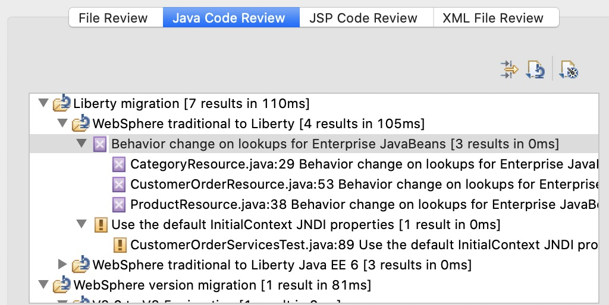

- Review the Detailed Help describing the issue.

- Replace the `ejblocal` lookup for `ProductSearchService` with the lookup below and save your changes:

  ```bash
  java:app/CustomerOrderServices/ProductSearchServiceImpl!org.pwte.example.service.ProductSearchService
  ```

- Replace the `ejblocal` lookup for `CustomerOrderServices` with the lookup below and save your changes:

  ```bash
  java:app/CustomerOrderServices/CustomerOrderServicesImpl!org.pwte.example.service.CustomerOrderServices
  ```

- Examine the last part of the Java Code Review:

  

  As you can see in the details, the change in the JPA cascade strategy is not expected to affect most applications. You can mitigate the cascade strategy by reverting to the previous behavior. In the persistence.xml file, set the openjpa.Compatibility property.

  You can configure newer versions of WebSphere Application Server to run on previous versions of most of the JEE technologies. JPA is one of those technologies. In this exercise we will be using the jpa-2.0 feature, so the warning doesn't affect your application.

- Move to the XML File Review section in the Software Analyzer results. A problem exists due to a behavior change on lookups for Enterprise JavaBeans. Review the detailed help.

- Click the file that is related to the error. Change to the `source` view. Notice that you're using the WebSphere Application Server traditional namespaces for the EJB binding:

  

  You need to change the EJB binding as follows:
  `java:app/CustomerOrderServices/ProductSearchServiceImpl!org.pwte.example.service.ProductSearchService`

  

- Save and close the file.

- Rerun the Software Analysis and ensure that the severe results have been addressed and no longer show in the analysis results.

  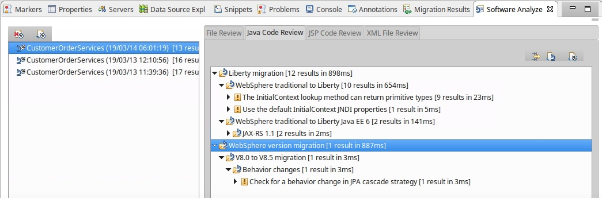

### Run the modified Application

#### Configure the WebSphere Liberty Server
- Open the default `server.xml` file that was created when you created the `Lab5` server earlier.

    - In the `Servers` view. open the `Lab5` server

    - Double-click on 'Server Configuration'

    - Switch to the 'Source' view

- Replace the contents as shown below:

    ```
    <server description="new server">

    <!-- Enable features -->
    <featureManager>
    <feature>jpa-2.0</feature>
    <feature>jaxrs-1.1</feature>
    <feature>jsonp-1.0</feature>
    <feature>servlet-3.1</feature>
    <feature>ejbLite-3.1</feature>
    <feature>appSecurity-2.0</feature>
    <feature>localConnector-1.0</feature>
    <feature>jdbc-4.1</feature>
    <feature>transportSecurity-1.0</feature>
    </featureManager>

    <!-- User and group security definitions -->
    <basicRegistry id="basic" realm="customRealm">
    <user name="rbarcia" password="bl0wfish"/>
    <group name="SecureShopper">
    	<member name="rbarcia"/>
    </group>
    </basicRegistry>

    <keyStore password="passw0rd"></keyStore>

    <authData id="DefaultNode01/CustOrderAuthAlias" password="db2inst1" user="db2inst1"/>

    <jdbcDriver id="DB2" javax.sql.DataSource="com.ibm.db2.jcc.DB2ConnectionPoolDataSource">
    <library>
        <file name="${shared.resource.dir}/lib/db2jcc.jar"/>
        <file name="${shared.resource.dir}/lib/db2jcc_license_cu.jar"/>
    </library>
    </jdbcDriver>

    <jdbcDriver id="DB2_XA" javax.sql.DataSource="com.ibm.db2.jcc.DB2XADataSource">
    <library>
        <file name="${shared.resource.dir}/lib/db2jcc.jar"/>
        <file name="${shared.resource.dir}/lib/db2jcc_license_cu.jar"/>
    </library>
    </jdbcDriver>

    <dataSource id="OrderDS" jdbcDriverRef="DB2_XA" jndiName="jdbc/orderds" transactional="true">
    <properties.db2.jcc databaseName="ORDERDB" serverName="52.117.164.118" portNumber="30605" user="db2inst1" password="db2inst1" />
    <connectionManager agedTimeout="0" connectionTimeout="180" maxIdleTime="1800" maxPoolSize="10" minPoolSize="0" reapTime="180"/>
    </dataSource>

    <!-- To access this server from a remote client add a host attribute to the following element, e.g. host="*" -->
    <httpEndpoint host="*" httpPort="9080" httpsPort="9443" id="defaultHttpEndpoint"/>

    <!-- Automatically expand WAR files and EAR files -->
    <applicationManager autoExpand="true"/>

    <!-- Define application and its classloaders -->
    <application id="customerOrderServicesApp" location="${shared.app.dir}/CustomerOrderServicesApp.ear" name="CustomerOrderServicesApp.ear" type="ear">
    <classloader apiTypeVisibility="spec, ibm-api, third-party"/>
    </application>

    </server>
    ```

- Review the `featureList`, `classLoader`, `basicRegistry` and `dataSource` configuration

- Save the new `server.xml` file.

In AppMod Exercise 1 you cloned the https://github.com/ibm-cloud-architecture/icp-dev-workshop.git repository. In the `lab5` folder you will find a `libs` folder that contains the DB2 drivers.

- Copy the `lib` folder from the `lab5` repo to `<wlp>/usr/shared/resources/lib` (where `<wlp>` is the location that you unzipped Liberty)

  This should create `<wlp>/usr/shared/resources/lib/db2jcc.jar` and `<wlp>/usr/shared/resources/lib/db2jcc_license_cu.jar`

- Export the EAR file from eclipse (we are doing this as there are known issues with running EAR files directly from the Eclipse Workspace)

    - Right-click the CustomerOrderServicesApp project and select Export > EAR file.

    - In the window that opens, set up the project to be exported as an EAR file

    - For the name of the EAR project, type CustomerOrderServicesApp.

    - For the destination, browse to `/opt/liberty/wlp/usr/shared/apps/CustomerOrderServicesApp.ear`.

    - Select the Optimize for a specific server runtime check box and select WebSphere Application Server Liberty from the list.

    - Select the Overwrite existing file check box in case another application already uses the file name that you specified.

    - Click Finish.

- Click the Servers tab. Right-click the `Lab5` server and click Start. The Console tab opens, where you can see the WebSphere Liberty output.

- Note that the server failed to start due to missing older features.

  

- Install the required features.

    - Stop the `Lab5` server

    - At the command line, navigate to the `<wlp>/bin` folder and issue the following command:

    ```bash
    ./installUtility install Lab5
    ```

- Restart the `Lab5` Liberty server in Eclipse

- Find the links for the two web applications that are deployed to WebSphere Liberty. One application is a test project that you can ignore. The other application is the Customer Order Services application, which is accessible at http://localhost:9080/CustomerOrderServicesWeb/. Click that link or copy the link and paste it in a web browser.

  

- You are prompted to log in because you added security for the application in the server.xml file.

  For the user name, type `rbarcia`. For the password, type `bl0wfish`

  After you log in to the application, the catalog is displayed (it may take a few seconds to display)

  

- However, if you look at the Console tab for WebSphere Liberty in Eclipse, errors are shown. Carefully review the errors. A problem exists with the data that is returned from the database.

  

- The problem happens in the loadCustomer method in CustomerOrderServicesImpl.java. Look at that method. The method is trying to return an AbstractCustomer from the database:

  

  The problem is in the AbstractCustomer class. As its name suggests, it's an abstract class, so it won't be instantiated. Look for the classes that extend the abstract class. Those classes are BusinessCustomer and ResidentialCustomer. If you remember the SQL error in the WebSphere Liberty Console log, it was about a value, Y, being returned as an integer. In the Java classes, you can see that some Boolean attributes that get values of Y and N are being returned as integers, causing the SQL exception.

  The reason for this behavior is that the OpenJPA driver treats Booleans differently based on its version. In this case, the OpenJPA driver version that you're using in WebSphere Liberty does not automatically convert Y or N database values into Booleans. As a result, you need to store them as strings and check those strings to return a Boolean value:

  

  

  Save all the changes, export the EAR project to the WebSphere Liberty folder, and restart the server.

- Confirm that no errors are shown for the Customer Order Services application, either in the browser or on the Console tab for WebSphere Liberty in Eclipse.

  

- Stop the WebSphere Liberty server.

That's it. You now have this application running on Liberty in a Container. For next steps you would likely push this image to a Red Hat OpenShift Image Repository and deploy the application using the OpenLiberty Operator. If the client was interested in adding CI/CD automation you may also go back to the source code and automate CI and then automate deployment using CD.

## Summary

You have now completed the second of two AppMod exercises. This exercise demonstrated a `runtime` modernization scenario that required some code changes.
