import Globals from 'gatsby-theme-carbon/src/templates/Globals';

<PageDescription>

Migrate a Java EE app that requires minimum code changes

</PageDescription>

This exercise shows how to handle a "minimum code changes required" modernization of an existing traditional WebSphere Application Server Network Deployment (WebSphere ND) application to WebSphere Liberty running in a Docker container.

This exercise assumes the following:

1. You are using a <Globals name="env" /> that has already been installed.
1. Cloud Pak for Applications has already been installed in the environment.
1. You have Java installed on your laptop, one of the optional [prerequisites](/getting-started/prereqs).
1. You will also install Eclipse on your laptop.

This exercise consists of the following sections:

<AnchorLinks>
  <AnchorLink to="#environment-setup">Environment setup</AnchorLink>
  <AnchorLink to="#analyze-the-scan-results">Analyze the scan results</AnchorLink>
  <AnchorLink to="#migrate-to-websphere-liberty">Migrate to WebSphere Liberty</AnchorLink>
  <AnchorLink to="#run-the-application-on-liberty">Run the application on Liberty</AnchorLink>
</AnchorLinks>

## Business Need

Just as with [Application Modernization - Exercise 1](/practical/appmod-exercise1/), Exercise 2 is an example of [runtime modernization](https://www.ibm.com/cloud/garage/architectures/runtime-modernization-solution/) which doesn't address the technical debt in the application but does remove the technical debt provided by the WebSphere Application Server itself.

In this exercise, you will learn the skills to be able to demonstrate how *some* applications can be moved to Liberty in a Docker container with only minor code changes to the application. We will migrate the application using [IBM Cloud Transformation Advisor](https://www.ibm.com/garage/method/practices/learn/ibm-transformation-advisor) and the Eclipse-based [IBM WebSphere Application Server Migration Toolkit](https://www.ibm.com/developerworks/library/mw-1701-was-migration/index.html) (WAMT). This approach is another strategy for the overall modernization of a legacy Java application portfolio and an important skill to have.

### Project hill

Here's the [hill statement](https://www.ibm.com/garage/method/practices/think/practice_hills/) describing the desired outcome of this migration:

- **Who**: Operations teams are tasked with moving existing Java applications from traditional WebSphere ND to "the Cloud" and have access to developers to make some minor changes to legacy Java applications to move them to the cloud.

- **What**: This is an application that users still need. They consider it good enough as-is: While bug fixes and new features might be desirable, the aren't worth the expense. Or step 1 for making the app more maintainable is moving it to the cloud where it'll be easier to improve it using modern development techniques like continuous deployment. The operations team needs to move to "the Cloud" and wants to standardize on Docker containers that they can run anywhere.

- **Wow**: With a few simple steps, you can move an application and the associated configuration to a Liberty runtime in a Docker container with some minor code changes. This is something that can be repeated over and over on many apps in the portfolio in a factory type engagement.


## Architecture

The original and target architectures for this exercise are the same as they were in the first Application Modernization exercise, but the lab architecture is different.

Customer Order Services is a simple legacy monolith that runs in WebSphere Application Server with a backend database (DB2). The diagram below shows a typical customer environment with IBM HTTP Server and WebSphere Application Server Network Deployment (WebSphere ND) running on Traditional IT along with the application database.

  

The target for the runtime modernization is shown below with the containerized application running on Liberty on OpenShift Container Platform and the application database remaining on traditional IT.

  

For the purposes of this lab exercise, you have been provided the data collector result data from IBM Cloud Transformation Advisor. You will load that into the Transformation Advisor and then analyze it. You will use the WebSphere Migration Toolkit in Eclipse to modify application code until you can run the application without error in a local Liberty environment installed on your laptop.

  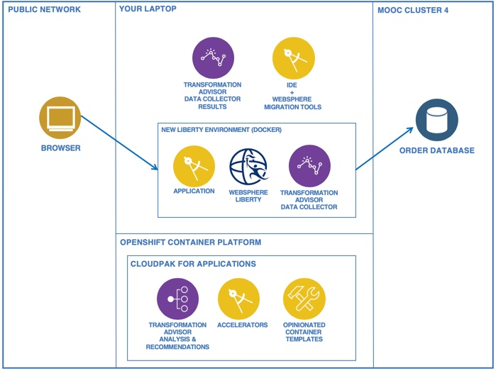

## Technical Requirements

This modernization exercise has the following requirements:
- Minor code changes
- The target is to get the application running on Liberty on your laptop
- The DB2 database will remain in its current location -- It is deployed in a container in the MOOC4 environment, exposed with a NodePort

## Guide
This exercise has the following steps:
- Import provided scan results into IBM Cloud Transformation Advisor running in your team's <Globals name="env" />
- Review the Transformation Advisor analysis
- Load the application source code into Eclipse
- Use the WebSphere Application Server Migration Toolkit (WAMT) to perform simple code changes
- Configure WebSphere Liberty to run the application
- Unit test and fix the application


### Environment setup

For setup, we need to install the WebSphere Liberty development tools.

- Verify that you have JDK 8 installed on your laptop
    - It's typically installed in `/Library/Java/JavaVirtualMachines/` (Mac)
    - Run `echo $JAVA_HOME` to find it
    - Run `java -version` to see the default
    - Run `/usr/libexec/java_home -V` to see all versions installed on your laptop
    - If you don't have JDK 8, install it from [Java SE Development Kit 8 Downloads](https://www.oracle.com/technetwork/java/javase/downloads/jdk8-downloads-2133151.html)

- Download Liberty from [WAS Liberty with Java EE 8 Full Platform](https://developer.ibm.com/wasdev/downloads/#asset/runtimes-wlp-javaee8)
    - This file is named something like `wlp-javaee8-19.0.0.11.zip`
    - We'll refer to this file later as ``{wlp.zip}``

- Install the latest version of Eclipse from [Eclipse Packages](https://www.eclipse.org/downloads/packages/) > Eclipse IDE for Enterprise Java Developers

- Add plugins to Eclipse

    - Start Eclipse, create or select a workspace, and close the Welcome screen

    - In Eclipse, use the [Eclipse Marketplace Client](https://marketplace.eclipse.org/marketplace-client-intro) (Help > Eclipse Marketplace) to install these plugins:
        - [IBM WebSphere Application Server Migration Toolkit](https://marketplace.eclipse.org/content/ibm-websphere-application-server-migration-toolkit)
        - [IBM Liberty Developer Tools](https://marketplace.eclipse.org/content/ibm-liberty-developer-tools) (latest, such as 19.0.0.9)

    - Restart Eclipse


### Analyze the scan results

In this section, you will upload the data collector results to the Transformation Advisor UI and analyze the findings.

- Use the [<Globals name="dashboard" />](/getting-started/dashboard) to open the Transformation Advisor dashboard

    

    - The browser may display the message "Authentication endpoint is broken at the moment."  To solve the problem, open the URL in a new incognito browser tab.

- Use your existing workspace named `AppMod-{initials}`

- Add a new collection named `Lab2`

In AppMod Exercise 1, you cloned the https://github.com/ibm-cloud-architecture/icp-dev-workshop.git repository. Import the collector data from that repo.

- Click `Upload data` and specify the `icp-dev-workshop/lab5/Lab5.zip` file

    After a few moments, the UI will display the Results page.

    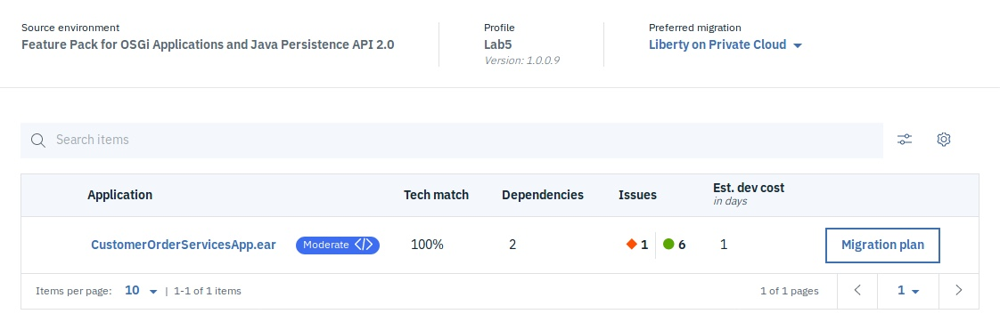

- Click on the `CustomerOrderServicesApp.ear` and review the detailed results

    - Review the Severe results

    - Use the Analysis report to locate the files you'll need to change


### Migrate to WebSphere Liberty

To figure out what we need to do to migrate the app, we need to load the code into Eclipse and run the WMAT analyzer on it.

#### Load the application into Eclipse

Download the application code and import it into Eclipse.

- Start Eclipse, create or select a workspace, and close the Welcome screen

Create a Liberty server in Eclipse named Lab5

- In the Servers view, select New > Server

    - Define a new server

        - Select IBM > Liberty Server as the server type

            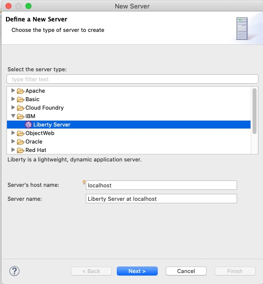

        - Press Next

    - Liberty runtime environment

        - Select Install from an archive or a repository

        - Select a JDK 8 for the JRE

            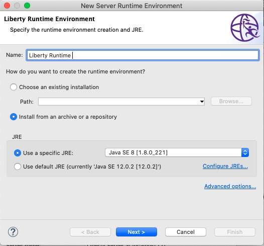

        - Press Next

    - Install runtime environment

        - Specify a destination path where you like Liberty installed, often in a path like `~/tools` or `~/dev`

            We'll refer to this path later as `{wlp}`

        - Select Install a new runtime environment from an archive, and specify the `{wlp.zip}` file you downloaded earlier

        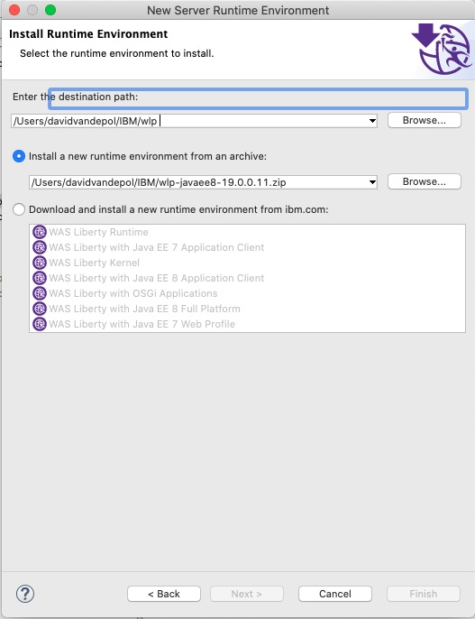

        - (Or, if you have not downloaded the Liberty zip yet, you can: Select Download and install a new runtme environment from ibm.com, and select WAS Liberty with Java EE 8 Full Platform)

        - Press Next

    - Install additional content

        - Select the Java EE 8 Full Platform Bundle

            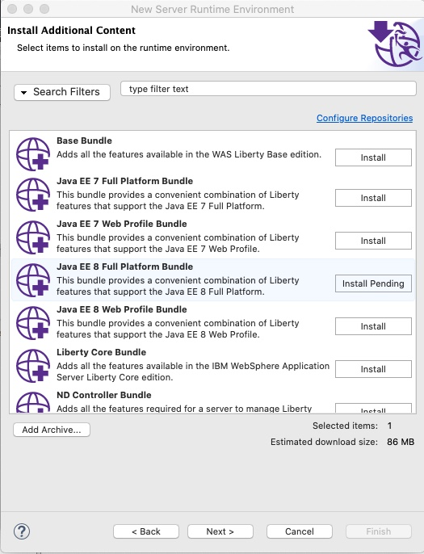

        - Press Next

    - Accept the license and press Next

    - New Liberty server

        - Change the server name to `Lab5`

            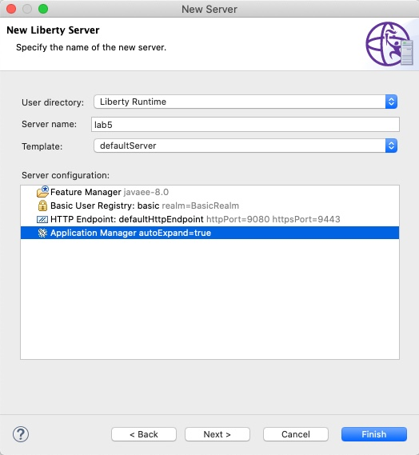

        - Press Finish

Clone the Customer Order Services application and import it into Eclipse.

- Clone the Customer Order Services repository to your machine

    It's https://github.com/ibm-cloud-architecture/refarch-jee-customerorder

    ```bash
    git clone https://github.com/ibm-cloud-architecture/refarch-jee-customerorder.git
    cd refarch-jee-customerorder
    ```

- Checkout the existing branch, was70-dev, that contains the source code

    The master branch doesn't contain the app. The was70-dev branch contains the version of the app for this exercise.

    ```bash
    git checkout was70-dev
    ```

- From the menu bar, select File > Import

    - Select

        - Select General > Existing Projects into Workspace and press Next

    -  Import projects

        - For the root directory, browse to your cloned repository `refarch-jee-customerorder` (in the was70-dev branch)

            Eclipse finds four projects and will import them.

            

        - Press Finish

    -  Workspace Migration

        We don't want the tool to do the migration, we're going to do the migration manually.

        - Press Cancel and confirm OK


#### Clean up the development environment

When you create a Liberty development environment, you might need to fix installation paths and development tool versions that differ from the original development environment. When you imported the project to Eclipse, any errors were highlighted with red error marks.

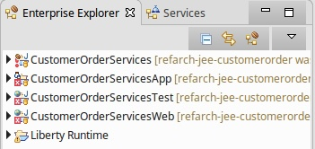

- To view the problems in your workspace, select Window > Show View > Other, select General > Problems, and press Open

Errors are shown for each of the projects that are related to the build path. In the projects for the new development environment, you need to update the references to the Java and WebSphere libraries which can be done automatically by setting the Target Runtime.

- Fix the targeted runtime for the application

    - Right-click on the CustomerOrderServicesApp project and select Properties

    - In the Properties window, select Targeted Runtimes

    - Deselect WebSphere Application Server traditional V7.0

    - Select Liberty Runtime

    

    - Press Apply and Close

After updating the target runtime, clean and rebuild the entire workspace.

- Clean the projects

    - Select Project > Clean

    - Make sure that Clean all projects is selected

    - Press Clean

- Look at the Problems view again

    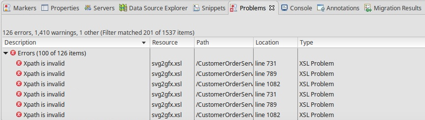

You resolved several problems, but a few problems still exist. In this case, you want to fix the Xpath is invalid error.

- Fix the Xpath

    - Right-click on the CustomerOrderServicesWeb project and select Properties

    - In the properties window, select Validation

    - In the list of validators, in the XSL Validator, clear the Manual and Build options

    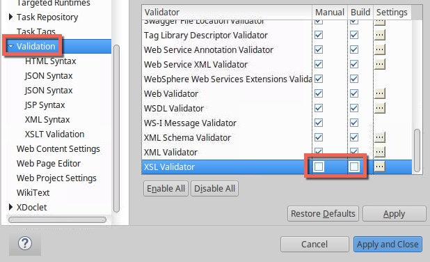

    - Press Apply and Close

- Clean and rebuild all projects in the workspace

- Look at the Problems view again

Now the projects build without problems.


#### Configure the Software Analyzer

In this task, you configure the WAMT Software Analyzer.

- In the Eclipse menu bar, select Run > Analysis... to open the Software Analyzer Configurations dialog

- Right-click on Software Analyzer and select New Configuration

- Type a name for the new configuration such as "CustomerOrderServices"

- On the Rules tab for the new configuration, select the rule set WebSphere Application Server Version Migration and press Set

    

- In the Rule set configuration dialog, select these settings:

    - Source application server:    **WebSphere Application Server V7.0**
    - Target application server:    **Liberty**
    - Target Java EE version:       **Java EE 6**
    - Target cloud runtime:         **None**
    - Source Java version:          **IBM Java 6**
    - Target Java version:          **IBM Java 8**

    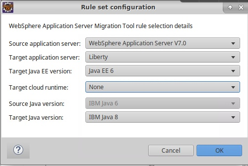

    - Press OK

- Press Apply to finish creating the new configuration

#### Run the Software Analyzer

Now that we've configured a new analysis, run it.

- Still in the Software Analyzer Configurations dialog, select the new configuration and press Analyze

    When the analyzer finishes running, the Software Analyzer Results tab opens in the main Eclipse window.

    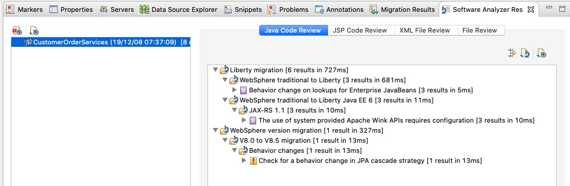

  <InlineNotification kind="info">
  Note: The boxes in the Software Analyzer Results will sometimes not resize correctly. In order to fix this, simply click on another one of the results tabs and then go back to your desired tab and the results box will resize.
  </InlineNotification>

    The Software Analyzer rules and any errors and warnings are sorted in four categories:
    - Java Code Review
    - XML File Review
    - JSP Code Review
    - File Review

Open the Help view for contextual help

- From the Eclipse menu bar, select Help > Show Contextual Help

Review each of the categories to determine whether code or configuration changes might be needed.

- File Review

    The results are empty.

- JSP Code Review

    The results are empty.

- Java Code Review

    Warnings are shown for these aspects the WebSphere Application Migration Toolkit:

    - Behavior change on lookups for Enterprise JavaBeans (3 results)

    - Use of system-provided third-party APIs in JAX-RS (3 results)

    - Behavior change in JPA cascade strategy (1 result)

  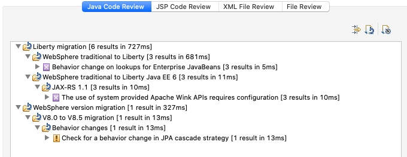

  Let's start with the result in the JAX RS 1.1 section regarding system-provided third-party APIs. View the information about the rule that flagged each error or warning by clicking Help > Show Contextual Help.

  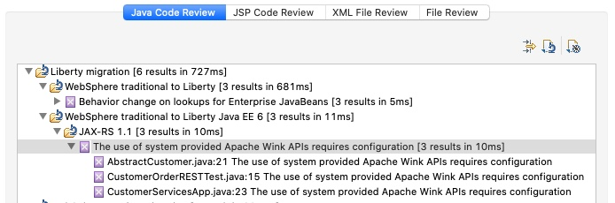

  To understand more about the problem, click it and read the Help information.

  Tip: If you need more information, click the detailed help link:

  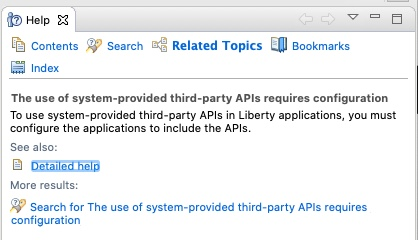

- When you understand what the problem is, click the detailed help and review the information.

  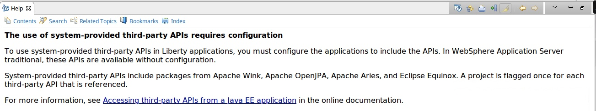

  The information doesn't contain enough details to determine what the problem is. Click the link in the last sentence to open an IBM Knowledge Center page for WebSphere.

  From the information in IBM Knowledge Center, you learn that you need to configure the Liberty server to give the application access to third-party libraries. To configure the server, you add the following code to the server.xml configuration file. You will add the code in the next task of this tutorial.

  ```bash
  <application id="customerOrderServicesApp"
   name="CustomerOrderServicesApp.ear" type="ear"
   location="${shared.app.dir}/CustomerOrderServicesApp.ear">
  <classloader apiTypeVisibility="spec, ibm-api, third-party"/>
  </application>
  ```

  The code allows the classloader to access the third-party libraries that are included with Liberty. For the application to work correctly, the classloader must be able to access the Jackson and Apache Wink libraries.

- Examime the results related to the behavior change for lookups on Enterprise JavaBeans.

  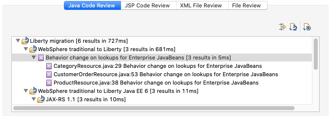

- Review the Detailed Help describing the issue.

- Double click on the `CategoryResource.java` result in the Software Analyzer Results view to go to the line in the file that is causing the issue.

- Replace the `ejblocal` lookup for `ProductSearchService` with the lookup below and save your changes:

  ```bash
  java:app/CustomerOrderServices/ProductSearchServiceImpl!org.pwte.example.service.ProductSearchService
  ```

- Replace the `ejblocal` lookup for `CustomerOrderServices` with the lookup below and save your changes:

  ```bash
  java:app/CustomerOrderServices/CustomerOrderServicesImpl!org.pwte.example.service.CustomerOrderServices
  ```

- Examine the last part of the Java Code Review:

  

  As you can see in the details, the change in the JPA cascade strategy is not expected to affect most applications. You can mitigate the cascade strategy by reverting to the previous behavior. In the persistence.xml file, set the openjpa.Compatibility property.

  You can configure newer versions of WebSphere Application Server to run on previous versions of most of the JEE technologies. JPA is one of those technologies. In this exercise we will be using the jpa-2.0 feature, so the warning doesn't affect your application.

- Move to the XML File Review section in the Software Analyzer results. A problem exists due to a behavior change on lookups for Enterprise JavaBeans. Review the detailed help.

- Click the file that is related to the error. Change to the `source` view. Notice that you're using the WebSphere Application Server traditional namespaces for the EJB binding:

  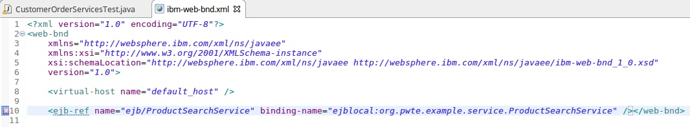

  You need to change the EJB binding as follows:

  ```bash
  java:app/CustomerOrderServices/ProductSearchServiceImpl!org.pwte.example.service.ProductSearchService
  ```

  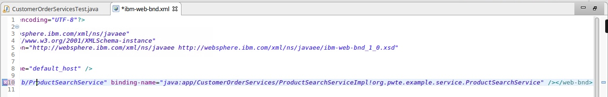

- Save and close the file.

- Rerun the Software Analysis and ensure that the severe results have been addressed and no longer show in the analysis results.

  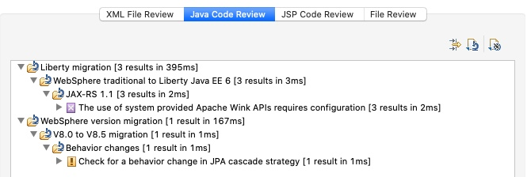


### Run the application on Liberty

#### Configure the WebSphere Liberty Server
- Open the default `server.xml` file that was created when you created the `Lab5` server earlier.

    - In the `Servers` view. open the `Lab5` server

    - Double-click on 'Server Configuration'

    - Switch to the 'Source' view

- Replace the contents as shown below:

    ```
    <server description="new server">

    <!-- Enable features -->
    <featureManager>
    <feature>jpa-2.0</feature>
    <feature>jaxrs-1.1</feature>
    <feature>jsonp-1.0</feature>
    <feature>servlet-3.1</feature>
    <feature>ejbLite-3.1</feature>
    <feature>appSecurity-2.0</feature>
    <feature>localConnector-1.0</feature>
    <feature>jdbc-4.1</feature>
    <feature>transportSecurity-1.0</feature>
    </featureManager>

    <!-- User and group security definitions -->
    <basicRegistry id="basic" realm="customRealm">
    <user name="rbarcia" password="bl0wfish"/>
    <group name="SecureShopper">
    	<member name="rbarcia"/>
    </group>
    </basicRegistry>

    <keyStore password="passw0rd"></keyStore>

    <authData id="DefaultNode01/CustOrderAuthAlias" password="db2inst1" user="db2inst1"/>

    <jdbcDriver id="DB2" javax.sql.DataSource="com.ibm.db2.jcc.DB2ConnectionPoolDataSource">
    <library>
        <file name="${shared.resource.dir}/libs/db2jcc.jar"/>
        <file name="${shared.resource.dir}/libs/db2jcc_license_cu.jar"/>
    </library>
    </jdbcDriver>

    <jdbcDriver id="DB2_XA" javax.sql.DataSource="com.ibm.db2.jcc.DB2XADataSource">
    <library>
        <file name="${shared.resource.dir}/libs/db2jcc.jar"/>
        <file name="${shared.resource.dir}/libs/db2jcc_license_cu.jar"/>
    </library>
    </jdbcDriver>

    <dataSource id="OrderDS" jdbcDriverRef="DB2_XA" jndiName="jdbc/orderds" transactional="true">
    <properties.db2.jcc databaseName="ORDERDB" serverName="169.62.104.36" portNumber="31777" user="db2inst1" password="db2inst1" />
    <connectionManager agedTimeout="0" connectionTimeout="180" maxIdleTime="1800" maxPoolSize="10" minPoolSize="0" reapTime="180"/>
    </dataSource>

    <!-- To access this server from a remote client add a host attribute to the following element, e.g. host="*" -->
    <httpEndpoint host="*" httpPort="9080" httpsPort="9443" id="defaultHttpEndpoint"/>

    <!-- Automatically expand WAR files and EAR files -->
    <applicationManager autoExpand="true"/>

    <!-- Define application and its classloaders -->
    <application id="customerOrderServicesApp" location="${shared.app.dir}/CustomerOrderServicesApp.ear" name="CustomerOrderServicesApp.ear" type="ear">
    <classloader apiTypeVisibility="spec, ibm-api, third-party"/>
    </application>

    </server>
    ```

- Review the `featureList`, `classLoader`, `basicRegistry` and `dataSource` configuration.

<InlineNotification kind="info">

**Note:** The DB2 database used by this application is at `169.62.104.36` on port `31777`

</InlineNotification>

- Save the new `server.xml` file.

In AppMod Exercise 1 you cloned the https://github.com/ibm-cloud-architecture/icp-dev-workshop.git repository. In the `lab5` folder you will find a `libs` folder that contains the DB2 drivers.

- Copy the `libs` folder from the `lab5` repo to `{wlp}/usr/shared/resources/libs` (where `{wlp}` is the location that you unzipped Liberty)

  This should create `{wlp}/usr/shared/resources/libs/db2jcc.jar` and `{wlp}/usr/shared/resources/libs/db2jcc_license_cu.jar`

- Export the EAR file from eclipse (we are doing this as there are known issues with running EAR files directly from the Eclipse Workspace)

    - Right-click the CustomerOrderServicesApp project and select Export > EAR file.

    - In the window that opens, set up the project to be exported as an EAR file

    - For the name of the EAR project, type CustomerOrderServicesApp.

    - For the destination, browse to `{wlp}/usr/shared/apps/CustomerOrderServicesApp.ear`.

    - Select the Optimize for a specific server runtime check box and select WebSphere Application Server Liberty from the list.

    - Select the Overwrite existing file check box in case another application already uses the file name that you specified.

    - Click Finish.

- Click the Servers tab. Right-click the `Lab5` server and click Start. The Console tab opens, where you can see the WebSphere Liberty output.

- Note that the server contained error messages at startup time due to missing older features.

  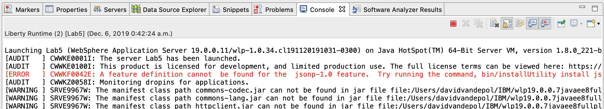

- Install the required features.

    - Stop the `Lab5` server

    - At the command line, navigate to the `{wlp}/bin` folder and issue the following command:

    ```bash
    ./installUtility install Lab5
    ```

- Restart the `Lab5` Liberty server in Eclipse

- Find the links for the two web applications that are deployed to WebSphere Liberty. One application is a test project that you can ignore. The other application is the Customer Order Services application, which is accessible at http://localhost:9080/CustomerOrderServicesWeb/. Click that link or copy the link and paste it in a web browser.

  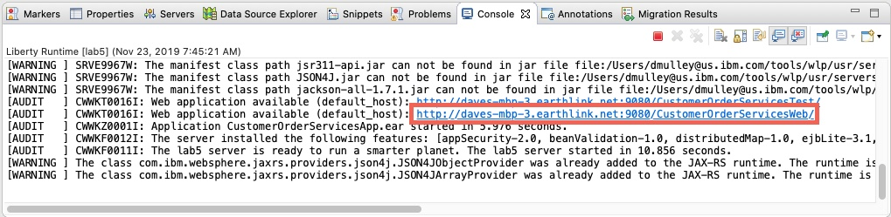

- You are prompted to log in because you added security for the application in the server.xml file.

  For the user name, type `rbarcia`. For the password, type `bl0wfish`

  After you log in to the application, the catalog is displayed (it may take a few seconds to display)

  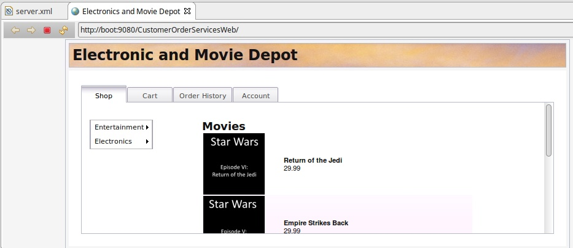

- However, if you look at the Console tab for WebSphere Liberty in Eclipse, errors are shown. Carefully review the errors. A problem exists with the data that is returned from the database.

  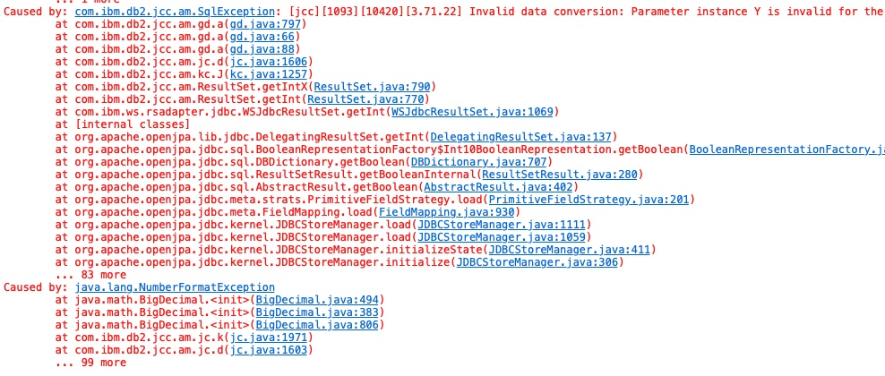

- The problem happens in the loadCustomer method in CustomerOrderServicesImpl.java. Look at that method. The method is trying to return an AbstractCustomer from the database:

  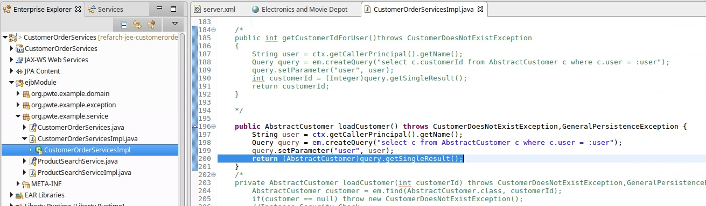

  The problem is in the AbstractCustomer class. As its name suggests, it's an abstract class, so it won't be instantiated. Look for the classes that extend the abstract class. Those classes are BusinessCustomer and ResidentialCustomer. If you remember the SQL error in the WebSphere Liberty Console log, it was about a value, Y, being returned as an integer. In the Java classes, you can see that some Boolean attributes that get values of Y and N are being returned as integers, causing the SQL exception.

  The reason for this behavior is that the OpenJPA driver treats Booleans differently based on its version. In this case, the OpenJPA driver version that you're using in WebSphere Liberty does not automatically convert Y or N database values into Booleans. As a result, you need to store them as strings and check those strings to return a Boolean value:

  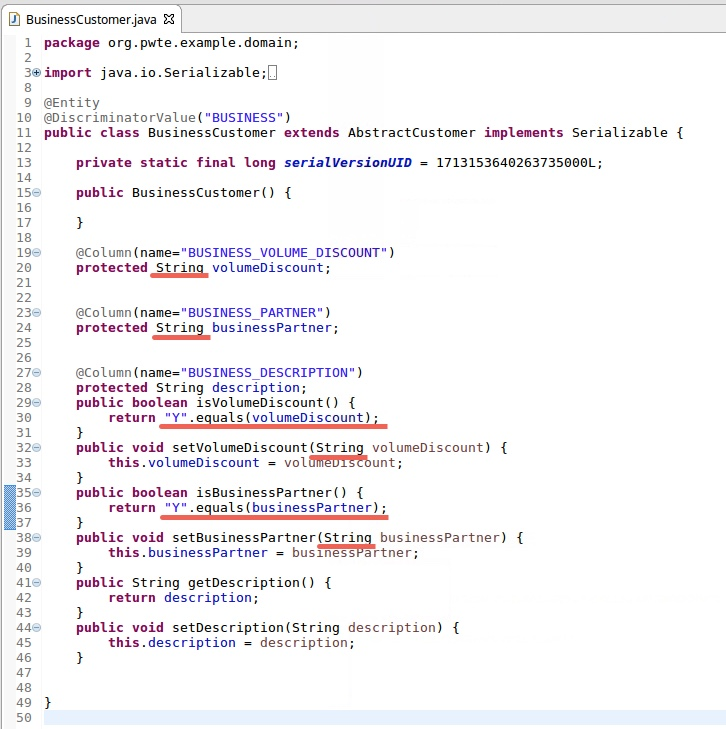

  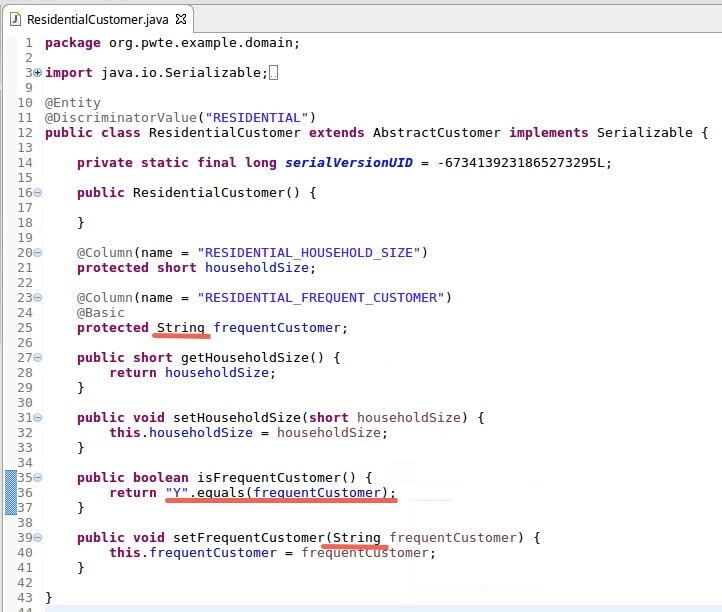

  Save all the changes, export the EAR project to the WebSphere Liberty folder, and restart the server.

- Confirm that no errors are shown for the Customer Order Services application, either in the browser or on the Console tab for WebSphere Liberty in Eclipse.

  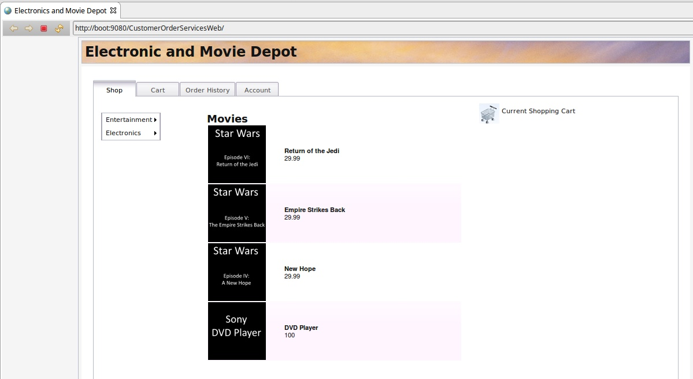

- Stop the WebSphere Liberty server.

### Extra credit

This extra credit section is deliberately vague and requires that you use the skills that you have acquired in Lab 1 and in previous parts of the MOOC

- Containerize the application. Use your experience from Lab 1 to build a Dockerfile with the application, server.xml and DB2 drivers. You may want to move the application and DB2 drivers from the `shared` folders to the same locations that you used in Lab 1 and update your server.xml accordingly

- Expose the DB2 URL, Port, UserID and Password as Environment Variables and inject them in to the container at start up. See the example in the "Environment specific configuration" section in [this article](https://medium.com/@davemulley/what-are-the-minimum-changes-i-should-make-to-my-websphere-application-before-deploying-to-a8418ca8f871)

- Configure a CI/CD pipeline to automate the build, test and deployment process for the application.

## Summary

You have now completed the second of two AppMod exercises. This exercise demonstrated a `runtime` modernization scenario that required some code changes.
