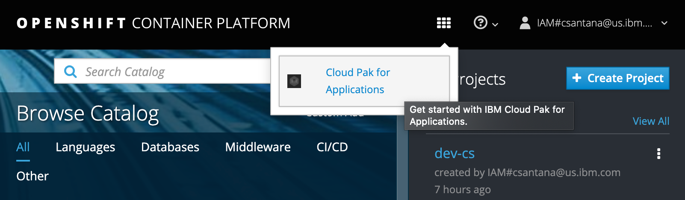
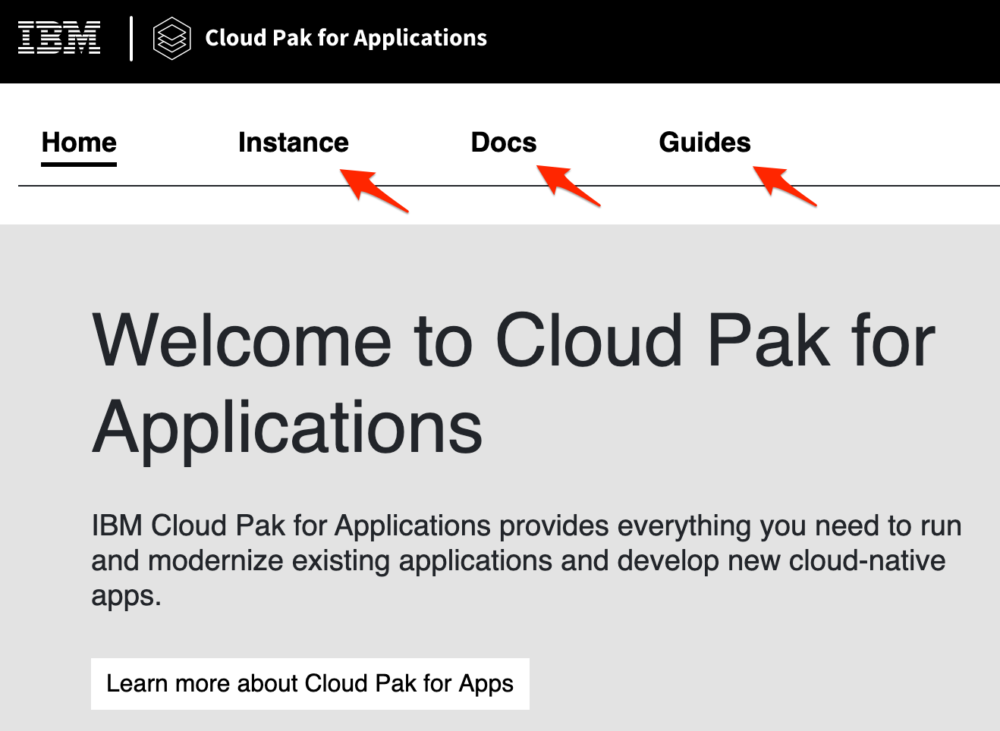
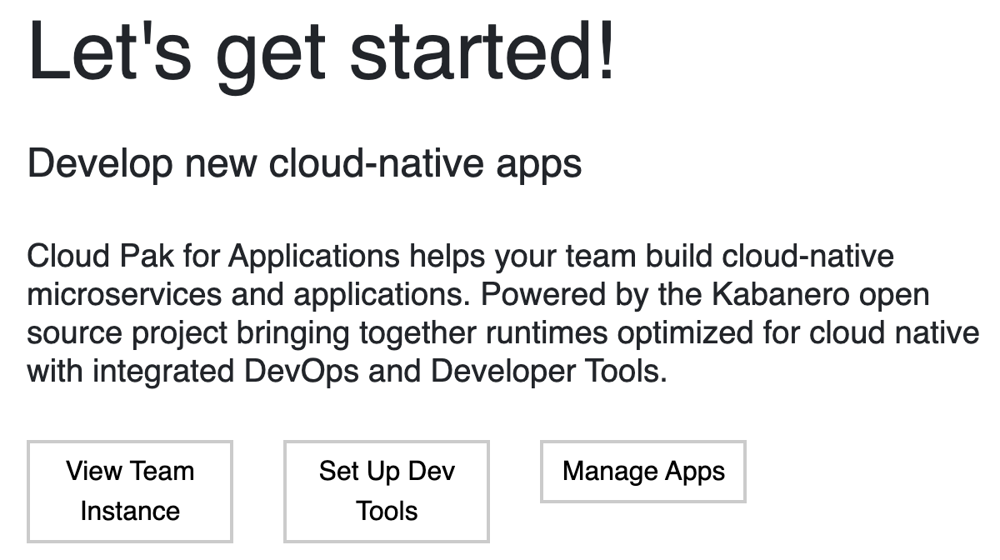
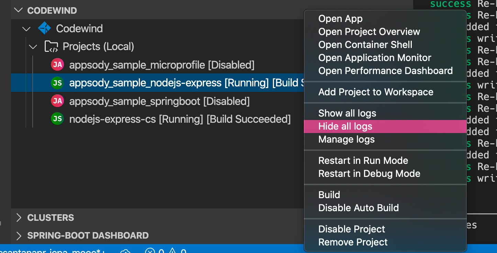
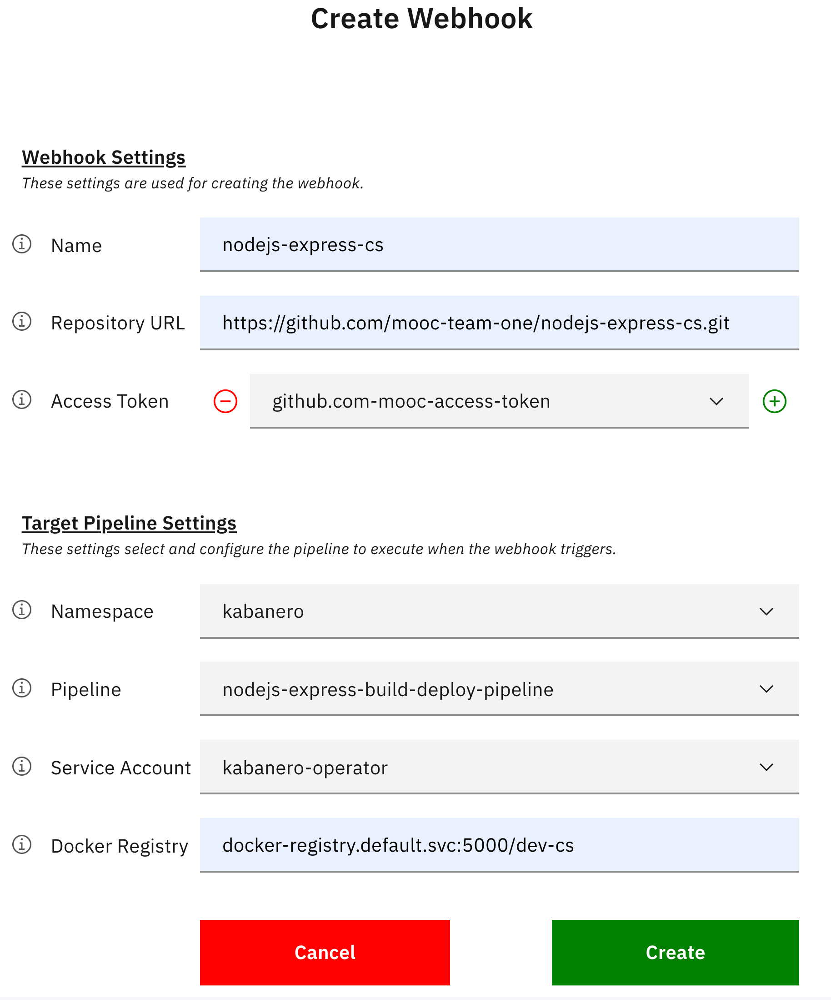
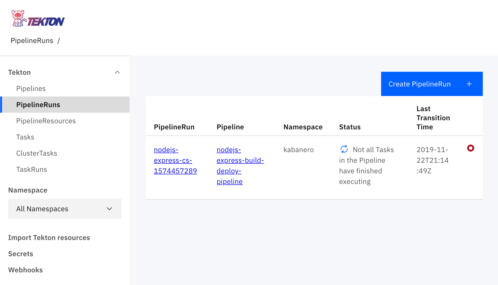

import Globals from 'gatsby-theme-carbon/src/templates/Globals';

<PageDescription>

Use IBM Cloud Pak for Applications to build new cloud-native applications

</PageDescription>

This guide assumes the following:

1. You are using a <Globals name="env" /> that has already been installed.
1. Cloud Pak for Applications has already been installed in the environment.

This guide consists of the following sections:

<AnchorLinks>
  <AnchorLink to="#cp4apps-dashboard">CP4Apps Dashboard</AnchorLink>
  <AnchorLink to="#cp4apps-dev-tools">CP4Apps Dev Tools</AnchorLink>
  <AnchorLink to="#create-a-new-app-using-the-appsody-cli">Create a new app using the Appsody CLI</AnchorLink>
  <AnchorLink to="#create-a-new-app-using-codewind">Create a new app using Codewind</AnchorLink>
  <AnchorLink to="#build-an-app-with-a-tekton-pipeline">Build an app with a Tekton pipeline</AnchorLink>
  <AnchorLink to="#scale-to-zero-serverless">Scale to zero with Serverless</AnchorLink>
</AnchorLinks>


## CP4Apps dashboard

Open the Cloud Pak for Applications dashboard.

- Open the OpenShift web console

- Click on the App Launcher and select "Cloud Pak for Applications"

    

In the CP4Apps dashboard, familiarize yourself with the console pages.

- Explore the Instance, Docs, and Guides pages

    


## CP4Apps Dev Tools

Set up the dev tools.

- In the CP4Apps dashboard, on the Home page, go to the Let's get started! section

- Press Setup Dev Tools to see the instructions we'll follow below

    

Install Codewind and Appsody.

- [Install Codewind for VS Code IDE](https://www.eclipse.org/codewind/vsc-getting-started.html)

- [Install Codewind for Eclipse IDE](https://www.eclipse.org/codewind/eclipse-getting-started.html)

- [Install the Appsody CLI](https://appsody.dev/docs/getting-started/installation)

We've installed both Codewind and Appsody to show you how to use both. As you'll see, they have many features in common.


## Create a new app using the Appsody CLI

Now that we've installed the Appsody CLI, we'll configure it and use it to implement an app.

### Configure the Appsody CLI

The CP4Apps installation in your OpenShift cluster includes an instance of Kabanero Enterprise. In the CP4Apps dashboard, the Instance page shows details about this Kabanero Enterprise instance. Configure your Appsody CLI to access this instance.

- In the CP4Apps dashboard, go to the Instance page

- In the Collection Hub section, copy the Appsody URL (i.e. {Appsody-URL})

- Add the repository in Kabanero Enterprise to your local Appsody CLI's configuration

    ```bash
    appsody repo add kabanero-0.2.1 {Appsody-URL}
    ```

    For example:

    ```bash
    appsody repo add kabanero-0.2.1 https://github.com/kabanero-io/collections/releases/download/0.2.1/kabanero-index.yaml
    ```

Make the repo in Kabanero Enterprise the default, as shown by the astrix (`*`) in the list of repos.

- Set the default repo and list them

    ```bash
    $ appsody repo set-default kabanero-0.2.1
    $ appsody repo list

    NAME                    URL
    *kabanero-0.2.1         https://github.com/kabanero-io/collections/releases/download/0.2.1/kabanero-index.yaml
    incubator               https://github.com/appsody/stacks/releases/latest/download/incubator-index.yaml
    ```

- List the technology stacks included in the repo

    ```bash
    $ appsody list kabanero-0.2.1

    REPO            ID                      VERSION         TEMPLATES               DESCRIPTION
    kabanero-0.2.1  java-microprofile       0.2.18          *default                Eclipse MicroProfile on Open Liberty & OpenJ9 using Maven
    kabanero-0.2.1  java-spring-boot2       0.3.15          *default, kotlin        Spring Boot using OpenJ9 and Maven
    kabanero-0.2.1  nodejs                  0.2.5           *simple                 Runtime for Node.js applications
    kabanero-0.2.1  nodejs-express          0.2.7           scaffold, *simple       Express web framework for Node.js
    kabanero-0.2.1  nodejs-loopback         0.1.5           *scaffold               LoopBack 4 API Framework for Node.js
    ```

    Notice that the stacks listed are the same as the list of Collections back on the Instance page.


### Create an application

Now that we've configured our Appsody CLI, let's use it to create an application.

Create an application named `nodejs-express-{initials}` using Appsody and the Kabanero Enterprise application stack in our cluster.

- Create an empty project directory named `nodejs-express-{initials}`

    ```bash
    mkdir -p ~/projects/nodejs-express-{initials}
    cd ~/projects/nodejs-express-{initials}
    ```

- Initialize the project
    ```bash
    appsody init kabanero-0.2.1/nodejs-express
    ```

To run the application, you don't need to have node.js or the Java SDK installed on your workstation. The application will run in a container that includes all of the tools.

- Start the application
    ```bash
    appsody run
    ```

Whenever any of the application files are edited, Kabanero Enterprise detects the change and automatically restarts the application.

- Using your favorite editor, edit `app.js`

- Change the response to `Hello Garage`.

Notice that the change is detected and the application automatically restarted.

<InlineNotification>

Each Appsody stack comes with instrumentation that you can access with the following endpoints:
- Application endpoint: http://localhost:3000/
- Health endpoint: http://localhost:3000/health
- Liveness endpoint: http://localhost:3000/live
- Readiness endpoint: http://localhost:3000/ready
- Metrics endpoint: http://localhost:3000/metrics
- Dashboard endpoint: http://localhost:3000/appmetrics-dash (development only)

</InlineNotification>

While the application is running, experiment with using its instrumentation endpoints.

When you're through with the application, stop it.

- Open another shell and switch to the same application directory (e.g. ``~/projects/nodejs-express-{initials}`)`

- Stop the application
    ```bash
    appsody stop
    ```

## Create a new app using Codewind

Now that we've installed the Codewind plugin, we'll configure it and use it to implement an app.

### Configure the Codewind plugin

The CP4Apps installation in your OpenShift cluster includes an instance of Kabanero Enterprise. In the CP4Apps dashboard, the Instance page shows details about this Kabanero Enterprise instance. Configure your Codewind plugin to access this instance.

Set the Collection Hub URL as a Template Source in Codewind:

- If using the VS Code IDE, see [Configuring template sources for VS Code](https://www.eclipse.org/codewind/mdt-vsc-workingwithtemplates.html)

- If using the Eclipse IDE, See [Configuring template sources for Eclipse](https://www.eclipse.org/codewind/mdteclipseworkingwithtemplates.html)


### Create an application

Now that we've configured our Codewind plugin, let's use it to create an application.

Create an application named `nodejs-express-{initials}` using Codewind and the Kabanero Enterprise application stack in our cluster.

- Select Projects (Local), then select New Project

- Select the "Kabanero Node.js Express simple template (Appsody Stacks - kabanero-0.2.1)" template from the list

- Specify a name, such as `nodejs-express-{initials}`

The application will start.

To work with the source code, right click on Projects and select Open CodeWind Workspace.

Experiment with using Codewind to perform actions on your running application.

- In the CodeWind view, right click on your application to see the actions the plugin can perform

    

- Perform each of the actions on your application:
    - Open App
    - Open Project Overview, verify the ports and status
    - Open Container Shell, explore the filesystem
    - Open Application Monitor, use the application and see the traffic metrics
    - Open Performance Dashboard and run a load test, see the traffic metrics
    - Restart in Debug mode, insert a break point in `app.js` and run the app to stop the application in debug view


## Build an app with a Tekton pipeline

To deploy an app using Tekton, we'll need:
- a project in OpenShift to deploy the app to
- a Git repo for the app's code with a webhook that triggers the Tekton pipeline
- the code for the app that goes in the Git repo

When the code is pushed to the git repo, the pipeline will get triggered.


### Create OpenShift project

Create a project or use an existing one. Set the OpenShift Container Platform CLI to use the project.

- Find your project in OpenShift named `dev-{initials}`

    - If it doesn't already exist, create it
        ```bash
        oc new-project dev-{initials}
        ```

- Change context to your project
    ```bash
    oc project dev-{initials}
    ```

- Verify project context
    ```bash
    oc project -q
    ```


### Connect the pipeline to Git

Create a Git repository for your app and connect it to the Tekton pipeline.

First, create the Git repo.

- In your MOOC team's GitHub organization, create a Git repo named `nodejs-express-{initials}`

    - For example, `https://github.com/mooc-team-one/nodejs-express-cs.git`

Second, open the Tekton dashboard.

- In the CP4Apps dashboard, go to the Instance page

- In the Tools section, click on the Tekton URL to open the Tekton dashboard

    - If prompted, log in using OpenShift

    - If prompted, allow access

<InlineNotification>

- In the Tekton dashboard, select the Pipelines page

Notice that Kabanero Enterprise includes pipelines for building apps based on different technologies: MicroProfile, Spring Boot, Node.js, and Express.js. When a pipeline runs, it'll run in a certain Kubernetes namespace (a.k.a. OpenShift project). Each of the pipeline's tasks will run in a new container and pod. A task's steps all run in the same container.

</InlineNotification>

Third, create the webhook. The Kabanero Enterprise instance already includes several pipelines. Create a webhook in the Git repo that triggers the proper pipeline.

- In the Tekton dashboard, select the Webhooks page

- Press Add Webhook

- In the Create Webhook form, enter the following values:

    

    - **Name**: `nodejs-express-{initials}`, such as `nodejs-express-cs`
    - **Repository URL**: `https://github.com/mooc-team-{name}/nodejs-express-{initials}.git`, such as `https://github.com/mooc-team-one/nodejs-express-cs.git`
    - **Access Token**: Select `github.com-mooc-access-token` (no need to create a new access token)
    - **Namespace**: Select `kabanero` (not your own namespace)
    - **Pipeline**: Select `nodejs-express-build-deploy-pipeline`
    - **Service Account**: Select `kabanero-operator`
    - **Docker Registry**: `docker-registry.default.svc:5000/dev-{initials}`, such as `docker-registry.default.svc:5000/dev-cs`

<InlineNotification>

The webhook doesn't just notify Tekton when the Git repo's contents have changed. The webhook also specifies what pipeline to run, what namespace to run it in, the [Kubernetes service account](https://kubernetes.io/docs/tasks/configure-pod-container/configure-service-account/) to use to run it, and the registry for the tasks' container images.

</InlineNotification>

- Press Create to close the form and create the webhook

### Configure the application deployment

Add some code to the local repo.

- Generate the Appsody manifest
    ```bash
    appsody deploy --generate-only
    ```

- Edit the generated file, `app-deploy.yaml`

    - Specify the namespace to deploy the application into
    ```yaml
    metadata:
      namespace: dev-{initials}
    ```

- Check the files into Git
    ```bash
    git init
    git add .
    git commit -m "first commit"
    ```


### Push the app and trigger the pipeline

Configure the local repo to map to the git renote repo you created earlier and sync them.

- Add the remote repo URL and push
    ```bash
    git remote add origin git@github.com:mooc-team-{id}/nodejs-express-{initials}.git
    git push -u origin master
    ```

When you push the changes to the server, that triggers the Tekton pipeline.

- In the Tekton dashboard, select the PipelineRuns page

    

    The page shows the pipeline running.

<InlineNotification>

Click on a PipelineRun to see its details. In its list of Tasks, expand one to see its steps. Select a step to see its details: logs, status, and details.

</InlineNotification>


## Scale to zero (Serverless)

Use the Git repo created for Tekton to deploy the app using Knative.

- Edit the generated file, `app-deploy.yaml`

    - Set the variable `createKnativeService` to `true`
    ```yaml
    spec:
      createKnativeService: true
    ```

- Push the change to Git
    ```bash
    git add app-deploy.yaml
    git commit -m "make it serverless"
    git push origin
    ```

Watch the pipeline run in the Tekton dashboard.

- When the Tekton pipeline is finished, get the URL of the Knative service
    ```bash
    $ oc get ksvc

    NAME                URL                                                                                                                               LATESTCREATED             LATESTREADY               READY   REASON
    nodejs-express-cs   http://nodejs-express-cs.dev-cs.mooc-surge-ocp-cluster-0143c5dd31acd8e030a1d6e0ab1380e3-0001.us-east.containers.appdomain.cloud   nodejs-express-cs-gfvfz   nodejs-express-cs-gfvfz   True
    ```
