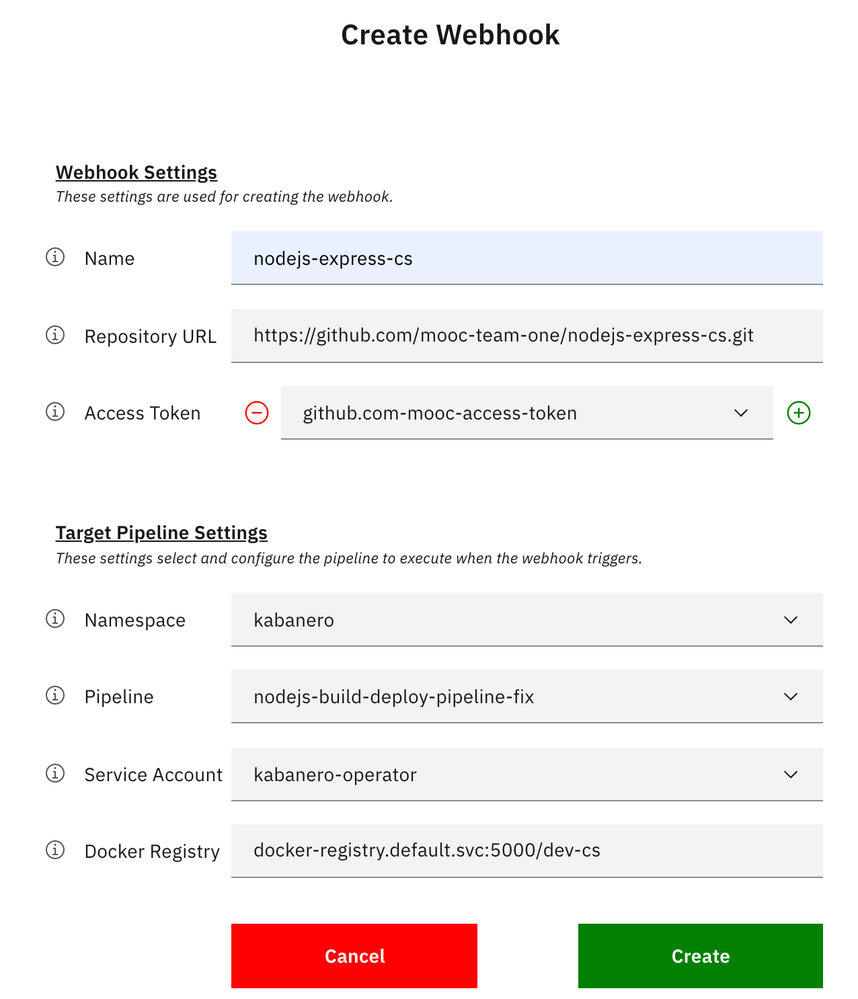

<PageDescription>

Use IBM Cloud Pak for Applications for build new cloud-native applications

</PageDescription>

This guide assumes that the environment is already setup for your cluster.

<AnchorLinks>
  <AnchorLink to="#cp4apps-dashboard">CP4Apps Dashboard</AnchorLink>
  <AnchorLink to="#cp4apps-dev-tools">CP4Apps Dev Tools</AnchorLink>
  <AnchorLink to="#create-a-new-app-using-the-appsody-cli">Create a new app using the Appsody CLI</AnchorLink>
  <AnchorLink to="#create-a-new-app-using-codewind">Create a new app using Codewind</AnchorLink>
  <AnchorLink to="#build-apps-with-tekton-pipelines">Build Apps with Tekton Pipelines</AnchorLink>
  <AnchorLink to="#scale-to-zero-serverless">Scale to zero with Serverless</AnchorLink>
</AnchorLinks>


## CP4Apps dashboard

Open the Cloud Pack for Applications dashboard.

- Open the OpenShift web console

- Click on the App Launcher and select "Cloud Pack for Applications"

    

In the CP4Apps dashboard, familiarize yourself with the console pages.

- Explore the Instance, Docs, and Guides pages

    


## CP4Apps Dev Tools

Setup the dev tools.

- In the CP4Apps dashboard, on the Home page, go to the Let's get started! section

- Press Setup Dev Tools to see the instructions we'll follow below

    

Install Codewind and Appsody.

- If using the VS Code IDE, install [Codewind from the VS Code Marketplace](https://marketplace.visualstudio.com/items?itemName=IBM.codewind)

- If using the Eclipse IDE, install [Codewind from the Eclipse Marketplace](https://marketplace.eclipse.org/content/codewind)

- Install the [Appsody CLI](https://appsody.dev/docs/getting-started/installation)


## Create a new app using the Appsody CLI

Now that we've installed the Appsody CLI, we'll configure it and use it to implement an app.

### Configure the Appsody CLI

The CP4Apps installation in your OpenShift cluster includes an instance of Kabanero Enterprise. In the CP4Apps dashboard, the Instance page shows details about this Kabanero Enterprise instance. Configure your Appsody CLI to access this instance.

- In the CP4Apps dashboard, go to the Instance page

- In the Collection Hub section, copy the Appsody URL (i.e. {Appsody-URL})

- Add the repository in Kabanero Enterprise to your local Appsody CLI's configuration

    ```bash
    appsody repo add kabanero-0.2.1 {Appsody-URL}
    ```

    For example:

    ```bash
    appsody repo add kabanero-0.2.1 https://github.com/kabanero-io/collections/releases/download/0.2.1/kabanero-index.yaml
    ```

Make the repo in Kabanero Enterprise the default, as shown by the astrix (`*`) in the list of repos.

- Set the default repo and list them

    ```bash
    $ appsody repo set-default kabanero-0.2.1
    $ appsody repo list

    NAME                    URL
    *kabanero-0.2.1         https://github.com/kabanero-io/collections/releases/download/0.2.1/kabanero-index.yaml
    incubator               https://github.com/appsody/stacks/releases/latest/download/incubator-index.yaml
    ```

- List the application stack included in the repo

    ```bash
    $ appsody list kabanero-0.2.1

    REPO            ID                      VERSION         TEMPLATES               DESCRIPTION
    kabanero-0.2.1  java-microprofile       0.2.18          *default                Eclipse MicroProfile on Open Liberty & OpenJ9 using Maven
    kabanero-0.2.1  java-spring-boot2       0.3.15          *default, kotlin        Spring Boot using OpenJ9 and Maven
    kabanero-0.2.1  nodejs                  0.2.5           *simple                 Runtime for Node.js applications
    kabanero-0.2.1  nodejs-express          0.2.7           scaffold, *simple       Express web framework for Node.js
    kabanero-0.2.1  nodejs-loopback         0.1.5           *scaffold               LoopBack 4 API Framework for Node.js
    ```

    Notice that the applications listed are the same as the list of Collections back on the Instance page.


### Create an application

Now that we've configured our Appsody CLI, let's use it to create an application.

Create an application named `nodejs-express-{initials}` using Appsody and the Kabanero Enterprise application stack in our cluster.

- Create an empty project directory named `nodejs-express-{initials}`

    ```bash
    mkdir -p ~/projects/nodejs-express-{initials}
    cd ~/projects/nodejs-express-{initials}
    ```

- Initialize the project
    ```bash
    appsody init kabanero-0.2.1/nodejs-express
    ```

To run the application, you don't need to have node.js or the Java SDK installed on your workstation. The application will run in a container that includes all of the tools.

- Start the application
    ```bash
    appsody run
    ```

Whenever any of the application files are edited, Kabanero Enterprise detects the change and automatically restarts the application.

- Using your favorite editor, edit `app.js`

- Change the response to `Hello Garage`.

Notice that the change is detected and the application automatically restarted.

<InlineNotification>

Each Appsody stack comes with a set of instrumentation that you can access with these following endpoints:
- Application endpoint: http://localhost:3000/
- Health endpoint: http://localhost:3000/health
- Liveness endpoint: http://localhost:3000/live
- Readiness endpoint: http://localhost:3000/ready
- Metrics endpoint: http://localhost:3000/metrics
- Dashboard endpoint: http://localhost:3000/appmetrics-dash (development only)

</InlineNotification>

While the application is running, experiment with using its instrumentation endpoints.

When you're through with the application, stop it.

- Stop the application
    ```bash
    appsody stop
    ```

## Create a new app using Codewind

Now that we've installed the Codewind plugin, we'll configure it and use it to implement an app.

### Configure the Codewind plugin

The CP4Apps installation in your OpenShift cluster includes an instance of Kabanero Enterprise. In the CP4Apps dashboard, the Instance page shows details about this Kabanero Enterprise instance. Configure your Codewind plugin to access this instance.

Set the Collection Hub URL.

- If using the VS Code IDE, see [Configuring template sources for VS Code](https://www.eclipse.org/codewind/mdt-vsc-usingadifferenttemplate.html)

- If using the Eclipse IDE, See [Configuring template sources for Eclipse](https://www.eclipse.org/codewind/mdteclipseusingadifferenttemplate.html)


### Create an application

Now that we've configured our Codewind plugin, let's use it to create an application.

Create an application named `nodejs-express-{initials}` using Codewind and the Kabanero Enterprise application stack in our cluster.

- Select Projects (Local), then select New Project

- Select the "Kabanero Node.js Express simple template (Appsody Stacks - kabanero-0.2.1)" template from the list

- Specify a name, such as `nodejs-express-$initials`

The application will start.

To work with the source code, right click on Projects and select Open CodeWind Workspace.

Experiment with using Codewind to perform actions on your running application.

- In the CodeWind view, right click on your application to see the actions the plugin can perform

    

- Perform each of the actions on your application:
    - Open App
    - Open Project Overview, verify the ports and status
    - Open Container Shell, explore the filesystem
    - Open Application Monitor, use the application and see the traffic metrics
    - Open Performance Dashboard and run a load test, see the traffic metrics
    - Restart in Debug mode, insert a break point in `app.js` and run the app to stop the application in debug view

## Build Apps with Tekton Pipelines


### Setup namespace

Creat a new namespace `dev-$initials` if not already created
```
oc new-project dev-$initials
```

Change context to your namespace
```
oc project dev-$intials
```

Verify namespace context
```
oc projet -q
```


### Create the Git Webhook

Create a Github repository using your corresponding mooc organization and use your initials to make your repository unique.
For example `https://github.com/mooc-team-one/nodejs-express-cs.git`

Create a Git Webhook, open the Tekton Dashboard from the Instance view in the ICP4Apps Dashboard.

Then click on Webhooks menu on the Tekton Dashboard.

Then click `Add Webhook`

Enter the following values on the form.

- Name: `nodejs-express-$intials` like `nodejs-express-cs`
- Repository URL: `https://github.com/mooc-team-$id/nodejs-express-$initials.git` like `https://github.com/mooc-team-one/nodejs-express-cs.git`
- Access Token: 
  - Select from the list: `github.com-mooc-access-token` no need to create a new access token.
- Namespace: 
  - Select `kabanero`, not your own namespace.
- Pipeline: `nodejs-express-build-deploy-pipeline-fix` the one with prefix `-fix`
- Service Account: `kabanero-operator`
- Docker Registry: `docker-registry.default.svc:5000/dev-$initials` the `dev-$initials` is your namespace, like `docker-registry.default.svc:5000/dev-cs` 

    

### Setup git repository for deployment

Run the following command, to generate the manifest
```
appsody deploy --generate-only 
```
This command generated the following file `app-deploy.yaml`

Edit the file `app-deploy.yaml`.

Specify namespace to deploy application in your case `dev-$initials`
```
metadata:
  namespace: dev-$initials
```

Checking all the files:
```
git init
git add .
git commit -m "first commit"
```

Add the remote repo url and push
```
git remote add origin git@github.com:mooc-team-$id/nodejs-express-$initials.git
git push -u origin master
```

Select `PipelineRuns` in the Tekton UI to see the progress on the pipelines


## Scale to zero (Serverless)

Edit the `app-deploy.yaml` and set the variable `createKnativeService` to `true`

```yaml
spec:
  createKnativeService: true
```

Push the change to git:
```
git add app-deploy.yaml
git commit -m "make it serverless"
git push origin
```

When the tekton pipeline is done, get the URL of the Knative Service with the following command:
```
oc get ksvc
```

The output should look like this:
```
NAME                URL                                                                                                                               LATESTCREATED             LATESTREADY               READY   REASON
nodejs-express-cs   http://nodejs-express-cs.dev-cs.mooc-surge-ocp-cluster-0143c5dd31acd8e030a1d6e0ab1380e3-0001.us-east.containers.appdomain.cloud   nodejs-express-cs-gfvfz   nodejs-express-cs-gfvfz   True    
```