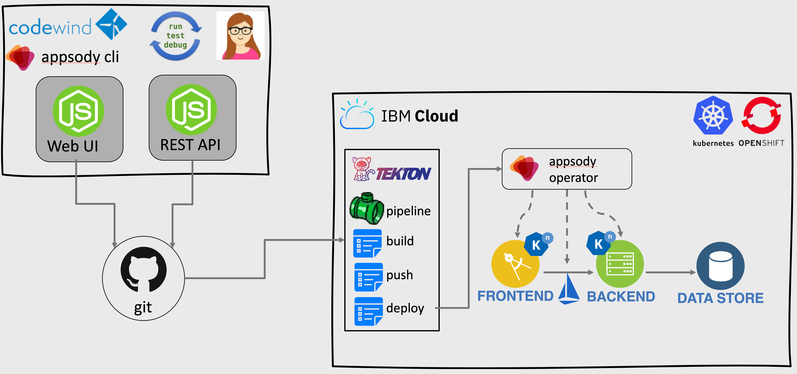
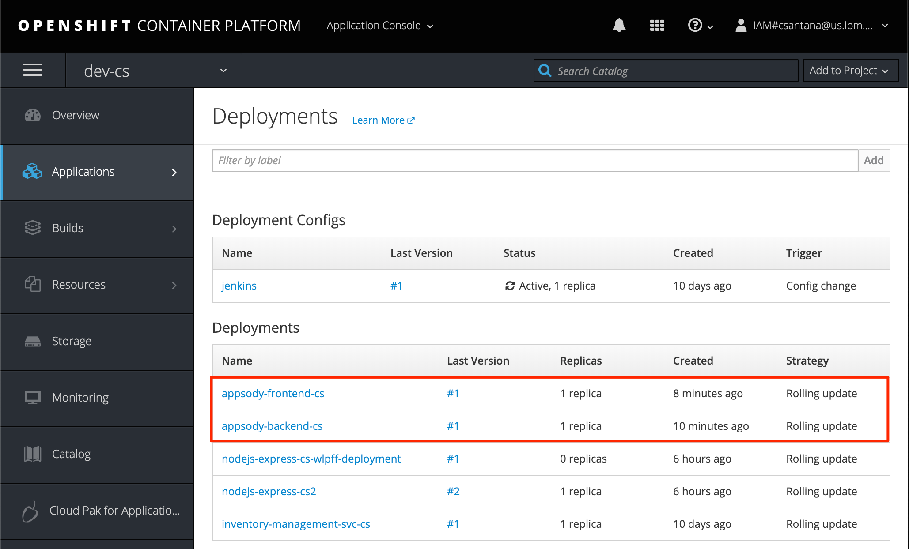
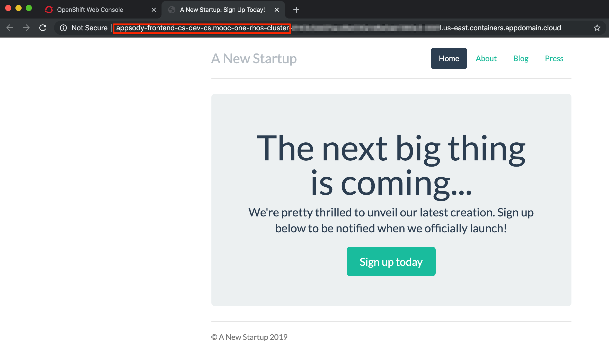

import Globals from 'gatsby-theme-carbon/src/templates/Globals';

<PageDescription>

Use IBM Cloud Pak for Applications to integrate microservices

</PageDescription>

For this homework, you will use two existing applications and deploy them as a set of microservices using the CP4Apps workflow.



This guide assumes the following:

1. You are using a <Globals name="env" /> that has already been installed.
1. Cloud Pak for Applications has already been installed in the environment.
1. You already completed [CP4Apps homeworks](/practical/cp4apps).

This guide consists of the following sections:

<AnchorLinks>
  <AnchorLink to="#deploy-existing-backend-as-appsody-app">Deploy existing backend as Appsody app</AnchorLink>
  <AnchorLink to="#deploy-existing-frontend-as-appsody-app">Deploy existing frontend as Appsody app</AnchorLink>
  <AnchorLink to="#verify-deployed-microservice-solution">Verify deployed microservice solution</AnchorLink>
</AnchorLinks>


## Deploy existing backend as Appsody app

Create a backend app from an Appsody template, set it up for Appsody, and connect the repo to a pipeline.

First, create a backend app from an existing template.

- Go to the template https://github.com/kabanero-demo/appsody-backend

- Complete the [GitHub create repository from template](https://help.github.com/en/github/creating-cloning-and-archiving-repositories/creating-a-repository-from-a-template) process

  - **Owner**: Select the GitHub organization for your team

  - **Repository name**: Use a name like `appsody-backend-{initials}`

  The new repository will be created in your selected organization.

- Clone the new Github repo locally

Second, set up the cloned template with Appsody.

- Initialize the backend as an Appsody Express.js app
    ```bash
    appsody init kabanero-0.2.1/nodejs-express none
    ```

- Use Appsody to run the backend
    ```bash
    appsody run -p 3001:3000 -p 9230:9229 -p 8081:8080
    ```

- Test the running backend, accessible at http://localhost:3001 (port 3000 will be use later for frontend)

- Add deployment manifest
    ```bash
    appsody deploy --generate-only
    ```

- Edit the generated file, `app-deploy.yaml`

    - Specify the namespace to deploy the application into
    ```yaml
    metadata:
      namespace: dev-{initials}
    ```

- Commit and push the new Appsody-related files
    ```bash
    git add .
    git commit -m "Add appsody files"
    git push
    ```

Third, connect the repo to the Tekton pipeline.

- Create a webhook for your GitHub repo to trigger a Tekton pipeline, as described in [Tekton Pipelines Homework](/practical/cp4apps#build-an-app-with-a-tekton-pipeline)

## Deploy existing frontend as Appsody app

Create a frontend app from an Appsody template, set it up for Appsody and connect it to the backend, and connect the repo to a pipeline.

First, create a frontend app from an existing template.

- Repeat the steps above to create a repo from a template:

    - **Template**: https://github.com/kabanero-demo/appsody-frontend

    - **Owner**: Select the GitHub organization for your team

    - **Repository name**: Use a name like `appsody-frontend-{initials}`

- Clone the new Github repo locally

Second, set up the cloned template with Appsody and connect it to the backend.

- Initialize the frontend as an Appsody Express.js app
    ```bash
    appsody init kabanero-0.2.1/nodejs-express none
    ```

- Use Appsody to run the frontend
    ```bash
    appsody run
    ```

- Test the running frontend, accessible at http://localhost:3000 (port 3001 is used by the backend)

    - Make sure the backend is running with Appsody and exposed on port 3001

    - Test the app by adding a new user

- Repeat the steps above from the backend using the command `appsody deploy --generate-only` to add the Appsody deployment manifest file `app-deploy.yaml` and set the target namespace to `dev-{initials}`

- Also in `app-deploy.yaml`, add an environment variable to link the frontend service to the backend service

    ```yaml
    spec:
      env:
        - name: APPSODY_BACKEND_DEFAULT_URL
          value: http://appsody-backend-{initials}:3000/
    ```

    (On the server, the frontend and backend will both listen on port 3000 (in different pods).)

- Commit and push your changes to Git

Third, connect the repo to the Tekton pipeline.

- Create a webhook for your GitHub repo to trigger a Tekton pipeline, as described in [Tekton Pipelines Homework](/practical/cp4apps#build-an-app-with-a-tekton-pipeline)


## Verify deployed microservice solution

The webhooks should have triggered the pipelines to deploy the frontend and backend to your OpenShift project. Let's verify the apps are in OpenShift and running correctly.

- In the OpenShift web console, navigate to your project and its deployments

- Verify there are two applications corresponding to the frontend (`appsody-frontend-{initials}`) and backend (`appsody-backend-{initials}`) services

    

- Access the route for the frontend service and register a new user

    