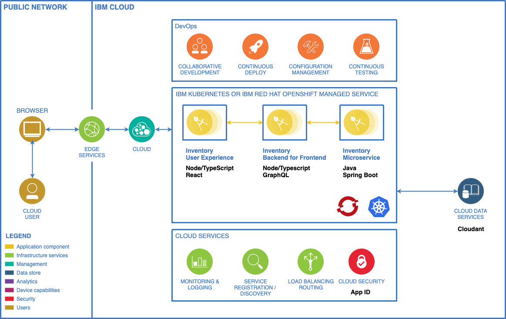

<PageDescription>

An example three tier application architecture you can build and have deployed in IBM Kubernetes service or IBM Red Hat OpenShift in less than an hour using the IBM Garage for Cloud Developer Tools and Starter Kit Templates.

</PageDescription>

## Business Need

In this guide imagine you have completed a [Enterprise Design Thinking Workshop](https://www.ibm.com/garage/method/practices/think/enterprise-design-thinking/) and the out come is a single **Hill** defining the desired business outcomes. Use the steps below to help deliver this **Hill** quickly and to [Garage Method Best Practices](https://www.ibm.com/garage/method).

## [Hills](https://www.ibm.com/garage/method/practices/think/practice_hills/)

- **Who** Provide an internal web application system that can be used by distribution employees securely from each of the regional warehouses. The warehouses are linked using the public internet.

- **What** Enable a secure web application that will allow the warehouse employees to gain easy access to list of product [SKU](https://en.wikipedia.org/wiki/Stock_keeping_unit) inventory levels and inventory locations.

- **Wow** Make the system appealing and easy to use. Deliver it to the IBM Cloud platform in a short focused [Minimal Viable Product](https://www.ibm.com/garage/method/practices/think/practice_minimum_viable_product/). Use the latest managed container runtimes and DevOps best practices to enable post MVP feature improvements. Simulate a release to a  _Test_ environment.

## [Architecture]()

The Micro App should be built using a three tier microservices architecture. Each tier will follow a clean separation of concerns. Each app component will be modelled using _Microservices_ and use a number of [polyglot](https://searchsoftwarequality.techtarget.com/definition/polyglot-programming) programming languages and frameworks. Data will be stored in IBM Cloudant and the Micro App will be secured using IBM App ID.

## [Design]()

The Micro App should adhere to the following User Interface Design and API and Model Design.

Add Design here.

## Technical Requirements
- The Mico App should adhere to the following technical requirements:

    - Polyglot Microservices
    - Stateless
    - REST APIs
    - DevOps with Continous Integration and Delivery
    - Monitoring and Logging
    - Code Analysis
    - App Security
    - Deployed to Red Hat OpenShift or IBM Kubernetes Managed Service
    - Follow [Carbon Design System](https://www.carbondesignsystem.com/) User Experience

## Guide

Steps to Go here

## Summary

You have now completed the Micro App Guide demonstrating the _Inventory_ solution.

## Solution Links

If you want to skip the guide and just get the components running, here are the solution Git Repositories. You can clone these and `igc pipeline` them to register them in the CI pipeline. The **README.md** may include additional setup for populating test data etc.

<AnchorLinks>
  <AnchorLink to="https://github.com/ibm-garage-cloud/inventory-ui">Inventory User Interface</AnchorLink>
  <AnchorLink to="https://github.com/ibm-garage-cloud/inventory-bff">Inventory Backend for Frontend</AnchorLink>
  <AnchorLink to="https://github.com/ibm-garage-cloud/inventory-service">Inventory Microservice</AnchorLink>
</AnchorLinks>

