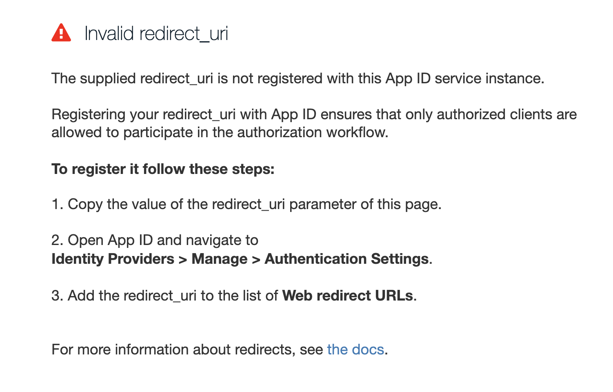
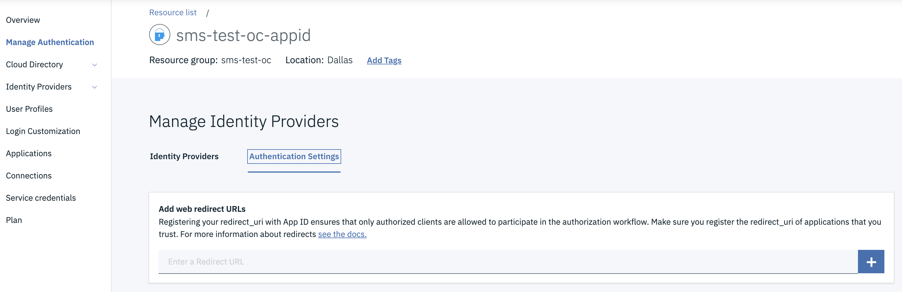
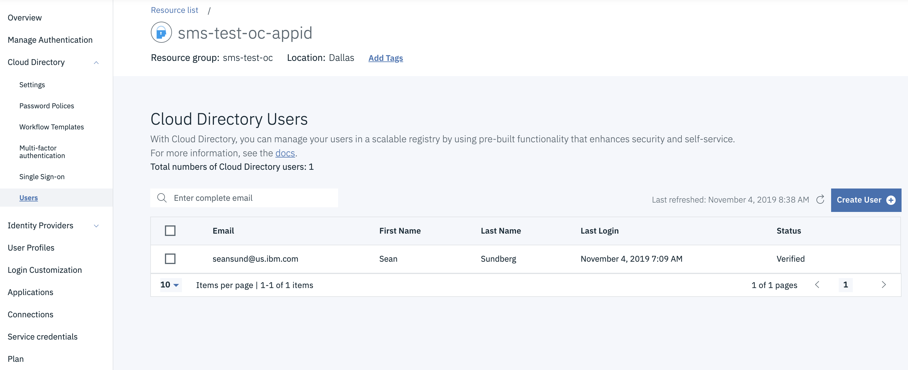

<PageDescription>

An example three tier application architecture you can build and have deployed in IBM Kubernetes service or IBM Red Hat OpenShift in less than an hour using the IBM Garage for Cloud Developer Tools and Starter Kit Templates.

</PageDescription>

## Business Need

In this guide imagine you have completed a [Enterprise Design Thinking Workshop](https://www.ibm.com/garage/method/practices/think/enterprise-design-thinking/) and the out come is a single **Hill** defining the desired business outcomes. Use the steps below to help deliver this **Hill** quickly and to [Garage Method Best Practices](https://www.ibm.com/garage/method).

## [Hills](https://www.ibm.com/garage/method/practices/think/practice_hills/)

- **Who** Provide an internal web application system that can be used by distribution employees securely from each of the regional warehouses. The warehouses are linked using the public internet.

- **What** Enable a secure web application that will allow the warehouse employees to gain easy access to list of product [SKU](https://en.wikipedia.org/wiki/Stock_keeping_unit) inventory levels and inventory locations.

- **Wow** Make the system appealing and easy to use. Deliver it to the IBM Cloud platform in a short focused [Minimal Viable Product](https://www.ibm.com/garage/method/practices/think/practice_minimum_viable_product/). Use the latest managed container runtimes and DevOps best practices to enable post MVP feature improvements. Simulate a release to a  _Test_ environment.

## [Architecture]()

The Micro App should be built using a three tier microservices architecture. Each tier will follow a clean separation of concerns. Each app component will be modelled using _Microservices_ and use a number of [polyglot](https://searchsoftwarequality.techtarget.com/definition/polyglot-programming) programming languages and frameworks. Data will be stored in IBM Cloudant and the Micro App will be secured using IBM App ID.


## [Design]()

The Micro App should adhere to the following User Interface Design and API and Model Design.


## Technical Requirements
- The Mico App should adhere to the following technical requirements:

    - Polyglot Microservices
    - Stateless
    - REST APIs
    - DevOps with Continous Integration and Delivery
    - Monitoring and Logging
    - Code Analysis
    - App Security
    - Deployed to Red Hat OpenShift or IBM Kubernetes Managed Service
    - Follow [Carbon Design System](https://www.carbondesignsystem.com/) User Experience

## Guide

### Inventory User Interface

#### Setup

Get the initial project created and register the pipeline for automated builds.

1. Create a new repository from the React Starter Kit template - https://github.com/ibm-garage-cloud/template-node-react/generate

2. Clone the new repository to your machine

3. Update the project name in the `package.json` to match the repository

4. Log into the cluster from the command-line then register the pipeline in Jenkins using `igc pipeline`

#### Initial components

Clean up the UI Design patterns view to include only one entry for Stock Items.
Based on the requirements of this first use case we can base the work off of 
the TableList pattern. 

1. Make a copy of the `TableList` pattern component in the components folder. Rename the
file and the class inside to `StockItemList`

2. Update UIShell.jsx
    - Update the initial pattern name to `Stock Items`
    - Update the SideNameMenu title to Inventory Management
    - Remove all the patterns from the SideNavMenu and add a line to render the Stock Items menu - `this.renderSideNavItem("Stock Items")`
  
    components/UIShell.jsx
    ```javascript
    class UIShell extends Component {
      constructor(props) {
        super(props);
        this.state = {
          patternName: "Stock Items"
        };
      }
    
      ...
    
      render() {
        return (
          <div>
            <Header aria-label="IBM Platform Name">
              <SkipToContent />
              <HeaderName href="#" prefix="IBM">
                Garage for Cloud Catalyst
              </HeaderName>
            </Header>
            <SideNav aria-label="Side navigation">
              <SideNavItems>
                <SideNavMenu
                  defaultExpanded
                  icon={<Fade20 />}
                  title="Inventory Management"
                >
                  {this.renderSideNavItem("Stock Items")}
                </SideNavMenu>
              </SideNavItems>
            </SideNav>
            <Content id="main-content"><UIShellBody patternName={this.state.patternName} /></Content>
          </div>
        );
      }
    }
    ```

3. Update UIShellBody.jsx

    - Remove all of the pattern values from the `components` map and add only show StockItem List
    - Use `Stock Items` as the default pattern name when none is given

    components/UIShellBody.jsx
    ```javascript
    class UIShellBody extends Component {
      components = {
        "Stock Items": StockItemList,
      };
      render() {
        const PatternName = this.components[
          this.props.patternName || "Stock Items"
        ];
        return (
          <div className="pattern-container">
            <PatternName showDescription={true} />
          </div>
        );
      }
    }
    ```
`
#### Update StockItemList according to the requirements

1. Update the data structure for our sample data to match the UI

    components/StockItemList.jsx
    ```javascript
    class StockItemList extends Component {
      ...
    
      componentDidMount() {
        const data = [
          {
            "name": "Item 1",
            "description": "The first item",
            "stock": 10,
            "unitPrice": 100.0,
            "picture": "test",
            "manufacturer": "unknown",
          },
          {
            "name": "Item 2",
            "description": "The second item",
            "stock": 15,
            "unitPrice": 120.5,
            "picture": "test1",
            "manufacturer": "Apple",
          },
          {
            "name": "Item 3",
            "description": "The third item",
            "stock": 20,
            "unitPrice": 75.5,
            "picture": "test1",
            "manufacturer": "Sony",
          }
        ];
    
        this.setState({
          data
        });
      }
    
      ...
    }
    ```

2. Update the title, subtitle, and columns with values for our Stock Items view. Set the `formatters` to
an empty object for now.

    components/StockItemList.jsx
    ```javascript
    class StockItemList extends Component {
      title = 'Stock Items';
      subtitle = 'This is the current inventory of items';
      columns = [
        "name",
        "description",
        "stock",
        "unitPrice",
        "picture",
        "manufacturer",
      ];
      formatters = {};
     
      ...
    }
    ```

#### Add a mock service to get the Stock Items

1. Create a directory called `services` under the client/src folder

2. Create a service called `stock-item-mock.service` initially to validate the logic. Our 
StockItem service API will have a single asynchronous function at this time called `listStockItems()`
that returns a list of StockItems. 

    services/stock-item-mock.service.js
    ```javascript
    export class StockServiceMock {
      async listStockItems() {
        await timer(1000);
    
        return [
          {
            "name": "Item 1",
            "description": "The first item",
            "stock": 10,
            "unitPrice": 100.0,
            "picture": "test",
            "manufacturer": "unknown",
          },
          {
            "name": "Item 2",
            "description": "The second item",
            "stock": 15,
            "unitPrice": 120.5,
            "picture": "test1",
            "manufacturer": "Apple",
          },
          {
            "name": "Item 3",
            "description": "The third item",
            "stock": 20,
            "unitPrice": 75.5,
            "picture": "test1",
            "manufacturer": "Sony",
          }
        ];
      }
    }
    
    async function timer(time) {
      return new Promise(resolve => {
        setTimeout(resolve, time)
      });
    }
    ```

3. Update the components to pass the service in the properties

    App.test.jsx
    ```javascript
    describe('App', () => {
      test('canary verifies test infrastructure', () => {
         expect(true).toEqual(true);
      });
    
      test('renders without crashing', () => {
        const div = document.createElement('div');
        ReactDOM.render(<App stockService={new StockServiceMock()}/>, div);
        ReactDOM.unmountComponentAtNode(div);
      });
    });
    ```

    App.jsx
    ```javascript
    class App extends Component {
      constructor(props) {
        super(props);
    
        this.stockService = props.stockService || new MockStockService();
      }
    
      render() {
        return (
          <div className="App">
            <UIShell stockService={this.stockService}/>
          </div>
        );
      }
    }
    ```

    components/UIShell.jsx
    ```javascript
    class UIShell extends Component {
      ...
      
      <Content id="main-content"><UIShellBody patternName={this.state.patternName} stockService={this.props.stockService}/></Content>
     
      ...
    }
    ```

    components/UIShellBody.jsx
    ```javascript
    class UIShellBody extends Component {
      components = {
        "Stock Items": StockItemList,
      };
      render() {
        const PatternName = this.components[
          this.props.patternName || "Stock Items"
        ];
        return (
          <div className="pattern-container">
            <PatternName showDescription={true} stockService={this.props.stockService} />
          </div>
        );
      }
    }
    ```

4. Update `StockItemList` to use the provided service

    components/StockItemList.jsx
    ```javascript
    class StockItemList extends Component {
      ...
    
      constructor(props) {
        super(props);
    
        this.stockService = props.stockService;
    
        this.state = {
          data: [],
          selectedRow: 0
        };
      }
    
      async componentDidMount() {
    
        this.setState({
          data: await this.stockService.listStockItems()
        });
      }
    
      ...
    }
    ```

#### Add a service that calls the BFF

1. Create a service implementation in the `services` directory called `stock-service.js`

    services/stock-service.js
    ```javascript
    export class StockService {
      async listStockItems() {
        return [];
      }
    }
    ```

2. Add an implementation of listStockItems() that calls the BFF through the `/api` proxy

    ```javascript
    export class StockService {
      constructor(baseUrl) {
        this.baseUrl = baseUrl || '/api';
      }
    
      async listStockItems() {
        return superagent
          .get(this.baseUrl + '/stock-items')
          .set('accept', 'application/json')
          .then(res => {
            console.log('Got response: ', res);
            return res.body || [];
          });
      }
    }
    ``` 
    
    **Note:** In dev mode the proxy is configured in `client/package.json`. When running with the express 
    server the proxy is configured in `server/routers/api.js`. By default the value points to `localhost:3001`.

3. Update `App.jsx` to use the new service instead of the mock service.

    App.jsx
    ```javascript
    class App extends Component {
      constructor(props) {
        super(props);
    
        this.stockService = props.stockService || new StockService();
      }
    
      ...
    }
    ```

4. Configure the helm chart to point to the kubernetes Service resource of the BFF.

    chart/template-node-react/values.yaml
    ```javascript
    apiHost: "inventory-management-bff:80"
    ``` 

### Inventory Service

#### Setup

Get the initial project created and register the pipeline for automated builds.

1. Create a new repository from the Java Spring Starter Kit template - https://github.com/ibm-garage-cloud/template-java-spring/generate

2. Clone the new repository to your machine

3. Update the project name in the `package.json` to match the repository

4. Log into the cluster from the command-line then register the pipeline in Jenkins using `igc pipeline`

#### Create initial components 

1. Copy `com.ibm.hello.app.Application` into the `com.ibm.inventory_management.app` package and
update the @ComponentScan package list to include `com.ibm.inventory_management.*`

    com.ibm.inventory_management.app.Application
    ```java
    @SpringBootApplication
    @ComponentScan({"com.ibm.inventory_management.*", "com.ibm.cloud_garage.*","com.ibm.health"})
    public class Application extends SpringBootServletInitializer {
        public static void main(String[] args) {
            SpringApplication.run(Application.class, args);
        }
    
        ...
    
        @Override
        protected SpringApplicationBuilder configure(SpringApplicationBuilder application) {
            return application.sources(Application.class);
        }
    }
    ```

2. Delete `com.ibm.hello.app.Application`

#### Add StockItem controller

1. Start the tests in tdd mode with `npm run tdd` (or `./gradlew test --continuous`)

2. Add a StockItemControllerTest.java in `com.ibm.inventory_management.controllers` under the `test` folder

    ```java
    @DisplayName("StockItemController")
    public class StockItemControllerTest {
    
        @Test
        @DisplayName("canary verifies test infrastructure")
        public void canary() {
            Assertions.assertTrue(false);
        }
    }
    ```

3. Change the value to `true` to make it pass

4. Add the MockMvc infrastructure and create the `StockItemController`

    ```java
    @DisplayName("StockItemController")
    public class StockItemControllerTest {
        StockItemController controller;
    
        MockMvc mockMvc;
    
        @BeforeEach
        public void setup() {
            controller = spy(new StockItemController());
    
            mockMvc = MockMvcBuilders.standaloneSetup(controller).build();
        }
    
        ...
    }
    ```

    ```java
    @RestController
    public class StockItemController {
    }
    ```

5. Add the tests for the controller behavior and make the corresponding changes to make the tests pass

    ```java
    @DisplayName("StockItemController")
    public class StockItemControllerTest {
        ...
    
        @Nested
        @DisplayName("Given [GET] /stock-items")
        public class GivenGetStockItems {
    
            @Test
            @DisplayName("When called then it should return a 200 status")
            public void when_called_should_return_200_status() throws Exception {
    
                mockMvc.perform(get("/stock-items"))
                        .andExpect(status().isOk());
            }
    
            @Test
            @DisplayName("When called then it should return an empty array")
            public void when_called_then_return_an_empty_array() throws Exception {
    
                mockMvc.perform(get("/stock-items").accept("application/json"))
                        .andExpect(content().json("[]"));
            }
        }
    }
    ```

    ```java
    @RestController
    public class StockItemController {
    
        @GetMapping(path = "/stock-items", produces = "application/json")
        public List<StockItem> listStockItems() {
            return new ArrayList();
        }
    }
    ```

#### Add a service for providing results

1. Update the controller test to include returning data from the service

    ```java
    @DisplayName("StockItemController")
    public class StockItemControllerTest {
        StockItemController controller;
        StockItemApi service;
    
        MockMvc mockMvc;
    
        @BeforeEach
        public void setup() {
            service = mock(StockItemApi.class);
    
            controller = spy(new StockItemController(service));
    
            mockMvc = MockMvcBuilders.standaloneSetup(controller).build();
        }
        
        @Nested
        @DisplayName("Given [GET] /stock-items")
        public class GivenGetStockItems {
            @Test
            @DisplayName("When called then it should return a 200 status")
            public void when_called_should_return_200_status() throws Exception {
    
                mockMvc.perform(get("/stock-items"))
                        .andExpect(status().isOk());
            }
    
            @Test
            @DisplayName("When called then it should return the results of the StockItemService")
            public void when_called_then_return_the_results_of_the_stockitemservice() throws Exception {
    
                final List<StockItem> expectedResult = Arrays.asList(new StockItem());
                when(service.listStockItems()).thenReturn(expectedResult);
    
                mockMvc.perform(get("/stock-items").accept("application/json"))
                        .andExpect(content().json("[{}]"));
            }
        }
    }
    ```

    com.ibm.inventory_management.model.StockItem
    ```java
    public class StockItem implements Serializable {
    }
    ```
    
    com.ibm.inventory_management.service.StockItemApi;
    ```java
    package com.ibm.inventory_management.service;
    
    import java.util.List;
    
    import com.ibm.inventory_management.model.StockItem;
    
    public interface StockItemApi {
        public List<StockItem> listStockItems();
    }
    ```
    
    ```java
    @RestController
    public class StockItemController {
    
        private final StockItemApi service;
    
        public StockItemController(StockItemApi service) {
            this.service = service;
        }
    
        @GetMapping(path = "/stock-items", produces = "application/json")
        public List<StockItem> listStockItems() {
            return this.service.listStockItems();
        }
    }
    ```

2. Update the `StockItem` model to include the necessary fields

    com.ibm.inventory_management.model.StockItem
    ```java
    package com.ibm.inventory_management.model;
    
    import java.io.Serializable;
    
    public class StockItem implements Serializable {
        private String id = null;
        private String name = null;
        private int stock = 0;
        private double price = 0.0;
        private String manufacturer = "";
    
        public StockItem() {
            super();
        }
    
        public StockItem(String id) {
            super();
    
            this.setId(id);
        }
    
        public String getId() {
            return id;
        }
    
        public void setId(String id) {
            this.id = id;
        }
    
        public StockItem withId(String id) {
            this.id = id;
    
            return this;
        }
    
        public String getName() {
            return name;
        }
    
        public void setName(String name) {
            this.name = name;
        }
    
        public StockItem withName(String name) {
            this.setName(name);
    
            return this;
        }
    
        public int getStock() {
            return stock;
        }
    
        public void setStock(int stock) {
            this.stock = stock;
        }
    
        public StockItem withStock(int stock) {
            this.setStock(stock);
    
            return this;
        }
    
        public double getPrice() {
            return price;
        }
    
        public void setPrice(double price) {
            this.price = price;
        }
    
        public StockItem withPrice(double price) {
            this.setPrice(price);
    
            return this;
        }
    
        public String getManufacturer() {
            return manufacturer;
        }
    
        public void setManufacturer(String manufacturer) {
            this.manufacturer = manufacturer;
        }
    
        public StockItem withManufacturer(String manufacturer) {
            this.setManufacturer(manufacturer);
    
            return this;
        }
    }
    ```

3. Provide an implementation of the service that just returns canned data, for now

    ```java
    package com.ibm.inventory_management.service;
    
    import java.util.Arrays;
    import java.util.List;
    
    import org.springframework.context.annotation.Primary;
    import org.springframework.stereotype.Service;
    
    import com.ibm.inventory_management.model.StockItem;
    
    @Primary
    @Service
    public class StockItemService implements StockItemApi {
        @Override
        public List<StockItem> listStockItems() {
            return Arrays.asList(
                    new StockItem("1")
                            .withName("Item 1")
                            .withStock(100)
                            .withPrice(10.5)
                            .withManufacturer("Sony"),
                    new StockItem("2")
                            .withName("Item 2")
                            .withStock(150)
                            .withPrice(100.0)
                            .withManufacturer("Insignia"),
                    new StockItem("3")
                            .withName("Item 3")
                            .withStock(10)
                            .withPrice(1000.0)
                            .withManufacturer("Panasonic")
                    );
        }
    }
    ```

4. Update the swagger config to restrict the results to the `/stock-items` api

    com.ibm.cloud_garage.swagger.SwaggerDocket
    ```java
    @Component
    @EnableSwagger2
    public class SwaggerDocket {
        ...
    
        @Bean
        public Docket api() {
            return new Docket(DocumentationType.SWAGGER_2)
                    .select()
                    .apis(buildApiRequestHandler())
                    .paths(PathSelectors.regex(".*stock-item.*"))
                    .build()
                    .apiInfo(buildApiInfo());
        }    
    }
    ```

### Inventory BFF

#### Setup

Get the initial project created and register the pipeline for automated builds.

1. Create a new repository from the Typescript GraphQL Starter Kit template - https://github.com/ibm-garage-cloud/template-graphql-typescript/generate

2. Clone the new repository to your machine

3. Update the project name in the `package.json` to match the repository

4. Log into the cluster from the command-line then register the pipeline in Jenkins using `igc pipeline`

#### Build the controller for the REST interface

1. Create the controller test

    test/controllers/stock-items.controller.spec.ts
    ```typescript
    import {Application} from 'express';
    import * as request from 'supertest';
    
    import {buildApiServer} from '../helper';
    
    describe('stock-item.controller', () => {
    
      let app: Application;
      beforeEach(async () => {
        const apiServer = buildApiServer();
    
        app = await apiServer.getApp();
      });
      
      test('canary verifies test infrastructure', () => {
         expect(true).toEqual(true);
      });
    
      describe('given GET /stock-items', () => {
        describe('when service is successful', () => {
          test('then return 200 status', async () => {
            return request(app).get('/stock-items').expect(200);
          });
    
          test('then should return an empty array', async () => {
            return request(app).get('/stock-items').expect([]);
          });
        });
      });
    }
    ```

    src/controllers/stock-items.controller.ts
    ```typescript
    import {GET, Path} from 'typescript-rest';
    
    @Path('stock-items')
    export class StockItemsController {
    
      @GET
      async listStockItems(): Promise<any[]> {
        return [];
      }
    }
    ```

2. Add the controller to the controllers `index.ts`

    ```typescript
    export * from './stock-items.controller';
    ```

#### Update the controller to call a service

1. Add a StockItem model that matches the UI model and add it to models `index.ts`

    src/models/stock-item.model.ts
    ```typescript
    export class StockItemModel {
      id: string;
      name: string;
      description: string;
      stock: number;
      unitPrice: number;
      picture: string;
      manufacturer: string;
    }
    ```

    src/models/index.ts
    ```typescript
    export * from './stock-item.model';
    ```

2. Define an abstract class for the api and add it to the services `index.ts`

    src/services/stock-items.api.ts
    ```typescript
    import {StockItemModel} from '../models';
    
    export abstract class StockItemsApi {
      async abstract listStockItems(): Promise<StockItemModel[]>;
    }
    ```

    src/services/index.ts
    ```typescript
    export * from './stock-items.api';
    ```

3. Update the controller test to inject the service into the controller and to return the value from the service

    test/controllers/stock-items.controller.spec.ts
    ```typescript
    import {Application} from 'express';
    import * as request from 'supertest';
    import {Container} from 'typescript-ioc';
    
    import {buildApiServer} from '../helper';
    import Mock = jest.Mock;
    import {StockItemsApi} from '../../src/services';
    
    describe('stock-item.controller', () => {
    
      let app: Application;
      let service_listStockItems: Mock;
    
      beforeEach(async () => {
        service_listStockItems = jest.fn();
        Container.bind(StockItemsApi).provider({
          get: () => ({
            listStockItems: service_listStockItems
          }),
        });
    
        const apiServer = buildApiServer();
    
        app = await apiServer.getApp();
      });
    
      test('canary verifies test infrastructure', () => {
         expect(true).toEqual(true);
      });
    
      describe('given GET /stock-items', () => {
        describe('when service is successful', () => {
          const expectedResult = [{value: 'val'}];
          beforeEach(() => {
            service_listStockItems.mockResolvedValue(expectedResult);
          });
    
          test('then return 200 status', async () => {
            return request(app).get('/stock-items').expect(200);
          });
    
          test('then should return value from service', async () => {
            return request(app).get('/stock-items').expect(expectedResult);
          });
        });
    
        describe('when service fails', () => {
          beforeEach(() => {
            service_listStockItems.mockRejectedValue(new Error('service failed'));
          });
    
          test('then return 502 error', async () => {
            return request(app).get('/stock-items').expect(502);
          });
        });
      });
    });
    ```

4. Update the controller to inject the service and use it

    src/controllers/stock-items.controller.ts
    ```typescript
    import {Inject} from 'typescript-ioc';
    import {GET, Path} from 'typescript-rest';
    import {HttpError} from 'typescript-rest/dist/server/model/errors';
    
    import {StockItemModel} from '../models';
    import {StockItemsApi} from '../services';
    
    class BadGateway extends HttpError {
      constructor(message?: string) {
        super("BadGateway", message);
        this.statusCode = 502;
      }
    }
    
    @Path('stock-items')
    export class StockItemsController {
      @Inject
      service: StockItemsApi;
    
      @GET
      async listStockItems(): Promise<StockItemModel[]> {
        try {
          return await this.service.listStockItems();
        } catch (err) {
          throw new BadGateway('There was an error');
        }
      }
    }
    ```

#### Create a mock service implementation

1. Add a `stock-items-mock.service` to services and add it to `index.ts`

    src/services/stock-items-mock.service.ts
    ```typescript
    import {Provides} from 'typescript-ioc';
    
    import {StockItemsApi} from './stock-items.api';
    import {StockItemModel} from '../models';
    
    @Provides(StockItemsApi)
    export class StockItemsMockService implements StockItemsApi {
      async listStockItems(): Promise<StockItemModel[]> {
        return [
          {
            id: "1",
            name: "Self-sealing stem bolt",
            description: "Self-sealing stem bolt",
            stock: 10,
            unitPrice: 10.5,
            picture: "https://via.placeholder.com/32.png",
            manufacturer: "Bajor Galactic"
          },
          {
            id: "2",
            name: "Heisenberg compensator",
            description: "Magical component that negates the effects of the Heisenberg Uncertainty Principle",
            stock: 20,
            unitPrice: 20.0,
            picture: "https://via.placeholder.com/32.png",
            manufacturer: "Federation Imports"
          },
          {
            id: "3",
            name: "Tooth sharpener",
            description: "Industrial strength tooth sharpener",
            stock: 30,
            unitPrice: 5.25,
            picture: "https://via.placeholder.com/32.png",
            manufacturer: "Farenginar Exploits"
          }
        ];
      }
    }
    ```

    src/services/index.ts
    ```typescript
    export * from './stock-items-mock.service';
    ```

2. The controller should now return the values from the mock service when invoked

#### Add a GraphQL implementation of Stock Items

1. Add a `stock-items` GraphQL schema and add it to the schemas `index.ts`

    src/schemas/stock-item.schema.ts
    ```typescript
    import {Field, Float, Int, ObjectType} from 'type-graphql';
    import {StockItemModel} from '../models';
    
    @ObjectType()
    export class StockItem implements StockItemModel {
      @Field()
      id: string;
      @Field()
      description: string;
      @Field()
      manufacturer: string;
      @Field()
      name: string;
      @Field({nullable: true})
      picture: string;
      @Field(type => Int)
      stock: number;
      @Field(type => Float)
      unitPrice: number;
    }
    ``` 

    src/schemas/index.ts
    ```typescript
    export * from './stock-item.schema'
    ```

2. Add a 'stock-item' GraphQL resolver and add it to the resolvers `index.ts`

    src/resolvers/stock-item.resolver.ts
    ```typescript
    import {Query, Resolver} from 'type-graphql';
    import {Inject} from 'typescript-ioc';
    
    import {resolverManager} from './_resolver-manager';
    import {StockItem} from '../schemas';
    import {StockItemModel} from '../models';
    import {StockItemsApi} from '../services';
    
    @Resolver(of => StockItem)
    export class StockItemResolver {
      @Inject
      service: StockItemsApi;
    
      @Query(returns => [StockItem])
      async stockItems(): Promise<StockItemModel[]> {
        return this.service.listStockItems();
      }
    }
    
    resolverManager.registerResolver(StockItemResolver);
    ```

    **Note:** The Starter Kit includes a `resolverManager` component that simplifies the steps to
    make the resolver available. All that is required to use the resolver is to register it, preferably
    at the bottom of the module where it is defined.

    src/resolvers/index.ts
    ```typescript
    export * from './stock-item.resolver';
    ```

3. Verify that the that the resolver is available using the Graph QL browser provided by the
Starter Kit (visit http://{host}:{port}/ and add `query { stockItems { name } }`)

#### Create a service implementation that calls the microservice

1. Add a `stock-item-service` config and the class to config/index.ts

    src/config/stock-item-service.config
    ```typescript
    import {Provided, Provider} from 'typescript-ioc';
    
    const baseUrl: string = process.env.SERVICE_URL || 'localhost:9080';
    
    const provider: Provider = {
      get: () => ({
        baseUrl,
      })
    };
    
    @Provided(provider)
    export class StockItemServiceConfig {
      baseUrl: string;
    }
    ```

    src/config/index.ts
    ```typescript
    export * from './stock-item-service.config'
    ```
   
2. Add `stock-items` service that uses the config

    src/services/stock-items.service.ts
    ```typescript
    import {Inject, Provides} from 'typescript-ioc';
    import {get, Response} from 'superagent';
    
    import {StockItemsApi} from './stock-items.api';
    import {StockItemModel} from '../models';
    import {StockItemServiceConfig} from '../config';
    import {LoggerApi} from '../logger';
    
    class StockItem {
      'id'?: string;
      'manufacturer'?: string;
      'name'?: string;
      'price'?: number;
      'stock'?: number;
    }
    
    @Provides(StockItemsApi)
    export class StockItemsService implements StockItemsApi {
      @Inject
      _logger: LoggerApi;
      @Inject
      config: StockItemServiceConfig;
    
      get logger(): LoggerApi {
        return this._logger.child('StockItemsService');
      }
    
      async listStockItems(): Promise<StockItemModel[]> {
        try {
          const response: Response = await get(this.config.baseUrl + '/stock-items')
            .set('Accept', 'application/json');
    
          return this.mapStockItems(response.body);
        } catch (err) {
          this.logger.error('Error getting data from service', err);
          throw err;
        }
      }
    
      mapStockItems(data: StockItem[]): StockItemModel[] {
        return data.map(this.mapStockItem);
      }
    
      mapStockItem(item: StockItem): StockItemModel {
        return {
          id: item.id,
          name: item.name,
          description: item.name,
          stock: item.stock,
          unitPrice: item.price,
          picture: 'https://via.placeholder.com/32.png',
          manufacturer: item.manufacturer,
        };
      }
    }
    ```

3. Remove the `@Provides()` decorator from the mock service

    src/services/stock-items-mock.service.ts
    ```typescript
    import {StockItemsApi} from './stock-items.api';
    import {StockItemModel} from '../models';
    
    export class StockItemsMockService implements StockItemsApi {
      ...
    }
    ```

4. Add `stock-item.service` to `index.ts` in the service directory (`stock-items-mock.service` can be removed)

    src/services/index.ts
    ```typescript
    export * from './stock-items.service';
    ```

5. Add `serviceUrl` to the values.yaml file of the helm chart with a value that matches the 
kubernetes service of the microservice

    chart/template-graphql-typescript/values.yaml
    ```yaml
    global: {}
    
    serviceUrl: "inventory-management-service:80"
    
    ...
    ```

6. Add an environment variable in the deployment for the service url along with the other environment variables

    chart/template-graphql-typescript/templates/deployment.yaml
    ```yaml
      ...
      env:
        - name: INGRESS_HOST
          value: {{ include "starter-kit-chart.host" . }}
        - name: PROTOCOLS
          value: {{ include "starter-kit-chart.protocols" . }}
        - name: SERVICE_URL
          value: {{ .Values.serviceUrl | quote }}
      ...
    ```

### Add a Cloudant backend to the service

#### Update the gradle config to include cloudant dependencies

1. Add `build-services.gradle` to the gradle folder

    gradle/build-services.gradle
    ```
    dependencies {
        compile group: 'com.cloudant', name: 'cloudant-client', version: '2.17.0'
        compile group: 'com.jayway.jsonpath', name: 'json-path', version: '2.4.0'
        compile group: 'javax.xml.bind', name: 'jaxb-api', version: '2.1'
        compile group: 'joda-time', name: 'joda-time', version: '2.10.3'
    }
    ```

2. Apply build-services.gradle to build.gradle

    build.gradle
    ```
    ...
    apply from:   'gradle/build-services.gradle'
    ...
    ```

#### Add configuration values

1. Add CloudantConfig to hold the url, username, password, and databaseName values

    com.ibm.inventory_management.config.CloudantConfig
    ```java
    package com.ibm.inventory_management.config;
    
    import com.fasterxml.jackson.annotation.JsonIgnoreProperties;
    
    @JsonIgnoreProperties(ignoreUnknown = true)
    public class CloudantConfig {
        private String url;
        private String username;
        private String password;
        private String databaseName;
    
        public String getUrl() {
            return url;
        }
    
        public void setUrl(String url) {
            this.url = url;
        }
    
        public CloudantConfig withUrl(String url) {
            this.setUrl(url);
    
            return this;
        }
    
        public String getUsername() {
            return username;
        }
    
        public void setUsername(String username) {
            this.username = username;
        }
    
        public CloudantConfig withUsername(String username) {
            this.setUsername(username);
    
            return this;
        }
    
        public String getPassword() {
            return password;
        }
    
        public void setPassword(String password) {
            this.password = password;
        }
    
        public CloudantConfig withPassword(String password) {
            this.setPassword(password);
    
            return this;
        }
    
        public String getDatabaseName() {
            return databaseName;
        }
    
        public void setDatabaseName(String databaseName) {
            this.databaseName = databaseName;
        }
    
        public CloudantConfig withDatabaseName(String databaseName) {
            this.setDatabaseName(databaseName);
    
            return this;
        }
    
        public String toString() {
            return "[CloudantConfig: url=" + this.url + ", username=" + this.username + ", name=" + this.databaseName + "]";
        }
    }
    ```

2. Implement logic to load the configuration from the secret binding or local file

    com.ibm.inventory_management.config.CloudantMapping
    ```java
    package com.ibm.inventory_management.config;
    
    import java.io.Serializable;
    
    import com.fasterxml.jackson.annotation.JsonProperty;
    
    public class CloudantMapping implements Serializable {
        @JsonProperty(value = "CLOUDANT_CONFIG")
        private String cloudantConfig;
    
        public String getCloudantConfig() {
            return cloudantConfig;
        }
    
        public void setCloudantConfig(String cloudantConfig) {
            this.cloudantConfig = cloudantConfig;
        }
    }
    ```

    com.ibm.inventory_management.config.CloudantConfigFactory
    ```java
    package com.ibm.inventory_management.config;
    
    import java.io.IOException;
    
    import com.fasterxml.jackson.databind.ObjectMapper;
    import org.springframework.context.annotation.Bean;
    import org.springframework.stereotype.Component;
    
    @Component
    public class CloudantConfigFactory {
        @Bean
        public CloudantConfig buildCloudantConfig() throws IOException {
            return buildConfigFromBinding(
                    loadCloudantConfig(),
                    loadDatabaseName()
            );
        }
    
        protected String loadCloudantConfig() throws IOException {
            return System.getProperty("CLOUDANT_CONFIG") != null
                    ? System.getProperty("CLOUDANT_CONFIG")
                    : loadCloudantConfigFromLocalDev();
        }
    
        protected String loadCloudantConfigFromLocalDev() throws IOException {
            final ObjectMapper mapper = new ObjectMapper();
    
            final CloudantMapping mappings = mapper.readValue(
                    this.getClass().getClassLoader().getResourceAsStream("mappings.json"),
                    CloudantMapping.class
            );
    
            return mappings.getCloudantConfig();
        }
    
        protected String loadDatabaseName() {
            return System.getProperty("DATABASE_NAME") != null
                    ? System.getProperty("DATABASE_NAME")
                    : "stock-items";
        }
    
        protected CloudantConfig buildConfigFromBinding(String binding, String databaseName) throws IOException {
            final ObjectMapper mapper = new ObjectMapper();
    
            return mapper.readValue(binding, CloudantConfig.class)
                    .withDatabaseName(databaseName);
        }
    }
    ```

#### Set up local development

1. Log into cloud.ibm.com and open the Cloudant service from the resource list

2. Click on service credentials and expand the listed credentials

3. Copy the json contents from the credentials into `mappings.json` under CLOUDANT_CONFIG 

    src/main/resources/mappings.json
    ```
    {
      "CLOUDANT_CONFIG": "{paste json here}"
    }
    ```

#### Implement the service

1. Add a CloudantApi component to create the CloudantClient instance from the configuration

    com.ibm.inventory_management.service.CloudServicesException
    ```java
    package com.ibm.inventory_management.service;
    
    public class CloudServicesException extends Exception {
        public CloudServicesException() {
        }
    
        public CloudServicesException(String message) {
            super(message);
        }
    
        public CloudServicesException(String message, Throwable cause) {
            super(message, cause);
        }
    
        public CloudServicesException(Throwable cause) {
            super(cause);
        }
    
        public CloudServicesException(
                String message,
                Throwable cause,
                boolean enableSuppression,
                boolean writableStackTrace
        ) {
            super(message, cause, enableSuppression, writableStackTrace);
        }
    }
    ```
    
    com.ibm.inventory_management.service.CloudantApi
    ```java
    package com.ibm.inventory_management.service;
    
    import java.net.MalformedURLException;
    import java.net.URL;
    
    import com.cloudant.client.api.ClientBuilder;
    import com.cloudant.client.api.CloudantClient;
    import org.springframework.context.annotation.Bean;
    import org.springframework.stereotype.Component;
    
    import com.ibm.inventory_management.config.CloudantConfig;
    
    @Component
    public class CloudantApi {
        @Bean
        public CloudantClient buildCloudant(CloudantConfig config) throws CloudServicesException {
            System.out.println("Config: " + config);
            URL url = null;
            try {
                url = new URL(config.getUrl());
            } catch (MalformedURLException e) {
                throw new CloudServicesException("Invalid service URL specified", e);
            }
    
            return ClientBuilder
                    .url(url)
                    .username(config.getUsername())
                    .password(config.getPassword())
                    .build();
        }
    }
    ```

2. Add the service implementation

    com.ibm.inventory_management.service.StockItemService
    ```java
    package com.ibm.inventory_management.service;
    
    import java.io.IOException;
    import java.util.List;
    import javax.annotation.PostConstruct;
    
    import com.cloudant.client.api.CloudantClient;
    import com.cloudant.client.api.Database;
    import org.springframework.context.annotation.Primary;
    import org.springframework.stereotype.Service;
    
    import com.ibm.inventory_management.config.CloudantConfig;
    import com.ibm.inventory_management.model.StockItem;
    
    @Service
    @Primary
    public class StockItemService implements StockItemApi {
        private CloudantConfig config;
        private CloudantClient client;
        private Database db = null;
    
        public StockItemService(CloudantConfig config, CloudantClient client) {
            this.config = config;
            this.client = client;
        }
    
        @PostConstruct
        public void init() {
            db = client.database(config.getDatabaseName(), true);
        }
    
        @Override
        public List<StockItem> listStockItems() throws Exception {
    
            try {
                return db.getAllDocsRequestBuilder()
                        .includeDocs(true)
                        .build()
                        .getResponse()
                        .getDocsAs(StockItem.class);
    
            } catch (IOException e) {
                throw new Exception("", e);
            }
        }
    }
    ```

3. Remove the `@Primary` annotation from the mock service

#### Add the values to the helm chart

1. Update the `cloudantBinding` and `databaseName` values in values.yaml

    **Note:** The cloudantBinding value should match the name of the cloudant binding secret

### Enable AppId on the application

#### User Interface

1. Update the `values.yaml` file in the chart to set `ingress.appId.enabled=true` and to set the value for the AppId binding secret

```yaml
...
appidBinding: "binding-sms-test-oc-appid"

ingress:
  enabled: true
  appid:
    enabled: true
    # web or app - https://cloud.ibm.com/docs/services/appid?topic=appid-kube-auth
    requestType: web
    ...
```

#### AppId redirect url config

1. When the UI application is available, navigate to the https url. An error page should be displayed that looks like the 
following:

    
    
2. The url for the error page will look like the following: 

    `https://us-south.appid.cloud.ibm.com/oauth/v4/25d16cda-8899-46fa-a5ae-9818f93dd1d3/authorization?client_id=0351c750-a3f0-4b8c-818b-d14558f9dfb9&response_type=code&redirect_uri=https://inventory-manangement-ui-dev.sms-test-oc-cluster.us-east.containers.appdomain.cloud/appid_callback&scope=appid_default`
    
    Get the value of the `redirect_url` parameter.

3. Open the IBM Cloud resource list - `https://cloud.ibm.com/resources` 

4. Open the AppId instance to the `Manage Authentication` -> `Authentication Settings`

    

5. Add the `redirect_url` to the web redirect URLs

#### Add users to AppId

1. Open the AppId instance to `Cloud Directory` -> `Users`

    

2. Add users

## Summary

You have now completed the Micro App Guide demonstrating the _Inventory_ solution.

## Solution Links

If you want to skip the guide and just get the components running, here are the solution Git Repositories. You can clone these and `igc pipeline` them to register them in the CI pipeline. The **README.md** may include additional setup for populating test data etc.

<AnchorLinks>
  <AnchorLink to="https://github.com/ibm-garage-cloud/inventory-ui">Inventory User Interface</AnchorLink>
  <AnchorLink to="https://github.com/ibm-garage-cloud/inventory-bff">Inventory Backend for Frontend</AnchorLink>
  <AnchorLink to="https://github.com/ibm-garage-cloud/inventory-service">Inventory Microservice</AnchorLink>
</AnchorLinks>

