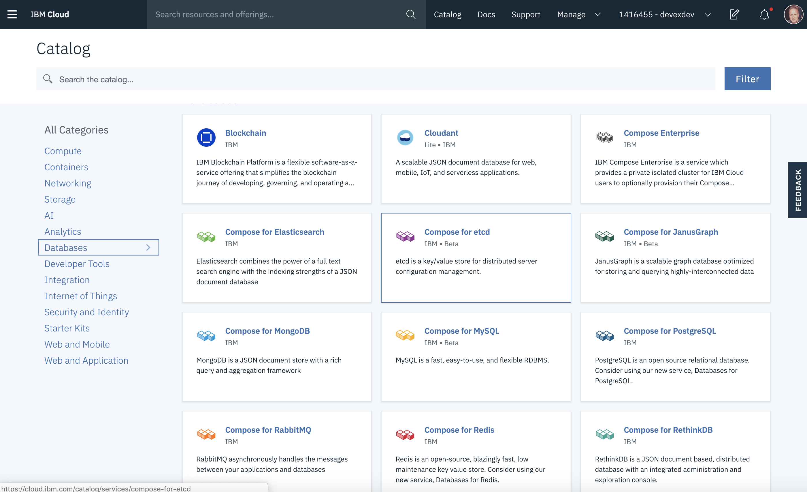

import Globals from 'gatsby-theme-carbon/src/templates/Globals';

<PageDescription>

Use Cloud Databases to persist application data

</PageDescription>

**Learning objectives:**

* Learn an introduction to Cloud Databases
* Learn about the types of Cloud Databases
* Learn when to use the right type of Cloud Database
* Learn how to manage IBM Cloud Databases
* Exercise Create a Cloudant NoSQL Database
* Exercise Integrate Database to Spring Boot Application
* Exercise Extend Spring Boot app with CRUD methods

## Introduction

The <Globals name="longName" /> <Globals name="env" /> provides a set of database services for persisting applications' data:
- [Databases For PostgreSQL](https://cloud.ibm.com/docs/services/databases-for-postgresql) -- A SQL database for persisting relational data that conforms to a schema that can be queryed using SQL
- [Cloudant](https://cloud.ibm.com/docs/services/Cloudant) -- A NoSQL database for persisting schemaless data structured as JSON documents
- [Cloud Object Storage](https://cloud.ibm.com/docs/services/cloud-object-storage) -- For persisting binary data, especially huge sets of data

Microservices are stateless, so a cloud-native application will need servcies like these to persist their data. If a particular application does not need all of these services, only the ones it uses need to be created in the production environment.

Each microservice should have its own database (zero or more), such that a particular database is only accessed by replicas of a single microservice. Yet the <Globals name="env" /> only has these three database service instances for all of the microservices it hosts. Doesn't that violate best practices? No. Each database service is like a database manager, which can host multiple databases. Each microservice should have its own databases, but multiple microservices that want to use the same database technology can use databases hosted by the same database service instance. Any one database in the service is only used by a single microservice.


= Introduction to Cloud Databases

Database's play an important part in many cloud application. They enable applications to persist data for use between user transactions. This means its easy to store, retrieve and search for records of data that have been created or used within a Cloud native application.

The IBM Cloud offers a number of different databases that are optimized for specific purposes. This can range from storing unstructured data, to storing value key pairs into in memory caches, or managing structured data within defined data schema's.

This education will walk you through an explanation of the different types of databases offered for applications within the IBM Cloud.

It will close with an exercise to help you develop a NoSQL database and link it into a Spring Boot REST application.

== Database Types

So, where do you begin in choosing a database? There are two key types we will discuss the first being  NoSQL (non-relational) and relational database management systems (RDBMS) we can start to explain the best situations to use them in your applications.

=== SQL/RDBMS/Relational Databases

Relational databases and related management systems (RDBMS) are more widely known and understood than their NoSQL cousins. Relational databases emerged in the 70s to store data according to a schema that allows data to be displayed as tables with rows and columns. Think of a relational database as a collection of tables, each with a schema that represents the fixed attributes and data types that the items in the table will have. RDBMSs all provide functionality for reading, creating, updating, and deleting data, typically by means of Structured Query Language (SQL) statements.

The tables in a relational database have keys associated with them, which are used to identify specific columns or rows of a table and facilitate faster access to a particular table, row, or column of interest.

Data integrity is of particular concern in relational databases, and RDBMS use a number of constraints to ensure that the data contained in your tables are reliable and accurate.

While there are many relational databases, over time, these have become the most popular:

- MySQL: MySQL is an open-source relational database management system (RDBMS) based on Structured Query Language (SQL). MySQL runs on virtually all platforms, including Linux, UNIX, and Windows.
- PostgreSQL: PostgreSQL, often simply Postgres, is an object-relational database management system (ORDBMS) with an emphasis on extensibility and standards compliance.
- DB2: DB2 is an RDBMS designed to store, analyze, and retrieve data efficiently.

=== Advantages

- Relational databases are well-documented and mature technologies, and RDBMSs are sold and maintained by a number of established corporations.
- SQL standards are well-defined and commonly accepted.
- All RDBMS are ACID-compliant, meaning their transactions are Atomic, Consistent, Isolated, and Durable

=== Disadvantages

- RDBMSs don't work well — or at all — with unstructured or semi-structured data due to schema and type constraints. This makes them ill-suited for large analytics or IoT event loads.
- The tables in your relational database will not necessarily map one-to-one with an object or class representing the same data.
- When migrating one RDBMS to another, schemas and types must generally be identical between source and destination tables for migration to work (schema constraint). For many of the same reasons, extremely complex datasets or those containing variable-length records are generally difficult to handle with an RDBMS schema.

=== NoSQL/Non-Relational Databases

NoSQL databases emerged as a popular alternative to relational databases as web applications became increasingly complex. NoSQL/non-relational databases can take a variety of forms. However, the critical difference between NoSQL and relational databases is that RDBMS schemas rigidly define how all data inserted into the database must be typed and composed, whereas NoSQL databases can be schema-agnostic, allowing unstructured and semi-structured data to be stored and manipulated.

=== Types

- Key-value stores, such as Redis , are extremely simple database management systems that store only key-value pairs and provide basic functionality for retrieving the value associated with a known key. The simplicity of key-value stores makes these database management systems particularly well-suited to embedded databases, where the stored data is not particularly complex and speed is of paramount importance.
- Wide column stores, such as Cassandra and Scylla are schema-agnostic systems that enable users to store data in column families or tables, a single row of which can be thought of as a record — a multi-dimensional key-value store. These solutions are designed with the goal of scaling well enough to manage petabytes of data across as many as thousands of commodity servers in a massive, distributed system. Although technically schema-free, wide column stores like Scylla and Cassandra use an SQL variant called CQL for data definition and manipulation, making them straightforward to those already familiar with RDBMS.
- Document stores, including MongoDB and Cloudant, are schema-free systems that store data in the form of JSON documents. Document stores are similar to key-value or wide column stores, but the document name is the key and the contents of the document, whatever they are, are the value. In a document store, individual records do not require a uniform structure, can contain many different value types, and can be nested. This flexibility makes them particularly well-suited to manage semi-structured data across distributed systems.

- Graph databases, such as Neo4J and Datastax Enterprise Graph, represent data as a network of related nodes or objects in order to facilitate data visualizations and graph analytics. A node or object in a graph database contains free-form data that is connected by relationships and grouped according to labels. Graph-oriented database management systems (DBMS) software is designed with an emphasis on illustrating connections between data points. As a result, graph databases are typically used when analysis of the relationships between heterogeneous data points is the end goal of the system, such as in fraud prevention, advanced enterprise operations, or Facebook's original friend's graph.

- Search engines, such as Elasticsearch and Solr, store data using schema-free JSON documents. They are similar to document stores, but with a greater emphasis on making your unstructured or semi-structured data easily accessible via text-based searches with strings of varying complexity.

=== Advantages

Since there are so many types and varied applications of NoSQL databases, it's hard to nail these down, but generally:

- Schema-free data models are more flexible and easier to administer.
NoSQL databases are generally more horizontally scalable and fault-tolerant.
- Data can easily be distributed across different nodes. To improve  availability and/or partition tolerance, you can choose that data on some nodes be eventually consistent.

=== Disadvantages

These are also dependent on the database type. Principally:

- NoSQL databases are generally less widely adopted and mature than RDBMS solutions, so specific expertise is often required.
- There is a range of formats and constraints specific to each database type.

=== Which Database Is Right For You?

- If your first priority is ACID transactions (Atomic, Consistent, Isolated, and Durable), consider using RDBMS.
- If you have a massively distributed system and can settle for eventual consistency on some nodes/partitions, you might consider a wide column store such as Cassandra or Scylla.
- If your input data is particularly heterogeneous and difficult to encapsulate according to a normalization schema, consider using a NoSQL DBMS.
- If your goal is to scale vertically, consider an RDBMS; conversely, if you want to scale horizontally, a NoSQL DBMS may be preferable.
\
= Managing IBM Cloud Databases

The [IBM Cloud](https://cloud.ibm.com) has made it very easy to manage the range of [Cloud Database](https://cloud.ibm.com/catalog?databases). The first place to look is the Catalog. It offers a dedicated section for Databases.



The instructor can scroll through the list and see the various types of structured and none structured databases.

You can create them easily by clicking on the tile and then selecting the plan. The best practice is to have one database per deployment environment locked down with the correct IAM (access control) rules.

You can delete the instances using the *Resource List* from the menu. You can also rename them. Most of the databases follow the resource model on the IBM Cloud. This means they can have configured credentials that can be managed in the Credentials section. They can also be bound to Cloud Foundry instances where the credentials can be accessed through the VCAP service variables. They can also be bound to a Kubernetes cluster and accesses through Kubernetes secrets.


## Creating a Database

These steps will Create a Cloud Native NoSQL Database and populate it with data. You will then access the data through a Spring Boot micro service REST API.

 	- Create the Database instance
 	- Populate it with sample data

<InlineNotification kind="success">

Note: If a Cloudant instance has been created already the students can skip the Create database process, if not then they need to follow these steps to create an instance.

</InlineNotification>

- While logged into the IBM Cloud, click on the Catalog link in the header

. This will display the catalog of all the services that you can use to build cloud solutions. We are going to focus on creating a NoSQL database using the Cloudant Service. Click on Databases on the left-hand menu and you should see the list of services narrow to this view.

- Select the Cloudant NoSQL DB
    - You should see the Database creation screen,
    - Change the name to `cloudant-<machine name>`
    - Select `Use Both` for available authentication methods.
    - Select the resource group you are working in.
    - Click *Create* button to create the database instance.
+
This will create a database instance that you can start working with to store your product information.

- After the create is successful, you will see the Database instance Manage view.  From here you can click on the Launch button to access the database management views. We now need to configure the command line so you can upload data.

- Click on the Service Credentials on the left-hand menu.
- If there are no credentials created, click *New Credentials* button and in the dialog click *Add*. These control the access to the database. Are the credentials have been created you should see a screen similar to the one below.
+


- .Open a command prompt and create a folder/directory called `data`
+
----
mkdir data
----

. To help create test JSON data we are going to supply a template to the JSON Generator tool, this helps when creating dummy data for testing. Navigate to the following link.

+
https://next.json-generator.com

. Replace the default template with the following template (using cut and paste). This will enable a 100 records of test data to be created to represent a products database. Click on the *Generate* button.

```bash
[
  {
    'repeat(1, 100)': {
      _id: '{{objectId()}}',
      index: '{{index()}}',
      name: '{{lorem(2, "words")}}',
      guid: '{{guid()}}',
      delivered: '{{bool()}}',
      price: '{{floating(1000, 4000, 2, "$0,0.00")}}',
      picture: 'http://placehold.it/32x32',
      firstname: '{{firstName()}}',
      surname:'{{surname()}}',
      company: '{{company().toUpperCase()}}',
      email(tags) {
        return `${this.firstname}.${this.surname}@${this.company}${tags.domainZone()}`.toLowerCase();
      },
      phone: '+1 {{phone()}}',
      address: '{{integer(100, 999)}} {{street()}}, {{city()}}, {{state()}}, {{integer(100, 10000)}}',
      about: '{{lorem(1, "paragraphs")}}',
      created: '{{moment(this.date(new Date(2014, 0, 1), new Date())).format("LLLL")}}',
      latitude: '{{floating(-90.000001, 90)}}',
      longitude: '{{floating(-180.000001, 180)}}',
      ordered: '{{integer(0,999)}}'
    }
  }
]
```

- Copy the generated contents on the right hand side into a file called `products-<machine name>.json` and save it into the same folder. Wrap the array with a docs statement.

```bash
{
  "docs": <Add Generated array []>
}
```

- Using a code editor create a shell script called `load.sh` that will load data into the database using a `curl` command. Use the contents from below for the script.

```
#!/bin/bash
# load.sh
UIDPW=
AUTH="$(python -c 'import base64; print base64.urlsafe_b64encode("<<username>>:<<password>>")')"
ACURL="curl -s --proto '=https' -iv -g -H 'Authorization: Basic ${AUTH}'"
HOST="https://<<host>>"

# Products Data
eval ${ACURL} -X DELETE '${HOST}/<<machine name>>'
eval ${ACURL} -X PUT '${HOST}/<<machine name>>'
eval ${ACURL} -H "Content-Type:application/json" -d @products-<<machine name>>.json -vX POST '${HOST}/<<machine name>>/_bulk_docs'
```

- Replace the username:password fields with values from the Credentials section of the Cloudant instance in the dashboard.
. Replace the `host` with the value from the credentials section of the dashboard. Replace `machine name` with name of your machine to create a unique database name.
.Save the script, make it executable, and then run it.
```
chmod +x ./load.sh
./load.sh
```
- The data from the `products-<machine name>.json` file will then be used to populate the database, to confirm this on the Dashboard click on Manage menu on the left and then Launch  button to see the Cloudant dashboard.
- Click on the Left icon that looks like a Database and you will see the products database created.

- Click on the products database itself.
- You can see the rows of data
- If you click on a row of data, you will see the raw NoSQL form of the data record.
- This completes the setup of the database and populating it with data. We will be now moving onto creating a Spring Micro service that then uses this database to display Product details.

## Consuming in a Spring micro service

Create a Spring Micro service and Access Cloudant NoSQL Database.

In this exercise you will:

 - Create a Products Micro service using Spring backend <Globals name="template" />
 - Make some updates to integrate the app programmatically with the database
 - Test these changes locally
 
. Make sure you are logged into IBM Cloud. From the menu ( menu on the top left hand side of the dashboard) select Web Apps.

. You should see the main Overview screen for the IBM App Service. Navigate to the <Globals name="templates" /> menu on the left-hand side. You will see a range of <Globals name="templates" /> that are designed to give you a production code starting point for a variety of common patterns and frameworks for the key programming languages that are commonly used in cloud native development. Have a look through the list of <Globals name="templates" /> for other types of projects you may have in the future.

. Scroll down the list and find the one labelled
`Java BFF Example with Spring
Backend for Frontend` and click on it to select it to be created then click on `Create app`.

. Within in the Create Project view, enter a sensible unique name, such as using your machine name and a numerical counter (eg. products-ms01), this is important as the Microservice will require a unique HTTP host name when its running on the platform. Once you've completed the form, click on the Create App button.
+
image:createapp.png[]

. This will show you the App Configuration/Details view. This view can be used to manage various aspects of your app. You will see the right-hand side has a Getting Started Quickly guide. The main body has an area where you can associate services and configure DevOps tool chains. You can also see at the top it is possible to just download the code and run it without any DevOps configuration. Using the menu in the top right, you can also rename of the project or delete it.

. Now that we have created an App we need to get the code to the local machine. We could create a Dev Ops Toolchain and store the code in GIT but for this exercise we will just click on the *Download Code* button in the top right of the screen.

. Unzip the downloaded file into you projects folder.

. You will see that the App was created and a lot of very useful files and configuration was prepared for you to work with.

..	The code was prepared with a manifest.yml for configuration of Cloud Foundry
.. It has a Helm chart created for management of Kubernetes deployment
.. It had a DevOps tool chain configuration setup for deployment to Cloud Foundry
.. It had Maven configuration for the Spring framework and the initial bootstrap of a backend app with Java and Spring.

. Open the code into your IntelJ IDE, and run it to check its startsOK.
. Click on `Maven Tool->Plugins->spring-boot->springboot:run` Or run the the App from the run button at the top. You see the following messages at the end of the log file. This validates the app compiled successfully.
+
----
The following endpoints are available by default :-
  OpenAPI UI    : http://localhost:8080/swagger-ui.html
  OpenAPI json  : http://localhost:8080/swagger/api
----

. Open up a Web browser and now select the link http://localhost:8080/swagger-ui.html You should now see the Swagger API .

. We now need to update the logic so we can integrate It with the Cloudant database we created earlier.

. The first step is to add the credentials for accessing the database to the `application.properties` file. Open `src/main/resources/application.properties` and replace the values for the credentials and save the changes.

```
cloudant.username=<Username>
cloudant.password=<Password>
cloudant.url=<URL>
cloudant.db=<machine name>
```

. Now we need to add the Cloudant Maven dependency to the `pom.xml` file. This will install the SDK required to access the Cloudant database using Java APIs.

. Open `pom.xml` from the root folder and at the bottom of the dependency section underneath
the `spring-boot-starter-test` dependency add the following dependency configuration. Save the changes, let InteliJ install the dependency if asked.

```
<dependency>
    <groupId>com.cloudant</groupId>
    <artifactId>cloudant-client</artifactId>
    <version>2.11.0</version>
</dependency>
```

- Now we need to add the code that will read the configuration and then bookstrap the Cloudant SDK.

- Create a file in `src/main/java/application` called `CloudantConfiguration.java` and add the following code.

```
package application;

import com.cloudant.client.api.ClientBuilder;
import com.cloudant.client.api.CloudantClient;
import com.cloudant.client.api.Database;

import org.springframework.beans.factory.annotation.Autowired;
import org.springframework.boot.context.properties.EnableConfigurationProperties;
import org.springframework.context.annotation.Bean;
import org.springframework.context.annotation.Configuration;

@Configuration
@EnableConfigurationProperties(CloudantConfigurationProperties.class)
public class CloudantConfiguration {
	@Autowired
	private CloudantConfigurationProperties config;

	@Bean
	public CloudantClient client() {
		ClientBuilder builder = ClientBuilder
			.url(config.getUrl())
			.username(config.getUsername())
			.password(config.getPassword());
		return builder.build();
	}

	@Bean
	public Database database(CloudantClient client) {
		Database db = client.database(config.getDb(), true);
		return db;
	}
}
```

. Create another new file in `src/main/java/application` called `CloudantConfigurationProperties.java` and add the following contents, then save it.

```
package application;

import java.net.URL;
import org.springframework.boot.context.properties.ConfigurationProperties;

@ConfigurationProperties(prefix="cloudant")
public class CloudantConfigurationProperties {

	private URL url;

	private String username;

	private String password;

	private String db;

	public void setUrl(URL url) {
		this.url = url;
	}

	public void setUsername(String username) {
		this.username = username;
	}

	public void setPassword(String password) {
		this.password = password;
	}

	public void setDb(String db) {
		this.db = db;
	}

	public URL getUrl() {
		return this.url;
	}

	public String getUsername() {
		return this.username;
	}

	public String getPassword() {
		return this.password;
	}

	public String getDb() {
		return this.db;
	}

}
```

.- With the Database configuration setup we now need to update the Model. Replace the contents of the `src/main/java/application/model/Product.java` with an updated model that maps to the data in the Database. Save the file once contents has been replaced.

```
package application.model;

import java.util.Objects;
import com.fasterxml.jackson.annotation.JsonProperty;
import com.fasterxml.jackson.annotation.JsonCreator;
import io.swagger.annotations.ApiModel;
import io.swagger.annotations.ApiModelProperty;
import org.springframework.validation.annotation.Validated;
import javax.validation.Valid;
import javax.validation.constraints.*;

/**
 * A product object
 */
@ApiModel(description = "A product object")
@Validated
@javax.annotation.Generated(value = "com.ibm.mobile.sdkgen.platform.JavaSpringBindingsConfig", date = "2019-01-16T16:53:58.923Z")

public class Product   {

  @JsonProperty("_id")
  private String _id = null;

  @JsonProperty("name")
  private String name = null;

  @JsonProperty("firstname")
  private String firstname = null;
  @JsonProperty("surname")
  private String surname = null;

  @JsonProperty("guid")
  private String guid = null;
  @JsonProperty("delivered")
  private boolean delivered = false;
  @JsonProperty("price")
  private String price = null;
  @JsonProperty("picture")
  private String picture = null;
  @JsonProperty("ordered")
  private int ordered = 0;
  @JsonProperty("email")
  private String email = null;
  @JsonProperty("phone")
  private String phone = null;
  @JsonProperty("address")
  private String address = null;
  @JsonProperty("about")
  private String about = null;
  @JsonProperty("created")
  private String created = null;
  @JsonProperty("latitude")
  private String latitude = null;

  public String getCompany() {
    return company;
  }

  public void setCompany(String company) {
    this.company = company;
  }

  @JsonProperty("longitude")
  private String longitude = null;
  @JsonProperty("company")
  private String company = null;


  public Product id(String id) {
    this._id = id;
    return this;
  }

  /**
   * Get identifier
   * @return identifier
   **/
  @ApiModelProperty(required = true, value = "")
  @NotNull

  public String get_id() {
    return _id;
  }

  public void set_id(String id) {
    this._id = id;
  }

  public Product name(String name) {
    this.name = name;
    return this;
  }

  public String getGuid() {
    return guid;
  }

  public void setGuid(String guid) {
    this.guid = guid;
  }

  public boolean isDelivered() {
    return delivered;
  }

  public void setDelivered(boolean delivered) {
    this.delivered = delivered;
  }

  public String getPrice() {
    return price;
  }

  public void setPrice(String price) {
    this.price = price;
  }

  public String getPicture() {
    return picture;
  }

  public void setPicture(String picture) {
    this.picture = picture;
  }

  public int getOrdered() {
    return ordered;
  }

  public void setOrdered(int ordered) {
    this.ordered = ordered;
  }

  public String getEmail() {
    return email;
  }

  public void setEmail(String email) {
    this.email = email;
  }

  public String getPhone() {
    return phone;
  }

  public void setPhone(String phone) {
    this.phone = phone;
  }

  public String getAddress() {
    return address;
  }

  public void setAddress(String address) {
    this.address = address;
  }

  public String getAbout() {
    return about;
  }

  public void setAbout(String about) {
    this.about = about;
  }

  public String getCreated() {
    return created;
  }

  public void setCreated(String created) {
    this.created = created;
  }

  public String getLatitude() {
    return latitude;
  }

  public void setLatitude(String latitude) {
    this.latitude = latitude;
  }

  public String getLongitude() {
    return longitude;
  }

  public void setLongitude(String longitude) {
    this.longitude = longitude;
  }

  public String getFirstname() {
    return firstname;
  }

  public void setFirstname(String firstname) {
    this.firstname = firstname;
  }

  public String getSurname() {
    return surname;
  }

  public void setSurname(String surname) {
    this.surname = surname;
  }

  /**
   * Get name
   * @return name
   **/
  @ApiModelProperty(required = true, value = "")
  @NotNull


  public String getName() {
    return name;
  }

  public void setName(String name) {
    this.name = name;
  }


  @Override
  public boolean equals(Object o) {
    if (this == o) {
      return true;
    }
    if (o == null || getClass() != o.getClass()) {
      return false;
    }
    Product product = (Product) o;
    return Objects.equals(this._id, product._id) &&
            Objects.equals(this.name, product.name);
  }

  @Override
  public int hashCode() {
    return Objects.hash(_id, name);
  }

  @Override
  public String toString() {
    StringBuilder sb = new StringBuilder();
    sb.append("class Product {\n");

    sb.append("    identifier: ").append(toIndentedString(_id)).append("\n");
    sb.append("    name: ").append(toIndentedString(name)).append("\n");
    sb.append("}");
    return sb.toString();
  }

  /**
   * Convert the given object to string with each line indented by 4 spaces
   * (except the first line).
   */
  private String toIndentedString(Object o) {
    if (o == null) {
      return "null";
    }
    return o.toString().replace("\n", "\n    ");
  }
}
```

- Using the <Globals name="template" /> it helps as it has already defined a `Products` API using Spring Boot. We can now extend this with the Cloudant API calls to access the contents of the database.

- Open `src/main/java/application/ProductsApiBinding.java`, add the following `import`.

```
import com.cloudant.client.api.Database;
import java.io.IOException;
```
. Add the following attribute to the class so we can access the database instance object.

```
@Autowired
private Database db;
----
. Final step is to add the code to `getAll` this retrieves the stored documents in the database. Replace the contents of the `getAll` method with the following code.
```
    ApiResponseMessage ApiRm = null;
    try {
        List<Product> allDocs = db.getAllDocsRequestBuilder().includeDocs(true).build().getResponse().getDocsAs(Product.class);
        ApiRm = new ApiResponseMessage<>(HttpStatus.FOUND, "", allDocs);

    } catch (IOException e) {
        ApiRm = new ApiResponseMessage<>(HttpStatus.NOT_FOUND, "", null);
    }

    return ApiRm;
```
. You can see the code using the `db` instance to call Cloudant Couch DB APIs and return a List of documents, this is then wrapped into a `ApiResponseMessage` so a consistent handling of HTTP response messages can be achieved. Save any changes and rerun the micro service.

. Open the Swagger UI endpoint listed in the console logs. You should see a Swagger API looking similar to the screen shot below.
+


. Expand the *GET* `/products` API endpoint and select *Try It* The response body should now display an array of all the documents stored in the NoSQL database.
+
```
[
  {
    "_id": "5c3f915101ca439a6631445f",
    "name": "consectetur anim",
    "firstname": "Anna",
    "surname": "Landry",
    "guid": "df52ff12-b678-4a80-a3cf-933affd0e723",
    "delivered": true,
    "price": "$3,555.02",
    "picture": "http://placehold.it/32x32",
    "ordered": 938,
    "email": "anna.landry@niquent.co.uk",
    "phone": "+1 (993) 468-2139",
    "address": "510 Fairview Place, Vowinckel, Delaware, 3513",
    "about": "Reprehenderit id irure minim sit. Minim tempor laborum sit fugiat exercitation do Lorem cupidatat id. Enim laboris occaecat aute id voluptate mollit sit dolor. Ex occaecat labore sit nulla proident ipsum incididunt nulla officia fugiat voluptate tempor elit. Culpa amet enim voluptate veniam qui Lorem elit incididunt sint laborum id laborum. Anim occaecat commodo culpa quis aliquip dolore. Veniam nulla non et culpa.",
    "created": "Wednesday, December 21, 2016 9:03 AM",
    "latitude": "-34.934096",
    "longitude": "-173.018863",
    "company": "NIQUENT"
  },
```
. Using a NoSQL database allows for lots of flexibility for the document format and they have a lot of rich APIs.

. Congratulations ! In this short exercise, you have created and deployed a Java Spring microservice and integrated to an IBM Cloud Cloudant database instance.

### References

-  https://console.bluemix.net/docs/services/Cloudant/getting-started.html#getting-started-with-cloudant
- http://spring.io/projects/spring-boot
- https://cloud.ibm.com/
- https://cloud.ibm.com/catalog?category=databases
- https://github.com/cloudant/java-cloudant
