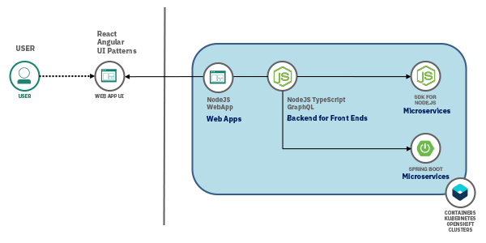
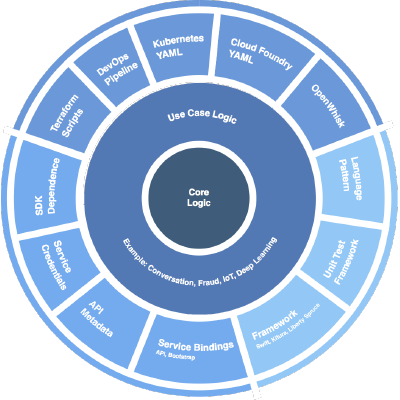

## Overview

With your development tools now installed, its time to
focus on writing code. To complement the IBM Cloud for Garage Development Tools this project provides
a set of **Starter Kit Templates**. These have been designed to give your a production ready
entry point for cloud native development. There are a number of templates
that provide support for different architecture layers of your Kubernetes solution these includes:

- User Interfaces
- Backend for Backends
- Microservices
- Machine Learning (coming soon)

You can pick the starter kit template that best meets your requirements and it will seamlessly integrate
with the installed development tools. There is more information below on what is included in each template.

<ArtDirection>

</ArtDirection>

## Why another code template

As teams have built out production solutions using IBM Kubernetes Services and RedHat OpenShift
on the IBM Cloud it has became clear that starting with a `hello-world` type template slows down a project.
In cases where you are learning the basic principles of cloud native development with a specific language it does help to start with `hello-world`
but when you are building production code to be used by real users it takes a lot of effort to industrialize this code ready for production.

The objective of the *Starter Kit Templates* is to kick off a project quickly so they can reach maximum development velocity in the
least amount of time.

Why starter kit templates ? As the approach to cloud native microservice development has evolved
a number of language frameworks have come into play, runtime configuration technologies and best practices
to improve quality and robustness. It becomes very time consuming to create, manage and maintain these elements.

<Row>
<Column colMd={2} colLg={5} noGutterMdLeft>

If we look at a typical cloud native app, they require a number of supporting files, similar to the ones
found in the outer ring of this diagram. They take time to create and are only often needed for the initial
seed of the project. Its also never clear where the documentation is for these elements and how they are work together.

Some typical examples :

- Dockerfile
- CI Pipeline Jenkins or Tekton
- TDD Frameworks
- Code Analysis
- Monitoring / Logging Support
- Cloud Service bindings and credentials
- User Case logic UI, BFF, Microservice

</Column>
<Column colMd={2} colLg={6} noGutterMdLeft>

<ArtDirection>

## STarter Kit Template

</ArtDirection>

</Column>
</Row>

So the purpose of the starter kit template is to provide the scaffold code for the elements outside of your working
use case business logic. This will then allow you to get started a lot quicker and allow you to push code regularly into your CI environment.

## What constitutes a good template

If you want to contribute a **Starter Kit Template** have a look at the examples are provided. They all have most of the
features listed below. They must be UBI ([Universal Base Image](https://www.redhat.com/en/blog/introducing-red-hat-universal-base-image)) based
so they can run in side Red Hat OpenShift and IBM Kubernetes Service. They must have a Dockerfile that uses that UBI.
To make them work with Continuous Integration you can provide a Pipeline defined in **Jenkins Pipeline** or **Tekton Pipeline** format.
If you are targeting the new Tekton CI tools make sure you have that support installed.

Make sure there is a good use case that is repeatable in your solution architecture. Make sure the code is documented and includes
a README. There is good code coverage for tests and you have integrated SonarQube code scanning on the build process.
Finally put out in the open so others can enhance, improve or consume.

- README
- License
- Package.json
- Use case example source code for example APIs, UIs, Dashboards, Machine learning models
- Unit test framework
- Pact test framework
- Integration testing including User Experience tests
- SonarQube scan integration
- Dockerfile using Universal Base Image
- Jenkinsfile or Tekton pipeline that is production ready
- Make it Open Source

