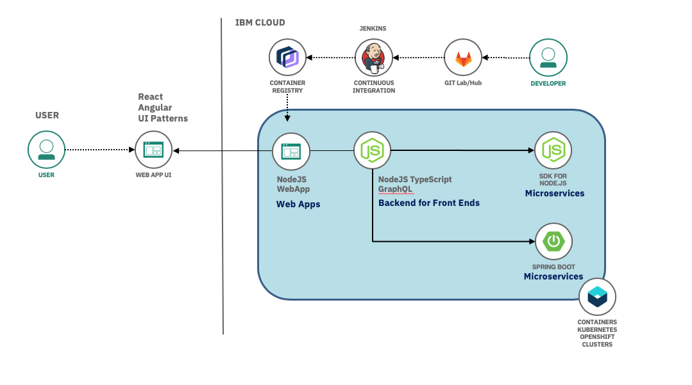

## Overview

What that mean for this

embed starter kits diagram , explain you focus on code not configuration

## Why another code template

Explain most are just hello world with no production quality content and framework and trusted contents

## What constitutes a good template

- Test
- Unit test framework
- Pact test framework
- Integration testing including UX tests
- SonarQube scan integration
- Dockerfile using UBI
- Jenkinsfile or Tekton that is production ready
- README
- License

## How to combine them into a solution

<ArtDirection>

</ArtDirection>