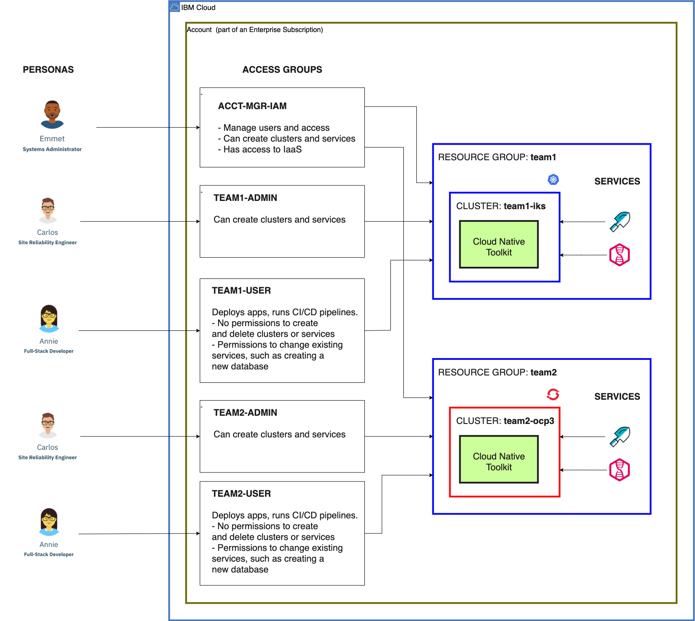

import Globals from 'gatsby-theme-carbon/src/templates/Globals'

<PageDescription>

Managing Access to Resources in IBM Cloud

</PageDescription>

IBM Cloud Identity and Access Management (IAM) enables account owners to authenticate and authorize users to access resources. IAM can be complex; these best practices make IAM easier to use.

## Introduction

This tutorial teaches you best practices for using Identity and Access Management (IAM) in [IBM Cloud](https://www.ibm.com/cloud).

This video presentation describes the IAM concepts, shows a demonstration, and includes a Q&A:
- 01:00 -- Features and concepts
- 26:00 -- Demonstration
- 46:00 -- Q&A

<iframe width="80%" height="500" src="https://www.youtube.com/embed/eayMGvkLZmI" frameborder="0" allow="accelerometer; autoplay; encrypted-media; gyroscope; picture-in-picture" allowfullscreen></iframe>

This article explains the concepts described in the video. You can access the presentation in the [Office Hours](https://ibm.box.com/v/Office-Hours) folder in Box. The scripts discussed are [available in GitHub](https://github.com/ibm-garage-cloud/ibm-garage-iteration-zero/tree/master/terraform/scripts).

## Requirements for access control

Access control doesn't change the features available in IBM Cloud. It does change who can use which features.

One approach to access control is to not use it. Just give everyone access to everything and trust that each user will only do what they should. This is a bit like a hotel where the room doors don't have locks, but each guest is trusted to only enter their own room.

Another approach is to limit which users can do what. Some users can enter almost every room (e.g. hotel management), some can rent rooms (e.g. the paying guest), and some can enter the rooms that have been rented for them (e.g. the paying guest's family).

This article is about how to apply these limits in IBM Cloud. Here are two common scenarios for employing these limits:
- **Account owner adds users to their account**: An account owner must pay for all resources created in their account. How can they control which users can create resources in their account, and which can only use existing resources without creating new ones? Some resources can be expensive, so the owner will want to limit who can create them.
- **Multiple teams developing apps**: Each development team can have their own development environment. Each developer on a team should have access to their team's environment but not the other environments. They may be allowed to change aspects of their own environment (such as deploying apps), but should not be able to change other teams' environments.

## IBM Cloud Identity and Access Management (IAM)

Access to resources in IBM Cloud is controlled using IBM Cloud Identity and Access Management (IAM). [Identity and access management (IAM)](https://en.wikipedia.org/w/index.php?title=Identity_and_access_management) is a general approach many software systems use to authenticate clients and authorize them to use functionality. [What is IBM Cloud Identity and Access Management?](https://cloud.ibm.com/docs/iam?topic=iam-iamoverview) introduces IBM Cloud's implementation of IAM, which includes this diagram of the IAM components and their relationships:

The most fundamental component type is a resource. To organize an account that will be shared by numerous users in various roles, two key aspects are:
- Create a good set of resource groups to organize the resources
- Create a good set of access groups to assign access to the resources

The documentation explains some stratagies:
- [Best practices for setting up your account](https://cloud.ibm.com/docs/account?topic=account-account_setup)
- [What is a resource?](https://cloud.ibm.com/docs/resources?topic=resources-resource)
- [Best practices for organizing resources in a resource group](https://cloud.ibm.com/docs/resources?topic=resources-bp_resourcegroups)
- [Best practices for assigning access](https://cloud.ibm.com/docs/iam?topic=iam-account_setup)

The IAM structure enables a lot of flexibility for very fine-grained access control. However, this broad range of capabilities can be complex to learn and is often more than many administrators need. This article will focus on the most important IAM components and best practices for how to use those.

## IAM –- Main components

This is a much simpler diagram of the main component types in IAM:

In words, this diagram says, "An access group uses policies to access the resources in a resource group."

Here are the four main component types (three shown in the diagram) and their purposes:
- **Resource**: Anything running in IBM Cloud that can be created from the cloud catalog. Examples include: A Kubernetes or OpenShift cluster, a service instance, even a service itself.
- **Resource Group**: Resources that go together, typically to support an app. A common example is: A cluster and its service instances.
- **Access Group**: Users who perform the same tasks; the same concept as a role in role-based access control (RBAC). For example: Developers on a team developing an app.
- **Policy**: Permissions (bundled as Roles) for users to access resources. Example: Administrator and Manager of the Kubernetes Service (aka IKS).

This perspective -- focusing on the main components instead of all of them -- is the beginning of explaining best practices for using IAM. This does not focus on everything IAM can do or on what users must do or can't do, but focuses on recommending what users should do to use IAM successfully.

## What is a resource group?

Let's delve into what a resource group is. A resource group is a group of resources! (Duh!!) But does that mean it's a good idea to grab a bunch of arbitrary resources and put them together in a group, will that really help? No. So how do resource groups help?

It's important to design resource groups decently because their flexibility is somewhat limited. When you create a resource, you need to specify what resource group to create it in. This means that you must create a resource group before you can create the resources that go in the group. Also, once you create a resource and specify its group, its group can't change. You can't move an existing resource from one group to another. So take some time to think about what resource groups you need and what resources to create in each one. You can always add more resource groups and resources, but once they're created, you can't move them around.

### Resources in IBM Cloud

This diagram illustrates one perspective for how to view IBM Cloud: It's just a bunch of stuff running in the cloud. That stuff is resources, primarily clusters and the service instances bound to each one.

This model is correct but not sufficient. IBM Cloud is a multitenant environment, so different tenants own and use different resources. IBM Cloud needs to keep straight which resources are owned and used by which tenants.

### Resources in IBM Cloud accounts

This diagram illustrates the first level of resource organization in IBM Cloud: accounts. Each tenant has their own account. Each resource is created in exactly one account.

Accounts organize resources in IBM Cloud in two key respects:
- **Billing**: An account owner is billed for the resources running in their account. (And is not billed for the resources running in other accounts.)
- **Access**: An account owner can access all of the resources in their account. Also, they can invite other users to their account and grant those users access to the account's resources. Meanwhile, the account owner and other users in an account cannot access any of the resources in any other account (unless they're invited to other accounts).

This model is again correct but not sufficient. Not all users in an account should have access to all resources in an account.

### Resources in IBM Cloud resource groups

A sufficiently large enterprise has multiple development teams developing multiple applications, often doing so in multiple development environments (such as one environment per team). A developer on a team should be able to access and perhaps even change the resources in their team's environment, but not other teams' environments. The account managers will probably also need one or more environments for deploying the production versions of applications, and perhaps other environments used for testing, demonstrations, and other uses. In each case, some users will need access to certain environments but should not have access to other environments.

This diagram illustrates how resource groups can be used to organize resources by environment.

Each resource group contains the resources for an environment, whether that environment is single tenant for a single development team or multitenant for the teams that share an environment. A basic environment typically consists of a single Kubernetes or OpenShift cluster and the service instances bound to that cluster. This is everything needed to host an application, whether it's a monolith or a set of microservices, or a set of applications being developed by the same team.

To plan the resource groups that you'll need, plan the development teams and the environments that they'll need, plus other environments you may need for production, testing, demonstrations, etc. Today, you may only know some of those needs. Create a new resource group for each environment you know about today, ensuring to give each one a unique name. Then as you create resources for an environment, put them in the environment's resource group. In the future, as you discover the need for other environments, create more resource groups for those and create each environment's resources in its corresponding resource group.

The software development lifecycle (SDLC) -- with stages like *dev*, *test*, and *staging* -- typically does not need separate environments, although *production* typically should have its own environment to isolate it from the rest of development. The stages other than production can typically be performed in the same environment to better utilize its resources.

## Managing access to resources

Once we have our resources organized into resource groups, one group per environment, we then need to organize how users access these resources. This is accomplished in IAM with a combination of access groups that organize users and policies that organize the roles with permissions for accessing resources.

### Organize users into access groups

An access group is a collection of users. Just like a resource group isn't a collection of random resources, an access group isn't a collection of random users. Rather, the users in an access group all do the same thing and thus need the same permissions. In [role-based access control (RBAC)](https://en.wikipedia.org/wiki/Role-based_access_control), users are grouped into roles and permissions are assigned to roles so that all of the users in a role get the same permissions.

An access group effectively serves the same purpose as an RBAC role. Users who will perform the same tasks and therefore need the same permissions should be grouped into the same access group. An added dimension, as we'll see, is that permissions specify not only what actions the users can perform but also what resources the actions can be performed on.

This diagram illustrates how a resource group is a collection of resources (as explained above, the resources for an environment) and how an access group is a collection of users:

Access groups are more flexible than resource groups. Whereas a resource can only belong to a single resource group that cannot be changed, a user can belong to multiple access groups and can be added and removed whenever needed.

Notice that access groups and resource groups are orthogonal, which is to say that they vary independently and are not directly related to each other. Access groups and resource groups are related, but there is no direct connection. (We'll see the indirect relationship below.) Often there are multiple access groups per resource group. The set of users in an access group has nothing to do with the set of resources in a resource group. Group members can be added to and removed from each independently.

### Policies connect access groups to resources

A policy associates an access group with a resource group. Each policy is a collection of roles and each role is a collection of permissions. A policy determines the permissions that users in an access group have to perform on the resources in a resource group.

This diagram illustrates how a policy associates an access group with a resource group and how the policy contains a collection of roles:

A policy does not necessarily provide access to all of the resources in a resource group, but rather provides access to all resources of a particular resource type in a resource group, a collection that adjusts as resources are added to or removed from the resource group. The permissions and therefore the roles available in a policy depend on the resource type that the policy accesses.

The example in the diagram shows three policies for three very common resource types:
- **Kubernetes**: Clusters, either [Kubernetes](https://cloud.ibm.com/docs/containers?topic=containers-overview) or [OpenShift](https://cloud.ibm.com/docs/openshift?topic=openshift-overview). (The IAM roles for OpenShift clusters are the same as for Kubernetes clusters, i.e. both cluster types are the same resource type called `Kubernetes Service`.)
- **Registry**: The [IBM Cloud Container Registry](https://cloud.ibm.com/docs/Registry?topic=registry-registry_overview), a global multitenant singleton built into IBM Cloud that is its own resource type with its own set of roles.
- **Services**: Service instances created from the [IBM Cloud catalog](https://cloud.ibm.com/docs/overview?topic=overview-whatis-platform#catalog) (that are IAM enabled), including services which may be added to or removed from the catalog in the future.

The diagram shows each policy with Administrator and Manager roles for their respective resource type. Administrator grants permissions to use a service including creating and deleting service instances, whereas Manager grants permission to manipulate a service instance (in ways that are service-specific).

The set of roles for a resource type is defined in IAM and cannot be changed by the user. Different resource types have different roles. Each role encapsulates a set of related permissions. For example, one of the permissions granted to users with the `Administrator` role on the `Kubernetes Service` resource type is `containers-kubernetes.cluster.create`, which enables the users to create clusters. Other roles grant `cluster.read`, `cluster.operate`, and `cluster.update`, but none of those can create and delete a cluster, they can only use an existing cluster.

## IAM -- Best Practices

The discussion above does not attempt to describe everything that IAM can do, but rather how to use IAM well to accomplish most tasks with low complexity. These guidelines follow a set of best practices. Some of the main ones are:
- **Assign resources to resource groups other than default**: An account initially has a single resource group: *default*. Avoid using it. Rather: Think of development teams developing apps. Create a resource group per team for the team's environment.
- **Assign policies to access groups, not users**: Don’t assign the same policy to one user after another, it’ll become a maintenance nightmare. Rather, use role-based access control: Design roles, grant them permissions, and assign users to roles.
- **Assign access to resource groups, not accounts or resources**: Don’t create multiple policies with the same access to different resources. Rather: Assign access to a resource group, to grant access to all resources in the resource group but not other resource groups.

[Best practices for assigning access](https://cloud.ibm.com/docs/iam?topic=iam-account_setup) has similar tips and some additional explanation.

Remember, the [full component diagram](/toolkit-resources/resource-mgmt#ibm-cloud-identity-and-access-management-(iam)) for IAM is quite complex. The [main set of components](http://localhost:8000/toolkit-resources/resource-mgmt#iam-main-components) that [you should use most of the time](http://localhost:8000/toolkit-resources/resource-mgmt#policies-connect-access-groups-to-resources) is much simpler.

## Access Groups for <Globals name="shortName"/>

As part of the Cloud Native Toolkit, we create a set of three access groups. This approach is pretty good for any account with multiple environments.

This diagram illustrates the three access groups and the relative scope of permissions they provide:

The three access groups are:
- **Account Manager**: Acts like an account owner to configure an account. Includes permissions to create infrastructure components including VLANs, as well as IAM components including resource groups, access groups, etc. Optionally creates clusters for the environment administrator.
- **Environment Administrator**: Owns an environment: Creates it, adds and removes services, etc. Includes permissions to create clusters, to create services, and to set RBAC within the cluster.
- **Environment User**: Uses an environment: Deploys apps, runs CI/CD pipelines, etc. No permissions to create and delete clusters or services. Does include permissions to read from and write to existing services, but not to change their configuration.

An account only needs one account manager access group, but needs a pair of environment administrator and environment user access groups per environment. This enables each environment to be administered and used by a different group of users, effectively confining each group of users to their particular environment. This is the minimum needed. An account could have multiple management access groups for different aspects of account administration, and likewise an environment could have multiple administrator or user access groups for different levels of access to the environment.

## Access Group Example

The previous section explained how we typically use access groups for three roles: account managers, environment administrators, and environment users. This diagram illustrates an example of the access groups for these three roles for an account that contains two development environments:

The diagram shows several components:
- **Two development environments**: Two development teams, each has its own development environment. Each development environment is organized as a resource group, in this example named `team1` and `team2`. The first has a Kubernetes cluster while the second has an OpenShift cluster.
- **One account manager access group**: The account managers control all resource groups. They act as system administrators for the account.
- **Two environment administrator access groups**: Each resource group has its own group of environment administrators who act as site reliability engineers (SREs) of the resources in the resource group.
- **Two environment user access groups**: Each resource group has its own group of environment users who use the resources in the resource group. They typically have a development or data science role such as full-stack developer.

These few access groups are a pretty good start for a typical account and may be all you'll need. You can always customize the policies in these access groups and/or add more access groups for even finer-grained access management.

## Configuration Process

[Plan Installation](/admin/plan-installation) and [Configure Account](/admin/config-account) document the process to set up an account to control access to development environments.

This video presentation shows how to perform this process:
- 3:38 -- Plan Installation
- 13:16 -- Configure Account
- 27:44 -- Demo the access groups

<iframe width="80%" height="500" src="https://www.youtube.com/embed/EF-gN0WRhE8" frameborder="0" allow="accelerometer; autoplay; encrypted-media; gyroscope; picture-in-picture" allowfullscreen></iframe>

