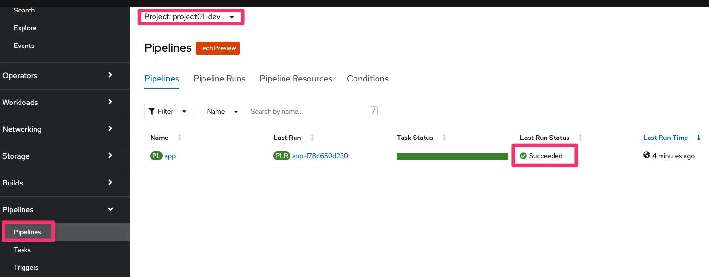
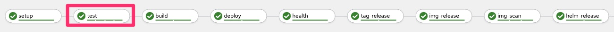
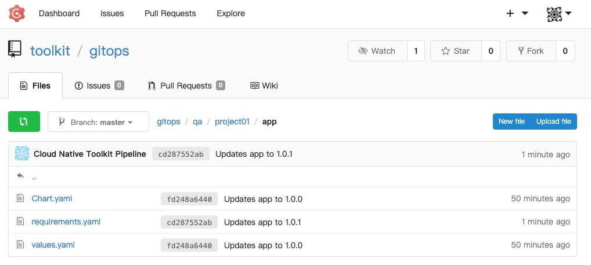

import Globals from 'gatsby-theme-carbon/src/templates/Globals';

<PageDescription>

Deploy an Application using CI Pipelines with Tekton

</PageDescription>

<iframe width="560" height="315" src="https://www.youtube.com/embed/V-BFLaPdoPo" frameborder="0" allow="accelerometer; autoplay; clipboard-write; encrypted-media; gyroscope; picture-in-picture" allowfullscreen></iframe>

1. Prerequisites
    - The instructor should [Setup Workshop Environment](/workshop/setup#3.-setup-ibm-cloud-native-toolkit-workshop)
    - The student should [Setup CLI and Terminal Shell](/workshop/setup#4-setup-cli-and-terminal-shell)

1. Instructor will provide the following info:
    - OpenShift Console URL (OCP_CONSOLE_URL)
    - The username and password for OpenShift and Git Server (default values are user01, user02, etc.. for users and `password` for password).

1. Set `TOOLKIT_USERNAME` environment variable, replace `userXX` with assigned usernames (ex. `user01`)
    ```bash
    TOOLKIT_USERNAME=user1
    ```

1. Login to OpenShift using `oc`
    - If using IBM Cloud cluster then login with your IBM account email and IAM API Key or Token by using the **Copy Login Command**
        
    - If using a cluster that was configured with the workshop scripts outside IBM Cloud then use respective assigned username (ex. `user01`), and the password is `password`
    ```bash
    oc login $OCP_URL -u $TOOLKIT_USERNAME -p password
    ```

1. Set `TOOLKIT_PROJECT` environment variable, replace `projectXX` based on username id assigned (ex. `project01`)
    ```bash
    TOOLKIT_PROJECT=project1
    ```

1. Create a project/namespace using your project as prefix, and `-dev` and suffix
    ```bash
    oc sync $TOOLKIT_PROJECT-dev
    ```

1. Fork application template git repo
    - Open Developer Dashboard from the OpenShift Console
        
    - Select Starter Kits
        
    - Select One in our case **Go Gin Microservice**
    - Click Fork
    - Login into GIT Sever using the provided username and password (ie `user01` and `password`)
    - **IMPORTANT**: Rename Repository Name to `app`
    - Click **Fork Repository**

1. Setup environment variable `GIT_URL` for the git url using the value from previous step or as following.
        **Note:** We are including username/password in git url for simplicity of this lab. You would **NOT** want to do this in your development environment.
    ```bash
    GIT_URL=http://${TOOLKIT_USERNAME}:password@$(oc get route -n tools gogs --template='{{.spec.host}}')/$TOOLKIT_USERNAME/app
    echo GIT_URL=${GIT_URL}
    ```

1. Clone the git repository and change directory
    ```bash
    cd $HOME
    git clone $GIT_URL
    cd app
    ```

1. Create a Tekton pipeline for the application
    ```bash
    oc pipeline --tekton
    ```
    - Use down/up arrow and select `ibm-golang`
    - Hit Enter to enable image scanning
    - Open the url to see the pipeline running in the OpenShift Console

1. Verify that Pipeline Run completed successfully
    - On the OpenShift web console select **Pipelines**
    - At the top of the page select your development project/namespace created above (ex. `project01-dev`)
    - The app pipeline last run status should be **Succeeded**
        

1. Review the Pipeline Tasks/Stages.
    - Click on the last run
        
    - Click on the **Test** task and view the logs
        
    - Open SonarQube from Console Link
    - Open Registry from Console Link
    - Open Artifactory from Console Link

1. The **gitops** step of the pipeline triggeres Argo CD to deploy the app to QA. Select **Developer** perspective, select project `$TOOLKIT_PROJECT-qa` and then select **Topology** from the Console and verify the application running
        

1. Open the application route url and try out the application using the swagger UI
        

1. Make a change to the application in the git repository and see the pipeline running again from the Console.
    ```bash
    git config --local user.email "${TOOLKIT_USERNAME}@example.com"
    git config --local user.name "${TOOLKIT_USERNAME}"
    echo "A change to trigger a new PipelineRun $(date)" >> README.md
    git add .
    git commit -m "update readme"
    git push -u origin master
    ```

1. Verify that change in Git Server and Git WebHook
    - Open Git Dev from Console Link
    - Navigate to user app git repository
    - Review the recent commit
    - Review the webhook recent delivery
        

1. Verify that a new Pipeline starts successfully

1. Verify that the App manifests are being updated in the `gitops` repo in the git account `toolkit` under the `qa` directory.
    - Open Git Ops from Console Link
    - Select toolkit/gitops git repository
        

1. Congratulations you finished this lab, continue with lab [Promote an Application using CD with GitOps and ArgoCD](./cd)


