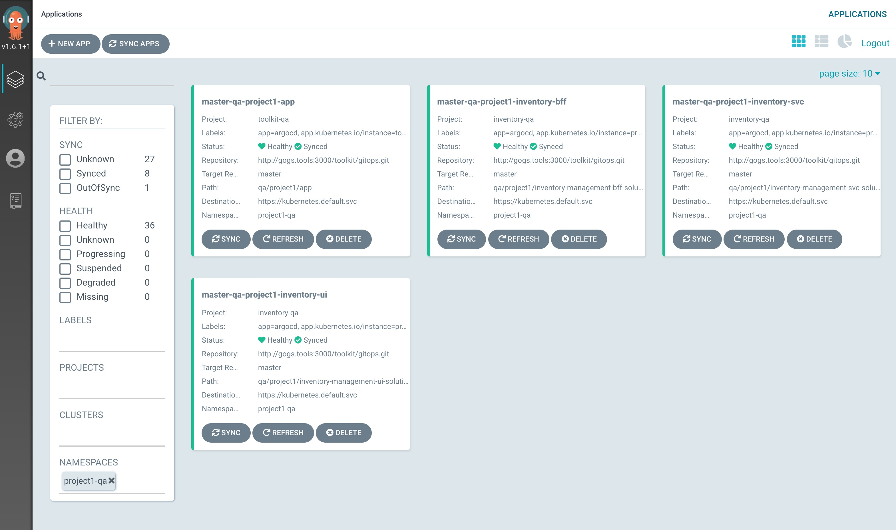
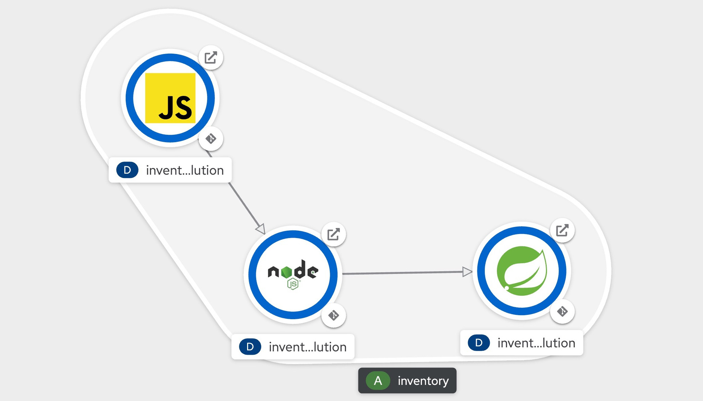

import Globals from 'gatsby-theme-carbon/src/templates/Globals';

<PageDescription>

The Workshop is design to provide a quick way to try the methodology leveraging the tools that the <Globals name="tinyName"/> integrates.

</PageDescription>

<Row>
<Column colLg={4} colMd={4} noGutterMdLeft>
<ArticleCard
    color="dark"
    title="Setup Workshop Environment"
    href="/workshop/setup"
    >

</ArticleCard>
</Column>

<Column colLg={4} colMd={4} noGutterMdLeft>
<ArticleCard
    color="dark"
    title="Deploy an Application using CI Pipelines with Tekton"
    href="/workshop/ci"
    >

</ArticleCard>
</Column>

<Column colLg={4} colMd={4} noGutterMdLeft>
<ArticleCard
    color="dark"
    title="Promote an Application using CD with GitOps and ArgoCD"
    href="/workshop/cd"
    >

</ArticleCard>
</Column>

<Column colLg={4} colMd={4} noGutterMdLeft>
<ArticleCard
    color="dark"
    title="Deploy a 3 tier Microservice using React, Node.js, and Java"
    href="/workshop/inventory"
    >

</ArticleCard>
</Column>

</Row>
